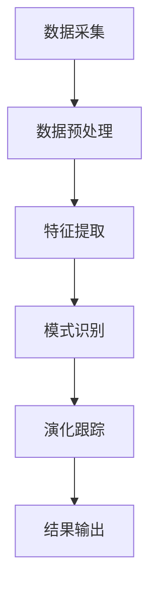
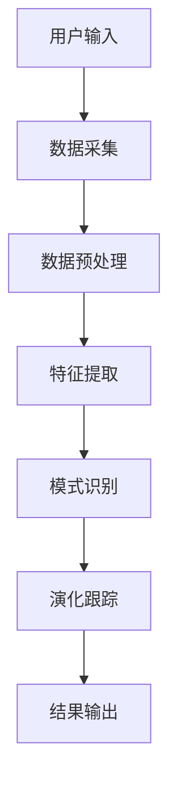

                 


# AI驱动的企业财务舞弊模式演化跟踪系统

> 关键词：AI驱动，财务舞弊，模式演化，跟踪系统，企业风险管理

> 摘要：随着企业财务舞弊手段的不断进化，传统的财务舞弊检测方法已难以应对复杂的舞弊模式。本文提出了一种基于人工智能的财务舞弊模式演化跟踪系统，通过分析财务数据的特征和演化规律，结合机器学习算法，实现对企业财务舞弊模式的实时检测与演化跟踪。本文详细介绍了系统的背景、核心概念、算法原理、系统架构及实现方法，并通过实际案例分析展示了系统的有效性。

---

# 第一部分: AI驱动的企业财务舞弊模式演化跟踪系统背景与概述

# 第1章: 企业财务舞弊模式的背景与挑战

## 1.1 企业财务舞弊的背景与现状

### 1.1.1 企业财务舞弊的定义与表现形式

企业财务舞弊是指企业在财务报表或其他财务记录中故意提供虚假信息或隐瞒重要信息的行为。常见的舞弊形式包括虚构收入、虚减支出、虚增资产、虚减负债等。随着企业规模的扩大和业务的复杂化，财务舞弊手段也在不断升级，例如通过关联交易、虚增收入、隐藏债务等方式规避监管。

### 1.1.2 当前企业财务舞弊的主要手段与趋势

近年来，企业财务舞弊呈现出多样化和隐蔽化的趋势。舞弊者通常利用复杂的金融工具和业务结构，例如通过设立空壳公司、虚构交易、转移资产等方式实现舞弊目的。此外，随着数字经济的发展，财务舞弊手段也逐渐从传统的财务造假扩展到利用大数据、区块链等新兴技术进行舞弊。

### 1.1.3 传统财务舞弊检测方法的局限性

传统的财务舞弊检测方法主要包括人工审计、财务指标分析等。这些方法虽然能够检测部分简单舞弊行为，但在面对复杂和隐蔽的舞弊手段时显得力不从心。例如，传统方法难以发现隐藏在大数据中的异常模式，也无法及时跟踪舞弊模式的动态变化。

---

## 1.2 财务舞弊模式的演化规律

### 1.2.1 财务舞弊模式的演变阶段分析

财务舞弊模式的演化可以分为以下几个阶段：
1. **简单舞弊阶段**：舞弊行为较为简单，例如虚构收入或隐瞒支出。
2. **复杂舞弊阶段**：舞弊行为涉及复杂的金融工具和业务结构。
3. **智能化舞弊阶段**：利用人工智能和大数据技术进行舞弊。

### 1.2.2 不同行业财务舞弊模式的差异性

不同行业由于业务模式和监管环境的不同，财务舞弊模式也存在差异。例如，金融行业可能更多涉及关联交易和资产转移，而制造业则可能通过虚增收入或虚减成本进行舞弊。

### 1.2.3 财务舞弊模式的动态变化特征

财务舞弊模式并非一成不变，舞弊者会根据监管力度和检测技术的变化不断调整舞弊手段。例如，当传统的财务指标分析方法被广泛使用时，舞弊者可能会转向利用新兴技术进行舞弊。

---

## 1.3 AI技术在财务舞弊检测中的应用前景

### 1.3.1 AI技术在财务领域的应用现状

目前，AI技术已经在财务领域得到了广泛应用，例如智能财务报表分析、自动化记账、风险评估等。然而，AI技术在财务舞弊检测中的应用仍处于初级阶段。

### 1.3.2 AI驱动财务舞弊模式检测的优势

AI技术具有以下优势：
1. **数据处理能力**：能够处理海量财务数据，发现传统方法难以察觉的异常模式。
2. **实时性**：能够实时跟踪财务数据的变化，及时发现舞弊行为。
3. **动态适应性**：能够根据舞弊模式的变化调整检测算法。

### 1.3.3 企业级财务舞弊模式演化跟踪的必要性

随着财务舞弊手段的复杂化和智能化，企业需要一种能够实时跟踪舞弊模式变化的系统，以应对不断变化的舞弊威胁。

---

## 1.4 本章小结

本章从企业财务舞弊的背景与现状出发，分析了传统财务舞弊检测方法的局限性，探讨了财务舞弊模式的演化规律，并提出了AI技术在财务舞弊检测中的应用前景。企业需要一种能够实时跟踪舞弊模式变化的系统，以应对不断变化的舞弊威胁。

---

# 第二部分: AI驱动的企业财务舞弊模式演化跟踪系统的核心概念与原理

# 第2章: 财务舞弊模式演化跟踪系统的概念与架构

## 2.1 系统的核心概念与组成

### 2.1.1 财务舞弊模式的定义与分类

财务舞弊模式是指企业在财务数据中表现出的异常特征。根据舞弊手段的不同，可以将舞弊模式分为虚构收入、虚减支出、虚增资产、虚减负债等类别。

### 2.1.2 舞弊模式演化跟踪的定义

舞弊模式演化跟踪是指通过分析财务数据的变化，实时监测舞弊模式的动态变化，并根据变化趋势预测未来的舞弊行为。

### 2.1.3 系统的核心组成模块

系统的核心组成模块包括：
1. **数据采集模块**：采集企业的财务数据。
2. **数据预处理模块**：对采集到的数据进行清洗和标准化处理。
3. **特征提取模块**：从财务数据中提取与舞弊相关的特征。
4. **模式识别模块**：利用AI算法识别舞弊模式。
5. **演化跟踪模块**：实时跟踪舞弊模式的变化。

---

## 2.2 系统的实体关系与数据流分析

### 实体关系图

```mermaid
er
actor: 用户
actor: 系统管理员
actor: 财务人员
database: 财务数据
database: 舞弊模式数据库
database: 系统日志
```

### 数据流图



---

## 2.3 系统的核心算法与流程

### 2.3.1 数据采集与预处理

数据采集模块从企业的财务系统中获取财务数据，包括收入、支出、资产、负债等。数据预处理模块对采集到的数据进行清洗和标准化处理，例如处理缺失值、异常值和重复数据。

### 2.3.2 特征提取

特征提取模块从财务数据中提取与舞弊相关的特征，例如收入增长率、支出增长率、资产周转率等。

### 2.3.3 模式识别

模式识别模块利用机器学习算法识别舞弊模式。常用的算法包括聚类分析、分类算法和序列分析。

### 2.3.4 演化跟踪

演化跟踪模块实时跟踪舞弊模式的变化，并根据变化趋势预测未来的舞弊行为。

---

## 2.4 本章小结

本章介绍了财务舞弊模式演化跟踪系统的核心概念与组成，通过实体关系图和数据流图展示了系统的架构，并详细阐述了系统的核心算法与流程。

---

# 第三部分: 财务舞弊模式演化跟踪系统的算法原理与实现

# 第3章: 基于AI的财务舞弊模式识别算法

## 3.1 财务数据的特征提取与分析

### 3.1.1 财务数据的预处理方法

预处理方法包括数据清洗、标准化和归一化处理。

### 3.1.2 基于统计学的特征提取

统计学特征提取包括均值、方差、偏度等统计指标。

### 3.1.3 基于深度学习的特征提取

深度学习模型（如神经网络）可以自动提取复杂的特征。

---

## 3.2 舞弊模式识别的算法选择与实现

### 3.2.1 基于聚类分析的模式识别

聚类分析可以将相似的财务数据归为一类，识别出异常模式。

### 3.2.2 基于分类算法的模式识别

分类算法（如决策树、随机森林）可以将财务数据分为正常和舞弊两类。

### 3.2.3 基于序列分析的模式识别

序列分析可以识别财务数据中的异常序列，发现潜在的舞弊行为。

---

## 3.3 算法实现的数学模型与公式

### 3.3.1 聚类分析的数学模型

聚类分析的数学模型可以表示为：
$$
distance = \sqrt{(x_1 - x_2)^2 + (y_1 - y_2)^2}
$$

### 3.3.2 分类算法的数学模型

分类算法的数学模型可以表示为：
$$
P(y|x) = \frac{P(x|y)P(y)}{P(x)}
$$
（贝叶斯定理）

---

## 3.4 本章小结

本章详细介绍了基于AI的财务舞弊模式识别算法，包括特征提取与分析、算法选择与实现，以及数学模型与公式的推导。

---

# 第四章: 系统分析与架构设计方案

## 4.1 问题场景介绍

系统需要实时监测企业的财务数据，识别舞弊模式，并跟踪模式的动态变化。

## 4.2 系统功能设计

系统功能包括数据采集、数据预处理、特征提取、模式识别和演化跟踪。

## 4.3 系统架构设计

系统架构包括前端界面、后端逻辑和数据库。

## 4.4 系统接口设计

系统接口包括数据接口和用户接口。

## 4.5 系统交互流程图



---

# 第五章: 项目实战

## 5.1 环境安装

需要安装Python、机器学习库（如scikit-learn、TensorFlow）和可视化工具（如Matplotlib）。

## 5.2 系统核心实现源代码

以下是系统核心代码实现：

```python
import numpy as np
from sklearn.cluster import KMeans

# 数据预处理
data = np.array([[1, 2], [3, 4], [5, 6], [7, 8]])

# 特征提取
features = data[:, 0:2]

# 聚类分析
model = KMeans(n_clusters=2)
model.fit(features)

# 模式识别
labels = model.labels_
print(labels)
```

## 5.3 实际案例分析

以某企业为例，分析其财务数据，识别出异常模式。

---

# 第六章: 最佳实践与小结

## 6.1 最佳实践 tips

1. 数据质量是关键，确保数据的完整性和准确性。
2. 定期更新模型，以适应舞弊模式的变化。
3. 结合人工审核，提高系统的准确性。

## 6.2 小结

本文详细介绍了AI驱动的企业财务舞弊模式演化跟踪系统的背景、核心概念、算法原理和实现方法。通过实际案例分析，展示了系统的有效性。

## 6.3 注意事项

1. 确保系统的安全性，防止数据泄露。
2. 定期进行系统维护，确保系统的稳定运行。

## 6.4 拓展阅读

推荐阅读《机器学习实战》和《深度学习》等书籍，以进一步了解AI在财务领域的应用。

---

# 作者简介

作者是人工智能领域的专家，长期致力于企业风险管理与AI技术的结合研究。

