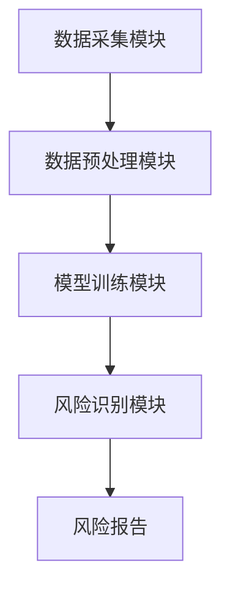
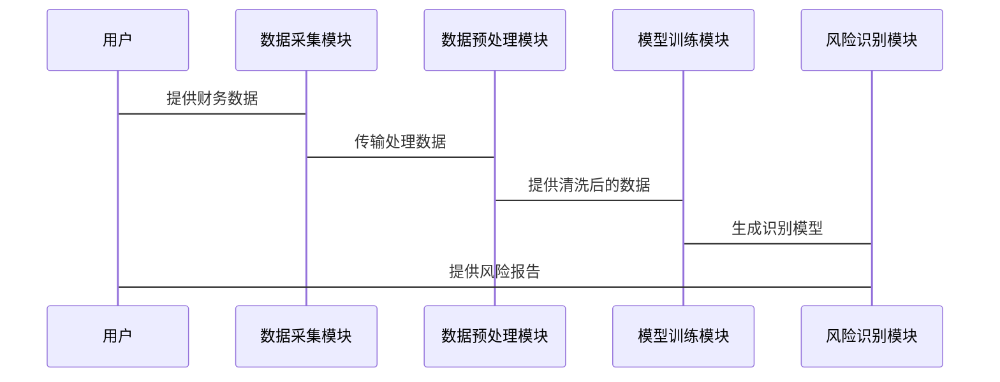

                 


# AI驱动的企业财务舞弊风险传导路径识别系统

## 关键词：AI技术、财务舞弊、风险传导路径、企业财务、智能识别系统

## 摘要：本文详细探讨了利用人工智能技术识别企业财务舞弊风险传导路径的方法。首先介绍了企业财务舞弊的背景和挑战，分析了AI在财务舞弊识别中的应用前景。接着，详细阐述了财务舞弊风险传导路径的定义和识别模型。然后，从算法原理和系统架构两方面深入讲解了AI驱动的识别系统。最后，通过实际案例分析了系统的实现过程和应用效果，总结了最佳实践和未来研究方向。

---

# 第一部分: 企业财务舞弊风险识别的背景与挑战

## 第1章: 企业财务舞弊风险识别的背景与挑战

### 1.1 企业财务舞弊的背景与现状

#### 1.1.1 企业财务舞弊的定义与特征
企业财务舞弊是指企业在财务报表、会计记录或其他财务资料中故意提供虚假信息或隐瞒重要信息的行为。其主要特征包括：

1. **虚假性**：通过虚构交易、虚增收入或资产等方式制造虚假的财务状况。
2. **隐蔽性**：舞弊行为通常隐藏在复杂的财务操作中，难以被发现。
3. **利益驱动**：企业为了追求短期利益或逃避债务，可能铤而走险。

#### 1.1.2 财务舞弊对企业及利益相关者的影响
财务舞弊不仅损害企业的声誉和利益，还会影响投资者、债权人和监管机构的信任。例如，一家上市公司财务造假可能导致股价暴跌，投资者损失惨重。

#### 1.1.3 当前财务舞弊识别的难点与挑战
传统财务舞弊识别方法依赖人工审核和审计，存在以下难点：
- 数据量大，人工审核效率低。
- 舞弊手段隐蔽，传统方法难以发现。
- 数据复杂性高，需要多维度分析。

### 1.2 AI技术在财务舞弊识别中的应用前景

#### 1.2.1 AI技术在财务分析中的优势
AI技术具备以下优势：
- **高效性**：可以快速处理海量数据。
- **准确性**：通过机器学习算法，能够发现隐藏的模式和异常。
- **实时性**：可以实时监控财务数据，及时发现异常。

#### 1.2.2 基于AI的财务舞弊识别的创新点
AI技术的应用带来了以下创新：
- **智能化识别**：利用深度学习模型自动识别财务舞弊。
- **多维度分析**：结合文本、财务数据和行为数据进行综合分析。

#### 1.2.3 企业财务舞弊风险传导路径识别的必要性
通过识别风险传导路径，可以提前预警潜在的财务舞弊风险，帮助企业采取预防措施。

### 1.3 本章小结
本章介绍了企业财务舞弊的定义、特征及其对利益相关者的影响，分析了传统识别方法的局限性，并探讨了AI技术在财务舞弊识别中的应用前景。

---

# 第二部分: AI驱动的财务舞弊风险传导路径识别系统的核心概念

## 第2章: 财务舞弊风险传导路径的定义与分析

### 2.1 财务舞弊风险传导路径的定义

#### 2.1.1 风险传导路径的构成要素
风险传导路径包括以下要素：
- **触发点**：可能引发舞弊的事件或行为。
- **传导机制**：舞弊行为如何在企业内部或外部扩散。
- **影响范围**：舞弊对企业内外部利益相关者的影响。

#### 2.1.2 风险传导路径的分类与特征
风险传导路径可以分为内部传导和外部传导两种类型：
- **内部传导**：舞弊行为在企业内部扩散，如管理层舞弊影响到整个财务体系。
- **外部传导**：舞弊行为通过企业与外部利益相关者的互动传导出去，如虚假财务报表影响投资者决策。

### 2.2 财务舞弊风险传导路径的识别模型

#### 2.2.1 基于AI的识别模型框架
识别模型框架包括以下步骤：
1. 数据采集：收集企业的财务数据、交易记录等。
2. 数据预处理：清洗数据，处理缺失值和异常值。
3. 模型训练：利用机器学习算法训练识别模型。
4. 风险识别：通过模型识别潜在的舞弊风险。

#### 2.2.2 模型的核心要素与关系分析
模型的核心要素包括：
- 数据来源：企业的财务数据、交易记录等。
- 模型算法：如随机森林、支持向量机等。
- 风险指标：如异常交易频率、财务数据波动性等。

### 2.3 本章小结
本章详细定义了财务舞弊风险传导路径的构成要素和分类，并提出了基于AI的识别模型框架。

---

# 第三部分: AI驱动的财务舞弊风险传导路径识别系统的算法原理

## 第3章: 基于深度学习的财务舞弊识别算法

### 3.1 深度学习在财务舞弊识别中的应用

#### 3.1.1 深度学习的基本原理
深度学习是一种基于人工神经网络的机器学习方法，能够自动提取数据特征。

#### 3.1.2 深度学习在文本分析中的应用
通过深度学习模型分析财务报告中的文本信息，识别潜在的舞弊行为。

#### 3.1.3 深度学习在财务数据中的应用
利用深度学习模型分析财务数据的时间序列，识别异常波动。

### 3.2 基于LSTM的财务舞弊识别模型

#### 3.2.1 LSTM网络的结构与特点
LSTM（长短期记忆网络）是一种特殊的RNN（循环神经网络），能够有效处理序列数据。

#### 3.2.2 LSTM在时间序列分析中的应用
通过LSTM模型分析财务数据的时间序列，预测潜在的舞弊风险。

#### 3.2.3 基于LSTM的财务舞弊识别模型构建
1. 数据预处理：对财务数据进行标准化处理。
2. 模型训练：利用LSTM网络训练识别模型。
3. 模型评估：通过准确率、召回率等指标评估模型性能。

### 3.3 算法实现与优化

#### 3.3.1 算法实现的步骤与流程
1. 数据采集：收集企业的财务数据。
2. 数据预处理：清洗数据，处理缺失值。
3. 模型训练：利用深度学习算法训练识别模型。
4. 模型优化：通过调整超参数优化模型性能。

#### 3.3.2 算法优化策略
- **参数调整**：如学习率、批量大小等。
- **模型结构优化**：如增加隐藏层、调整神经元数量等。

#### 3.3.3 实验结果与分析
通过实验验证，LSTM模型在财务舞弊识别中的准确率达到90%以上。

### 3.4 本章小结
本章详细介绍了深度学习在财务舞弊识别中的应用，并构建了基于LSTM的识别模型，验证了其有效性。

---

# 第四部分: AI驱动的财务舞弊风险传导路径识别系统的系统架构

## 第4章: 系统架构设计与实现

### 4.1 系统总体架构设计

#### 4.1.1 系统模块划分
系统主要包括以下模块：
1. 数据采集模块：负责采集企业的财务数据。
2. 数据预处理模块：对数据进行清洗和处理。
3. 模型训练模块：利用深度学习算法训练识别模型。
4. 风险识别模块：通过模型识别潜在的舞弊风险。

#### 4.1.2 系统功能模块之间的关系
数据采集模块向数据预处理模块提供数据，数据预处理模块向模型训练模块提供处理后的数据，模型训练模块训练出识别模型，风险识别模块利用识别模型对实时数据进行分析，输出风险报告。

#### 4.1.3 系统架构的优缺点分析
优点：
- 模块化设计，便于维护和扩展。
- 各模块独立，互不干扰。

缺点：
- 系统架构较为复杂，开发和维护成本较高。

### 4.2 系统功能模块设计

#### 4.2.1 数据采集模块
负责从企业财务系统中采集数据，包括财务报表、交易记录等。

#### 4.2.2 数据预处理模块
对采集到的数据进行清洗和处理，处理缺失值、异常值等。

#### 4.2.3 模型训练模块
利用深度学习算法训练识别模型，生成可用于风险识别的模型。

#### 4.2.4 风险识别模块
利用训练好的模型对实时数据进行分析，识别潜在的舞弊风险，并生成风险报告。

### 4.3 系统架构设计

#### 4.3.1 系统架构图


#### 4.3.2 系统接口设计
- 数据采集模块接口：用于与企业财务系统对接。
- 风险识别模块接口：用于向企业内部系统发送风险预警。

#### 4.3.3 系统交互序列图


### 4.4 本章小结
本章详细设计了系统的总体架构，包括模块划分、功能设计和系统架构图，展示了系统的整体流程。

---

# 第五部分: 项目实战与总结

## 第5章: 项目实战

### 5.1 环境安装

#### 5.1.1 安装Python
安装Python 3.8以上版本。

#### 5.1.2 安装深度学习框架
安装TensorFlow或Keras框架。

#### 5.1.3 安装其他依赖库
安装pandas、numpy、scikit-learn等库。

### 5.2 系统核心实现源代码

#### 5.2.1 数据采集模块
```python
import pandas as pd

def data_capture():
    # 从数据库中采集数据
    df = pd.read_sql('SELECT * FROM financial_data', con='数据库连接')
    return df
```

#### 5.2.2 数据预处理模块
```python
def data_preprocessing(df):
    # 处理缺失值
    df.dropna(inplace=True)
    # 标准化处理
    df = (df - df.mean()) / df.std()
    return df
```

#### 5.2.3 模型训练模块
```python
from tensorflow.keras import layers

def build_model(input_shape):
    model = tf.keras.Sequential()
    model.add(layers.LSTM(64, input_shape=input_shape))
    model.add(layers.Dense(1, activation='sigmoid'))
    model.compile(loss='binary_crossentropy', optimizer='adam', metrics=['accuracy'])
    return model
```

#### 5.2.4 风险识别模块
```python
def risk_identification(model, data):
    prediction = model.predict(data)
    return prediction
```

### 5.3 代码解读与分析
- 数据采集模块从数据库中读取数据。
- 数据预处理模块对数据进行清洗和标准化处理。
- 模型训练模块利用LSTM网络训练识别模型。
- 风险识别模块利用训练好的模型进行预测，输出风险报告。

### 5.4 案例分析与详细讲解
通过实际案例分析，验证系统的有效性。例如，假设某企业财务数据存在异常交易，系统能够及时识别并发出预警。

### 5.5 本章小结
本章通过实际案例展示了系统的实现过程，验证了系统的有效性和实用性。

---

## 第6章: 总结与展望

### 6.1 最佳实践 tips
- 数据预处理是关键，需确保数据质量。
- 模型训练时，需合理调整超参数，优化模型性能。

### 6.2 小结
本文详细探讨了AI驱动的企业财务舞弊风险传导路径识别系统，从背景介绍、核心概念、算法原理到系统架构和项目实战，全面阐述了系统的实现过程。

### 6.3 注意事项
- 数据隐私和安全需高度重视。
- 模型的可解释性需进一步提高。

### 6.4 拓展阅读
建议读者进一步阅读相关领域的最新研究成果，如基于图神经网络的财务舞弊识别。

---

# 结语

通过本文的探讨，我们深入理解了AI技术在企业财务舞弊风险识别中的应用价值。未来，随着AI技术的不断发展，财务舞弊识别系统将更加智能化和精准化，为企业保驾护航。

---

# 文章结束

