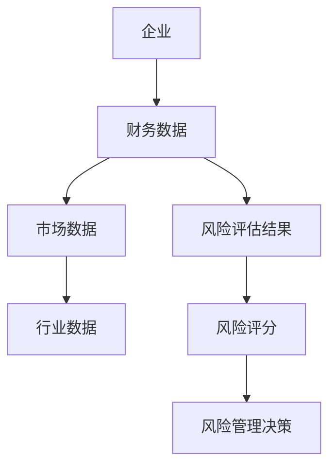

                 

# 《AI驱动的企业财务风险量化评估系统》

## 关键词：AI驱动，财务风险，量化评估，机器学习，系统架构

## 摘要：  
本文深入探讨了AI驱动的企业财务风险量化评估系统的核心概念、算法原理、系统架构及实际应用。通过结合机器学习技术，本文提出了一个高效的财务风险评估框架，旨在帮助企业更精准地识别和量化财务风险，从而优化风险管理策略。本文不仅分析了传统财务风险评估方法的局限性，还详细介绍了如何利用AI技术提升财务风险评估的准确性和效率。

---

# 第一部分: 企业财务风险量化评估的背景与概念

## 第1章: 企业财务风险量化评估概述

### 1.1 什么是企业财务风险
#### 1.1.1 企业财务风险的定义
企业财务风险是指企业在经营过程中由于内外部因素的影响，导致财务状况恶化、资产损失或无法履行债务的风险。这些风险可能来源于市场波动、经济环境变化、管理决策失误等多种因素。

#### 1.1.2 财务风险的分类与特征
财务风险可以分为以下几类：
1. **流动性风险**：企业无法及时获得足够的资金来偿还债务或维持日常运营的风险。
2. **信用风险**：由于客户或供应商无法履行合同义务而对企业造成的风险。
3. **市场风险**：由于市场价格波动对企业资产价值或收益的影响。
4. **操作风险**：由于内部流程、系统或人为错误导致的财务损失风险。

财务风险的特征包括不确定性、相关性、传染性和可管理性。

#### 1.1.3 财务风险对企业的影响
财务风险直接影响企业的财务稳定性、信用评级和市场信任度。高财务风险可能导致企业无法获得贷款、股价下跌或甚至破产。

---

### 1.2 传统财务风险评估方法
#### 1.2.1 财务比率分析法
财务比率分析法是通过分析企业的财务报表中的各项比率（如流动比率、速动比率、资产负债率等）来评估企业的财务健康状况。这种方法简单易懂，但缺乏对复杂市场环境的适应性。

#### 1.2.2 资产负债表分析法
资产负债表分析法通过对企业资产、负债和所有者权益的分析，评估企业的财务结构和偿债能力。这种方法能够提供企业的静态财务状况，但无法捕捉动态变化。

#### 1.2.3 现金流量分析法
现金流量分析法通过分析企业的现金流入和流出情况，评估企业的流动性风险和短期偿债能力。这种方法能够反映企业的实际资金运作情况，但同样存在局限性。

#### 1.2.4 传统方法的优缺点
优点：
- 简单易懂，易于计算。
- 数据来源明确，易于获取。

缺点：
- 无法捕捉非财务因素的影响。
- 无法预测未来风险，仅能反映历史状况。
- 无法处理大数据量和复杂关系。

---

### 1.3 为什么需要AI驱动的财务风险评估
#### 1.3.1 传统方法的局限性
传统财务风险评估方法主要依赖于财务报表数据，无法充分利用企业内外部的海量数据，也无法实时捕捉市场变化和企业内部动态。此外，传统方法难以处理非线性关系和复杂模式。

#### 1.3.2 AI在财务风险评估中的优势
人工智能技术，尤其是机器学习，能够处理海量数据，并发现传统方法难以捕捉的复杂模式和非线性关系。AI驱动的财务风险评估系统可以实时更新模型，快速响应市场变化，提高评估的准确性和及时性。

#### 1.3.3 数字化转型对企业财务风险管理的推动
随着企业数字化转型的推进，企业积累了大量的财务和非财务数据。这些数据为企业利用AI技术进行财务风险管理提供了丰富的数据来源。AI技术的应用能够提高财务风险管理的效率和精准度，帮助企业更好地应对复杂多变的市场环境。

---

### 1.4 本书的核心目标与内容框架
#### 1.4.1 本书的核心目标
本书旨在介绍如何利用人工智能技术构建企业财务风险量化评估系统，探讨其核心概念、算法原理、系统架构及实际应用。通过本书，读者能够了解如何利用AI技术提升企业财务风险管理的效率和准确性。

#### 1.4.2 本书的内容框架
本书分为以下几个部分：
- **第1章**：介绍企业财务风险量化评估的背景与概念。
- **第2章**：探讨AI驱动的财务风险量化评估系统的核心概念与原理。
- **第3章**：详细分析机器学习算法在财务风险评估中的应用。
- **第4章**：设计并实现AI驱动的财务风险量化评估系统。
- **第5章**：通过实际案例展示系统的核心实现与应用效果。
- **第6章**：总结本书的核心内容，并提出未来的研究方向。

#### 1.4.3 本书的适用读者
本书适合以下读者阅读：
- 企业财务管理人员和风险管理相关人员。
- 数据科学家、机器学习工程师。
- 对企业财务管理与人工智能技术感兴趣的读者。

---

## 第2章: AI驱动的财务风险量化评估系统核心概念

### 2.1 问题背景与问题描述
#### 2.1.1 企业财务风险量化评估的难点
企业财务风险量化评估的难点主要在于数据的复杂性、动态性和不确定性。传统的财务评估方法难以应对这些挑战。

#### 2.1.2 数据获取与处理的挑战
- 数据来源多样化，包括内部财务数据、外部市场数据等。
- 数据量大，需要高效的处理和存储技术。
- 数据清洗和特征提取的复杂性。

#### 2.1.3 模型构建与应用的复杂性
- 机器学习模型的选择与调优。
- 模型的可解释性和实时性要求。

---

### 2.2 核心概念与联系
#### 2.2.1 财务风险量化评估的核心要素
- 数据来源：包括财务报表数据、市场数据、行业数据等。
- 数据特征：如流动性、偿债能力、盈利能力等。
- 评估模型：如逻辑回归、随机森林、神经网络等。

#### 2.2.2 AI技术在财务风险评估中的应用
- 数据特征工程：通过机器学习技术提取有用的特征。
- 风险评分模型：利用机器学习算法构建风险评分模型。
- 实时监控：通过流数据处理技术实现实时风险监控。

#### 2.2.3 系统架构与功能模块的关系
- 系统架构决定了功能模块的划分与交互方式。
- 功能模块的设计直接影响系统的性能和用户体验。

---

### 2.3 核心概念原理
#### 2.3.1 数据特征工程的原理
数据特征工程是机器学习模型构建的关键步骤。通过对原始数据进行清洗、转换和特征提取，可以提高模型的准确性和泛化能力。

#### 2.3.2 机器学习模型的分类与选择
根据数据类型和业务需求，选择合适的机器学习模型。常见的模型包括：
- **监督学习**：如逻辑回归、支持向量机（SVM）、随机森林。
- **无监督学习**：如聚类分析、主成分分析（PCA）。
- **深度学习**：如神经网络。

#### 2.3.3 风险评分模型的构建逻辑
风险评分模型通过对企业特征的综合评估，生成风险评分。评分越高，风险越大。模型的构建需要结合业务知识和数据特征。

---

### 2.4 核心概念对比分析
#### 2.4.1 不同模型的特征对比
| 模型类型       | 优点                          | 缺点                          |
|----------------|-------------------------------|-------------------------------|
| 逻辑回归       | 解释性强，适合二分类问题      | 对非线性关系的处理能力较弱    |
| 随机森林       | 鲁棒性高，适合复杂数据         | 解释性较弱                   |
| 神经网络       | 能处理复杂非线性关系           | 训练时间长，解释性差           |

#### 2.4.2 不同算法的性能对比
| 算法           | 训练时间 | 准确率 | 解释性 |
|----------------|----------|--------|--------|
| 逻辑回归       | 快速     | 中等    | 高      |
| 随机森林       | 中等     | 高      | 中等    |
| 神经网络       | 长       | 高      | 低      |

#### 2.4.3 不同应用场景的适用性对比
| 场景           | 适用算法                   |
|----------------|-----------------------------|
| 高维数据分类    | 随机森林、神经网络           |
| 小样本数据分类  | 逻辑回归、SVM               |
| 实时风险监控    | 简单模型（如逻辑回归）       |

---

### 2.5 ER实体关系图

---

通过以上内容，我们详细介绍了AI驱动的企业财务风险量化评估系统的核心概念和原理。接下来，我们将深入探讨机器学习算法在财务风险评估中的应用，以及如何设计和实现一个高效的AI驱动的财务风险量化评估系统。

