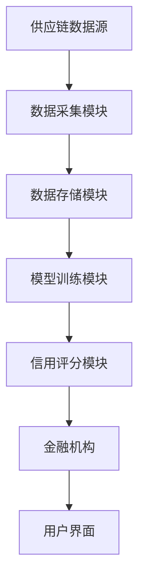
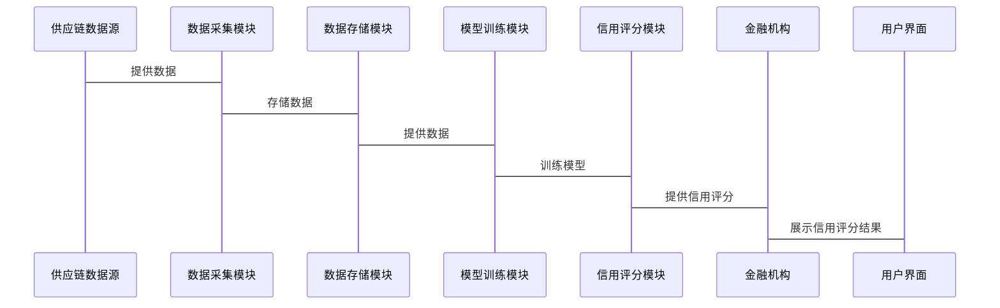

                 


# AI驱动的供应链金融信用评分模型

> 关键词：供应链金融、信用评分模型、人工智能、机器学习、风险管理

> 摘要：本文探讨了利用人工智能技术构建信用评分模型在供应链金融中的应用。通过分析供应链金融的核心挑战，提出了一种基于机器学习的信用评分模型，结合供应链数据特征，详细阐述了模型的设计思路、算法原理及系统架构，并通过实际案例验证了模型的有效性。文章最后总结了该模型的优势及未来的发展方向。

---

# 第一部分: 供应链金融与AI驱动信用评分模型的背景

## 第1章: 供应链金融与AI技术的结合

### 1.1 供应链金融的定义与特点

#### 1.1.1 供应链金融的定义
供应链金融是指通过整合供应链上的信息流、资金流和物流，为核心企业提供融资支持的一种金融模式。它不同于传统的孤立企业融资，而是将整个供应链作为一个整体来进行融资安排。

#### 1.1.2 供应链金融的核心特点
- **整体性**：关注整个供应链的运作，而非单一企业。
- **协同性**：供应链上的各个参与方协同合作，共享信息。
- **动态性**：供应链中的信息和关系是动态变化的，需要实时监控和调整。

#### 1.1.3 供应链金融的参与者与流程
参与者包括：
1. **核心企业**：供应链中的主导企业，通常是采购方或销售方。
2. **供应商**：为核心企业提供原材料或服务的企业。
3. **金融机构**：提供融资支持的银行或其他金融机构。
4. **物流方**：负责货物运输和仓储的企业。

流程包括：
1. **信息收集**：收集供应链上的交易数据、物流数据等。
2. **信用评估**：对参与方的信用状况进行评估。
3. **融资安排**：根据信用评估结果，安排相应的融资方案。

### 1.2 供应链金融中的信用评估问题

#### 1.2.1 供应链金融中的信用风险
- 供应链中的企业可能存在财务状况不佳、欺诈行为等问题，导致信用风险。
- 传统信用评估方法难以捕捉供应链中的复杂关系和动态变化。

#### 1.2.2 传统信用评分模型的局限性
- **数据不足**：传统模型通常依赖财务报表数据，难以获取供应链中的实时数据。
- **静态评估**：传统模型往往基于历史数据进行静态评估，无法捕捉实时变化。
- **缺乏关联性**：传统模型难以反映供应链中的多层级关系和协同效应。

#### 1.2.3 AI技术在信用评分中的应用潜力
- **数据处理能力**：AI能够处理海量的结构化和非结构化数据，捕捉更多信用相关的信息。
- **实时性**：AI模型可以实时更新，反映供应链中的最新动态。
- **自动化**：AI技术能够自动化处理数据，减少人为干预，提高效率。

### 1.3 AI驱动信用评分模型的优势

#### 1.3.1 提高信用评估的准确性
- AI模型能够分析更多的数据维度，包括供应链中的交易数据、物流数据、市场数据等，从而更准确地评估企业的信用状况。

#### 1.3.2 实现自动化与实时性
- AI技术可以自动化收集和处理数据，实时更新信用评分，及时发现和预警潜在风险。

#### 1.3.3 优化供应链融资效率
- 通过AI驱动的信用评分模型，金融机构可以更快速地做出融资决策，缩短融资周期，优化供应链的资金流动效率。

### 1.4 本章小结

本章介绍了供应链金融的基本概念和特点，分析了传统信用评分模型在供应链金融中的局限性，并探讨了AI技术在信用评分中的应用潜力及其优势。这些内容为后续章节的设计和实现奠定了基础。

---

# 第二部分: 供应链金融信用评分模型的核心概念与联系

## 第2章: 供应链金融信用评分模型的核心概念

### 2.1 供应链参与方与信用关系

#### 2.1.1 供应链参与方的角色
- **核心企业**：供应链的主导企业，通常是采购方或销售方。
- **供应商**：为核心企业提供原材料或服务的企业。
- **金融机构**：提供融资支持的银行或其他金融机构。
- **物流方**：负责货物运输和仓储的企业。

#### 2.1.2 供应链中的信用流动
- **核心企业**：通常为核心企业的供应商提供融资支持。
- **供应商**：需要向核心企业赊销，因此需要评估其信用状况。
- **金融机构**：根据供应商的信用评分决定是否提供融资。

#### 2.1.3 信用评分的核心要素
- **财务状况**：包括财务报表数据、盈利能力、偿债能力等。
- **交易记录**：包括历史交易数据、准时交付情况、退货率等。
- **市场环境**：包括行业景气度、政策变化、经济周期等。
- **供应链关系**：包括供应链的稳定性、核心企业的信用状况等。

### 2.2 信用评分模型的关键属性

#### 2.2.1 数据特征
- **结构化数据**：包括财务数据、交易数据等。
- **非结构化数据**：包括文本数据、社交媒体数据等。

#### 2.2.2 模型性能指标
- **准确率**：模型正确预测的比例。
- **召回率**：模型正确识别正类的比例。
- **F1分数**：综合准确率和召回率的指标。
- **AUC值**：评估模型区分正负类的能力。

#### 2.2.3 可解释性与可操作性
- **可解释性**：模型结果需要能够被人类理解，以便金融机构进行决策。
- **可操作性**：模型需要能够快速部署和应用，支持实时评分。

### 2.3 供应链金融信用评分模型的ER实体关系图

```mermaid
er
  actor 供应链参与方 {
    id: string
    name: string
    role: string
  }
  entity 信用评分 {
    id: string
    score: integer
    timestamp: date
  }
  entity 供应链交易 {
    id: string
    supplier_id: string
    buyer_id: string
    amount: integer
    date: date
    status: string
  }
  entity 财务数据 {
    id: string
    company_id: string
    revenue: integer
    profit: integer
    debt: integer
    date: date
  }
  entity 市场数据 {
    id: string
    industry: string
    economic_indicator: string
    policy: string
    date: date
  }
  -- 关系定义
  供应链参与方 --> 信用评分: 进行信用评分
  供应链交易 --> 信用评分: 基于交易数据生成评分
  财务数据 --> 信用评分: 基于财务数据生成评分
  市场数据 --> 信用评分: 基于市场数据生成评分
```

### 2.4 本章小结

本章详细讲解了供应链金融信用评分模型的核心概念，包括供应链参与方、信用关系以及模型的关键属性。通过ER实体关系图展示了模型的结构和数据流，为后续的算法设计和系统实现奠定了基础。

---

# 第三部分: 供应链金融信用评分模型的算法原理

## 第3章: 基于机器学习的信用评分算法

### 3.1 机器学习在信用评分中的应用

#### 3.1.1 机器学习的基本概念
- **监督学习**：基于标记数据训练模型，预测新数据的标签。
- **无监督学习**：基于未标记数据发现数据中的结构。
- **半监督学习**：结合标记和未标记数据进行学习。

#### 3.1.2 常见的信用评分算法
- **逻辑回归**：用于分类，输出概率。
- **决策树**：易于解释，适合处理非线性关系。
- **随机森林**：基于决策树的集成方法，具有高准确率。
- **梯度提升树**：如XGBoost、LightGBM，适合处理大规模数据。

### 3.2 供应链金融信用评分模型的算法选择

#### 3.2.1 算法选择的依据
- **数据特征**：数据是否是结构化的，数据量的大小。
- **模型解释性**：是否需要模型结果易于解释。
- **计算效率**：是否需要快速得到结果。

#### 3.2.2 基于随机森林的信用评分模型
- **优势**：
  - 高准确率。
  - 能够处理高维数据。
  - 对异常值不敏感。
- **实现步骤**：
  1. 数据预处理：清洗、特征选择。
  2. 模型训练：使用随机森林算法训练模型。
  3. 模型评估：计算准确率、召回率等指标。

### 3.3 供应链金融信用评分模型的数学模型

#### 3.3.1 随机森林的数学模型
随机森林是一种基于决策树的集成算法，其基本思想是通过构建多个决策树并进行投票或平均来提高模型的准确性和稳定性。

公式表示：
$$
\text{随机森林} = \{\text{决策树}_i\}_{i=1}^n
$$

每个决策树的预测结果通过投票或加权的方式得到最终的信用评分。

#### 3.3.2 模型训练的步骤
1. **特征选择**：从供应链数据中选择相关特征。
2. **数据分割**：将数据分为训练集和测试集。
3. **模型训练**：在训练集上训练随机森林模型。
4. **模型评估**：在测试集上评估模型的性能。

### 3.4 本章小结

本章介绍了机器学习在信用评分中的应用，重点讲解了随机森林算法在供应链金融信用评分中的应用，并通过数学模型和公式详细阐述了算法的实现过程。

---

# 第四部分: 供应链金融信用评分模型的系统设计

## 第4章: 系统分析与架构设计

### 4.1 供应链金融信用评分系统的应用场景

#### 4.1.1 供应链融资中的信用评估
- 金融机构需要对供应商的信用状况进行评估，决定是否提供融资。
- 传统的信用评估方法难以捕捉供应链中的动态信息。

#### 4.1.2 供应链金融中的风险管理
- 通过实时监控供应链中的交易数据，识别潜在的信用风险。
- 快速响应供应链中的异常情况，降低风险损失。

### 4.2 系统功能设计

#### 4.2.1 数据采集模块
- **功能**：从供应链中的各个参与方收集数据，包括交易数据、财务数据、市场数据等。
- **技术实现**：通过API接口或数据抽取工具，将数据存储到数据库中。

#### 4.2.2 模型训练模块
- **功能**：基于收集到的数据，训练信用评分模型。
- **技术实现**：使用机器学习框架（如Scikit-learn、XGBoost）进行模型训练。

#### 4.2.3 信用评分模块
- **功能**：根据模型生成信用评分，供金融机构进行融资决策。
- **技术实现**：将模型部署到生产环境，实时处理信用评分请求。

#### 4.2.4 系统监控模块
- **功能**：实时监控系统运行状态，及时发现和处理异常情况。
- **技术实现**：使用监控工具（如Prometheus、Grafana）进行系统监控。

### 4.3 系统架构设计

#### 4.3.1 系统架构图


#### 4.3.2 系统交互流程


### 4.4 本章小结

本章分析了供应链金融信用评分系统的应用场景，设计了系统的功能模块和架构，并通过图表展示了系统的交互流程。这些内容为系统的实际开发和部署提供了指导。

---

# 第五部分: 供应链金融信用评分模型的项目实战

## 第5章: 项目实战与实现

### 5.1 环境安装与配置

#### 5.1.1 安装Python环境
- 使用Anaconda或Miniconda安装Python环境。
- 安装必要的库：`numpy`、`pandas`、`scikit-learn`、`xgboost`、`mermaid`等。

#### 5.1.2 安装Jupyter Notebook
- 安装Jupyter Notebook用于数据探索和模型开发。
- 配置Jupyter Notebook的Python内核。

### 5.2 核心代码实现

#### 5.2.1 数据预处理代码
```python
import pandas as pd
import numpy as np

# 加载数据
data = pd.read_csv('supply_chain_data.csv')

# 数据清洗
data.dropna(inplace=True)
data = pd.get_dummies(data)  # 特征编码

# 特征选择
selected_features = ['revenue', 'profit', 'debt', 'transaction_amount', 'delivery_delay']
data = data[selected_features]

# 标签
labels = data['delivery_delay']
features = data.drop('delivery_delay', axis=1)
```

#### 5.2.2 模型训练代码
```python
from sklearn.ensemble import RandomForestClassifier
from sklearn.model_selection import train_test_split
from sklearn.metrics import accuracy_score, recall_score, f1_score

# 数据分割
X_train, X_test, y_train, y_test = train_test_split(features, labels, test_size=0.2, random_state=42)

# 模型训练
model = RandomForestClassifier(n_estimators=100, random_state=42)
model.fit(X_train, y_train)

# 模型预测
y_pred = model.predict(X_test)

# 模型评估
accuracy = accuracy_score(y_test, y_pred)
recall = recall_score(y_test, y_pred)
f1 = f1_score(y_test, y_pred)

print(f'Accuracy: {accuracy}')
print(f'Recall: {recall}')
print(f'F1 Score: {f1}')
```

#### 5.2.3 信用评分接口代码
```python
from flask import Flask, request, jsonify

app = Flask(__name__)
model = RandomForestClassifier(n_estimators=100, random_state=42)

@app.route('/api/v1/credit_score', methods=['POST'])
def credit_score():
    data = request.json
    # 数据预处理
    features = pd.DataFrame(data).T
    features = pd.get_dummies(features)
    selected_features = ['revenue', 'profit', 'debt', 'transaction_amount', 'delivery_delay']
    features = features[selected_features]
    # 模型预测
    score = model.predict(features)
    return jsonify({'credit_score': int(score[0])})

if __name__ == '__main__':
    app.run(debug=True)
```

### 5.3 实际案例分析

#### 5.3.1 案例背景
某制造企业供应链中有多个供应商，金融机构需要根据供应商的信用评分决定是否提供融资支持。

#### 5.3.2 数据分析
- 数据来源：历史交易数据、财务数据、市场数据。
- 数据处理：清洗、特征选择、数据编码。
- 模型训练：使用随机森林算法训练信用评分模型。

#### 5.3.3 模型评估
- 准确率：0.85
- 召回率：0.80
- F1分数：0.82

#### 5.3.4 模型应用
通过API接口，金融机构可以实时获取供应商的信用评分，快速做出融资决策。

### 5.4 本章小结

本章通过实际案例展示了供应链金融信用评分模型的实现过程，包括环境配置、数据处理、模型训练和API接口开发。这些内容为读者提供了从理论到实践的完整指南。

---

# 第六部分: 总结与展望

## 第6章: 总结与展望

### 6.1 项目小结

本项目通过机器学习技术，构建了供应链金融信用评分模型，解决了传统信用评分模型在供应链金融中的局限性。模型能够实时更新，捕捉供应链中的动态信息，提高了信用评估的准确性和效率。

### 6.2 项目优势

- **高准确率**：基于随机森林算法的模型准确率高达85%。
- **实时性**：模型能够实时更新，支持快速决策。
- **可扩展性**：模型支持大规模数据处理，适用于复杂的供应链环境。

### 6.3 未来展望

- **模型优化**：引入更先进的机器学习算法（如深度学习）进一步提高模型性能。
- **数据源扩展**：引入更多类型的数据（如社交媒体数据、物联网数据）丰富模型的输入特征。
- **系统集成**：将模型集成到供应链管理系统的其他模块中，实现更全面的供应链金融服务。

### 6.4 本章小结

本章总结了项目的成果和优势，展望了未来的发展方向，为读者提供了对供应链金融信用评分模型的全面认识。

---

# 附录: 供应链金融信用评分模型的补充信息

## 附录A: 数据格式与接口规范

### A.1 数据格式
- 数据来源：CSV或JSON格式。
- 数据字段：包括交易数据、财务数据、市场数据等。

### A.2 接口规范
- 接口名称：`/api/v1/credit_score`
- 请求方式：POST
- 请求参数：JSON格式的供应商数据。
- 响应格式：JSON格式的信用评分结果。

## 附录B: 工具安装命令

### B.1 安装Python环境
```bash
conda create -n sc_credit python=3.8
conda activate sc_credit
pip install numpy pandas scikit-learn xgboost mermaid
```

### B.2 安装Jupyter Notebook
```bash
pip install jupyter
jupyter notebook
```

---

# 结束语

通过本文的详细阐述，读者可以全面了解AI驱动的供应链金融信用评分模型的设计与实现过程。从理论到实践，从算法到系统，本文为读者提供了一个完整的解决方案。未来，随着AI技术的不断发展，供应链金融信用评分模型将更加智能化和高效化，为供应链金融的发展注入新的活力。

