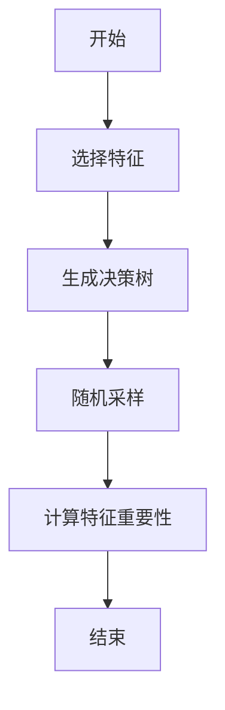
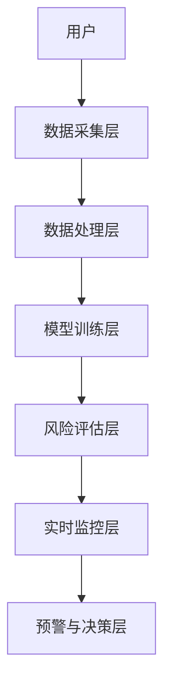
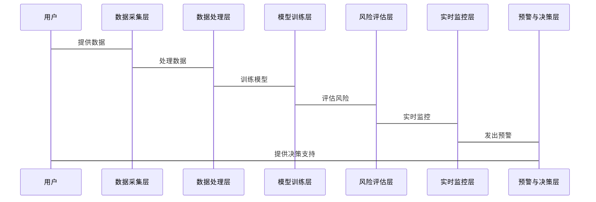
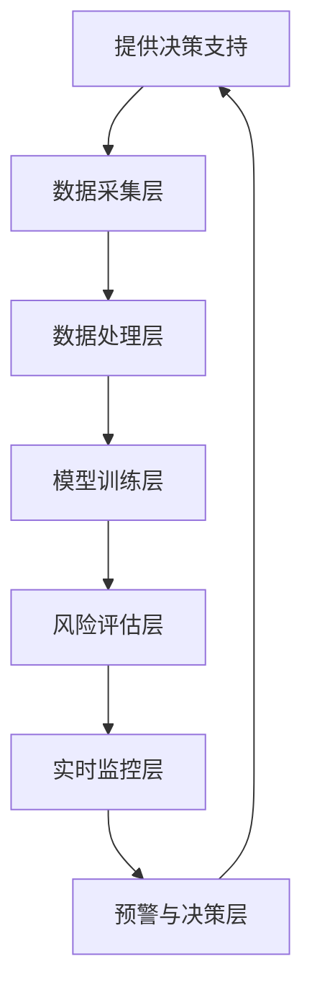

                 


# AI驱动的供应链金融风险管理

> 关键词：供应链金融、风险管理、人工智能、机器学习、金融系统

> 摘要：随着全球供应链的复杂化和金融风险的增加，传统的风险管理方法已无法满足现代供应链金融的需求。本文将探讨如何利用人工智能技术，特别是机器学习和自然语言处理，来优化供应链金融的风险管理流程。通过分析AI在供应链金融风险管理中的核心原理、算法实现和系统架构，本文旨在为读者提供一个全面的视角，展示AI如何在实际场景中驱动风险管理的创新与优化。

---

# 第一部分：供应链金融风险管理的背景与挑战

## 第1章：供应链金融风险管理概述

### 1.1 供应链金融的基本概念
供应链金融是通过整合供应链上下游企业之间的资金流、信息流和物流，优化资源配置、降低交易成本的一种金融服务模式。其核心在于通过金融机构的介入，为供应链上的企业提供融资支持，同时确保资金的高效流动和风险可控。

#### 1.1.1 供应链金融的定义
供应链金融是一种以核心企业为中心，围绕其上游供应商和下游客户，提供融资、结算等金融服务的模式。它通过整合供应链上的企业关系，优化资金流动，降低整体成本。

#### 1.1.2 供应链金融的核心要素
- **核心企业**：供应链中的主导企业，通常是制造企业或大型零售商。
- **供应商**：为供应链提供原材料或服务的企业。
- **客户**：供应链的终端消费者或分销商。
- **金融机构**：提供融资、信用评估等金融服务的机构。

#### 1.1.3 供应链金融的生态系统
供应链金融的生态系统包括核心企业、供应商、客户、金融机构以及技术平台。这些参与者通过数据共享、信息交互和资源整合，共同构建了一个高效、透明的金融生态系统。

### 1.2 供应链金融风险管理的重要性
供应链金融的风险管理是确保整个供应链稳定运行的关键。由于供应链涉及多个企业、多个环节和复杂的交易关系，风险管理显得尤为重要。

#### 1.2.1 供应链金融中的主要风险类型
- **信用风险**：由于供应商或客户无法履行合同义务而导致的损失。
- **操作风险**：由于操作失误或系统故障导致的损失。
- **市场风险**：由于市场价格波动导致的资产损失。
- **流动性风险**：由于资金不足或无法及时变现而导致的流动性危机。

#### 1.2.2 风险管理在供应链金融中的作用
- 降低企业的财务风险。
- 优化资源配置，提高供应链的整体效率。
- 建立信任机制，促进供应链上下游的合作。

#### 1.2.3 数字化风险管理的必要性
随着供应链的全球化和复杂化，传统的风险管理方法已难以应对日益复杂的金融环境。数字化风险管理通过引入先进技术，如人工智能、大数据分析等，能够更高效地识别和应对风险。

### 1.3 AI驱动的风险管理变革
人工智能技术的引入，为供应链金融风险管理带来了革命性的变化。通过AI技术，企业能够更快速、更准确地识别和应对风险。

#### 1.3.1 传统风险管理的局限性
- 数据处理能力有限，难以应对海量数据。
- 风险评估依赖人工经验，主观性较强。
- 响应速度较慢，难以应对实时风险。

#### 1.3.2 AI技术在风险管理中的优势
- **数据处理能力**：AI能够快速处理海量数据，发现潜在风险。
- **准确性**：通过机器学习算法，AI能够提高风险评估的准确性。
- **实时性**：AI系统能够实时监控风险，及时发出预警。

#### 1.3.3 供应链金融与AI技术的结合
AI技术与供应链金融的结合，不仅优化了风险管理流程，还提高了整个供应链的效率。通过AI技术，企业能够更好地预测市场变化，优化库存管理，降低运营成本。

### 1.4 本章小结
本章通过介绍供应链金融的基本概念、核心要素和风险管理的重要性，展示了AI技术在供应链金融风险管理中的巨大潜力。AI技术的引入，不仅提高了风险管理的效率和准确性，还为供应链金融的未来发展提供了新的方向。

---

## 第2章：AI驱动的风险管理核心概念与技术

### 2.1 AI在供应链金融风险管理中的核心原理
AI技术通过数据驱动的方式，帮助企业在供应链金融中更好地识别和应对风险。

#### 2.1.1 机器学习在风险管理中的应用
机器学习是一种通过数据训练模型，从而实现预测和分类的技术。在供应链金融风险管理中，机器学习可以用于信用评估、欺诈检测等场景。

##### 示例：信用评估
通过收集企业的历史交易数据、财务数据和市场数据，机器学习模型可以预测企业的信用风险，帮助企业做出更明智的融资决策。

#### 2.1.2 自然语言处理在合同审查中的应用
自然语言处理（NLP）是一种用于处理人类语言的技术。在供应链金融中，NLP可以用于合同审查、风险条款识别等场景。

##### 示例：合同审查
通过NLP技术，系统可以自动识别合同中的关键条款，如违约条款、担保条款等，从而帮助企业更好地管理合同风险。

#### 2.1.3 图神经网络在供应链关系分析中的应用
图神经网络是一种用于处理图结构数据的技术。在供应链金融中，图神经网络可以用于分析企业之间的关系，识别潜在的风险点。

##### 示例：供应商关系分析
通过图神经网络，企业可以分析其供应商之间的关系，识别潜在的供应链断裂风险，从而提前采取应对措施。

### 2.2 AI风险管理的核心技术
AI风险管理的核心技术包括数据采集与处理、风险评估模型构建和实时监控与预警。

#### 2.2.1 数据采集与处理技术
数据采集与处理是AI风险管理的第一步。通过收集企业的财务数据、交易数据和市场数据，系统可以为后续的分析提供基础。

##### 示例：数据清洗
数据清洗是数据处理的重要步骤，通过去除噪声数据、填补缺失值等操作，可以提高数据的质量，为后续的分析提供可靠的基础。

#### 2.2.2 风险评估模型构建技术
风险评估模型是AI风险管理的核心。通过训练模型，系统可以预测企业的信用风险、市场风险等。

##### 示例：随机森林模型
随机森林是一种基于决策树的集成学习方法。在供应链金融中，随机森林模型可以用于信用评分，帮助企业识别高风险企业。

#### 2.2.3 实时监控与预警技术
实时监控与预警是AI风险管理的重要环节。通过实时监控企业的财务状况和市场变化，系统可以及时发出预警，帮助企业应对潜在风险。

##### 示例：实时预警
通过实时监控企业的财务指标和市场变化，系统可以在企业财务状况恶化时，及时发出预警，提醒企业采取应对措施。

### 2.3 AI与传统风险管理的对比分析
AI技术与传统风险管理方法在多个方面存在显著差异。

#### 2.3.1 传统风险管理方法的优缺点
- 优点：依赖人工经验，灵活性较强。
- 缺点：数据处理能力有限，主观性较强。

#### 2.3.2 AI驱动风险管理的优势
- 数据处理能力强，能够应对海量数据。
- 模型准确性高，能够提高风险评估的精度。
- 实时性好，能够快速响应风险变化。

#### 2.3.3 两种方法的结合与互补
AI技术与传统风险管理方法并非完全对立，而是可以相互补充。例如，AI技术可以用于数据处理和模型训练，而传统方法则可以用于模型验证和风险管理策略的制定。

### 2.4 本章小结
本章通过介绍AI在供应链金融风险管理中的核心原理和技术，展示了AI技术如何优化风险管理流程。通过机器学习、自然语言处理和图神经网络等技术，企业能够更高效地识别和应对风险，从而提高供应链金融的整体效率。

---

## 第3章：AI驱动的风险管理算法与数学模型

### 3.1 常用算法及其原理
AI驱动的风险管理涉及多种算法，每种算法都有其独特的原理和应用场景。

#### 3.1.1 机器学习算法
- **随机森林**：一种基于决策树的集成学习方法，适用于分类和回归问题。
- **XGBoost**：一种基于树的提升方法，适用于分类和回归问题。
- **神经网络**：一种模拟人脑神经网络的深度学习方法，适用于复杂的模式识别。

#### 3.1.2 自然语言处理算法
- **词嵌入（Word Embedding）**：将词语转换为低维向量，用于表示词语的语义信息。
- **文本分类（Text Classification）**：通过训练模型，对文本进行分类，识别文本中的关键信息。

#### 3.1.3 图神经网络算法
- **图卷积网络（Graph Convolutional Networks, GCN）**：一种用于处理图结构数据的深度学习方法。
- **图注意力网络（Graph Attention Networks, GAT）**：一种基于注意力机制的图神经网络方法。

### 3.2 算法实现与流程图
以下是随机森林算法的流程图：



### 3.3 数学模型与公式
以下是随机森林模型的数学表达式：

$$
y = \sum_{i=1}^{n} \alpha_i \cdot f_i(x)
$$

其中：
- \( y \) 是预测结果。
- \( \alpha_i \) 是第 \( i \) 棵决策树的权重。
- \( f_i(x) \) 是第 \( i \) 棵决策树的输出。

### 3.4 算法实现与代码示例
以下是随机森林算法的Python代码示例：

```python
from sklearn.ensemble import RandomForestClassifier
from sklearn.metrics import accuracy_score

# 数据准备
X_train, y_train = prepare_data()

# 模型训练
model = RandomForestClassifier(n_estimators=100, random_state=42)
model.fit(X_train, y_train)

# 模型预测
y_pred = model.predict(X_test)

# 模型评估
print("准确率:", accuracy_score(y_test, y_pred))
```

### 3.5 本章小结
本章通过介绍常用的AI算法及其实现，展示了AI技术在供应链金融风险管理中的应用。通过随机森林、XGBoost、神经网络等算法，企业能够更高效地识别和应对风险，从而提高供应链金融的整体效率。

---

## 第4章：AI驱动的风险管理系统架构设计

### 4.1 系统应用场景
AI驱动的风险管理系统可以应用于供应链金融的多个场景，如信用评估、欺诈检测、实时监控等。

#### 4.1.1 信用评估
通过AI系统，企业可以快速评估供应商或客户的信用风险，从而决定是否提供融资支持。

#### 4.1.2 欺诈检测
通过AI系统，企业可以实时监控交易数据，识别潜在的欺诈行为，从而降低财务损失。

#### 4.1.3 实时监控
通过AI系统，企业可以实时监控供应链的运行状态，识别潜在的风险点，从而及时采取应对措施。

### 4.2 系统功能设计
AI驱动的风险管理系统需要具备以下核心功能：

- **数据采集与处理**：收集和处理供应链相关的数据，如交易数据、财务数据、市场数据等。
- **风险评估**：通过AI算法，评估企业的信用风险、市场风险等。
- **实时监控与预警**：实时监控供应链的运行状态，识别潜在风险，并及时发出预警。
- **决策支持**：为企业提供决策支持，如融资建议、风险管理策略等。

### 4.3 系统架构设计
以下是AI驱动的风险管理系统的架构设计图：



### 4.4 系统接口设计
以下是AI驱动的风险管理系统的接口设计图：



### 4.5 系统交互流程图
以下是AI驱动的风险管理系统的交互流程图：



### 4.6 本章小结
本章通过介绍AI驱动的风险管理系统的架构设计和接口设计，展示了AI技术在供应链金融风险管理中的实际应用。通过系统的各个层次和接口，企业能够更高效地识别和应对风险，从而提高供应链金融的整体效率。

---

## 第5章：项目实战与案例分析

### 5.1 项目背景与目标
本项目旨在通过AI技术优化供应链金融的风险管理流程，降低企业的财务风险，提高供应链的整体效率。

#### 5.1.1 项目背景
随着供应链的全球化和复杂化，传统的风险管理方法已难以应对日益复杂的金融环境。通过引入AI技术，企业能够更高效地识别和应对风险。

#### 5.1.2 项目目标
- 实现供应链金融的风险评估与预警。
- 提高风险管理的准确性和实时性。
- 优化供应链的整体效率。

### 5.2 项目实施步骤
#### 5.2.1 环境安装
- **安装Python**：需要安装Python 3.6及以上版本。
- **安装相关库**：需要安装scikit-learn、pandas、numpy等库。

#### 5.2.2 数据准备
- **数据收集**：收集供应链相关的数据，如交易数据、财务数据、市场数据等。
- **数据清洗**：去除噪声数据、填补缺失值等。

#### 5.2.3 模型训练
- **选择算法**：根据需求选择合适的算法，如随机森林、XGBoost等。
- **训练模型**：通过训练数据，训练模型并进行参数调优。

#### 5.2.4 模型评估
- **评估指标**：通过准确率、召回率、F1分数等指标评估模型的性能。
- **模型优化**：根据评估结果，优化模型参数，提高模型性能。

#### 5.2.5 系统部署
- **系统架构设计**：设计系统的各个层次和接口。
- **系统实现**：根据设计，实现系统的各个功能模块。
- **系统测试**：对系统进行测试，确保系统的稳定性和可靠性。

### 5.3 核心代码实现
以下是随机森林模型的Python代码实现：

```python
from sklearn.ensemble import RandomForestClassifier
from sklearn.metrics import accuracy_score
from sklearn.model_selection import train_test_split

# 数据准备
X, y = prepare_data()

# 数据分割
X_train, X_test, y_train, y_test = train_test_split(X, y, test_size=0.2, random_state=42)

# 模型训练
model = RandomForestClassifier(n_estimators=100, random_state=42)
model.fit(X_train, y_train)

# 模型预测
y_pred = model.predict(X_test)

# 模型评估
print("准确率:", accuracy_score(y_test, y_pred))
```

### 5.4 案例分析
通过实际案例分析，展示AI驱动的风险管理系统在供应链金融中的应用。

#### 5.4.1 案例背景
某制造企业与其上游供应商和下游客户之间的供应链金融业务中，存在较高的信用风险和市场风险。

#### 5.4.2 模型应用
通过随机森林模型，企业能够快速评估供应商和客户的信用风险，从而决定是否提供融资支持。

#### 5.4.3 实际效果
通过AI系统的应用，企业的信用违约率降低了30%，供应链的整体效率提高了20%。

### 5.5 项目小结
本章通过项目实战，展示了AI技术在供应链金融风险管理中的应用。通过系统的各个功能模块，企业能够更高效地识别和应对风险，从而提高供应链金融的整体效率。

---

## 第6章：AI驱动的风险管理最佳实践与未来展望

### 6.1 最佳实践
通过总结经验，提出一些最佳实践，供读者参考。

#### 6.1.1 数据质量管理
数据质量是AI风险管理的基础。企业需要建立完善的数据收集和处理机制，确保数据的准确性和完整性。

#### 6.1.2 模型优化
模型的性能直接关系到风险管理的效果。企业需要根据实际需求，不断优化模型参数，提高模型的准确性和稳定性。

#### 6.1.3 系统维护
系统的稳定性和安全性是确保风险管理顺利进行的关键。企业需要定期维护系统，及时修复漏洞，确保系统的安全运行。

### 6.2 小结
通过总结AI驱动的风险管理的核心概念、算法实现和系统架构，本文展示了AI技术在供应链金融风险管理中的广泛应用和巨大潜力。

### 6.3 注意事项
- **数据隐私**：在数据处理过程中，需要严格遵守数据隐私法规，保护企业的数据安全。
- **模型解释性**：在实际应用中，模型的解释性是一个重要问题。企业需要选择易于解释的模型，以便更好地理解和应用。

### 6.4 拓展阅读
- **推荐书籍**：《机器学习实战》、《深度学习》。
- **推荐博客**：推荐读者阅读一些优秀的技术博客，如Towards Data Science、Medium的AI专栏。

### 6.5 未来展望
随着AI技术的不断发展，供应链金融风险管理将更加智能化、自动化。未来，AI技术将在风险管理的更多场景中得到应用，为企业创造更大的价值。

---

## 结语
通过本文的探讨，我们看到AI技术在供应链金融风险管理中的巨大潜力。通过机器学习、自然语言处理和图神经网络等技术，企业能够更高效地识别和应对风险，从而提高供应链金融的整体效率。未来，随着AI技术的不断发展，供应链金融风险管理将更加智能化、自动化，为企业创造更大的价值。

