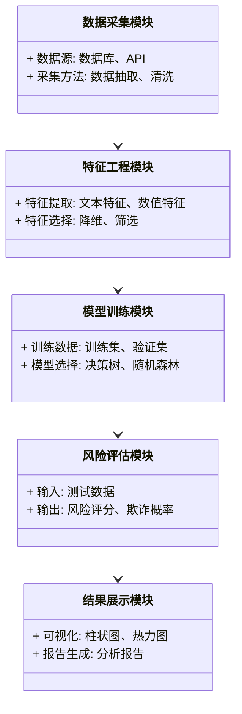
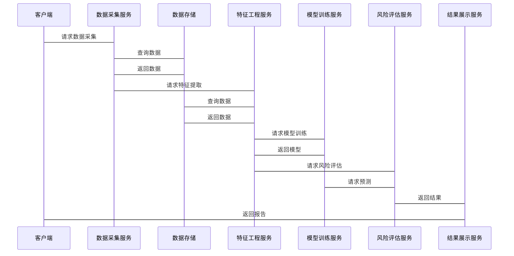

                 


# AI驱动的保险欺诈模式识别

> 关键词：保险欺诈、人工智能、模式识别、机器学习、自然语言处理、图神经网络

> 摘要：本文详细探讨了利用人工智能技术识别保险欺诈模式的方法。从保险欺诈的背景与挑战出发，分析了欺诈模式的分类与识别技术，深入讲解了基于机器学习、自然语言处理和图神经网络的欺诈检测算法，结合实际案例展示了系统架构设计与项目实战。最后，总结了AI驱动的保险欺诈模式识别的最佳实践与未来发展方向。

---

# 第1章: 保险欺诈模式识别的背景与挑战

## 1.1 保险欺诈的定义与分类

### 1.1.1 保险欺诈的定义
保险欺诈是指通过故意制造或夸大保险事故、编造虚假信息等手段，骗取保险公司赔偿金或保险金的行为。欺诈行为不仅增加了保险公司的成本，还可能导致保险公司财务损失和信任危机。

### 1.1.2 保险欺诈的主要类型
保险欺诈主要分为以下几种类型：
1. **虚假理赔**：投保人虚构保险事故或夸大损失程度，试图从保险公司获得不实的赔偿。
2. **重复理赔**：同一保险事故被多次理赔，或同一损失被不同保险产品重复理赔。
3. **调整赔案**：投保人通过篡改理赔信息或夸大损失金额，试图获得更多的赔偿。
4. **保险欺诈网络**：通过构建复杂的欺诈网络，涉及多个投保人、代理人或机构协同作案。

### 1.1.3 保险欺诈的特征与风险
保险欺诈行为通常具有以下特征：
- **隐蔽性**：欺诈行为往往经过精心策划，难以被传统方法发现。
- **复杂性**：涉及多方协同，欺诈手段多样且不断进化。
- **高成本**：保险公司为应对欺诈行为投入大量资源，增加了运营成本。

保险欺诈带来的风险包括财务损失、声誉损害以及客户信任度下降。

---

## 1.2 保险欺诈模式识别的背景

### 1.2.1 保险行业的现状与挑战
随着保险行业的快速发展，保险公司面临的欺诈风险也在增加。传统的欺诈识别方法主要依赖人工审核和规则-based系统，存在效率低、漏检率高的问题。

### 1.2.2 传统保险欺诈识别方法的局限性
传统方法主要包括基于规则的检测和简单的统计分析，其局限性在于：
- **规则有限**：难以覆盖所有可能的欺诈场景。
- **效率低下**：人工审核耗时长，难以应对海量数据。
- **缺乏灵活性**：难以适应欺诈手段的不断变化。

### 1.2.3 AI技术在保险欺诈识别中的应用前景
人工智能技术（包括机器学习、深度学习、自然语言处理和图神经网络等）在保险欺诈识别中的应用前景广阔：
- **高精度识别**：通过机器学习算法，能够发现隐藏在大量数据中的欺诈模式。
- **实时检测**：AI技术可以实现实时监控，快速识别潜在的欺诈行为。
- **动态适应**：AI模型能够不断学习新的欺诈手段，保持识别能力的更新。

---

## 1.3 AI驱动的保险欺诈模式识别的意义

### 1.3.1 提高欺诈识别的准确性和效率
AI技术能够从海量数据中提取特征，建立复杂的模型，从而提高欺诈识别的准确性和效率。

### 1.3.2 降低保险公司的运营成本
通过自动化识别和预测，AI技术可以减少人工审核的工作量，降低运营成本。

### 1.3.3 保护投保人的利益
及时识别和防止欺诈行为，可以保护投保人的利益，维护保险市场的公平性。

---

## 1.4 本章小结
本章介绍了保险欺诈的定义、分类及其识别的背景与挑战。通过对比传统方法与AI技术的优劣，强调了AI在保险欺诈识别中的重要性。后续章节将从技术原理和实践应用两个方面深入探讨AI驱动的保险欺诈模式识别。

---

# 第2章: 保险欺诈模式识别的核心概念

## 2.1 欺诈模式识别的基本原理

### 2.1.1 数据驱动的模式识别
模式识别是通过分析数据的特征，发现数据中的模式和规律。在保险欺诈识别中，数据驱动的模式识别主要基于海量的历史理赔数据和客户行为数据。

### 2.1.2 基于AI的模式识别方法
人工智能技术为模式识别提供了强大的工具，包括：
- **机器学习**：通过训练模型，识别欺诈特征。
- **深度学习**：利用神经网络提取高维特征，识别复杂的欺诈模式。
- **自然语言处理**：分析非结构化数据（如保险合同文本、理赔说明）中的潜在欺诈线索。

### 2.1.3 模式识别的数学基础
模式识别涉及大量的数学方法，包括：
- **统计学**：用于数据分析和特征提取。
- **线性代数**：用于特征向量的表示和计算。
- **优化理论**：用于模型训练和参数调整。

---

## 2.2 欺诈模式识别的关键技术

### 2.2.1 机器学习在欺诈识别中的应用
机器学习算法（如决策树、随机森林、支持向量机等）广泛应用于欺诈识别。例如，基于随机森林的特征重要性分析可以帮助识别关键欺诈特征。

### 2.2.2 自然语言处理在保险文本分析中的应用
自然语言处理技术（如词袋模型、TF-IDF、BERT等）可以用于分析保险合同、理赔说明等文本数据，发现潜在的欺诈模式。

### 2.2.3 图神经网络在欺诈网络识别中的应用
图神经网络可以用于识别欺诈网络中的关联关系，例如发现多个投保人之间的协同欺诈行为。

---

## 2.3 欺诈模式识别的流程

### 2.3.1 数据采集与预处理
数据采集包括从保险公司内部系统获取理赔数据、客户数据等。预处理步骤包括数据清洗、特征提取和数据标注。

### 2.3.2 特征提取与选择
特征提取是将原始数据转化为能够反映欺诈特征的向量表示。特征选择则是在众多特征中筛选出对欺诈识别最有影响力的特征。

### 2.3.3 模型训练与评估
模型训练使用训练数据进行参数优化，评估使用验证集和测试集评估模型的性能。

### 2.3.4 结果分析与优化
通过分析模型的输出结果，进一步优化模型参数或调整特征选择策略。

---

## 2.4 本章小结
本章从理论角度探讨了保险欺诈模式识别的核心概念与关键技术，为后续章节的实践应用奠定了基础。

---

# 第3章: 常见的保险欺诈模式分析

## 3.1 假赔案的识别

### 3.1.1 虚假理赔的特征分析
虚假理赔的特征包括：理赔金额与事故严重程度不符、理赔时间集中、理赔地点异常等。

### 3.1.2 基于机器学习的虚假理赔检测
通过训练随机森林模型，识别虚假理赔的关键特征，如理赔金额与事故类型之间的不匹配。

### 3.1.3 案例分析
通过一个虚构案例，详细说明虚假理赔的识别过程，包括数据特征提取、模型训练和结果解读。

## 3.2 调整赔案的识别

### 3.2.1 赔案金额调整的特征
赔案金额调整的特征包括：调整金额与事故损失不符、调整时间集中、调整原因不合理等。

### 3.2.2 基于AI的赔案金额预测
通过训练回归模型，预测合理的赔案金额，并与实际金额进行对比，识别异常调整。

### 3.2.3 案例分析
通过案例分析，说明如何利用AI技术识别赔案金额调整的异常行为。

## 3.3 重复赔案的识别

### 3.3.1 重复赔案的特征
重复赔案的特征包括：同一保险事故被多次理赔、理赔金额累计超过实际损失等。

### 3.3.2 基于图神经网络的重复赔案识别
通过图神经网络识别关联的理赔记录，发现重复赔案。

### 3.3.3 案例分析
通过案例分析，说明如何利用图神经网络识别重复赔案。

---

## 3.4 本章小结
本章通过具体案例分析了虚假理赔、赔案金额调整和重复赔案三种常见的保险欺诈模式，展示了如何利用AI技术识别这些欺诈行为。

---

# 第4章: AI驱动的保险欺诈模式识别算法

## 4.1 机器学习算法

### 4.1.1 决策树算法
决策树是一种常用的分类算法，适用于特征重要性分析。以下是决策树的流程图：

```mermaid
graph TD
A[开始] -> B[选择特征]
B -> C[分裂节点]
C -> D[叶子节点]
D -> E[结束]
```

### 4.1.2 随机森林算法
随机森林是一种基于决策树的集成算法，适用于高维数据的特征选择。以下是随机森林的流程图：

```mermaid
graph TD
A[开始] -> B[生成多个决策树]
B -> C[每个决策树训练]
C -> D[投票或平均预测]
D -> E[结束]
```

### 4.1.3 支持向量机算法
支持向量机适用于高维数据的分类问题。以下是支持向量机的流程图：

```mermaid
graph TD
A[开始] -> B[数据映射到高维空间]
B -> C[寻找最优超平面]
C -> D[分类结果]
D -> E[结束]
```

---

## 4.2 深度学习算法

### 4.2.1 神经网络算法
神经网络适用于复杂的非线性分类问题。以下是神经网络的流程图：

```mermaid
graph TD
A[开始] -> B[输入层]
B -> C[隐藏层]
C -> D[输出层]
D -> E[结束]
```

### 4.2.2 长短期记忆网络
长短期记忆网络（LSTM）适用于时间序列数据的分析。以下是LSTM的流程图：

```mermaid
graph TD
A[开始] -> B[输入]
B -> C[记忆单元]
C -> D[输出]
D -> E[结束]
```

---

## 4.3 图神经网络算法

### 4.3.1 图神经网络的原理
图神经网络适用于识别欺诈网络中的关联关系。以下是图神经网络的流程图：

```mermaid
graph TD
A[开始] -> B[构建图结构]
B -> C[节点表示]
C -> D[边表示]
D -> E[分类]
E -> F[结束]
```

---

## 4.4 本章小结
本章详细介绍了常用的保险欺诈模式识别算法，包括机器学习、深度学习和图神经网络算法，并通过mermaid流程图展示了算法的实现流程。

---

# 第5章: 系统架构与项目实战

## 5.1 系统架构设计

### 5.1.1 系统功能设计
系统功能包括数据采集、特征工程、模型训练、风险评估和结果展示。以下是系统功能的类图：



### 5.1.2 系统架构设计
系统架构采用微服务架构，以下是系统架构的架构图：


### 5.1.3 系统接口设计
系统接口包括数据采集接口、特征工程接口、模型训练接口、风险评估接口和结果展示接口。以下是系统接口的序列图：



---

## 5.2 项目实战

### 5.2.1 环境搭建
项目实战需要以下环境：
- Python 3.8+
- Python库：scikit-learn、TensorFlow、PyTorch、networkx
- 数据库：MySQL或MongoDB

### 5.2.2 核心实现源代码

#### 5.2.2.1 数据采集与预处理
```python
import pandas as pd
from sklearn.preprocessing import StandardScaler

# 数据采集
df = pd.read_csv('insurance_fraud.csv')

# 数据预处理
df.dropna(inplace=True)
scaler = StandardScaler()
scaled_features = scaler.fit_transform(df[['amount', 'coverage', 'age']])
```

#### 5.2.2.2 特征选择与模型训练
```python
from sklearn.ensemble import RandomForestClassifier
from sklearn.metrics import accuracy_score

# 特征选择
features = scaled_features
labels = df['is_fraud']

# 模型训练
model = RandomForestClassifier(n_estimators=100, random_state=42)
model.fit(features, labels)

# 模型评估
预测 = model.predict(features)
accuracy = accuracy_score(预测, labels)
print(f'准确率：{accuracy}')
```

#### 5.2.2.3 图神经网络实现
```python
import networkx as nx
from sklearn.manifold import TSNE

# 构建图
G = nx.DiGraph()
G.add_nodes_from([1,2,3,4,5])
G.add_edges_from([(1,2), (2,3), (3,4), (4,5)])

# 图嵌入
tsne = TSNE(n_components=2)
embedding = tsne.fit_transform(G.nodes())
```

---

## 5.3 案例分析与结果解读
通过具体案例分析，展示如何利用AI技术识别保险欺诈行为，并解读模型的输出结果。

---

## 5.4 本章小结
本章通过系统架构设计和项目实战，展示了如何利用AI技术实现保险欺诈模式识别。从环境搭建到代码实现，详细讲解了整个项目的实施过程。

---

# 第6章: 最佳实践与未来展望

## 6.1 最佳实践

### 6.1.1 数据质量管理
确保数据的准确性和完整性，是提高模型性能的关键。

### 6.1.2 模型优化
通过调参、特征工程和模型融合，可以进一步提高模型的准确性和稳定性。

### 6.1.3 模型部署与监控
将模型部署到生产环境，并实时监控模型性能，及时发现和处理问题。

---

## 6.2 未来展望

### 6.2.1 模型可解释性
未来的欺诈识别模型需要具备更高的可解释性，以便更好地满足监管要求和用户需求。

### 6.2.2 多模态数据融合
通过融合结构化数据、文本数据和图像数据，可以进一步提高欺诈识别的精度。

### 6.2.3 实时欺诈预警
基于流数据处理技术，实现实时欺诈预警，能够在第一时间发现和阻止欺诈行为。

---

## 6.3 本章小结
本章总结了AI驱动的保险欺诈模式识别的最佳实践，并展望了未来的发展方向。

---

# 结语

AI技术正在 revolutionizing 保险欺诈模式识别领域，通过不断的技术创新和实践探索，我们可以更有效地识别和防止保险欺诈行为，保护保险公司的利益和投保人的权益。

---

# 参考文献
（此处列出相关的参考文献，如书籍、论文、技术文档等）

---

# 致谢
感谢所有参与本文撰写和审阅的人员，以及在AI驱动的保险欺诈模式识别领域提供技术支持和灵感的同行们。

