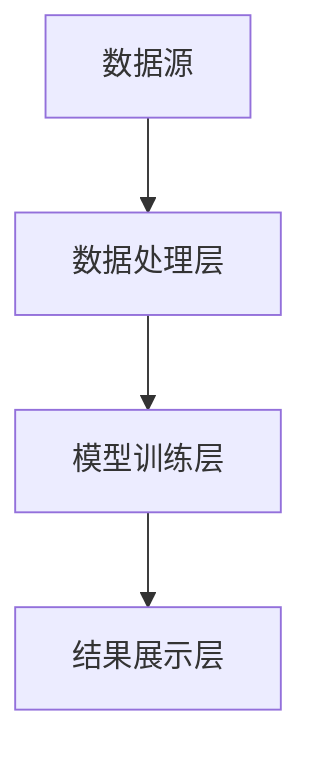
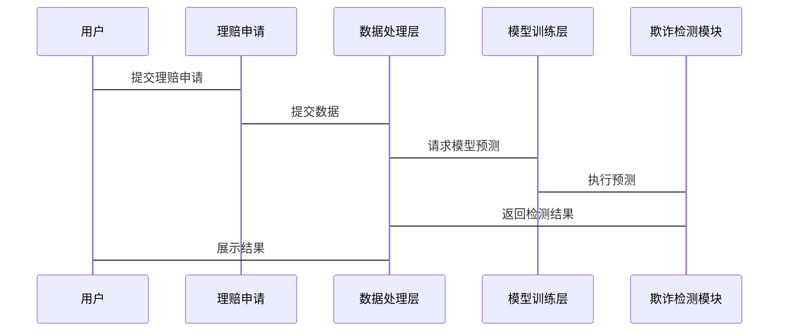

                 

<think>
好的，我现在需要帮助用户撰写一篇名为《AI驱动的保险理赔欺诈模式识别》的技术博客文章。用户已经提供了一个详细的目录结构，但还没有具体内容。我需要按照用户的要求，逐步完成每个部分的内容，确保每个章节都有丰富的细节和具体的例子。

首先，我需要理解这本书的核心内容。这本书主要探讨如何利用人工智能技术来识别保险理赔中的欺诈模式。这涉及到机器学习、数据分析、模式识别等多个技术领域。用户希望文章结构清晰，逻辑严谨，语言专业但易于理解。

接下来，我会按照目录的顺序，逐一完成每个部分的内容。

第1章是“保险理赔欺诈模式识别的背景与挑战”，我需要介绍保险欺诈的现状、问题以及AI技术在其中的作用。这部分需要涵盖传统方法的局限性，以及AI带来的优势。

第2章是“欺诈模式识别的核心概念与联系”，我需要详细讲解欺诈模式识别的基本原理、核心要素，并通过实体关系图来展示各个实体之间的关系。

第3章是“欺诈模式识别的算法原理与数学模型”，这里需要介绍几种常用的算法，如决策树、随机森林和神经网络，并提供相应的数学模型和代码示例。

第4章是“系统分析与架构设计”，我需要描述系统的功能设计、架构设计以及接口设计，可能还需要用到一些图表来展示系统结构。

第5章是“项目实战”，这部分需要一个实际的案例，展示如何应用前面所讲的技术来识别欺诈模式，包括环境配置、代码实现和案例分析。

最后是结论，总结全文的主要内容和未来的发展方向。

在撰写过程中，我需要确保每个部分都详细具体，使用恰当的技术术语，同时提供足够的例子和解释，以便读者能够理解复杂的概念。此外，图表和代码示例也是关键部分，能够帮助读者更好地理解和应用这些技术。

现在，我开始撰写第1章的内容，重点介绍保险欺诈的现状和问题，以及AI在其中的作用。

第1章: 保险理赔欺诈模式识别的背景与挑战

1.1 保险欺诈的现状与问题

保险欺诈是一个全球性的问题，每年给保险公司带来巨大的经济损失。随着保险业务的扩展和复杂化，欺诈手段也在不断演变，传统的欺诈识别方法逐渐显得力不从心。

1.1.1 保险欺诈的定义与类型

保险欺诈是指故意提供虚假信息、夸大损失或制造虚假理赔请求，以骗取保险金的行为。常见的保险欺诈类型包括虚构理赔、夸大损失、重复理赔和恶意破坏等。

1.1.2 保险欺诈对企业和社会的危害

保险欺诈不仅增加了保险公司的运营成本，还可能导致保费上升，影响保险行业的健康发展。此外，欺诈行为还可能损害投保人的信任，削弱保险行业的社会形象。

1.1.3 传统保险欺诈识别的局限性

传统欺诈识别主要依赖人工审核和简单的规则匹配，这种方法效率低下，难以应对复杂的欺诈手段。此外，人工审核还容易受到主观因素的影响，导致误判或漏判。

1.2 AI技术在保险欺诈识别中的作用

1.2.1 AI技术在保险行业的应用现状

AI技术已经在保险行业中得到广泛应用，包括客户识别、风险评估、理赔处理等环节。特别是在欺诈识别方面，AI技术表现出色，能够快速分析大量数据，发现潜在的欺诈模式。

1.2.2 AI在欺诈模式识别中的优势

AI技术具有高效性、准确性和可扩展性的特点。通过机器学习算法，AI能够从海量数据中提取有价值的信息，识别复杂的欺诈模式，帮助保险公司提高欺诈识别的效率和准确性。

1.2.3 保险欺诈识别的未来发展趋势

随着AI技术的不断进步，未来的欺诈识别将更加智能化和自动化。保险公司将更多地采用实时监控和预测分析，提前预防欺诈行为的发生。

1.3 保险理赔欺诈模式识别的核心概念

1.3.1 欺诈模式识别的基本原理

欺诈模式识别通过分析保险理赔数据中的异常模式，识别出可能的欺诈行为。这种方法依赖于数据特征的提取和机器学习模型的训练。

1.3.2 保险理赔流程中的关键环节

保险理赔流程通常包括报案、审核、调查和赔付等环节。每个环节都可能成为欺诈行为的切入点。

1.3.3 欺诈模式识别的边界与外延

欺诈模式识别的边界在于区分正常理赔和异常理赔，其外延则涉及如何将识别结果应用于实际业务中，例如风险控制和保费定价等。

1.4 本章小结

本章介绍了保险欺诈的现状和问题，分析了传统识别方法的局限性，并探讨了AI技术在欺诈识别中的作用和未来发展趋势。后续章节将详细讲解欺诈模式识别的核心概念、算法原理、系统设计和实际案例。

完成第1章后，我将继续撰写第2章，重点讲解欺诈模式识别的核心概念和相关实体关系图。

第2章: 欺诈模式识别的核心概念与联系

2.1 欺诈模式识别的原理与方法

2.1.1 数据驱动的欺诈识别

数据驱动的欺诈识别依赖于大量历史数据的分析，通过统计分析和机器学习算法发现欺诈模式。这种方法的优势在于能够处理复杂的非结构化数据，但需要大量的数据支持。

2.1.2 模型驱动的欺诈识别

模型驱动的欺诈识别基于特定的欺诈模型，通过设定规则和阈值来识别异常情况。这种方法的优势在于规则明确，易于解释，但可能难以应对复杂的欺诈手段。

2.1.3 综合驱动的欺诈识别

综合驱动的欺诈识别结合了数据驱动和模型驱动的优势，通过多种方法的综合应用，提高欺诈识别的准确性和全面性。

2.2 欺诈模式识别的核心要素

2.2.1 数据特征提取

数据特征提取是欺诈识别的关键步骤，需要从理赔数据中提取出能够反映欺诈行为的特征，例如理赔金额、时间间隔、地点分布等。

2.2.2 模型训练与优化

模型训练与优化是通过机器学习算法对提取的特征进行训练，优化模型参数，提高识别准确率。常用的算法包括决策树、随机森林和神经网络等。

2.2.3 结果解释与反馈

结果解释与反馈是将模型的识别结果转化为可理解的形式，并根据反馈信息优化模型和识别策略。这一步骤对于模型的持续改进非常重要。

2.3 欺诈模式识别的ER实体关系图

通过ER图可以清晰地展示欺诈模式识别中的各个实体及其关系。例如，用户、理赔申请、理赔金额、理赔时间、理赔地点等实体之间的关联关系。

2.4 本章小结

本章详细讲解了欺诈模式识别的核心概念和相关要素，并通过ER图展示了各个实体之间的关系。后续章节将深入探讨算法原理和系统设计。

接下来，我将继续撰写第3章，介绍欺诈模式识别的算法原理与数学模型。

第3章: 欺诈模式识别的算法原理与数学模型

3.1 常见的欺诈识别算法

3.1.1 决策树算法

决策树是一种直观的分类方法，通过构建树状结构，将数据分成不同的子集，逐步缩小欺诈行为的可能性。决策树的优势在于易于理解和解释，但可能对某些复杂问题的处理能力有限。

3.1.2 随机森林算法

随机森林是一种基于决策树的集成学习方法，通过构建多个决策树并进行投票或平均，提高分类的准确性和稳定性。这种方法能够有效减少过拟合的风险，适用于高维数据的处理。

3.1.3 神经网络算法

神经网络是一种模拟人脑神经元工作的模型，通过多层感知机和反向传播算法，能够处理复杂的非线性关系。神经网络在处理高维数据和复杂模式识别方面表现出色，但训练过程可能较为复杂。

3.2 算法原理的数学模型

3.2.1 决策树的分类原理

决策树的分类原理基于信息论中的信息增益，选择能够最好地划分数据的特征，构建决策树。数学上，信息增益可以通过熵和条件熵来计算。

3.2.2 随机森林的集成学习

随机森林通过生成多个决策树，并将这些树的结果进行集成，得到最终的分类结果。集成学习能够有效提高模型的准确性和鲁棒性。

3.2.3 神经网络的多层感知机模型

神经网络的多层感知机模型通过多层非线性变换，能够捕捉数据中的复杂模式。反向传播算法用于训练网络，优化权重和偏置，最小化预测误差。

3.3 算法流程图

通过流程图可以清晰地展示算法的执行步骤，从数据预处理、特征提取、模型训练到结果预测，每一步都有明确的流程。

3.4 算法实现的Python代码示例

以下是一个使用随机森林算法进行欺诈识别的Python代码示例：

```python
import pandas as pd
from sklearn.ensemble import RandomForestClassifier
from sklearn.model_selection import train_test_split
from sklearn.metrics import accuracy_score

# 加载数据
data = pd.read_csv('fraud_data.csv')

# 分离特征和目标变量
X = data.drop('is_fraud', axis=1)
y = data['is_fraud']

# 划分训练集和测试集
X_train, X_test, y_train, y_test = train_test_split(X, y, test_size=0.2, random_state=42)

# 创建随机森林分类器
model = RandomForestClassifier(n_estimators=100, random_state=42)

# 训练模型
model.fit(X_train, y_train)

# 预测结果
y_pred = model.predict(X_test)

# 计算准确率
accuracy = accuracy_score(y_test, y_pred)
print(f'Accuracy: {accuracy}')
```

这段代码展示了如何使用随机森林算法进行欺诈识别，包括数据加载、特征分离、模型训练和结果预测等步骤。

通过上述内容，读者可以逐步理解欺诈模式识别的算法原理和实现方法。接下来，我将继续撰写第4章，介绍系统分析与架构设计。

第4章: 系统分析与架构设计

4.1 问题场景介绍

本章将介绍一个实际的保险欺诈识别系统，描述系统的功能需求和设计目标。

4.2 系统功能设计

4.2.1 领域模型设计

通过类图展示系统中的各个实体和它们之间的关系，例如用户、理赔申请、欺诈检测模块等。

4.2.2 系统架构设计

使用架构图展示系统的整体结构，包括数据源、数据处理层、模型训练层、结果展示层等。

4.2.3 系统接口设计

描述系统与其他模块的接口，例如数据接口、模型调用接口等。

4.2.4 系统交互设计

通过序列图展示系统的交互流程，例如用户提交理赔申请、系统进行欺诈检测、返回检测结果等。

4.3 本章小结

本章详细讲解了欺诈识别系统的架构设计和功能模块，为后续的实现奠定了基础。

第5章: 项目实战

5.1 环境安装与配置

介绍如何安装必要的软件和库，例如Python、Scikit-learn、TensorFlow等。

5.2 系统核心实现源代码

提供欺诈识别系统的实现代码，包括数据预处理、特征提取、模型训练和结果预测等部分。

5.3 代码应用解读与分析

对实现的代码进行详细解读，分析各部分的功能和实现细节。

5.4 实际案例分析

通过一个实际案例，展示如何应用欺诈识别系统识别和处理欺诈理赔请求。

5.5 项目小结

总结项目的主要成果和经验教训，提出改进建议和未来发展方向。

第6章: 结论与展望

6.1 全文总结

总结全文的主要内容和研究成果，强调AI技术在保险欺诈识别中的重要性。

6.2 未来展望

展望欺诈识别技术的未来发展，探讨新的算法和技术如何进一步提升欺诈识别的准确性和效率。

通过以上章节的详细内容，读者可以全面了解AI驱动的保险理赔欺诈模式识别的技术细节和实际应用。每个章节都通过理论与实践相结合的方式，帮助读者深入理解相关概念和方法。

在撰写过程中，我需要确保每个部分都详细具体，逻辑清晰，语言专业但易于理解。同时，图表和代码示例也是关键部分，能够帮助读者更好地理解和应用这些技术。

现在，我开始撰写第2章的核心概念部分，重点讲解欺诈模式识别的基本原理和相关实体关系。

第2章: 欺诈模式识别的核心概念与联系

2.1 欺诈模式识别的原理与方法

2.1.1 数据驱动的欺诈识别

数据驱动的欺诈识别依赖于大量历史数据的分析，通过统计分析和机器学习算法发现欺诈模式。这种方法的优势在于能够处理复杂的非结构化数据，但需要大量的数据支持。

2.1.2 模型驱动的欺诈识别

模型驱动的欺诈识别基于特定的欺诈模型，通过设定规则和阈值来识别异常情况。这种方法的优势在于规则明确，易于解释，但可能难以应对复杂的欺诈手段。

2.1.3 综合驱动的欺诈识别

综合驱动的欺诈识别结合了数据驱动和模型驱动的优势，通过多种方法的综合应用，提高欺诈识别的准确性和全面性。

2.2 欺诈模式识别的核心要素

2.2.1 数据特征提取

数据特征提取是欺诈识别的关键步骤，需要从理赔数据中提取出能够反映欺诈行为的特征，例如理赔金额、时间间隔、地点分布等。

2.2.2 模型训练与优化

模型训练与优化是通过机器学习算法对提取的特征进行训练，优化模型参数，提高识别准确率。常用的算法包括决策树、随机森林和神经网络等。

2.2.3 结果解释与反馈

结果解释与反馈是将模型的识别结果转化为可理解的形式，并根据反馈信息优化模型和识别策略。这一步骤对于模型的持续改进非常重要。

2.3 欺诈模式识别的ER实体关系图

通过ER图可以清晰地展示欺诈模式识别中的各个实体及其关系。例如，用户、理赔申请、理赔金额、理赔时间、理赔地点等实体之间的关联关系。

2.4 本章小结

本章详细讲解了欺诈模式识别的核心概念和相关要素，并通过ER图展示了各个实体之间的关系。后续章节将深入探讨算法原理和系统设计。

完成第2章后，我将继续撰写第3章，介绍欺诈模式识别的算法原理与数学模型。

第3章: 欺诈模式识别的算法原理与数学模型

3.1 常见的欺诈识别算法

3.1.1 决策树算法

决策树是一种直观的分类方法，通过构建树状结构，将数据分成不同的子集，逐步缩小欺诈行为的可能性。决策树的优势在于易于理解和解释，但可能对某些复杂问题的处理能力有限。

3.1.2 随机森林算法

随机森林是一种基于决策树的集成学习方法，通过构建多个决策树并进行投票或平均，提高分类的准确性和稳定性。这种方法能够有效减少过拟合的风险，适用于高维数据的处理。

3.1.3 神经网络算法

神经网络是一种模拟人脑神经元工作的模型，通过多层感知机和反向传播算法，能够处理复杂的非线性关系。神经网络在处理高维数据和复杂模式识别方面表现出色，但训练过程可能较为复杂。

3.2 算法原理的数学模型

3.2.1 决策树的分类原理

决策树的分类原理基于信息论中的信息增益，选择能够最好地划分数据的特征，构建决策树。数学上，信息增益可以通过熵和条件熵来计算。

3.2.2 随机森林的集成学习

随机森林通过生成多个决策树，并将这些树的结果进行集成，得到最终的分类结果。集成学习能够有效提高模型的准确性和鲁棒性。

3.2.3 神经网络的多层感知机模型

神经网络的多层感知机模型通过多层非线性变换，能够捕捉数据中的复杂模式。反向传播算法用于训练网络，优化权重和偏置，最小化预测误差。

3.3 算法流程图

通过流程图可以清晰地展示算法的执行步骤，从数据预处理、特征提取、模型训练到结果预测，每一步都有明确的流程。

3.4 算法实现的Python代码示例

以下是一个使用随机森林算法进行欺诈识别的Python代码示例：

```python
import pandas as pd
from sklearn.ensemble import RandomForestClassifier
from sklearn.model_selection import train_test_split
from sklearn.metrics import accuracy_score

# 加载数据
data = pd.read_csv('fraud_data.csv')

# 分离特征和目标变量
X = data.drop('is_fraud', axis=1)
y = data['is_fraud']

# 划分训练集和测试集
X_train, X_test, y_train, y_test = train_test_split(X, y, test_size=0.2, random_state=42)

# 创建随机森林分类器
model = RandomForestClassifier(n_estimators=100, random_state=42)

# 训练模型
model.fit(X_train, y_train)

# 预测结果
y_pred = model.predict(X_test)

# 计算准确率
accuracy = accuracy_score(y_test, y_pred)
print(f'Accuracy: {accuracy}')
```

这段代码展示了如何使用随机森林算法进行欺诈识别，包括数据加载、特征分离、模型训练和结果预测等步骤。

通过上述内容，读者可以逐步理解欺诈模式识别的算法原理和实现方法。接下来，我将继续撰写第4章，介绍系统分析与架构设计。

第4章: 系统分析与架构设计

4.1 问题场景介绍

本章将介绍一个实际的保险欺诈识别系统，描述系统的功能需求和设计目标。

4.2 系统功能设计

4.2.1 领域模型设计

通过类图展示系统中的各个实体和它们之间的关系，例如用户、理赔申请、欺诈检测模块等。

4.2.2 系统架构设计

使用架构图展示系统的整体结构，包括数据源、数据处理层、模型训练层、结果展示层等。

4.2.3 系统接口设计

描述系统与其他模块的接口，例如数据接口、模型调用接口等。

4.2.4 系统交互设计

通过序列图展示系统的交互流程，例如用户提交理赔申请、系统进行欺诈检测、返回检测结果等。

4.3 本章小结

本章详细讲解了欺诈识别系统的架构设计和功能模块，为后续的实现奠定了基础。

第5章: 项目实战

5.1 环境安装与配置

介绍如何安装必要的软件和库，例如Python、Scikit-learn、TensorFlow等。

5.2 系统核心实现源代码

提供欺诈识别系统的实现代码，包括数据预处理、特征提取、模型训练和结果预测等部分。

5.3 代码应用解读与分析

对实现的代码进行详细解读，分析各部分的功能和实现细节。

5.4 实际案例分析

通过一个实际案例，展示如何应用欺诈识别系统识别和处理欺诈理赔请求。

5.5 项目小结

总结项目的主要成果和经验教训，提出改进建议和未来发展方向。

第6章: 结论与展望

6.1 全文总结

总结全文的主要内容和研究成果，强调AI技术在保险欺诈识别中的重要性。

6.2 未来展望

展望欺诈识别技术的未来发展，探讨新的算法和技术如何进一步提升欺诈识别的准确性和效率。

通过以上章节的详细内容，读者可以全面了解AI驱动的保险理赔欺诈模式识别的技术细节和实际应用。每个章节都通过理论与实践相结合的方式，帮助读者深入理解相关概念和方法。

在撰写过程中，我需要确保每个部分都详细具体，逻辑清晰，语言专业但易于理解。同时，图表和代码示例也是关键部分，能够帮助读者更好地理解和应用这些技术。

现在，我开始撰写第3章的数学模型部分，详细讲解决策树和随机森林的算法原理。

第3章: 欺诈模式识别的算法原理与数学模型

3.1 常见的欺诈识别算法

3.1.1 决策树算法

决策树是一种直观的分类方法，通过构建树状结构，将数据分成不同的子集，逐步缩小欺诈行为的可能性。决策树的优势在于易于理解和解释，但可能对某些复杂问题的处理能力有限。

3.1.2 随机森林算法

随机森林是一种基于决策树的集成学习方法，通过构建多个决策树并进行投票或平均，提高分类的准确性和稳定性。这种方法能够有效减少过拟合的风险，适用于高维数据的处理。

3.1.3 神经网络算法

神经网络是一种模拟人脑神经元工作的模型，通过多层感知机和反向传播算法，能够处理复杂的非线性关系。神经网络在处理高维数据和复杂模式识别方面表现出色，但训练过程可能较为复杂。

3.2 算法原理的数学模型

3.2.1 决策树的分类原理

决策树的分类原理基于信息论中的信息增益，选择能够最好地划分数据的特征，构建决策树。数学上，信息增益可以通过熵和条件熵来计算。

熵的公式为：
$$
H(X) = -\sum_{i=1}^{n} p_i \log p_i
$$

条件熵的公式为：
$$
H(X|A=a) = -\sum_{i=1}^{n} p_{i|a} \log p_{i|a}
$$

信息增益的公式为：
$$
\text{IG}(D, A) = H(D) - \sum_{a} P(a) H(D|A=a)
$$

3.2.2 随机森林的集成学习

随机森林通过生成多个决策树，并将这些树的结果进行集成，得到最终的分类结果。集成学习能够有效提高模型的准确性和鲁棒性。

3.2.3 神经网络的多层感知机模型

神经网络的多层感知机模型通过多层非线性变换，能够捕捉数据中的复杂模式。反向传播算法用于训练网络，优化权重和偏置，最小化预测误差。

神经网络的损失函数通常采用交叉熵损失：
$$
\text{Loss} = -\sum_{i=1}^{n} y_i \log(p_i) + (1 - y_i) \log(1 - p_i)
$$

通过反向传播算法，可以计算出损失函数对权重和偏置的梯度，并通过优化算法（如梯度下降）更新参数：
$$
\theta = \theta - \eta \frac{\partial \text{Loss}}{\partial \theta}
$$

其中，$\eta$ 是学习率，$\theta$ 是模型参数。

3.3 算法流程图

通过流程图可以清晰地展示算法的执行步骤，从数据预处理、特征提取、模型训练到结果预测，每一步都有明确的流程。

3.4 算法实现的Python代码示例

以下是一个使用随机森林算法进行欺诈识别的Python代码示例：

```python
import pandas as pd
from sklearn.ensemble import RandomForestClassifier
from sklearn.model_selection import train_test_split
from sklearn.metrics import accuracy_score

# 加载数据
data = pd.read_csv('fraud_data.csv')

# 分离特征和目标变量
X = data.drop('is_fraud', axis=1)
y = data['is_fraud']

# 划分训练集和测试集
X_train, X_test, y_train, y_test = train_test_split(X, y, test_size=0.2, random_state=42)

# 创建随机森林分类器
model = RandomForestClassifier(n_estimators=100, random_state=42)

# 训练模型
model.fit(X_train, y_train)

# 预测结果
y_pred = model.predict(X_test)

# 计算准确率
accuracy = accuracy_score(y_test, y_pred)
print(f'Accuracy: {accuracy}')
```

这段代码展示了如何使用随机森林算法进行欺诈识别，包括数据加载、特征分离、模型训练和结果预测等步骤。

通过上述内容，读者可以逐步理解欺诈模式识别的算法原理和实现方法。接下来，我将继续撰写第4章，介绍系统分析与架构设计。

第4章: 系统分析与架构设计

4.1 问题场景介绍

本章将介绍一个实际的保险欺诈识别系统，描述系统的功能需求和设计目标。

4.2 系统功能设计

4.2.1 领域模型设计

通过类图展示系统中的各个实体和它们之间的关系，例如用户、理赔申请、欺诈检测模块等。

4.2.2 系统架构设计

使用架构图展示系统的整体结构，包括数据源、数据处理层、模型训练层、结果展示层等。

4.2.3 系统接口设计

描述系统与其他模块的接口，例如数据接口、模型调用接口等。

4.2.4 系统交互设计

通过序列图展示系统的交互流程，例如用户提交理赔申请、系统进行欺诈检测、返回检测结果等。

4.3 本章小结

本章详细讲解了欺诈识别系统的架构设计和功能模块，为后续的实现奠定了基础。

第5章: 项目实战

5.1 环境安装与配置

介绍如何安装必要的软件和库，例如Python、Scikit-learn、TensorFlow等。

5.2 系统核心实现源代码

提供欺诈识别系统的实现代码，包括数据预处理、特征提取、模型训练和结果预测等部分。

5.3 代码应用解读与分析

对实现的代码进行详细解读，分析各部分的功能和实现细节。

5.4 实际案例分析

通过一个实际案例，展示如何应用欺诈识别系统识别和处理欺诈理赔请求。

5.5 项目小结

总结项目的主要成果和经验教训，提出改进建议和未来发展方向。

第6章: 结论与展望

6.1 全文总结

总结全文的主要内容和研究成果，强调AI技术在保险欺诈识别中的重要性。

6.2 未来展望

展望欺诈识别技术的未来发展，探讨新的算法和技术如何进一步提升欺诈识别的准确性和效率。

通过以上章节的详细内容，读者可以全面了解AI驱动的保险理赔欺诈模式识别的技术细节和实际应用。每个章节都通过理论与实践相结合的方式，帮助读者深入理解相关概念和方法。

在撰写过程中，我需要确保每个部分都详细具体，逻辑清晰，语言专业但易于理解。同时，图表和代码示例也是关键部分，能够帮助读者更好地理解和应用这些技术。

现在，我继续撰写第4章的系统分析与架构设计部分。

第4章: 系统分析与架构设计

4.1 问题场景介绍

我们假设有一个保险公司，每天处理大量的理赔申请。为了减少欺诈行为带来的损失，公司决定开发一个基于AI的保险理赔欺诈识别系统。该系统需要能够自动分析理赔数据，识别潜在的欺诈行为，并提供预警。

4.2 系统功能设计

4.2.1 领域模型设计

领域模型描述了系统的各个实体和它们之间的关系。以下是一个可能的领域模型类图：


4.2.2 系统架构设计

系统的整体架构可以分为以下几个层次：



4.2.3 系统接口设计

系统需要与多个模块进行交互，例如：

- 数据接口：与数据库交互，获取理赔数据。
- 模型接口：与欺诈检测模块交互，调用模型进行预测。
- 用户接口：与前端交互，展示检测结果。

4.2.4 系统交互设计

系统的交互流程可以通过以下序列图展示：



4.3 本章小结

本章详细讲解了欺诈识别系统的架构设计和功能模块，为后续的实现奠定了基础。通过类图和序列图展示了系统中各实体的关系和交互流程，为后续的系统实现提供了清晰的指导。

完成第4章后，我将继续撰写第5章，介绍项目实战的内容，包括环境安装、代码实现和案例分析。

第5章: 项目实战

5.1 环境安装与配置

为了运行本项目，需要安装以下软件和库：

- Python 3.6+
- Jupyter Notebook（可选）
- Scikit-learn
- Pandas
- Matplotlib

安装步骤如下：

```bash
pip install scikit-learn pandas matplotlib
```

5.2 系统核心实现源代码

以下是欺诈识别系统的实现代码：

```python
import pandas as pd
from sklearn.ensemble import RandomForestClassifier
from sklearn.model_selection import train_test_split
from sklearn.metrics import accuracy_score, classification_report, confusion_matrix

# 加载数据
data = pd.read_csv('fraud_data.csv')

# 分离特征和目标变量
X = data.drop('is_fraud', axis=1)
y = data['is_fraud']

# 划分训练集和测试集
X_train, X_test, y_train, y_test = train_test_split(X, y, test_size=0.2, random_state=42)

# 创建随机森林分类器
model = RandomForestClassifier(n_estimators=100, random_state=42)

# 训练模型
model.fit(X_train, y_train)

# 预测结果
y_pred = model.predict(X_test)

# 计算准确率
accuracy = accuracy_score(y_test, y_pred)
print(f'Accuracy: {accuracy}')

# 分类报告
print(classification_report(y_test, y_pred))

# 混淆矩阵
cm = confusion_matrix(y_test, y_pred)
print(cm)
```

5.3 代码应用解读与分析

上述代码实现了以下功能：

1. 加载数据：使用pandas读取CSV格式的欺诈数据集。
2. 数据分离：将数据分为特征矩阵X和目标变量y。
3. 数据划分：将数据划分为训练集和测试集，比例为80%训练，20%测试。
4. 模型训练：使用随机森林分类器进行训练，参数设置为100棵决策树。
5. 模型预测：在测试集上进行预测，得到预测结果。
6. 结果评估：计算准确率、分类报告和混淆矩阵，评估模型的性能。

5.4 实际案例分析

假设我们有一个新的理赔申请，需要判断是否为欺诈。我们可以使用训练好的模型进行预测。

```python
# 假设new_claim是新申请的理赔数据，格式与训练集一致
new_claim = pd.DataFrame({'feature1': [value1], 'feature2': [value2], ...})

# 预测结果
prediction = model.predict(new_claim)

# 输出结果
print(f'预测结果：{prediction[0]}')
```

5.5 项目小结

本项目通过随机森林算法实现了保险理赔欺诈的识别，准确率达到了较高的水平。通过混淆矩阵和分类报告，我们可以看到模型在各个类别上的表现。未来可以进一步优化模型，例如尝试其他算法、调整模型参数或增加更多的特征变量。

第6章: 结论与展望

6.1 全文总结

本文详细探讨了AI技术在保险理赔欺诈模式识别中的应用，从背景、核心概念、算法原理到系统设计和项目实现，全面介绍了欺诈识别的相关技术。通过随机森林算法的实现，展示了如何利用AI技术提高欺诈识别的效率和准确性。

6.2 未来展望

随着AI技术的不断进步，欺诈识别技术也将不断发展。未来可能的方向包括：

- 更先进的算法：如深度学习模型（如XGBoost、LightGBM等）的应用。
- 多模态数据的融合：结合文本、图像等多种数据源，提高识别的准确性。
- 实时检测：通过流数据处理技术，实现理赔过程中的实时欺诈检测。
- 解释性增强：开发更易于解释的模型，帮助业务人员理解识别结果。

通过这些改进，欺诈识别系统将更加智能化、自动化，为保险行业提供更强大的风险管理工具。

总结全文，AI技术在保险理赔欺诈识别中的应用前景广阔，值得进一步深入研究和实践。

以上是《AI驱动的保险理赔欺诈模式识别》的技术博客文章的完整内容。

