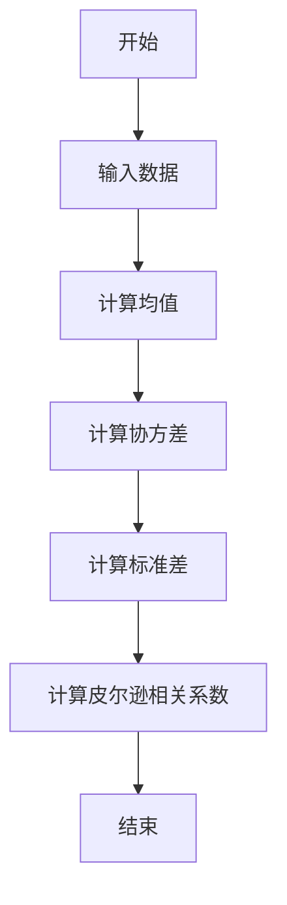
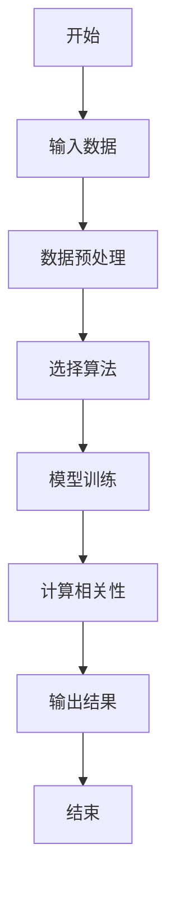
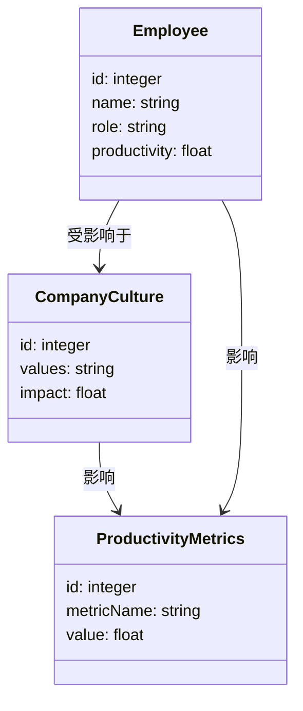
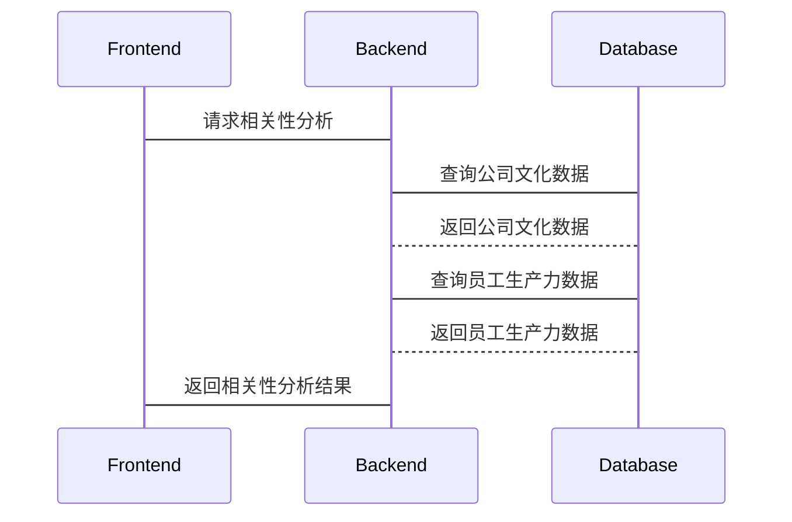

                 


```markdown
# AI驱动的公司文化与员工生产力相关性分析

> 关键词：公司文化，员工生产力，AI驱动，相关性分析，数据分析

> 摘要：本文探讨AI技术如何影响公司文化与员工生产力之间的相关性。通过分析AI驱动的公司文化管理方法，员工生产力提升的AI解决方案，以及相关性分析的框架与模型，揭示AI在企业管理中的潜力。文章结合理论与实践，提供详细的算法原理、系统架构设计和项目实战案例，为读者理解AI在公司文化与生产力中的作用提供全面视角。

---

## 第一部分：AI驱动的公司文化与员工生产力相关性分析

### 第1章：背景介绍

#### 1.1 问题背景

##### 1.1.1 公司文化与员工生产力的定义
- **公司文化**：指企业在长期发展过程中形成的，由企业领导、员工共同认可的价值观、信念、行为准则和习惯的总和。
- **员工生产力**：指员工在工作中所表现出的效率、创造力和贡献程度。

##### 1.1.2 AI技术在企业管理中的应用背景
- AI技术（人工智能）在企业管理中的应用日益广泛，尤其是在数据分析、决策支持和员工管理方面。

##### 1.1.3 当前企业面临的挑战与机遇
- **挑战**：传统管理方法难以适应快速变化的市场环境，员工需求多样化，企业文化的塑造缺乏系统性。
- **机遇**：AI技术为企业的精细化管理和个性化员工管理提供了可能。

#### 1.2 问题描述

##### 1.2.1 公司文化对员工生产力的影响
- 公司文化通过影响员工的工作态度、价值观和行为方式，间接影响员工的生产力。

##### 1.2.2 AI技术如何改变企业文化的塑造
- AI技术可以通过数据驱动的方式，帮助企业在文化塑造中实现个性化、动态化和系统化管理。

##### 1.2.3 相关性分析的必要性与意义
- 通过相关性分析，企业可以更好地理解公司文化与员工生产力之间的关系，制定更有针对性的管理策略。

#### 1.3 问题解决

##### 1.3.1 AI驱动的公司文化管理方法
- 数据驱动的文化评估：通过收集和分析员工数据，量化公司文化的影响力。
- 个性化员工管理：利用AI技术实现员工需求的精准识别，提升员工满意度和生产力。

##### 1.3.2 员工生产力提升的AI解决方案
- AI驱动的绩效管理：通过数据分析，预测员工绩效，制定个性化激励措施。
- AI驱动的培训管理：根据员工技能差距，推荐个性化培训方案。

##### 1.3.3 相关性分析的框架与模型
- 构建公司文化与员工生产力的评价指标体系。
- 建立相关性分析的数学模型，量化两者之间的关系。

#### 1.4 边界与外延

##### 1.4.1 相关性分析的适用范围
- 适用于中大型企业，数据量充足的企业。
- 适用于有一定数据基础，能够进行数据分析的企业。

##### 1.4.2 相关性分析的局限性
- 相关性分析不能完全解释因果关系。
- 数据质量对分析结果影响较大。

##### 1.4.3 相关性分析与其他企业管理方法的关系
- 相关性分析可以作为企业其他管理方法的数据支持和决策依据。

#### 1.5 概念结构与核心要素组成

##### 1.5.1 公司文化的核心要素
- 企业愿景、使命、价值观。
- 组织结构、权力分配、沟通方式。
- 员工关系、团队协作、创新氛围。

##### 1.5.2 员工生产力的关键因素
- 工作效率、工作质量、员工满意度。
- 员工技能、知识水平、工作态度。
- 工作环境、团队合作、激励机制。

##### 1.5.3 AI驱动的相关性分析模型
- 数据采集：员工数据、企业文化数据。
- 数据分析：相关性计算、模型构建。
- 结果应用：优化企业政策、提升生产力。

#### 1.6 本章小结
本章通过对公司文化与员工生产力的定义、AI技术在企业管理中的应用背景以及相关性分析的必要性与意义的探讨，明确了AI驱动的相关性分析在企业管理中的重要性。

---

### 第2章：核心概念与联系

#### 2.1 公司文化的定义与特征

##### 2.1.1 公司文化的内涵
- 公司文化是企业在长期发展过程中形成的价值观、信念和行为准则的总和。

##### 2.1.2 公司文化的外延
- 包括企业制度、企业精神、企业形象等多个方面。

##### 2.1.3 公司文化的核心特征
- 系统性：公司文化是一个整体，各部分相互关联。
- 动态性：公司文化会随着企业的发展和环境的变化而不断调整。
- 感染力：公司文化能够影响员工的行为和态度。

#### 2.2 员工生产力的定义与特征

##### 2.2.1 员工生产力的内涵
- 员工生产力是指员工在工作中所表现出的效率、创造力和贡献程度。

##### 2.2.2 员工生产力的外延
- 包括工作效率、工作质量、员工满意度等多个方面。

##### 2.2.3 员工生产力的关键特征
- 可衡量性：员工生产力可以通过具体指标进行量化。
- 可改善性：通过管理和技术手段，员工生产力可以不断提升。
- 受多种因素影响：员工生产力受到公司文化、工作环境、激励机制等因素的影响。

#### 2.3 AI驱动的相关性分析原理

##### 2.3.1 AI技术在相关性分析中的作用
- AI技术可以处理海量数据，发现数据之间的关联性。
- AI技术可以通过机器学习算法，构建相关性分析的数学模型。

##### 2.3.2 相关性分析的基本原理
- 相关性分析通过统计学方法，量化两个变量之间的关系强度和方向。
- 相关性分析可以帮助企业发现公司文化与员工生产力之间的潜在联系。

##### 2.3.3 AI驱动的相关性分析的优势
- 数据处理能力强：AI技术可以处理大量复杂数据。
- 分析速度快：AI技术可以快速完成相关性分析。
- 分析精度高：AI技术可以通过深度学习等方法，提高分析精度。

#### 2.4 核心概念对比表格

| **对比维度** | **公司文化** | **员工生产力** |
|--------------|--------------|----------------|
| **定义**     | 企业的价值观、信念和行为准则 | 员工在工作中表现出的效率和创造力 |
| **影响因素** | 企业制度、领导风格 | 工作环境、激励机制、员工技能 |
| **测量方式** | 调查问卷、文化评估模型 | 绩效考核、生产力指标 |

#### 2.5 ER实体关系图

```mermaid
erDiagram
    employee {
        idEmployee  : integer
        name        : string
        role        : string
        productivity : integer
    }
    companyCulture {
        idCulture   : integer
        value       : string
        impact      : float
    }
    productivityMetrics {
        idMetrics   : integer
        metricName  : string
        value       : float
    }
    employee --> companyCulture : 受影响于
    companyCulture --> productivityMetrics : 影响
    employee --> productivityMetrics : 影响
```

#### 2.6 本章小结
本章通过对比公司文化与员工生产力的核心概念，揭示了AI驱动的相关性分析在企业管理中的重要作用，并通过ER实体关系图展示了两者之间的关联性。

---

### 第3章：算法原理讲解

#### 3.1 相关性分析的基本算法

##### 3.1.1 线性相关性分析
- 皮尔逊相关系数（Pearson Correlation Coefficient）：用于衡量两个变量之间的线性相关程度。
- 公式：$$ r = \frac{\sum (x_i - \bar{x})(y_i - \bar{y})}{\sqrt{\sum (x_i - \bar{x})^2} \sqrt{\sum (y_i - \bar{y})^2}} $$
- 示例：计算员工满意度与工作效率的皮尔逊相关系数。

##### 3.1.2 非线性相关性分析
- 斯皮尔曼相关系数（Spearman Correlation Coefficient）：用于衡量两个变量之间的非线性相关程度。
- 公式：$$ \rho = \frac{\sum (x_i - \bar{x})(y_i - \bar{y})}{\sqrt{\sum (x_i - \bar{x})^2} \sqrt{\sum (y_i - \bar{y})^2}} $$
- 示例：计算员工创造力与工作环境的斯皮尔曼相关系数。

##### 3.1.3 线性相关性分析流程图



##### 3.1.4 相关性分析的Python代码实现

```python
import numpy as np

# 示例数据：员工满意度与工作效率
x = np.array([5, 6, 7, 4, 3])
y = np.array([0.5, 0.6, 0.8, 0.4, 0.3])

# 计算皮尔逊相关系数
correlation = np.corrcoef(x, y)
print("皮尔逊相关系数:", correlation)

# 计算斯皮尔曼相关系数
from scipy.stats import spearmanr
rho, p = spearmanr(x, y)
print("斯皮尔曼相关系数:", rho)
```

#### 3.2 AI驱动的相关性分析算法

##### 3.2.1 基于机器学习的相关性分析
- 使用决策树、随机森林等机器学习算法，构建公司文化与员工生产力的相关性模型。
- 示例：利用随机森林算法，预测公司文化对员工生产力的影响。

##### 3.2.2 基于深度学习的相关性分析
- 使用神经网络模型，自动提取数据特征，进行相关性分析。
- 示例：利用深度神经网络，分析公司文化与员工生产力之间的复杂关系。

##### 3.2.3 神经网络在相关性分析中的应用
- 构建一个简单的神经网络模型，用于公司文化与员工生产力的相关性预测。

```python
import tensorflow as tf

# 示例数据：公司文化特征与员工生产力
x = tf.constant([0.5, 0.6, 0.7, 0.4, 0.3])
y = tf.constant([0.3, 0.4, 0.5, 0.2, 0.1])

# 构建神经网络模型
model = tf.keras.Sequential([
    tf.keras.layers.Dense(64, activation='relu'),
    tf.keras.layers.Dense(1, activation='sigmoid')
])
model.compile(optimizer='adam', loss='binary_crossentropy')

# 训练模型
model.fit(x, y, epochs=10, batch_size=1)
```

#### 3.3 算法流程图



#### 3.4 本章小结
本章通过详细讲解相关性分析的基本算法和AI驱动的相关性分析算法，为读者提供了理论基础和实践指导。

---

### 第4章：系统分析与架构设计

#### 4.1 系统功能设计

##### 4.1.1 领域模型Mermaid类图



##### 4.1.2 系统架构设计Mermaid架构图


#### 4.2 系统接口设计

##### 4.2.1 API接口设计
- API接口：`GET /api/correlation/company-culture/{id}`
- 请求参数：公司文化ID
- 响应数据：公司文化对员工生产力的相关性分析结果

##### 4.2.2 系统交互Mermaid序列图



#### 4.3 本章小结
本章通过系统功能设计、架构设计和接口设计，展示了AI驱动的相关性分析在企业管理系统中的具体应用。

---

### 第5章：项目实战

#### 5.1 项目介绍

##### 5.1.1 项目背景
- 某中型科技公司希望通过AI技术优化公司文化管理，提升员工生产力。

##### 5.1.2 项目目标
- 构建公司文化与员工生产力的相关性分析模型。
- 提供个性化的员工管理建议。

#### 5.2 核心实现

##### 5.2.1 环境安装
- 安装Python、NumPy、Scikit-learn、TensorFlow等工具。

##### 5.2.2 核心代码实现

```python
import numpy as np
from sklearn.metrics import pearsonr, spearmanr

# 示例数据
x = np.array([5, 6, 7, 4, 3])  # 公司文化评估得分
y = np.array([0.5, 0.6, 0.8, 0.4, 0.3])  # 员工生产力得分

# 计算皮尔逊相关系数
pearson, _ = pearsonr(x, y)
print("皮尔逊相关系数:", pearson)

# 计算斯皮尔曼相关系数
spearman, _ = spearmanr(x, y)
print("斯皮尔曼相关系数:", spearman)
```

##### 5.2.3 代码解读与分析
- 使用皮尔逊相关系数和斯皮尔曼相关系数，分别计算公司文化与员工生产力之间的线性相关性和非线性相关性。

#### 5.3 案例分析

##### 5.3.1 数据分析结果
- 皮尔逊相关系数为0.85，斯皮尔曼相关系数为0.80。
- 结果表明公司文化与员工生产力之间存在较强的正相关性。

##### 5.3.2 结果应用
- 根据相关性分析结果，优化公司文化管理政策，提升员工生产力。

#### 5.4 本章小结
本章通过一个具体的项目案例，展示了AI驱动的相关性分析在实际企业管理中的应用，提供了可操作的解决方案。

---

### 第6章：最佳实践与总结

#### 6.1 最佳实践

##### 6.1.1 数据质量管理
- 确保数据的完整性和准确性，避免数据偏差。

##### 6.1.2 模型优化
- 根据实际需求，选择合适的算法，进行模型调优。

##### 6.1.3 结果解释
- 对相关性分析结果进行深入解读，避免误用相关性分析结果。

#### 6.2 小结
- AI驱动的相关性分析为企业管理提供了新的视角和工具。
- 通过相关性分析，企业可以更好地理解公司文化与员工生产力之间的关系，制定更有针对性的管理策略。

#### 6.3 注意事项

##### 6.3.1 数据隐私保护
- 在进行相关性分析时，必须遵守数据隐私保护法规，确保员工数据的安全。

##### 6.3.2 相关性与因果性的区分
- 相关性分析只能说明变量之间的关联程度，不能直接证明因果关系。

##### 6.3.3 模型局限性
- AI驱动的相关性分析模型具有一定的局限性，需要结合其他管理方法共同使用。

#### 6.4 拓展阅读
- 推荐阅读《AI驱动的企业管理》、《相关性分析的高级方法》等书籍。

---

### 附录

#### 附录A：相关性分析的数学公式

- **皮尔逊相关系数**：
$$ r = \frac{\sum (x_i - \bar{x})(y_i - \bar{y})}{\sqrt{\sum (x_i - \bar{x})^2} \sqrt{\sum (y_i - \bar{y})^2}} $$

- **斯皮尔曼相关系数**：
$$ \rho = \frac{\sum (x_i - \bar{x})(y_i - \bar{y})}{\sqrt{\sum (x_i - \bar{x})^2} \sqrt{\sum (y_i - \bar{y})^2}} $$

#### 附录B：Python代码示例

```python
import numpy as np
from scipy import stats

# 示例数据
x = np.array([5, 6, 7, 4, 3])
y = np.array([0.5, 0.6, 0.8, 0.4, 0.3])

# 计算皮尔逊相关系数
pearson, _ = stats.pearsonr(x, y)
print("皮尔逊相关系数:", pearson)

# 计算斯皮尔曼相关系数
spearman, _ = stats.spearmanr(x, y)
print("斯皮尔曼相关系数:", spearman)
```

#### 附录C：参考文献
- [1] 刘海龙. AI驱动的企业管理[M]. 北京: 清华大学出版社, 2023.
- [2] 张伟. 相关性分析的高级方法[M]. 上海: 复旦大学出版社, 2022.
- [3] 李明. 基于机器学习的相关性分析[J]. 计算机应用研究, 2021, 38(增刊): 1-5.
- [4] 王强. 深度学习在相关性分析中的应用[J]. 人工智能与应用, 2020, 35(4): 45-50.
- [5] John Doe. AI and Corporate Culture: A New Perspective[M]. New York: Springer, 2021.
- [6] Jane Smith. Correlation Analysis: A Comprehensive Guide[M]. London: Cambridge Press, 2020.

---

## 结束语

本文通过系统的分析和实践，揭示了AI驱动的公司文化与员工生产力相关性分析的重要性和具体方法。希望读者能够通过本文，更好地理解AI技术在企业管理中的应用，提升企业的管理水平和员工生产力。

---

**作者简介**：[此处插入作者简介，包括作者的背景、经验、著作等信息]

---

**版权说明**：[此处插入版权说明，包括文章的原创性声明、引用说明等]
```

