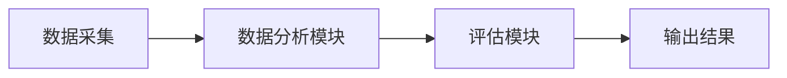

                 


# AI驱动的公司文化量化分析：无形资产估值新方法

## 关键词：AI技术、公司文化、无形资产、量化分析、评估方法、数据驱动、机器学习

## 摘要：  
本文探讨了如何利用AI技术对公司的文化进行量化分析，并提出了一种全新的无形资产估值方法。通过数据驱动的方式，结合自然语言处理和机器学习算法，我们能够将公司文化中的无形要素转化为可量化的指标，从而为企业提供更精准的资产评估和决策支持。本文详细介绍了AI驱动的文化分析的核心原理、算法实现、系统架构及实际应用案例。

---

## 第一部分: 背景介绍

### 第1章: 问题背景

#### 1.1 公司文化的无形性  
公司文化是一个组织的灵魂，它影响着员工的行为、决策以及公司的整体表现。然而，文化作为一种无形资产，其价值难以量化，导致企业在评估和优化文化时缺乏数据支持。

#### 1.2 传统评估方法的局限性  
传统的公司文化评估方法多依赖主观问卷调查或专家访谈，这种方法不仅耗时，而且结果难以量化。此外，文化数据的动态性和复杂性使得传统的评估方法难以捕捉文化变化的细节。

#### 1.3 AI技术的潜力  
AI技术，尤其是自然语言处理（NLP）和机器学习，能够从大量数据中提取模式和特征。通过分析文本数据（如员工反馈、公司文档等），AI可以将文化要素转化为可量化的指标，从而为文化评估提供新的可能性。

---

### 第2章: 问题描述

#### 2.1 核心问题  
如何将公司文化的无形要素（如价值观、员工凝聚力）转化为可量化的指标？  
如何利用AI技术对这些指标进行动态分析和评估？

#### 2.2 无形资产的定义与分类  
无形资产包括品牌价值、员工满意度、企业声誉等。这些资产通常难以用财务指标衡量，但对公司的长期价值至关重要。

#### 2.3 挑战与解决方案  
传统评估方法的主观性和低效性使得公司文化评估难以实现数据化和动态化。AI技术的应用为这一问题提供了新的解决方案，通过数据驱动的方式实现文化要素的量化分析。

---

## 第二部分: 核心概念与联系

### 第3章: 核心概念

#### 3.1 文化数据的特征提取  
通过自然语言处理技术，从员工反馈、公司文档中提取关键词和主题，识别文化中的核心要素。

#### 3.2 无形资产的量化模型  
构建基于机器学习的模型，将文化数据转化为可量化的指标，如文化健康指数、文化契合度等。

#### 3.3 AI算法的作用  
AI算法能够从大量非结构化数据中提取模式，帮助识别文化中的潜在问题和优化方向。

---

## 第三部分: 算法原理讲解

### 第4章: 数据采集与特征提取

#### 4.1 数据来源  
- 员工反馈（如满意度调查、离职面谈）  
- 公司文档（如使命宣言、价值观声明）  
- 业务数据（如员工绩效、客户满意度）  

#### 4.2 特征提取  
- 使用NLP技术提取文本数据中的关键词和主题。  
- 通过统计方法提取业务数据中的相关特征。

#### 4.3 示例代码  
```python
import numpy as np
from sklearn.feature_extraction.text import TfidfVectorizer

# 示例文本数据
texts = ["员工满意度高，团队协作能力强",
         "公司文化强调创新和客户至上",
         "员工对管理层的决策不满"]

# 使用TF-IDF提取关键词
vectorizer = TfidfVectorizer()
tfidf = vectorizer.fit_transform(texts)
feature_names = vectorizer.get_feature_names_out()

print(feature_names)
```

---

## 第四部分: 系统分析与架构设计

### 第5章: 系统架构

#### 5.1 系统功能设计  
- 数据采集模块：收集员工反馈、业务数据。  
- 数据分析模块：提取文化特征，训练AI模型。  
- 评估模块：生成文化健康指数，提供优化建议。

#### 5.2 系统架构图  


#### 5.3 接口设计  
- 数据接口：与企业现有的HR系统和业务系统对接。  
- 用户接口：提供可视化报告和优化建议。

---

## 第五部分: 项目实战

### 第6章: 实施步骤

#### 6.1 环境安装  
- 安装Python、机器学习库（如scikit-learn、TensorFlow）。  
- 配置数据存储和分析环境。

#### 6.2 核心代码实现  
```python
import pandas as pd
from sklearn.linear_model import LinearRegression

# 示例数据
data = pd.DataFrame({
    '员工满意度': [8, 7, 9],
    '团队协作': [7, 6, 8],
    '文化健康指数': [0.8, 0.7, 0.9]
})

# 训练模型
model = LinearRegression()
model.fit(data[['员工满意度', '团队协作']], data['文化健康指数'])

# 预测结果
print(model.predict([[8, 7]]))
```

#### 6.3 案例分析  
通过实际案例分析，展示如何利用AI技术量化公司文化，并评估其对业务的影响。

---

## 第六部分: 最佳实践

### 第7章: 小结

#### 7.1 核心要点总结  
- AI技术能够将公司文化转化为可量化的指标。  
- 数据驱动的方法为文化评估提供了新的可能性。  

#### 7.2 注意事项  
- 数据质量是评估结果的关键，需确保数据的准确性和完整性。  
- 结果需结合业务背景进行解读，避免单一化。

#### 7.3 拓展阅读  
推荐相关书籍和论文，进一步了解AI在企业分析中的应用。

---

## 结语

通过本文的介绍，我们了解了如何利用AI技术量化分析公司文化，并提出了新的无形资产估值方法。这种方法不仅能够帮助企业在管理中更科学地评估文化价值，还能为未来的优化和创新提供数据支持。

