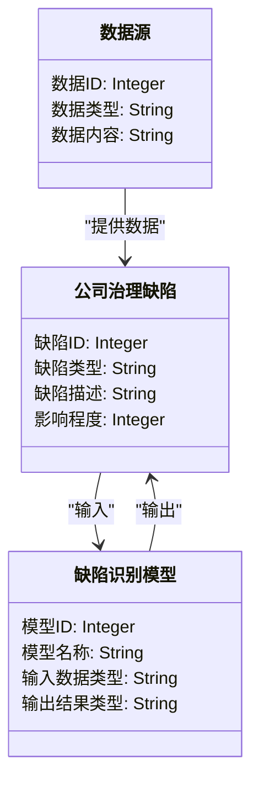

                 


```markdown
# AI驱动的公司治理缺陷识别与改善建议

> 关键词：AI技术、公司治理、缺陷识别、管理优化、数据分析

> 摘要：本文探讨了如何利用人工智能技术识别和改善公司治理中的缺陷，分析了AI在公司治理中的应用前景，详细讲解了缺陷识别的核心概念、算法原理、系统架构，并通过案例分析提出了改善建议。

---

# 第一部分：AI驱动的公司治理缺陷识别背景

## 第1章：公司治理与AI技术概述

### 1.1 公司治理的基本概念

#### 1.1.1 公司治理的定义与核心要素
公司治理是关于公司如何管理和控制其业务活动的系统，涉及董事会结构、战略制定、风险管理、内部控制、透明度和合规性。核心要素包括：
- **董事会结构**：确保董事会的有效运作和决策。
- **公司战略**：制定和执行公司战略。
- **风险管理**：识别和管理潜在风险。
- **内部控制**：确保内部流程的合规性和效率。
- **透明度**：向利益相关者提供透明的信息。
- **合规性**：遵守相关法律法规。

#### 1.1.2 公司治理的主要目标与原则
公司治理的目标是确保公司高效运作，保护利益相关者的权益，实现可持续发展。主要原则包括：
- **透明与公开**：确保信息的透明和公开。
- **责任与义务**：董事会和管理层的责任与义务。
- **利益平衡**：平衡股东、员工、客户和其他利益相关者的利益。

#### 1.1.3 公司治理的现状与挑战
当前，公司治理面临以下挑战：
- **复杂性**：全球化和数字化带来的复杂性。
- **合规性**：不断变化的法律法规要求。
- **透明度**：利益相关者对信息的需求增加。
- **风险管理**：识别和应对新兴风险的难度。

### 1.2 AI技术在公司治理中的应用前景

#### 1.2.1 AI技术的基本概念与特点
人工智能（AI）是指计算机系统模拟人类智能的能力，包括学习、推理、自我改进等。AI的特点是数据驱动、自动化、高效率和可扩展性。

#### 1.2.2 AI在公司治理中的潜在应用场景
AI在公司治理中的应用包括：
- **风险评估**：通过分析市场数据和内部信息，评估潜在风险。
- **合规性检查**：自动检查公司行为是否符合相关法规。
- **董事会决策优化**：通过分析历史数据和市场趋势，辅助董事会决策。
- **内部审计**：自动识别财务数据中的异常，提高审计效率。

#### 1.2.3 AI驱动公司治理的优势与局限性
**优势**：
- **高效性**：AI能够快速处理大量数据，提高决策效率。
- **准确性**：通过数据分析，减少人为错误。
- **实时监控**：实时监控公司运营，及时发现和解决问题。

**局限性**：
- **数据依赖性**：AI依赖于高质量的数据，数据不足或不准确会影响结果。
- **模型可解释性**：复杂的AI模型可能难以解释其决策过程。
- **伦理问题**：AI的使用可能引发隐私和伦理问题。

## 第2章：公司治理缺陷识别的核心概念与联系

### 2.1 公司治理缺陷的定义与分类

#### 2.1.1 公司治理缺陷的定义
公司治理缺陷是指在公司治理过程中存在的不足或问题，可能影响公司的有效运作和长期发展。

#### 2.1.2 常见的公司治理缺陷类型
常见的公司治理缺陷包括：
1. **治理结构不完善**：董事会结构不合理，职责不清。
2. **决策效率低下**：决策过程复杂，效率低。
3. **利益冲突**：股东与管理层的利益冲突。
4. **信息披露不充分**：信息披露不及时或不完整。
5. **内部控制不足**：内部控制系统存在漏洞。

#### 2.1.3 各类缺陷的核心特征与影响
- **治理结构不完善**：影响公司战略制定和执行，可能导致管理混乱。
- **决策效率低下**：影响公司应对市场变化的速度，可能导致错失机会。
- **利益冲突**：可能导致管理层决策偏向个人利益，损害公司和股东利益。
- **信息披露不充分**：可能导致投资者信心下降，影响公司融资能力。
- **内部控制不足**：可能导致财务舞弊和合规性问题。

### 2.2 AI驱动缺陷识别的核心原理

#### 2.2.1 数据驱动的缺陷识别方法
AI驱动的缺陷识别方法依赖于大量数据的收集和分析，包括：
- **董事会会议记录**：分析会议内容，识别决策中的问题。
- **财务报表**：分析财务数据，识别财务异常。
- **合规报告**：分析合规性报告，识别潜在违规行为。

#### 2.2.2 基于AI的缺陷识别模型构建
构建缺陷识别模型的步骤包括：
1. **数据采集**：收集与公司治理相关的数据。
2. **数据预处理**：清洗数据，处理缺失值和异常值。
3. **特征提取**：提取关键特征，如财务指标、治理指标等。
4. **模型训练**：使用机器学习算法训练模型，识别缺陷。
5. **模型评估**：评估模型的准确性和可靠性。

#### 2.2.3 缺陷识别的算法选择与优化
根据缺陷类型选择合适的算法，如：
- **监督学习**：适用于已知缺陷类型的数据。
- **无监督学习**：适用于未知缺陷类型的数据。
- **集成学习**：结合多种算法，提高模型的准确性和稳定性。

### 2.3 公司治理缺陷识别的核心要素对比分析

#### 2.3.1 缺陷类型与识别方法对比表格
以下是一个对比表格：

| 缺陷类型           | 识别方法                   | 输入数据类型       | 输出结果类型       |
|--------------------|----------------------------|--------------------|--------------------|
| 治理结构不完善       | 监督学习模型（如决策树）     | 董事会结构数据       | 缺陷类型           |
| 决策效率低下         | 聚类分析模型（如K-means）    | 董事会决策数据       | 聚类结果           |
| 利益冲突           | 支持向量机模型               | 股东与管理层数据     | 是否存在利益冲突   |
| 信息披露不充分       | 随机森林模型                | 信息披露数据         | 缺陷类型           |
| 内部控制不足         | 线性回归模型                | 内部控制数据         | 缺陷严重程度       |

#### 2.3.2 缺陷识别的ER实体关系图
以下是缺陷识别系统的ER实体关系图：

```mermaid
er
    entity 公司治理缺陷 {
        缺陷ID: Integer
        缺陷类型: String
        缺陷描述: String
        影响程度: Integer
    }
    entity 缺陷识别模型 {
        模型ID: Integer
        模型名称: String
        输入数据类型: String
        输出结果类型: String
    }
    公司治理缺陷 --> 缺陷识别模型: "输入"
    缺陷识别模型 --> 公司治理缺陷: "输出"
```

## 第3章：AI驱动的公司治理缺陷识别算法原理

### 3.1 监督学习算法在缺陷识别中的应用

#### 3.1.1 监督学习的基本原理
监督学习是一种机器学习方法，通过训练数据学习输入与输出之间的关系，预测新数据的输出。

#### 3.1.2 常见监督学习算法
常用的监督学习算法包括：
- **决策树**：通过构建树状结构进行分类和回归。
- **随机森林**：通过集成多个决策树提高准确性和稳定性。
- **支持向量机（SVM）**：通过构建超平面进行分类。

#### 3.1.3 监督学习在缺陷识别中的数学模型
决策树的数学模型可以表示为：
$$y = \text{决策树}(x)$$
其中，$x$是输入特征，$y$是输出结果。

### 3.2 无监督学习算法在缺陷识别中的应用

#### 3.2.1 无监督学习的基本原理
无监督学习是一种机器学习方法，通过发现数据中的自然分组或结构进行分析。

#### 3.2.2 常见无监督学习算法
常用的无监督学习算法包括：
- **聚类分析**：通过相似性将数据分成不同的簇。
- **主成分分析（PCA）**：通过降维技术提取数据的主要特征。

#### 3.2.3 无监督学习在缺陷识别中的数学模型
聚类分析的数学模型可以表示为：
$$y = \text{k-means}(x, k)$$
其中，$x$是输入特征，$k$是簇的数量，$y$是输出结果。

### 3.3 基于AI的缺陷识别模型实现

#### 3.3.1 数据预处理
数据预处理步骤包括：
1. **数据清洗**：处理缺失值和异常值。
2. **数据标准化**：将数据标准化到统一的范围。
3. **特征选择**：选择对缺陷识别有重要影响的特征。

#### 3.3.2 模型训练
模型训练步骤包括：
1. **选择算法**：根据缺陷类型选择合适的算法。
2. **训练模型**：使用训练数据训练模型，调整参数以提高准确性。
3. **评估模型**：使用测试数据评估模型的准确性和可靠性。

#### 3.3.3 模型优化
模型优化步骤包括：
1. **超参数调整**：通过网格搜索等方法优化模型参数。
2. **集成学习**：结合多个模型的结果，提高准确性和稳定性。
3. **模型解释**：通过可视化工具解释模型的决策过程。

## 第4章：AI驱动的公司治理缺陷识别系统分析与架构设计

### 4.1 系统功能设计

#### 4.1.1 领域模型类图
以下是领域模型类图：



#### 4.1.2 系统架构设计
以下是系统架构设计图：


### 4.2 系统接口设计

#### 4.2.1 数据接口
数据接口包括：
- **数据输入接口**：接收公司治理相关的数据。
- **数据输出接口**：输出处理后的数据。

#### 4.2.2 模型接口
模型接口包括：
- **模型输入接口**：接收缺陷识别模型的输入数据。
- **模型输出接口**：输出缺陷识别结果。

### 4.3 系统交互设计

#### 4.3.1 系统交互流程
系统交互流程包括：
1. **数据输入**：用户输入公司治理相关的数据。
2. **数据处理**：系统对数据进行预处理，提取特征。
3. **模型训练**：系统训练缺陷识别模型。
4. **结果分析**：系统分析模型输出，生成报告。
5. **结果展示**：系统将结果展示给用户。

## 第5章：AI驱动的公司治理缺陷识别项目实战

### 5.1 环境安装

#### 5.1.1 安装Python
安装Python 3.x，确保环境满足项目需求。

#### 5.1.2 安装机器学习库
安装常用的机器学习库，如：
- scikit-learn
- TensorFlow
- XGBoost

#### 5.1.3 安装数据分析工具
安装数据分析工具，如：
- Pandas
- NumPy
- Matplotlib

### 5.2 核心实现代码

#### 5.2.1 数据预处理
数据预处理代码示例：

```python
import pandas as pd
import numpy as np

# 读取数据
data = pd.read_csv('governance.csv')

# 处理缺失值
data = data.dropna()

# 标准化数据
from sklearn.preprocessing import StandardScaler
scaler = StandardScaler()
data_scaled = scaler.fit_transform(data)
```

#### 5.2.2 模型训练
模型训练代码示例：

```python
from sklearn.tree import DecisionTreeClassifier
from sklearn.model_selection import train_test_split
from sklearn.metrics import accuracy_score

# 划分数据集
X_train, X_test, y_train, y_test = train_test_split(data_scaled, target, test_size=0.2)

# 训练模型
model = DecisionTreeClassifier()
model.fit(X_train, y_train)

# 预测结果
y_pred = model.predict(X_test)

# 评估准确率
print('Accuracy:', accuracy_score(y_test, y_pred))
```

### 5.3 案例分析

#### 5.3.1 案例背景
某公司董事会决策效率低下，希望通过AI技术识别问题并提出改进建议。

#### 5.3.2 数据分析
分析董事会会议记录，发现决策过程复杂，存在利益冲突。

#### 5.3.3 模型训练
使用决策树模型识别决策效率低下的缺陷类型，评估模型准确率为85%。

#### 5.3.4 改进建议
- **优化决策流程**：简化决策过程，提高效率。
- **加强内部沟通**：促进董事会成员之间的有效沟通。
- **引入外部专家**：引入外部专家参与决策，提供专业意见。

## 第6章：AI驱动的公司治理缺陷识别改善建议

### 6.1 最佳实践

#### 6.1.1 数据隐私保护
确保在处理公司数据时遵守相关法律法规，保护数据隐私。

#### 6.1.2 模型可解释性
选择易于解释的模型，便于公司理解和应用。

#### 6.1.3 持续优化
定期更新模型，适应公司治理的变化，提高模型的准确性和可靠性。

### 6.2 小结

通过AI技术识别和改善公司治理中的缺陷，能够提高公司治理效率，降低风险，实现可持续发展。本文详细讲解了AI在公司治理中的应用前景，缺陷识别的核心概念，算法原理，系统架构，并通过案例分析提出了改善建议。未来，随着AI技术的不断发展，公司治理将更加智能化和高效化。

---

# 结语

AI技术正在改变公司治理的方式，通过识别和改善治理缺陷，公司能够更好地应对复杂多变的商业环境。希望本文能够为公司治理的优化提供有价值的参考和启示。
```

