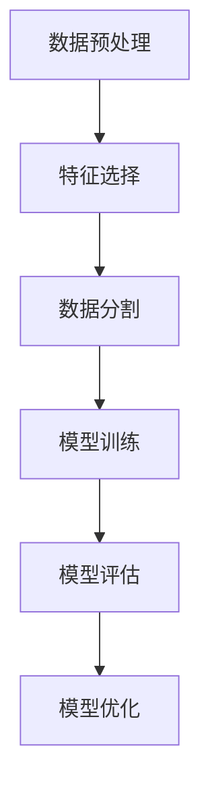

                 


# AI驱动的公司治理评分预测模型

> 关键词：公司治理，评分预测，人工智能，机器学习，数据分析

> 摘要：本文详细探讨了基于AI的公司治理评分预测模型的构建与应用，分析了其在现代企业治理中的价值与挑战，提出了有效的解决方案与未来研究方向。

---

## 第二章: AI驱动评分预测模型的核心概念与联系

### 2.1 模型的核心原理

#### 2.1.1 数据特征的提取与选择

公司在治理过程中涉及多方面的数据，包括财务数据、管理层稳定性、董事会结构、股东权益等。以下是关键数据特征的分类与属性对比：

```markdown
| 数据特征       | 属性特征           | 示例数据来源                         |
|----------------|--------------------|--------------------------------------|
| 财务表现       | 客观性、可量化       | 净利润、营收增长率、资产负债率       |
| 管理层稳定性     | 稳定性、可观察性     | 高管团队变动率、管理层平均任期       |
| 董事会结构       | 结构合理性、多样性   | 董事会独立性、独立董事比例           |
| 股东权益       | 透明性、相关性       | 大股东持股比例、股权分散度           |
| 公司声誉       | 主观性、间接性       | 企业舆情、行业排名、奖项荣誉           |
| 法律合规性       | 可验证性、强制性     | 违法违规记录、法律诉讼情况           |
```

#### 2.1.2 模型选择与训练

AI模型的构建需要结合数据特征和目标预测结果。以下是常用模型的对比：

```markdown
| 模型类型       | 适用场景           | 优势与劣势                         |
|----------------|--------------------|--------------------------------------|
| 线性回归       | 线性关系明显的场景   | 简单易解释，但对非线性关系捕捉能力弱 |
| 随机森林       | 非线性关系复杂的场景 | 高准确性，但解释性较弱               |
| 神经网络       | 高维非线性场景       | 强大的特征学习能力，但复杂度高       |
```

模型训练流程：



#### 2.1.3 结果解释与优化

模型预测结果需要转化为可理解的评分，通常采用概率评分或直接评分。评分解释需要结合实际业务场景，确保结果的可解释性和实用性。

### 2.2 核心概念的数学模型与公式

#### 2.2.1 数据特征的标准化处理

在模型训练前，通常需要对数据进行标准化处理：

$$ x' = \frac{x - \mu}{\sigma} $$

其中，$$ x $$ 是原始特征值，$$ \mu $$ 是均值，$$ \sigma $$ 是标准差。

#### 2.2.2 线性回归模型

线性回归是最简单的预测模型，其基本形式为：

$$ y = \beta_0 + \beta_1x_1 + \beta_2x_2 + \ldots + \beta_nx_n + \epsilon $$

其中，$$ y $$ 是目标变量，$$ \beta $$ 是系数，$$ x $$ 是特征变量，$$ \epsilon $$ 是误差项。

#### 2.2.3 随机森林模型

随机森林是一种集成学习方法，通过构建多棵决策树并进行投票或平均来提高预测准确性。其预测公式为：

$$ y = \text{mean}(\{y_1, y_2, \ldots, y_n\}) $$

其中，$$ y_i $$ 是第 $$ i $$ 棵决策树的预测值。

#### 2.2.4 神经网络模型

神经网络模型通常采用多层感知机（MLP）结构，其输出层的预测公式为：

$$ y = \sigma(w_2a + b_2) $$

其中，$$ a $$ 是隐藏层的激活值，$$ w_2 $$ 和 $$ b_2 $$ 是输出层的权重和偏置，$$ \sigma $$ 是sigmoid函数。

### 2.3 模型的输入与输出

#### 2.3.1 输入数据

模型的输入数据通常包括：

$$ \text{Input} = [\text{财务数据}, \text{管理层数据}, \text{董事会数据}, \text{股东数据}, \text{声誉数据}, \text{合规数据}] $$

#### 2.3.2 输出结果

模型输出的是标准化的评分，通常采用0到1的评分范围：

$$ \text{Output} = [\text{评分}, \text{评分解释}, \text{改进建议}] $$

### 2.4 模型的预测原理

#### 2.4.1 特征的标准化处理

对数据进行标准化处理是为了消除不同特征量纲的影响，使模型训练更加稳定。

#### 2.4.2 模型的训练与评估

在训练过程中，模型通过最小化预测误差来优化参数。常用的评估指标包括均方误差（MSE）、平均绝对误差（MAE）和R平方值（R²）。

#### 2.4.3 模型的预测与解释

预测结果需要结合实际业务场景进行解释，确保评分的合理性和可操作性。

### 2.5 核心概念与业务场景的联系

#### 2.5.1 评分预测的业务价值

评分预测可以帮助企业识别治理风险，优化管理结构，提升治理效率。

#### 2.5.2 模型优化的策略

模型优化需要结合业务需求，选择合适的特征和算法，确保模型的准确性和实用性。

#### 2.5.3 评分解释的实际应用

评分解释需要转化为具体的治理改进建议，帮助企业在实际操作中提升治理水平。

---

## 总结

通过以上思考，我们可以看到，AI驱动的公司治理评分预测模型需要从数据特征、模型选择、算法原理等多个方面进行深入分析，确保模型的准确性和实用性。同时，模型的应用需要结合实际业务场景，充分发挥其在公司治理中的价值。

