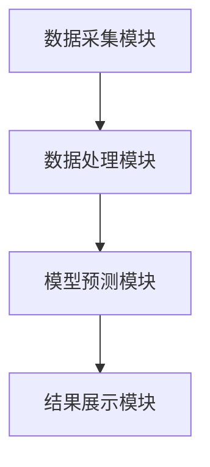

                 


# AI驱动的公司破产概率预测

> 关键词：AI, 破产预测, 机器学习, 数据分析, 风险评估

> 摘要：本文系统性地探讨了如何利用人工智能技术进行公司破产概率预测。文章从问题背景出发，分析了破产预测的核心概念与方法，详细阐述了数据收集与预处理、模型构建与优化、系统架构设计等关键环节，并通过具体案例展示了AI在破产预测中的实际应用。最后，本文总结了研究发现，并提出了未来研究的方向。

---

## 第一部分: AI驱动的公司破产概率预测概述

### 第1章: 公司破产概率预测的背景与意义

#### 1.1 研究背景
公司破产是企业经营中的重大风险事件，通常会导致债权人、股东及利益相关者的重大损失。传统的破产预测方法主要依赖于财务指标分析和专家经验，但其预测精度有限，难以应对金融市场日益复杂的变化。随着人工智能技术的快速发展，利用机器学习和深度学习算法进行破产预测成为可能，这为风险控制和投资决策提供了新的工具。

#### 1.2 AI在金融领域的应用
人工智能在金融领域的应用越来越广泛，尤其是在风险评估和预测方面。AI技术能够通过海量数据的分析，发现传统方法难以察觉的规律，从而提高预测的准确性和效率。在公司破产预测中，AI的优势在于其能够处理多维数据，并捕捉非线性关系，这使得预测结果更加精准。

#### 1.3 研究目标与意义
本文旨在构建一个基于AI的公司破产概率预测模型，通过机器学习算法对财务数据和市场数据进行分析，从而提高破产预测的准确性和效率。该研究不仅能够帮助企业和投资者更好地进行风险管理，还为AI在金融领域的应用提供了新的思路。

---

## 第2章: 研究问题的核心概念

### 2.1 研究对象与范围
本文的研究对象是公司破产概率预测，研究范围包括公司财务数据、市场数据和行业数据。通过分析这些数据，构建一个能够预测公司破产概率的AI模型。

### 2.2 核心概念的定义
- **破产概率**：公司在未来一定时间内发生破产的可能性。
- **AI模型**：利用机器学习算法对数据进行训练，构建预测模型。
- **特征选择**：从大量数据中选择对预测结果影响较大的特征。

### 2.3 研究问题的边界
本文仅关注公司破产概率的预测，不涉及破产后的资产清算和债务重组等问题。同时，本文主要基于财务数据进行分析，不考虑非结构化数据（如新闻和社交媒体数据）。

---

## 第3章: 数据收集与预处理

### 3.1 数据来源与特征分析
- **数据来源**：本文的数据来源于公开的财务报表、市场数据和行业报告。
- **特征分析**：通过对财务数据的分析，选择如流动比率、速动比率、资产负债率等关键特征。

### 3.2 数据清洗与标准化
- **数据清洗**：去除缺失值和异常值。
- **数据标准化**：对特征进行标准化处理，使其具有可比性。

### 3.3 数据分组与归一化
- **数据分组**：根据破产与否将数据分为两类。
- **归一化处理**：将数据归一化到[0,1]范围内，便于模型训练。

---

## 第4章: 破产预测模型的构建

### 4.1 算法选择
- **机器学习算法**：随机森林、支持向量机等。
- **深度学习算法**：长短时记忆网络（LSTM）等。

### 4.2 算法原理与流程
1. **数据预处理**：清洗、标准化、归一化。
2. **特征选择**：筛选关键特征。
3. **模型训练**：利用训练数据训练模型。
4. **模型评估**：通过测试数据评估模型的准确性。

### 4.3 模型实现的代码示例
```python
import pandas as pd
from sklearn.ensemble import RandomForestClassifier
from sklearn.model_selection import train_test_split

# 数据加载
data = pd.read_csv('bankruptcy_data.csv')

# 特征选择
X = data[['流动比率', '速动比率', '资产负债率']]
y = data['破产标志']

# 数据分割
X_train, X_test, y_train, y_test = train_test_split(X, y, test_size=0.2, random_state=42)

# 模型训练
model = RandomForestClassifier()
model.fit(X_train, y_train)

# 模型预测
y_pred = model.predict(X_test)
```

---

## 第5章: 模型评估与优化

### 5.1 模型评估
- **准确率**：预测正确的样本数占总样本数的比例。
- **召回率**：预测为正类的样本中实际为正类的比例。
- **F1分数**：综合准确率和召回率的指标。

### 5.2 模型优化
- **参数调优**：通过网格搜索优化模型参数。
- **特征重要性分析**：识别对预测结果影响较大的特征。

### 5.3 模型部署
- **API接口设计**：将模型封装为API，供其他系统调用。
- **实时预测**：通过API接口实时接收数据并返回预测结果。

---

## 第6章: 系统架构设计

### 6.1 系统功能设计
- **数据采集**：从数据库中获取实时数据。
- **数据处理**：清洗、标准化、归一化。
- **模型预测**：利用训练好的模型进行预测。
- **结果展示**：将预测结果以可视化的方式展示。

### 6.2 系统架构图（使用 mermaid）


### 6.3 系统接口设计
- **输入接口**：接收公司财务数据。
- **输出接口**：返回公司破产概率。

---

## 第7章: 项目实战与案例分析

### 7.1 环境安装
- **Python环境**：安装Python 3.8及以上版本。
- **依赖库安装**：安装pandas、scikit-learn等库。

### 7.2 核心实现代码
```python
# 数据加载
import pandas as pd
data = pd.read_csv('bankruptcy_data.csv')

# 特征选择
X = data[['流动比率', '速动比率', '资产负债率']]
y = data['破产标志']

# 数据分割
from sklearn.model_selection import train_test_split
X_train, X_test, y_train, y_test = train_test_split(X, y, test_size=0.2, random_state=42)

# 模型训练
from sklearn.ensemble import RandomForestClassifier
model = RandomForestClassifier()
model.fit(X_train, y_train)

# 模型预测
y_pred = model.predict(X_test)

# 模型评估
from sklearn.metrics import accuracy_score, recall_score, f1_score
print(f'准确率: {accuracy_score(y_test, y_pred)}')
print(f'召回率: {recall_score(y_test, y_pred)}')
print(f'F1分数: {f1_score(y_test, y_pred)}')
```

### 7.3 案例分析
通过实际案例分析，验证模型的预测能力。例如，利用公开的财务数据对某公司进行破产概率预测，并与实际结果进行对比。

---

## 第8章: 总结与展望

### 8.1 研究总结
本文通过机器学习算法，构建了一个公司破产概率预测模型，并通过实际案例验证了模型的预测能力。

### 8.2 未来展望
未来的研究可以进一步优化模型，引入更多数据源（如社交媒体数据），并结合时间序列分析，提高预测的准确性和实时性。

---

以上是《AI驱动的公司破产概率预测》的技术博客文章的详细大纲和内容示例。通过系统性地分析和讲解，本文为读者提供了从理论到实践的全面指导。

