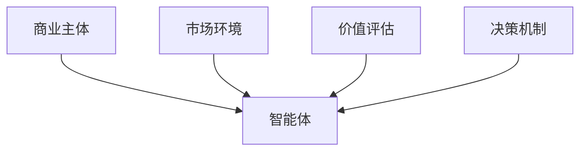
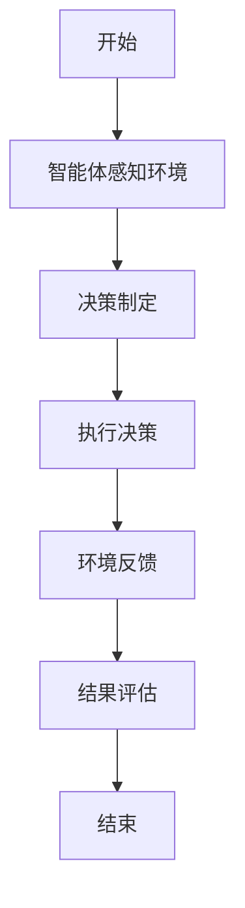
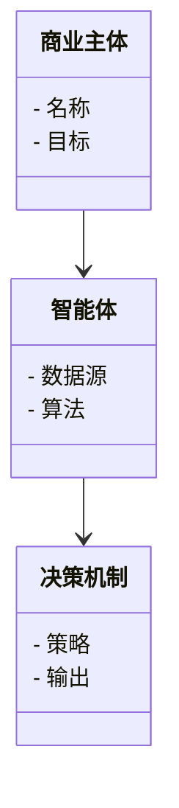

                 


# AI驱动的商业生态系统分析：价值投资中的多智能体应用

**关键词**：AI, 商业生态系统, 多智能体, 价值投资, 数学模型, 系统架构, 项目实战

**摘要**：本文系统分析AI驱动的商业生态系统，重点探讨多智能体在价值投资中的应用。通过背景介绍、核心概念、算法原理、系统架构和项目实战，详细阐述多智能体系统的构建与应用。结合数学模型、流程图和代码示例，深入剖析其在商业生态系统中的价值，为读者提供全面的技术指导。

---

## 第1章: AI驱动的商业生态系统概述

### 1.1 AI驱动的商业生态系统背景

#### 1.1.1 商业生态系统的定义与特点
商业生态系统是一个由多个参与者（如企业、消费者、供应商）及其互动关系构成的复杂系统。AI技术的引入，使系统能够实时分析数据，优化决策，提升效率。

#### 1.1.2 AI技术在商业生态系统中的作用
AI通过数据挖掘、机器学习等技术，帮助企业在市场预测、客户行为分析等方面做出更精准的决策。多智能体系统则进一步增强了系统的协作能力，提高了整体效率。

#### 1.1.3 多智能体系统的基本概念
多智能体系统由多个独立但协作的智能体组成，每个智能体都有自己的目标和决策机制。它们通过通信和协作，共同完成复杂任务。

### 1.2 价值投资中的多智能体应用

#### 1.2.1 价值投资的基本原理
价值投资是通过分析企业基本面，寻找被市场低估的投资机会。传统方法依赖人工分析，耗时且受限于主观判断。

#### 1.2.2 多智能体在价值投资中的优势
多智能体系统能够同时分析大量数据，快速识别投资机会，降低人为误差，提高决策效率。

#### 1.2.3 商业生态系统中的多智能体协作
在商业生态系统中，多智能体协同工作，分别负责数据收集、分析、决策等任务，形成高效的闭环系统。

---

## 第2章: 多智能体系统的核心概念与联系

### 2.1 多智能体系统的核心原理

#### 2.1.1 多智能体系统的定义
多智能体系统是由多个智能体组成的分布式系统，各智能体通过通信协作完成任务。

#### 2.1.2 多智能体系统的特点
- **分布式**：智能体独立运行，通过通信协作。
- **协作性**：各智能体协同完成复杂任务。
- **动态性**：系统能适应环境变化。

#### 2.1.3 多智能体系统与传统AI的区别
传统AI依赖中心化决策，而多智能体系统强调分布式协作，适用于复杂环境。

### 2.2 多智能体系统的ER实体关系图



### 2.3 多智能体系统的流程图



---

## 第3章: 多智能体系统的算法原理

### 3.1 多智能体系统的算法基础

#### 3.1.1 分布式计算原理
分布式计算将任务分解，由多个智能体并行处理，提高效率。

#### 3.1.2 协作学习机制
智能体通过协作学习共享知识，提升整体性能。

#### 3.1.3 多智能体通信协议
定义智能体间通信规则，确保有效协作。

### 3.2 多智能体算法的数学模型

#### 3.2.1 分布式计算公式
$$\text{并行计算} = \sum_{i=1}^{n} f(i)$$

#### 3.2.2 协作学习机制
$$\text{联合概率} = \prod_{i=1}^{n} P(i)$$

#### 3.2.3 通信协议
智能体间通过消息传递，消息格式包括动作、状态、目标。

---

## 第4章: 数学模型与系统分析

### 4.1 数学模型的建立

#### 4.1.1 市场动态模型
$$\text{市场价} = f(\text{供需}, \text{信息})$$

#### 4.1.2 价值评估模型
$$\text{价值} = \alpha \times \text{收益} + \beta \times \text{风险}$$

### 4.2 系统架构设计

#### 4.2.1 领域模型


---

## 第5章: 项目实战

### 5.1 环境搭建

#### 5.1.1 安装Python
使用Anaconda安装环境，配置Jupyter Notebook。

#### 5.1.2 安装依赖库
安装numpy、pandas、scikit-learn等库。

### 5.2 核心代码实现

#### 5.2.1 数据预处理
```python
import pandas as pd
data = pd.read_csv('data.csv')
```

#### 5.2.2 智能体协作
```python
class Agent:
    def __init__(self, data):
        self.data = data
    def analyze(self):
        # 数据分析逻辑
        return result
```

### 5.3 案例分析

#### 5.3.1 案例背景
分析某公司的财务数据，预测其股票价值。

#### 5.3.2 分析结果
通过多智能体协作，准确预测价值，指导投资决策。

### 5.4 项目总结
项目成功展示了多智能体系统在价值投资中的应用潜力。

---

## 第6章: 最佳实践与小结

### 6.1 最佳实践

#### 6.1.1 注意事项
- 数据质量至关重要。
- 系统设计需考虑扩展性。
- 定期更新模型以适应市场变化。

### 6.2 小结
本文系统介绍了AI驱动的商业生态系统，详细分析了多智能体系统在价值投资中的应用，为读者提供了理论和实践指导。

### 6.3 拓展阅读
推荐相关书籍和论文，深入学习多智能体系统。

---

**参考文献**：
1. Russell, S. & Norvig, P. (2010). * Artificial Intelligence: A Modern Approach.
2. Lintola, J. K. (2019). Multi-Agent Systems: A Practical Approach.

---

**附录**：
- 详细代码示例
- 进一步的数学推导
- 项目部署指南

