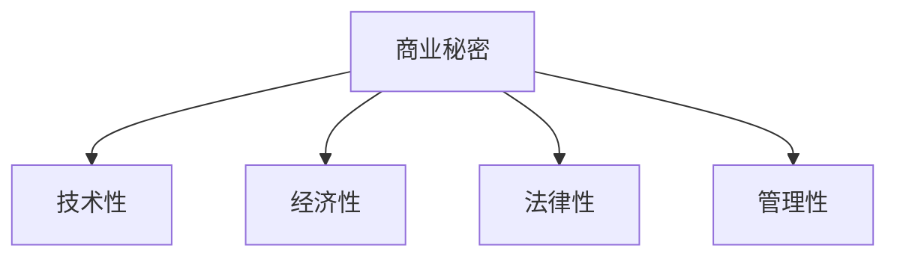
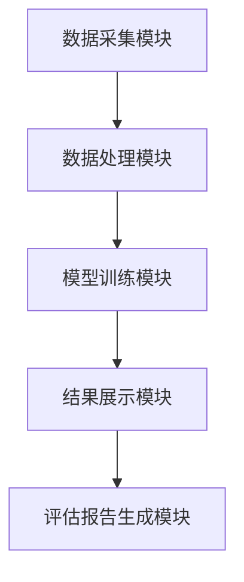
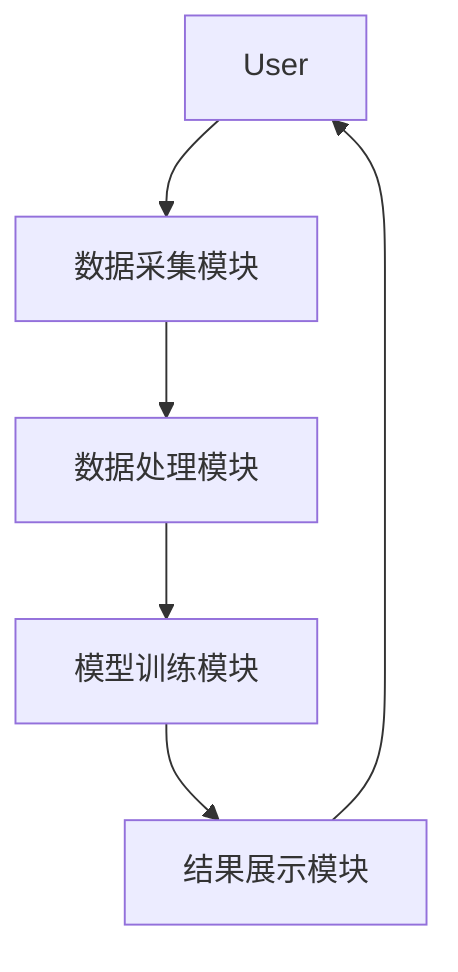

                 


# AI驱动的商业秘密价值评估：挖掘隐藏的公司资产

## 关键词：AI驱动，商业秘密，价值评估，公司资产，机器学习，深度学习，数据分析

## 摘要：  
商业秘密是企业的重要无形资产，其价值往往被低估或未被充分挖掘。随着人工智能技术的快速发展，AI驱动的商业秘密价值评估方法为企业提供了一种高效、精准的评估手段。本文将从商业秘密的基本概念、AI驱动评估的核心方法、算法原理、系统架构设计、项目实战等方面展开，深入探讨如何利用AI技术挖掘商业秘密的价值。

---

## 第1章: 商业秘密与AI驱动评估概述

### 1.1 商业秘密的基本概念  
商业秘密是指企业在经营活动中形成的，未公开、具有商业价值，并且采取了保密措施的技术信息和经营信息。它通常包括配方、工艺、客户信息、销售策略等。商业秘密的价值体现在其对企业竞争力的贡献上，但其评估难度较高，传统方法往往难以准确量化。

#### 1.1.1 商业秘密的定义与分类  
- **定义**：商业秘密是指不为公众所知悉、能为权利人带来经济利益、具有实用性并被采取保密措施的信息。  
- **分类**：  
  - 技术类：如专利技术、配方、工艺流程等。  
  - 经营类：如客户名单、销售策略、采购渠道等。  
  - 管理类：如组织架构、内部制度等。  

#### 1.1.2 商业秘密的法律保护框架  
- 商业秘密的保护主要依赖于《反不正当竞争法》等相关法律法规。  
- 保护措施包括签订保密协议、限制员工跳槽、技术加密等。  

#### 1.1.3 商业秘密在企业中的价值体现  
- 提升企业核心竞争力。  
- 增加企业的无形资产价值。  
- 在法律纠纷中作为重要证据。  

### 1.2 AI驱动的商业秘密评估背景  
随着大数据和AI技术的发展，企业对商业秘密的管理和评估需求日益增长。传统的商业秘密评估方法依赖于人工经验，效率低、主观性强，难以满足现代企业的需求。AI技术的应用为商业秘密的评估提供了新的思路。

#### 1.2.1 商业秘密评估的传统方法  
- **定性评估**：基于专家经验进行评估。  
- **定量评估**：通过财务指标、市场数据等进行估算。  
- **缺陷**：传统方法主观性强、效率低、难以量化。  

#### 1.2.2 AI技术在商业秘密评估中的优势  
- 数据驱动，能够量化评估结果。  
- 高效性，AI算法可以快速处理大量数据。  
- 精准性，基于机器学习的模型能够捕捉数据中的隐含关系。  

#### 1.2.3 当前市场对AI驱动评估的需求  
- 企业对商业秘密价值的量化需求增加。  
- 数据技术的发展为企业提供了更多可能性。  
- 法律法规对企业资产保护的要求不断提高。  

---

## 第2章: 商业秘密价值评估的核心概念

### 2.1 商业秘密价值评估的框架  
商业秘密价值评估需要考虑多个维度，包括技术性、经济性、法律性和管理性。  

#### 2.1.1 评估的核心要素  
- **技术性**：技术的先进性、成熟度和可替代性。  
- **经济性**：商业秘密带来的经济利益。  
- **法律性**：法律保护的力度和可行性。  
- **管理性**：企业内部的保密措施和管理能力。  

#### 2.1.2 评估的边界与外延  
- **边界**：商业秘密的范围和适用场景。  
- **外延**：与专利、商标等其他知识产权的关系。  

#### 2.1.3 核心概念的结构化分析  
- 使用 **mermaid** 绘制概念关系图：  



---

### 2.2 商业秘密与AI技术的关联  

#### 2.2.1 数据驱动的评估方法  
- 基于大数据分析，提取商业秘密的特征。  
- 使用聚类、分类等算法进行评估。  

#### 2.2.2 AI算法在商业秘密识别中的应用  
- 使用自然语言处理（NLP）识别敏感信息。  
- 使用深度学习模型预测商业秘密的价值。  

#### 2.2.3 商业秘密价值的动态评估模型  
- 基于时间序列分析的动态评估。  
- 使用神经网络模型捕捉数据中的隐含关系。  

---

## 第3章: AI驱动的商业秘密价值评估算法原理

### 3.1 算法原理概述  

#### 3.1.1 机器学习在商业秘密评估中的应用  
- 使用回归模型预测商业秘密的价值。  
- 使用决策树模型分类商业秘密的类型。  

#### 3.1.2 深度学习模型的构建与训练  
- 使用神经网络模型进行特征提取。  
- 使用卷积神经网络（CNN）处理文本数据。  

#### 3.1.3 模型的评估与优化  
- 使用交叉验证评估模型性能。  
- 使用超参数调优优化模型。  

---

#### 3.1.4 商业秘密价值评估的数学模型  

**线性回归模型**：  
$$ y = \beta_0 + \beta_1x_1 + \beta_2x_2 + \cdots + \beta_nx_n $$  
其中，$y$ 是商业秘密的价值，$x_i$ 是特征变量，$\beta_i$ 是模型参数。  

**神经网络模型**：  
$$ f(x) = \sigma(Wx + b) $$  
其中，$W$ 是权重矩阵，$b$ 是偏置向量，$\sigma$ 是激活函数。  

---

### 3.2 商业秘密价值评估的实现步骤  

#### 3.2.1 数据预处理与特征提取  
- 数据清洗：处理缺失值、异常值。  
- 特征提取：从文本、表格数据中提取特征。  

#### 3.2.2 模型训练与参数调优  
- 使用训练数据训练模型。  
- 使用验证数据调整模型参数。  

#### 3.2.3 评估指标与结果解读  
- 常见指标：准确率、召回率、F1分数。  
- 结果解读：模型对商业秘密价值的预测精度。  

---

## 第4章: 商业秘密价值评估系统的架构设计

### 4.1 系统功能模块设计  

#### 4.1.1 数据采集与处理模块  
- 数据来源：企业内部数据库、文档文件等。  
- 处理流程：数据清洗、特征提取、数据存储。  

#### 4.1.2 模型训练与部署模块  
- 模型训练：使用训练数据训练AI模型。  
- 模型部署：将模型部署到生产环境。  

#### 4.1.3 评估结果展示与分析模块  
- 结果展示：可视化展示评估结果。  
- 分析报告：生成评估报告。  

---

#### 4.1.4 系统架构设计  

使用 **mermaid** 绘制系统架构图：  



---

### 4.2 系统接口设计与交互流程  

#### 4.2.1 系统接口设计  
- 数据接口：提供API接口供其他系统调用。  
- 模型接口：提供模型调用接口。  

#### 4.2.2 系统交互流程  

使用 **mermaid** 绘制交互流程图：  



---

## 第5章: AI驱动的商业秘密价值评估项目实战

### 5.1 项目背景与目标  

#### 5.1.1 项目需求分析  
- 企业希望通过AI技术评估商业秘密的价值。  
- 目标是构建一个高效、精准的评估系统。  

#### 5.1.2 项目实施计划  
- 数据收集与清洗。  
- 模型训练与优化。  
- 系统部署与测试。  

---

### 5.2 系统核心实现  

#### 5.2.1 数据处理与清洗代码  

```python
import pandas as pd
import numpy as np

# 加载数据
data = pd.read_csv('commercial_secret.csv')

# 处理缺失值
data = data.dropna()

# 处理异常值
data = data[~(data['value'] > data['value'].quantile(0.99))]
```

#### 5.2.2 模型训练与评估代码  

```python
from sklearn.model import LinearRegression
from sklearn.metrics import mean_squared_error

# 训练模型
model = LinearRegression()
model.fit(X_train, y_train)

# 评估模型
y_pred = model.predict(X_test)
print(mean_squared_error(y_test, y_pred))
```

#### 5.2.3 系统功能展示与分析  
- 系统界面展示评估结果。  
- 提供详细的评估报告。  

---

## 第6章: 实际应用中的挑战与解决方案

### 6.1 数据隐私与安全问题  

#### 6.1.1 数据隐私保护措施  
- 数据加密：对敏感数据进行加密处理。  
- 访问控制：限制数据访问权限。  

#### 6.1.2 数据安全的技术实现  
- 使用区块链技术保证数据安全。  
- 实施数据脱敏技术。  

---

### 6.2 模型优化与扩展  

#### 6.2.1 模型优化策略  
- 使用更深的神经网络模型。  
- 增加更多的特征变量。  

#### 6.2.2 模型扩展方向  
- 实现实时评估功能。  
- 支持多语言、多平台的评估需求。  

---

## 第7章: 总结与展望

### 7.1 全文总结  
本文详细探讨了AI驱动的商业秘密价值评估方法，从算法原理到系统架构设计，再到项目实战，全面展示了如何利用AI技术挖掘商业秘密的价值。  

### 7.2 未来展望  
- AI技术的进一步发展将推动商业秘密评估的智能化。  
- 更多行业的应用将推动技术的创新与进步。  

---

## 思考与总结  

通过本文的分析，我们可以看出，AI技术在商业秘密价值评估中的应用前景广阔。随着技术的不断发展，AI将为企业管理和决策提供更有力的支持。

