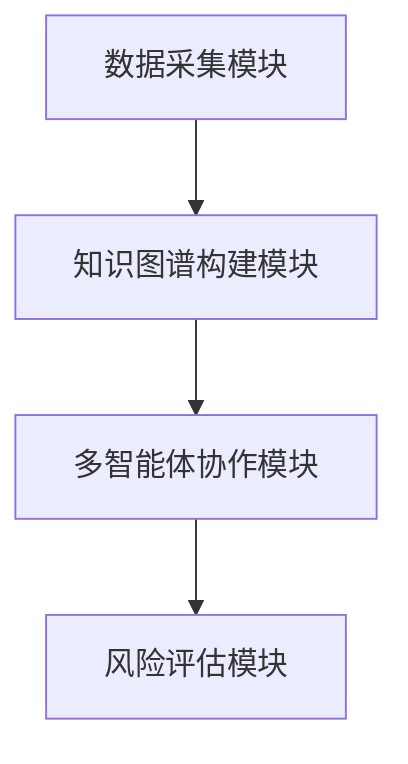
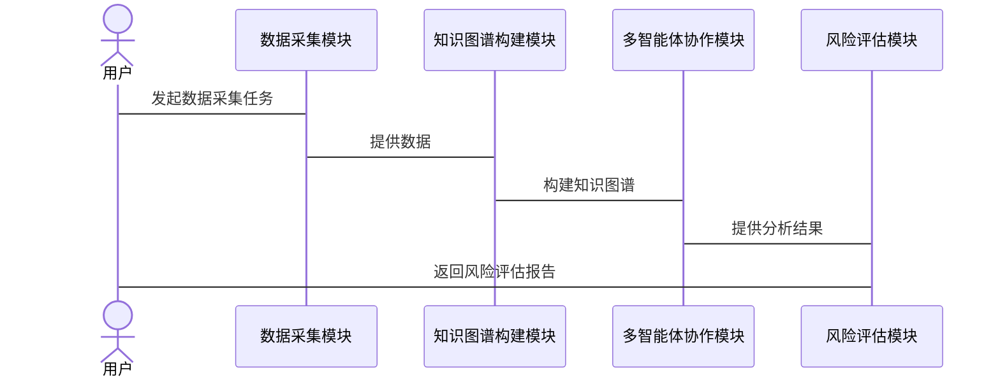

                 


# AI驱动的地缘政治风险分析：价值投资中的多智能体应用

**关键词**：AI驱动、地缘政治风险、多智能体系统、价值投资、风险评估、机器学习、系统架构

**摘要**：  
随着全球化的深入发展，地缘政治风险对经济和投资活动的影响日益显著。传统的地缘政治风险分析方法依赖于人类专家的经验和判断，存在主观性强、效率低下、难以量化等问题。人工智能（AI）技术的快速发展为地缘政治风险分析提供了新的工具和方法。本文将探讨如何利用AI技术，特别是多智能体系统，来分析地缘政治风险，并将其应用于价值投资中。通过构建知识图谱、设计多智能体系统、开发风险评估模型，本文将展示如何利用AI技术提升地缘政治风险分析的效率和准确性，为投资者提供更可靠的决策支持。

---

## 第1章：引言

### 1.1 地缘政治风险分析的背景
#### 1.1.1 地缘政治风险的定义与重要性
地缘政治风险是指由于政治、经济、军事、文化等多方面因素引发的国家间冲突、贸易摩擦、资源争夺等风险。这些风险可能对全球经济、企业运营和投资活动产生重大影响。例如，中美贸易摩擦、中东地缘政治冲突等事件都对全球资本市场产生了显著影响。

#### 1.1.2 传统地缘政治分析的局限性
传统的地缘政治分析方法主要依赖于专家经验和定性分析，存在以下问题：
- **主观性强**：分析结果受专家主观判断影响，缺乏客观性。
- **效率低下**：手动分析大量数据耗时耗力，难以应对海量信息。
- **难以量化**：地缘政治事件的复杂性使得风险量化困难，难以用于投资决策。

#### 1.1.3 AI技术如何弥补传统方法的不足
人工智能技术可以通过自动化数据处理、模式识别和预测模型，帮助解决传统方法的局限性：
- **数据驱动**：利用AI技术从海量数据中提取有用信息，提供客观的分析结果。
- **实时监控**：通过自然语言处理（NLP）和机器学习（ML）技术实时监控全球新闻、社交媒体和官方声明，捕捉潜在风险信号。
- **量化分析**：将地缘政治事件转化为可量化的指标，为投资决策提供支持。

### 1.2 多智能体系统在地缘政治风险分析中的应用
#### 1.2.1 多智能体系统的定义
多智能体系统（Multi-Agent System, MAS）是由多个相互作用的智能体组成的系统，每个智能体都具有一定的自主性、反应性和社会性。智能体之间通过通信和协作完成复杂任务。

#### 1.2.2 多智能体系统在地缘政治分析中的优势
- **分布式计算**：多智能体系统可以分布处理海量数据，提高计算效率。
- **协作与通信**：智能体之间可以协作分析不同领域（如经济、军事、文化）的数据，提供全面的风险评估。
- **动态适应**：智能体能够实时响应地缘政治事件的变化，快速调整分析结果。

#### 1.2.3 多智能体系统与价值投资的结合
多智能体系统可以为投资者提供实时的地缘政治风险评估，帮助他们在价值投资中做出更明智的决策。例如，通过分析全球贸易数据、政策变化和市场情绪，智能体可以预测某一地区的投资风险，并为投资者提供规避策略。

### 1.3 本书的核心目标与结构安排
#### 1.3.1 本书的研究目标
- 探讨AI技术在地缘政治风险分析中的应用。
- 研究多智能体系统在价值投资中的实际应用。
- 提供一种基于AI的地缘政治风险分析框架，为投资者提供决策支持。

#### 1.3.2 本书的章节安排
- 第1章：引言，介绍地缘政治风险分析的背景和AI技术的应用。
- 第2章：地缘政治风险分析的理论基础，包括知识图谱的构建。
- 第3章：多智能体系统的原理与设计。
- 第4章：AI驱动的地缘政治风险分析模型。
- 第5章：多智能体系统在价值投资中的应用。
- 第6章：系统架构设计与实现。
- 第7章：项目实战与案例分析。
- 第8章：结论与展望。

---

## 第2章：地缘政治风险分析的理论基础

### 2.1 地缘政治风险的构成要素
#### 2.1.1 政治因素
- 政治稳定性：国家政治环境的稳定性对投资风险有直接影响。
- 政策变化：政府政策的变化可能影响市场规则和企业运营。

#### 2.1.2 经济因素
- 经济依赖度：一国对某一资源或市场的依赖程度越高，风险越大。
- 贸易摩擦：贸易壁垒和关税政策可能影响全球供应链。

#### 2.1.3 文化与社会因素
- 社会动荡：社会不稳定可能导致政治风险增加。
- 文化差异：文化冲突可能引发国际争端。

#### 2.1.4 军事与安全因素
- 军事冲突：地区冲突可能对全球经济产生重大影响。
- 安全威胁：恐怖主义和网络安全威胁对投资活动构成风险。

### 2.2 地缘政治风险分析的框架
#### 2.2.1 宏观分析框架
从全球视角分析地缘政治风险，关注重大国际事件和全球性问题。

#### 2.2.2 中观分析框架
从区域或国家视角分析地缘政治风险，关注特定地区的经济、政治和军事动态。

#### 2.2.3 微观分析框架
从企业或项目的视角分析地缘政治风险，关注特定项目或企业在特定地区的风险暴露程度。

### 2.3 地缘政治知识图谱的构建
#### 2.3.1 知识图谱的定义
知识图谱是一种以图结构形式表示知识的数据库，包含实体和实体之间的关系。

#### 2.3.2 知识图谱的构建方法
- 数据采集：从新闻、政府声明、学术论文等多来源采集数据。
- 实体识别：使用NLP技术提取实体信息。
- 关系抽取：识别实体之间的关系，构建知识图谱。

#### 2.3.3 知识图谱在地缘政治分析中的应用
- 支持智能体之间的协作与通信。
- 提供地缘政治事件的背景信息，帮助智能体理解复杂关系。

---

## 第3章：多智能体系统的原理与设计

### 3.1 多智能体系统的定义与特点
#### 3.1.1 多智能体系统的定义
多智能体系统是由多个智能体组成的分布式系统，智能体之间通过通信和协作完成任务。

#### 3.1.2 多智能体系统的特性
- **自主性**：智能体能够自主决策。
- **反应性**：智能体能够实时感知环境并做出反应。
- **协作性**：智能体之间能够协作完成复杂任务。
- **分布式性**：智能体分布在不同的地理位置或计算节点。

### 3.2 多智能体系统的原理
#### 3.2.1 智能体的组成
- **感知层**：通过传感器或数据源获取信息。
- **推理层**：基于获取的信息进行分析和推理。
- **决策层**：根据推理结果做出决策。
- **执行层**：根据决策执行动作。

#### 3.2.2 多智能体系统的通信机制
- **直接通信**：智能体之间直接交换信息。
- **间接通信**：通过中间媒介（如共享数据库）进行信息交换。

### 3.3 多智能体系统的实现
#### 3.3.1 系统架构
- **中心化架构**：一个中心节点协调所有智能体。
- **去中心化架构**：智能体之间直接协作，无中心节点。

#### 3.3.2 智能体的协作与协调
- **任务分配**：智能体根据自身能力和当前任务分配情况进行任务分配。
- **冲突解决**：通过协商或规则解决智能体之间的冲突。

---

## 第4章：AI驱动的地缘政治风险分析模型

### 4.1 数据来源与特征提取
#### 4.1.1 数据来源
- **新闻媒体**：实时新闻报道。
- **政府声明**：官方政策声明。
- **社交媒体**：公众意见和情绪分析。

#### 4.1.2 特征提取
- **关键词提取**：提取与地缘政治相关的关键词。
- **情感分析**：分析文本的情感倾向，判断公众情绪。

### 4.2 机器学习模型
#### 4.2.1 模型选择
- **监督学习**：基于历史数据训练分类模型。
- **无监督学习**：聚类分析地缘政治事件的相似性。

#### 4.2.2 模型训练
- **数据预处理**：清洗数据，提取特征。
- **模型训练**：使用训练数据训练模型。
- **模型评估**：通过验证集评估模型性能。

### 4.3 风险预测与解释
#### 4.3.1 风险预测
- **概率预测**：预测地缘政治事件发生的概率。
- **影响评估**：评估事件对经济和投资的影响。

#### 4.3.2 风险解释
- **可解释性分析**：分析模型的决策过程，解释预测结果。

---

## 第5章：多智能体系统在价值投资中的应用

### 5.1 投资策略优化
#### 5.1.1 实时风险监控
- 智能体实时监控地缘政治事件，提供实时风险评估。

#### 5.1.2 动态投资组合调整
- 根据风险评估结果动态调整投资组合，规避高风险地区。

### 5.2 风险对冲
#### 5.2.1 风险对冲策略
- 通过多智能体系统分析，制定风险对冲策略。

#### 5.2.2 风险对冲工具
- 使用金融衍生品对冲地缘政治风险。

---

## 第6章：系统架构设计与实现

### 6.1 系统架构设计
#### 6.1.1 模块划分
- **数据采集模块**：采集地缘政治相关的数据。
- **知识图谱构建模块**：构建地缘政治知识图谱。
- **多智能体协作模块**：智能体协作进行风险分析。
- **风险评估模块**：基于多智能体分析结果，评估风险。

#### 6.1.2 系统架构图


### 6.2 接口设计
#### 6.2.1 数据接口
- **输入接口**：接收外部数据源的数据。
- **输出接口**：输出风险评估结果。

#### 6.2.2 智能体通信接口
- **智能体间通信接口**：定义智能体之间的通信协议。

### 6.3 交互设计
#### 6.3.1 用户界面
- **数据可视化界面**：展示地缘政治事件和风险评估结果。
- **操作界面**：用户可以通过界面进行任务分配和参数设置。

#### 6.3.2 系统交互流程


---

## 第7章：项目实战与案例分析

### 7.1 项目需求分析
#### 7.1.1 项目背景
- 研究如何利用AI技术分析中美贸易摩擦对全球经济的影响。

#### 7.1.2 项目目标
- 构建一个基于多智能体系统的地缘政治风险分析系统，分析中美贸易摩擦对全球供应链的影响。

### 7.2 系统设计
#### 7.2.1 系统架构设计
- **数据采集模块**：采集中美贸易摩擦相关的新闻、政策声明和社交媒体数据。
- **知识图谱构建模块**：构建中美贸易摩擦的知识图谱。
- **多智能体协作模块**：智能体协作分析中美贸易摩擦对全球经济的影响。
- **风险评估模块**：评估中美贸易摩擦对全球供应链的风险。

#### 7.2.2 实现步骤
1. 数据采集：从新闻网站、政府官网和社交媒体采集中美贸易摩擦相关的数据。
2. 数据清洗：清洗数据，提取关键词和实体。
3. 知识图谱构建：构建中美贸易摩擦的知识图谱，包括实体和关系。
4. 多智能体协作：智能体协作分析中美贸易摩擦对全球经济的影响。
5. 风险评估：评估中美贸易摩擦对全球供应链的风险。

### 7.3 代码实现
#### 7.3.1 数据采集代码
```python
import requests
from bs4 import BeautifulSoup

def fetch_news(url):
    response = requests.get(url)
    soup = BeautifulSoup(response.text, 'html.parser')
    news_title = soup.find('h1').text
    news_content = soup.find('div', class_='article-content').text
    return news_title, news_content

url = 'https://example.com/trade-friction'
title, content = fetch_news(url)
print(title)
print(content)
```

#### 7.3.2 知识图谱构建代码
```python
from kgclique import kg_utils

def build_kg():
    kg_utils.createKnowledgeGraph('trade-friction')

build_kg()
```

---

## 第8章：结论与展望

### 8.1 研究总结
本文探讨了AI技术在地缘政治风险分析中的应用，特别是多智能体系统的应用。通过构建知识图谱、设计多智能体系统和开发风险评估模型，本文为投资者提供了一种新的地缘政治风险分析方法。

### 8.2 未来展望
未来的研究可以进一步优化多智能体系统的协作机制，提高系统的实时性和准确性。此外，还可以探索更多AI技术，如强化学习和深度学习，进一步提升地缘政治风险分析的能力。

---

以上是《AI驱动的地缘政治风险分析：价值投资中的多智能体应用》的目录大纲和部分章节内容。希望本文能为读者提供一个清晰的思路，展示如何利用AI技术分析地缘政治风险，并应用于价值投资中。

