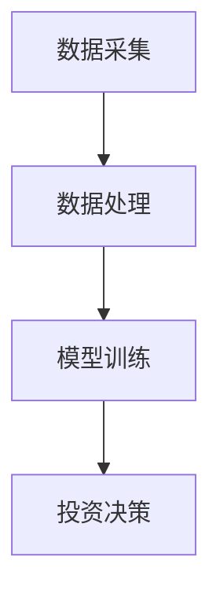
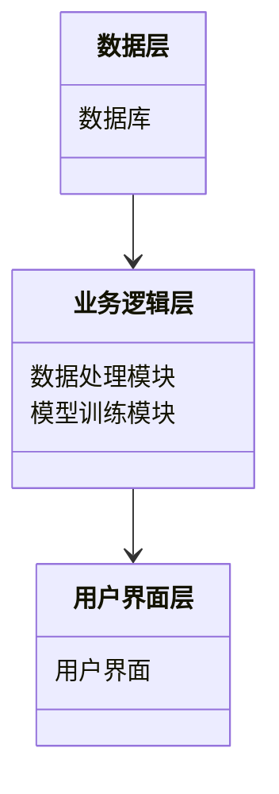

                 


# AI驱动的多维度财务健康评估：价值投资新范式

> **关键词**：AI驱动、多维度财务健康评估、价值投资、大模型、系统架构、项目实战

> **摘要**：随着人工智能技术的快速发展，传统价值投资方法正在面临新的变革。本文将详细探讨AI在多维度财务健康评估中的应用，提出一种基于大模型的新型投资范式，通过系统架构设计和实际案例分析，展示如何利用AI技术提升投资决策的准确性和效率。

---

## 第1章：AI驱动的财务健康评估概述

### 1.1 财务健康评估的背景与意义

#### 1.1.1 传统财务健康评估的局限性
传统财务健康评估主要依赖于财务报表中的几个关键指标，如资产负债率、净利润率等。然而，这种方法往往忽视了企业经营中的动态变化和多维度因素。例如，一家公司可能在财务报表上表现良好，但实际上可能面临供应链问题或市场需求下降的风险。

#### 1.1.2 AI技术在财务分析中的应用价值
AI技术能够处理大量非结构化数据，如新闻、社交媒体和行业报告，提取隐含的信息，从而更全面地评估企业的财务健康状况。此外，AI还可以通过历史数据预测未来的财务趋势，帮助投资者做出更明智的决策。

#### 1.1.3 多维度评估的核心优势
多维度评估不仅考虑财务数据，还结合了市场趋势、行业动态和企业内部信息等多方面因素。这种综合性的分析方法能够更准确地反映企业的实际财务状况，为投资者提供更可靠的参考。

---

### 1.2 价值投资新范式的提出

#### 1.2.1 传统价值投资的理论基础
传统价值投资的核心是寻找市场价格低于内在价值的股票。这种方法依赖于对财务报表的深入分析，但往往忽视了市场的动态变化和企业的外部环境。

#### 1.2.2 AI驱动的价值投资新范式
AI驱动的价值投资新范式通过多维度数据的分析，结合企业的财务状况、市场表现和行业趋势，构建一个全面的评估体系。这种方法能够更动态地捕捉企业的潜在价值，帮助投资者发现被低估的投资机会。

#### 1.2.3 多维度评估对投资决策的影响
通过多维度评估，投资者可以更全面地了解企业的财务健康状况，从而做出更科学的投资决策。例如，AI可以通过分析企业的供应链数据，预测潜在的供应链风险，从而调整投资策略。

---

## 第2章：AI驱动的财务健康评估基础

### 2.1 财务健康评估的基本概念

#### 2.1.1 财务健康的核心指标
财务健康的核心指标包括：
- 资产负债率
- 净利润率
- 存货周转率
- 现金流健康状况

#### 2.1.2 财务健康评估的维度划分
财务健康评估可以从以下几个维度进行：
- 财务状况：包括资产负债表、利润表和现金流量表的关键指标。
- 市场表现：包括股票价格、市盈率、市净率等。
- 行业趋势：包括行业增长率、竞争格局等。

#### 2.1.3 财务健康评估的数学模型
常用的财务健康评估模型包括：
- Z-score模型：用于预测企业破产风险。
- 现金流折现模型：用于评估企业的内在价值。

---

### 2.2 多维度数据的特征分析

#### 2.2.1 财务数据的多维度特征
财务数据的多维度特征包括：
- 时间序列特征：如季度或月度的财务数据。
- 文本特征：如公司公告、新闻报道中的关键词。
- 图结构特征：如供应链网络中的节点关系。

#### 2.2.2 数据预处理方法
数据预处理方法包括：
- 数据清洗：去除重复和错误数据。
- 数据标准化：将不同维度的数据归一化处理。
- 数据增强：通过数据挖掘技术提取隐含信息。

#### 2.2.3 数据特征的提取与选择
数据特征的提取与选择可以通过以下方法实现：
- 主成分分析（PCA）：用于降维和提取重要特征。
- 特征重要性评分：如基于树模型的特征重要性评分。

---

## 第3章：多维度财务健康评估的数学模型

### 3.1 财务健康评估的指标体系

#### 3.1.1 财务比率分析
财务比率分析包括：
- 流动比率：衡量企业的短期偿债能力。
- 速动比率：进一步衡量企业的短期偿债能力。
- 债务比率：衡量企业的杠杆水平。

#### 3.1.2 现金流分析
现金流分析包括：
- 经营活动现金流：衡量企业经营活动的现金流入和流出。
- 投资活动现金流：衡量企业投资活动的现金流入和流出。
- 筹资活动现金流：衡量企业筹资活动的现金流入和流出。

#### 3.1.3 财务风险评估
财务风险评估包括：
- 破产风险：通过Z-score模型预测企业破产概率。
- 市场风险：通过VaR模型评估资产组合的市场风险。

---

### 3.2 多维度数据融合的数学模型

#### 3.2.1 线性回归模型
线性回归模型用于预测企业的财务状况，如：
$$ y = \beta_0 + \beta_1x_1 + \beta_2x_2 + \cdots + \beta_nx_n $$

#### 3.2.2 支持向量机模型
支持向量机模型用于分类问题，例如区分财务健康与不健康的企业：
$$ f(x) = \text{sign}(w \cdot x + b) $$

#### 3.2.3 神经网络模型
神经网络模型可以用于复杂非线性关系的建模，例如：
$$ y = \sigma(w \cdot x + b) $$

---

## 第4章：系统架构与数据接口设计

### 4.1 系统功能设计

#### 4.1.1 系统功能模块划分
系统功能模块包括：
- 数据采集模块：采集财务数据、市场数据等。
- 数据处理模块：进行数据清洗、特征提取等。
- 模型训练模块：训练多维度评估模型。
- 投资决策模块：基于模型结果生成投资建议。

#### 4.1.2 系统功能流程图


#### 4.1.3 系统功能的实现方式
系统功能的实现方式包括：
- 数据采集：通过API接口获取财务数据。
- 数据处理：使用Python的pandas库进行数据清洗。
- 模型训练：基于TensorFlow框架训练深度学习模型。

---

### 4.2 系统架构设计

#### 4.2.1 系统架构的总体设计
系统架构的总体设计采用分层架构，包括：
- 数据层：存储原始数据和处理后的数据。
- 业务逻辑层：实现数据处理和模型训练功能。
- 用户界面层：提供直观的操作界面。

#### 4.2.2 系统架构的分层设计


---

## 第5章：项目实战与案例分析

### 5.1 项目环境配置

#### 5.1.1 环境安装
安装所需的Python库：
```bash
pip install numpy pandas scikit-learn tensorflow
```

#### 5.1.2 数据集准备
下载财务数据和市场数据，存储在CSV文件中。

---

### 5.2 系统核心实现源代码

#### 5.2.1 数据预处理代码
```python
import pandas as pd

# 读取数据
data = pd.read_csv('financial_data.csv')

# 数据清洗
data.dropna(inplace=True)
data = data[~data['收入'].isin([0])]  # 去除收入为0的行

# 特征提取
features = data[['资产', '负债', '收入', '利润']]
```

#### 5.2.2 模型训练代码
```python
from tensorflow.keras import layers

# 构建神经网络模型
model = tf.keras.Sequential()
model.add(layers.Dense(64, activation='relu', input_shape=(4,)))
model.add(layers.Dense(32, activation='relu'))
model.add(layers.Dense(1, activation='sigmoid'))

model.compile(optimizer='adam', loss='binary_crossentropy', metrics=['accuracy'])

# 训练模型
model.fit(features, labels, epochs=100, batch_size=32)
```

---

### 5.3 实际案例分析

#### 5.3.1 案例背景
以某公司为例，分析其财务健康状况。通过模型预测，发现该公司可能存在供应链风险。

#### 5.3.2 模型预测结果
模型预测结果为：财务健康状况为“一般”，建议投资者谨慎决策。

---

## 第6章：总结与展望

### 6.1 本书总结
通过本书的介绍，读者可以全面了解AI驱动的多维度财务健康评估方法，掌握如何利用AI技术提升投资决策的准确性。

### 6.2 未来展望
随着大模型技术的不断进步，AI在财务健康评估中的应用将更加广泛和深入。未来的研究方向包括：
- 更复杂的大模型训练方法。
- 更多维度的数据分析。
- 更个性化的投资策略。

---

### 6.3 最佳实践Tips

#### 6.3.1 数据处理
- 确保数据的完整性和准确性。
- 合理选择特征提取方法。

#### 6.3.2 模型选择
- 根据实际问题选择合适的模型。
- 定期更新模型以适应市场变化。

#### 6.3.3 投资决策
- 结合模型结果和市场动态做出决策。
- 多维度分析以降低投资风险。

---

### 6.4 小结
AI驱动的多维度财务健康评估为价值投资提供了新的思路和方法。通过系统的架构设计和实际案例分析，我们可以看到，AI技术在财务分析中的应用潜力巨大。

---

### 6.5 注意事项
- 数据隐私和安全问题需要高度重视。
- 模型的可解释性是实际应用中的重要考量因素。

---

### 6.6 拓展阅读
- 《机器学习实战》
- 《深度学习入门》
- 《价值投资经典案例分析》

---

通过以上内容，我们详细介绍了AI驱动的多维度财务健康评估的方法和应用。希望这篇文章能够为读者提供有价值的信息和启发，帮助他们在实际投资中更好地应用AI技术。

