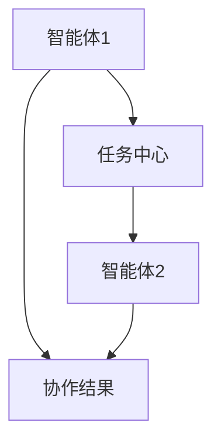
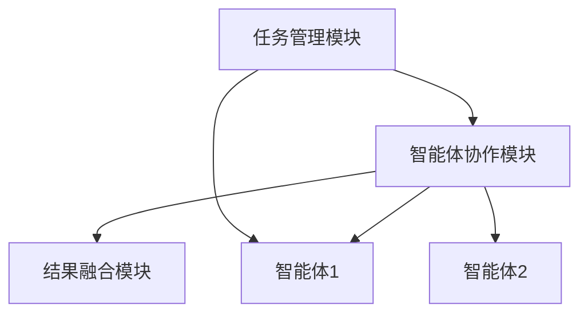

                 


# AI驱动的安全边际计算：多智能体协作提高准确度

> 关键词：AI, 安全边际计算, 多智能体协作, 算法原理, 系统架构, 项目实战

> 摘要：本文深入探讨了AI驱动的安全边际计算，重点分析了多智能体协作在提高计算准确度和可靠性方面的作用。通过详细阐述多智能体协作的核心概念、算法原理、系统架构设计以及实际项目案例，本文为读者提供了从理论到实践的全面指导，帮助读者理解并应用多智能体协作技术来提升AI系统的安全性和准确性。

---

## 第一部分: AI驱动的安全边际计算基础

### # 第1章: 安全边际计算与多智能体协作概述

#### ## 1.1 安全边际计算的基本概念

- **1.1.1 计算系统中的安全边际**  
  安全边际计算是指在计算系统中，通过引入冗余和协作机制，确保计算结果的准确性和可靠性的过程。其核心目标是在面对不确定性、噪声干扰或系统故障时，仍能保持计算的准确性。

- **1.1.2 安全边际计算的定义与目标**  
  安全边际计算通过多智能体协作的方式，将多个智能体的结果进行融合，从而提高计算的准确性和鲁棒性。其目标是降低单一智能体的计算误差，确保整体系统的可靠性。

- **1.1.3 多智能体协作在安全边际计算中的作用**  
  多智能体协作通过分布式计算和信息共享，能够有效降低单点故障的风险，提高系统的容错能力和抗干扰能力。

#### ## 1.2 多智能体协作的基本原理

- **1.2.1 多智能体系统的定义**  
  多智能体系统是由多个具有独立计算能力和协作能力的智能体组成的系统，这些智能体能够通过通信和协作完成共同的任务。

- **1.2.2 智能体之间的协作机制**  
  智能体之间的协作机制包括任务分配、信息共享和结果融合。通过这些机制，多个智能体可以协同工作，共同完成复杂的计算任务。

- **1.2.3 多智能体协作的优势与挑战**  
  优势：提高计算的准确性和鲁棒性，降低单点故障风险。挑战：智能体之间的通信延迟、信息同步问题以及协作算法的复杂性。

#### ## 1.3 AI驱动的安全边际计算的应用场景

- **1.3.1 金融领域的安全边际计算**  
  在金融交易中，通过多智能体协作，可以提高交易系统的准确性和安全性，降低因单点故障导致的交易失败风险。

- **1.3.2 医疗领域的安全边际计算**  
  在医疗诊断中，多智能体协作可以提高诊断的准确性和可靠性，降低误诊率。

- **1.3.3 智能交通系统的安全边际计算**  
  在智能交通系统中，多智能体协作可以提高交通流量预测的准确性，优化交通管理。

---

### # 第2章: 多智能体协作的核心概念与联系

#### ## 2.1 多智能体协作的原理

- **2.1.1 智能体的定义与属性**  
  智能体是具有感知环境、做出决策和执行动作能力的实体。其属性包括自主性、反应性、协作性和学习能力。

- **2.1.2 智能体之间的通信与协调**  
  智能体之间的通信是通过消息传递机制完成的。协调机制包括任务分配、信息同步和结果融合。

- **2.1.3 协作任务的分配与优化**  
  协作任务的分配需要考虑智能体的能力、负载和任务需求。优化目标是最大化系统的整体性能。

#### ## 2.2 多智能体协作的数学模型

- **2.2.1 协作任务的数学表达**  
  协作任务可以表示为一个优化问题，目标函数是系统整体的准确度，约束条件包括智能体的能力和任务需求。

- **2.2.2 智能体之间的信息交换模型**  
  智能体之间的信息交换可以表示为一个图模型，节点代表智能体，边表示信息交互。

- **2.2.3 协作过程的优化模型**  
  协作过程的优化可以通过强化学习算法实现，目标是最大化协作系统的整体收益。

#### ## 2.3 多智能体协作的ER实体关系图



---

### # 第3章: 多智能体协作的算法原理

#### ## 3.1 分布式计算算法

- **3.1.1 分布式计算的基本原理**  
  分布式计算是将计算任务分配给多个智能体，通过并行计算提高计算效率。

- **3.1.2 分布式计算的实现步骤**  
  1. 任务分配：根据智能体的能力分配任务。  
  2. 并行计算：智能体独立完成分配的任务。  
  3. 结果融合：将各智能体的结果进行融合，得到最终结果。

- **3.1.3 分布式计算的优缺点**  
  优点：提高计算效率，降低单点故障风险。缺点：需要复杂的任务分配和结果融合机制。

#### ## 3.2 强化学习算法

- **3.2.1 强化学习的基本原理**  
  强化学习是一种通过试错机制，学习最优策略的算法。智能体通过与环境的交互，获得奖励或惩罚，逐步优化其行为策略。

- **3.2.2 多智能体强化学习的挑战**  
  多智能体强化学习需要解决智能体之间的协调问题，避免竞争和冲突。

- **3.2.3 多智能体强化学习的实现案例**  
  在机器人协作任务中，多智能体强化学习可以实现任务分配和协作优化。

#### ## 3.3 协作任务分配算法

- **3.3.1 任务分配的基本原则**  
  任务分配需要考虑智能体的能力、负载和任务需求。

- **3.3.2 基于博弈论的任务分配算法**  
  通过博弈论模型，智能体可以自主决策任务分配，实现最优协作。

- **3.3.3 基于图论的任务分配算法**  
  通过图论模型，智能体之间的协作关系可以用图结构表示，任务分配可以通过图的划分实现。

---

### # 第4章: 多智能体协作的数学模型与公式

#### ## 4.1 协作任务的数学表达

- **4.1.1 协作任务的定义与表示**  
  协作任务可以表示为一个优化问题：  
  $$ \text{最大化 } J = \sum_{i=1}^n J_i $$  
  其中，$J_i$ 是智能体 $i$ 的收益。

- **4.1.2 协作任务的目标函数**  
  目标函数可以表示为：  
  $$ \text{最大化 } \sum_{i=1}^n \sum_{j=1}^m w_{ij}x_{ij} $$  
  其中，$w_{ij}$ 是智能体 $i$ 完成任务 $j$ 的权重，$x_{ij}$ 是智能体 $i$ 是否完成任务 $j$ 的二进制变量。

- **4.1.3 协作任务的约束条件**  
  约束条件包括：  
  $$ \sum_{i=1}^n x_{ij} = 1 \quad \forall j $$  
  $$ \sum_{j=1}^m x_{ij} \leq c_i \quad \forall i $$  
  其中，$c_i$ 是智能体 $i$ 的计算能力上限。

#### ## 4.2 智能体协作的数学模型

- **4.2.1 协作过程的数学模型**  
  协作过程可以用马尔可夫决策过程（MDP）表示：  
  $$ S, A, P, R, \gamma $$  
  其中，$S$ 是状态空间，$A$ 是动作空间，$P$ 是转移概率，$R$ 是奖励函数，$\gamma$ 是折扣因子。

- **4.2.2 智能体之间信息交换的数学模型**  
  智能体之间的信息交换可以用图模型表示：  
  $$ G = (V, E) $$  
  其中，$V$ 是智能体集合，$E$ 是智能体之间的通信边。

- **4.2.3 协作结果的数学表达**  
  协作结果可以通过加权融合得到：  
  $$ y = \sum_{i=1}^n \alpha_i y_i $$  
  其中，$\alpha_i$ 是智能体 $i$ 的权重，$y_i$ 是智能体 $i$ 的计算结果。

---

### # 第5章: 系统分析与架构设计

#### ## 5.1 系统架构设计

- **5.1.1 系统功能设计**  
  系统功能包括任务分配、智能体协作、结果融合和性能优化。

- **5.1.2 系统架构设计**  
  系统架构可以分为任务管理模块、智能体协作模块和结果融合模块。

#### ## 5.2 系统架构图



---

### # 第6章: 项目实战

#### ## 6.1 环境安装

- 安装Python和相关库（如numpy、scipy、tensorflow）。

#### ## 6.2 核心实现代码

```python
import numpy as np

def multi_agent Collaboration(n_agents, tasks):
    # 任务分配
    agent_tasks = [[] for _ in range(n_agents)]
    for task in tasks:
        agent = np.random.randint(n_agents)
        agent_tasks[agent].append(task)
    
    # 并行计算
    results = []
    for agent in range(n_agents):
        if agent_tasks[agent]:
            result = compute(agent_tasks[agent])
            results.append(result)
    
    # 结果融合
    final_result = fuse(results)
    return final_result

def compute(tasks):
    # 单个智能体的计算函数
    return np.mean(tasks)

def fuse(results):
    # 多智能体结果的融合函数
    return np.mean(results)
```

#### ## 6.3 代码解读与分析

- 任务分配：随机分配任务给智能体。  
- 并行计算：每个智能体独立完成分配的任务。  
- 结果融合：将所有智能体的结果进行融合，得到最终结果。

#### ## 6.4 实际案例分析

- 在金融领域的实际应用中，多智能体协作可以提高交易系统的准确性和安全性。

---

### # 第7章: 总结与展望

#### ## 7.1 总结

- 本文深入探讨了AI驱动的安全边际计算，重点分析了多智能体协作在提高计算准确度和可靠性方面的作用。

#### ## 7.2 展望

- 未来的研究方向包括优化多智能体协作算法、提高系统的实时性和扩展性。

---

### # 第8章: 最佳实践 tips

- **tip 1: 合理分配任务，避免单点故障。**  
- **tip 2: 使用高效的通信机制，降低延迟。**  
- **tip 3: 定期优化协作算法，提高系统性能。**

---

### # 第9章: 小结

- 通过多智能体协作，可以显著提高AI系统的准确度和可靠性。  
- 本文为读者提供了从理论到实践的全面指导，帮助读者理解并应用多智能体协作技术。

---

### # 第10章: 注意事项

- 在实际应用中，需要注意智能体之间的通信延迟和信息同步问题。  
- 确保系统的容错能力和抗干扰能力，降低单点故障风险。

---

### # 第11章: 拓展阅读

- 推荐阅读《多智能体系统：算法与应用》和《分布式计算与多智能体协作》。

---

通过以上内容，读者可以系统地了解AI驱动的安全边际计算的核心概念、算法原理、系统架构设计以及实际应用案例，从而掌握多智能体协作技术在提高计算准确度和可靠性方面的应用。

