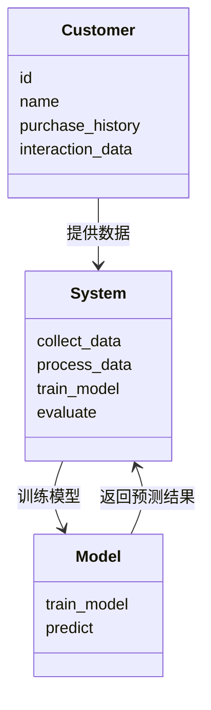

                 


# AI驱动的客户粘性分析：评估公司的长期收入质量

## 关键词：客户粘性，AI，客户分析，收入质量，算法，机器学习

## 摘要：AI驱动的客户粘性分析通过机器学习算法，如聚类、回归和分类，评估客户忠诚度和保留率，帮助公司优化客户关系管理，提高长期收入质量。本文详细探讨了核心概念、算法原理、系统设计和项目实战，提供实用的分析框架和实施策略。

---

# 第一部分：AI驱动的客户粘性分析概述

## 第1章：客户粘性分析的背景与意义

### 1.1 客户粘性分析的基本概念

#### 1.1.1 什么是客户粘性
客户粘性（Customer Churn）指的是客户停止使用公司产品或服务的现象。高粘性意味着客户更可能长期使用产品，从而提高公司的收入质量。

#### 1.1.2 客户粘性与公司收入质量的关系
客户粘性高的公司通常具有稳定的收入来源，因为客户更可能持续付费。这有助于公司预测收入，优化资源分配。

#### 1.1.3 AI在客户粘性分析中的作用
AI技术，特别是机器学习算法，能够从大量数据中识别模式，预测客户流失风险，并提出优化策略。

### 1.2 问题背景与分析

#### 1.2.1 传统客户分析的局限性
传统方法依赖人工分析，效率低且容易出错。此外，传统方法难以处理大数据量和复杂关系。

#### 1.2.2 当前市场环境的变化
市场竞争加剧，客户需求多样化，企业需要更精准的工具来评估和提升客户粘性。

#### 1.2.3 AI驱动的解决方案
AI通过自动化分析和实时反馈，提供更高效、精准的客户分析，帮助公司制定有效的策略。

---

# 第二部分：客户粘性分析的核心概念与联系

## 第2章：客户粘性分析的核心维度

### 2.1 客户生命周期分析

#### 2.1.1 客户生命周期的定义
客户生命周期包括获取、激活、留存、增长和流失五个阶段。不同阶段的客户行为和需求不同，需要不同的策略。

#### 2.1.2 各阶段的特征与行为
- 获取阶段：新客户，需快速激活。
- 激活阶段：客户开始使用产品，需引导深度使用。
- 留存阶段：客户持续使用，需提供价值。
- 增长阶段：客户价值提升，需提供更多服务。
- 流失阶段：客户可能离开，需及时干预。

#### 2.1.3 生命周期与客户粘性的关系
生命周期不同阶段的客户行为直接影响粘性。例如，及时激活新客户可以降低流失率。

### 2.2 客户满意度与忠诚度

#### 2.2.1 满意度与忠诚度的定义
客户满意度是客户对产品或服务的满意程度；忠诚度是客户持续购买的意愿。

#### 2.2.2 两者的关系与影响
高满意度通常与高忠诚度相关，但不是绝对的。忠诚的客户更可能在面对竞争时保持粘性。

#### 2.2.3 如何通过AI提升两者
通过自然语言处理分析客户反馈，识别不满情绪，提前解决问题，提升满意度和忠诚度。

### 2.3 客户行为分析

#### 2.3.1 行为数据的收集与处理
收集客户的购买频率、使用时长、互动频率等数据，进行分析。

#### 2.3.2 行为分析在客户粘性中的应用
通过分析行为数据，识别潜在流失客户，预测流失风险。

---

## 第3章：客户价值评估与流失预测

### 3.1 客户价值评估

#### 3.1.1 客户价值的定义
客户价值是客户对公司收入和利润的贡献，包括当前价值和未来潜力。

#### 3.1.2 客户价值评估的指标
- 收入贡献：客户购买金额。
- 利润贡献：扣除成本后的利润。
- 生命周期价值：未来可能贡献的收入。

#### 3.1.3 通过AI评估客户价值
使用回归算法预测客户未来贡献，识别高价值客户，优化资源分配。

### 3.2 客户流失预测

#### 3.2.1 流失预测的定义
预测客户在未来一段时间内停止使用产品或服务的可能性。

#### 3.2.2 流失预测的指标
- 流失概率：预测客户流失的可能性。
- 流失原因：分析客户流失的主要因素。

#### 3.2.3 通过AI预测流失
使用分类算法（如逻辑回归、随机森林）构建流失预测模型，识别高风险客户。

---

## 第4章：客户行为分析与画像构建

### 4.1 客户行为数据的分析

#### 4.1.1 行为数据的收集
通过日志记录、问卷调查等方式收集客户的互动数据。

#### 4.1.2 行为分析的方法
使用聚类分析将客户分为不同群体，识别行为模式。

#### 4.1.3 行为分析在客户粘性中的应用
通过分析客户行为，识别活跃客户和潜在流失客户，制定针对性策略。

### 4.2 客户画像的构建

#### 4.2.1 客户画像的定义
客户画像是基于数据构建的客户特征描述，帮助公司更好地理解客户。

#### 4.2.2 通过AI构建客户画像
使用聚类分析将客户分为不同的群体，分析每个群体的行为特征和需求。

#### 4.2.3 客户画像的应用
根据画像制定个性化营销策略，提升客户满意度和忠诚度。

---

## 第5章：客户价值评估与流失预测的数学模型

### 5.1 客户价值评估模型

#### 5.1.1 线性回归模型
用于预测客户未来贡献，公式为：
$$ y = \beta_0 + \beta_1x_1 + \beta_2x_2 + ... + \beta_nx_n $$
其中，$y$是客户贡献，$x_i$是影响因素。

#### 5.1.2 逐步分析与实现
通过逐步回归法选择重要特征，优化模型性能。

### 5.2 客户流失预测模型

#### 5.2.1 逻辑回归模型
用于分类问题，公式为：
$$ P(y=1|x) = \frac{e^{\beta_0 + \beta_1x_1 + ... + \beta_nx_n}}{1 + e^{\beta_0 + \beta_1x_1 + ... + \beta_nx_n}} $$
其中，$P(y=1|x)$是客户流失的概率。

#### 5.2.2 逐步分析与实现
通过训练数据拟合模型，评估模型性能，调整参数优化结果。

---

## 第6章：系统分析与架构设计方案

### 6.1 问题场景介绍

#### 6.1.1 系统目标
构建一个AI驱动的客户粘性分析系统，评估客户粘性，预测流失，优化客户关系。

#### 6.1.2 项目介绍
基于机器学习算法，设计一个实时分析系统，帮助公司提高客户保留率和收入质量。

### 6.2 系统功能设计

#### 6.2.1 功能模块
- 数据采集：收集客户数据。
- 数据处理：清洗和预处理数据。
- 模型训练：训练客户粘性分析模型。
- 预测与评估：预测流失，评估客户价值。
- 反馈与优化：根据结果优化模型和策略。

#### 6.2.2 领域模型（mermaid 类图）


### 6.3 系统架构设计

#### 6.3.1 架构图（mermaid）


### 6.4 系统接口设计

#### 6.4.1 API接口
- 数据接口：获取客户数据。
- 分析接口：调用模型进行预测。
- 反馈接口：返回预测结果和优化建议。

### 6.5 系统交互流程（mermaid 序列图）
```mermaid
sequenceDiagram
    User -> System: 提交请求
    activate System
    System -> Model: 调用模型
    Model -> System: 返回预测结果
    deactivate System
    User <- System: 显示结果
```

---

## 第7章：项目实战

### 7.1 环境安装与数据准备

#### 7.1.1 环境安装
安装Python、Scikit-learn、Pandas、Jupyter Notebook。

#### 7.1.2 数据准备
收集客户数据，包括购买记录、互动数据、人口统计数据。

### 7.2 核心实现

#### 7.2.1 数据预处理
清洗数据，处理缺失值，标准化特征。

#### 7.2.2 模型训练
使用逻辑回归训练流失预测模型。

#### 7.2.3 模型评估
评估模型的准确率、召回率和F1分数。

#### 7.2.4 反馈与优化
根据模型结果优化客户保留策略。

### 7.3 代码实现

#### 7.3.1 数据预处理
```python
import pandas as pd
from sklearn.preprocessing import StandardScaler

# 加载数据
data = pd.read_csv('customer_data.csv')

# 处理缺失值
data = data.dropna()

# 标准化特征
scaler = StandardScaler()
X_scaled = scaler.fit_transform(data[['feature1', 'feature2']])
```

#### 7.3.2 模型训练
```python
from sklearn.linear_model import LogisticRegression

# 训练模型
model = LogisticRegression()
model.fit(X_scaled, data['label'])
```

#### 7.3.3 模型评估
```python
from sklearn.metrics import accuracy_score, recall_score, f1_score

# 预测结果
y_pred = model.predict(X_scaled)

# 评估指标
print(f'Accuracy: {accuracy_score(y_true, y_pred)}')
print(f'Recall: {recall_score(y_true, y_pred)}')
print(f'F1 Score: {f1_score(y_true, y_pred)}')
```

### 7.4 案例分析与结果解读

#### 7.4.1 案例分析
分析模型预测结果，识别高风险客户，制定保留策略。

#### 7.4.2 结果解读
解释模型输出，评估策略的有效性，优化客户关系管理。

#### 7.4.3 小结
总结项目成果，提出改进建议，展望未来发展。

---

## 第8章：最佳实践与总结

### 8.1 小结

#### 8.1.1 核心内容回顾
AI驱动的客户粘性分析帮助公司提高客户保留率和收入质量，通过机器学习算法实现精准预测和优化。

### 8.2 注意事项

#### 8.2.1 数据质量的重要性
确保数据准确、完整，避免偏差影响结果。

#### 8.2.2 模型选择与优化
根据不同场景选择合适的算法，持续优化模型性能。

#### 8.2.3 伦理与隐私保护
在数据处理中遵守相关法律法规，保护客户隐私。

### 8.3 拓展阅读

#### 8.3.1 推荐书籍
- 《机器学习实战》
- 《数据挖掘导论》

#### 8.3.2 在线资源
- scikit-learn官方文档
- Kaggle上的相关项目

---

# 结语

AI驱动的客户粘性分析是提升公司长期收入质量的重要工具。通过机器学习算法，企业可以精准预测客户流失，优化客户关系管理，提高客户满意度和忠诚度。随着技术的不断发展，AI在客户分析中的应用将更加广泛和深入，帮助企业在全球化竞争中占据优势。

