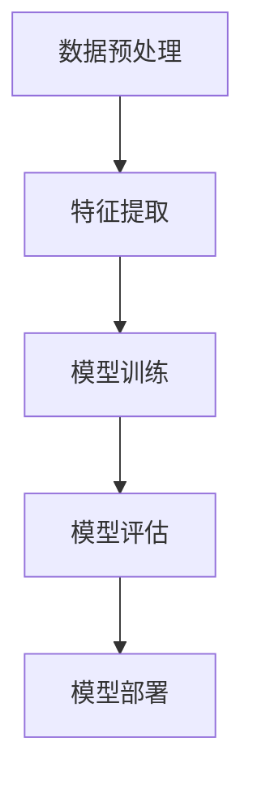

                 


# AI驱动的客户终身价值预测：评估公司的长期盈利能力

> 关键词：AI，客户终身价值，机器学习，长期盈利能力，预测模型，系统架构

> 摘要：客户终身价值（Customer Lifetime Value, CLV）是企业在评估客户价值和制定市场策略时的重要指标。通过AI技术，企业可以更精准地预测客户终身价值，从而优化资源配置，提升长期盈利能力。本文将从背景、算法、系统架构、项目实战等多角度深入探讨AI在客户终身价值预测中的应用。

---

## 第1章: 背景介绍

### 1.1 问题背景

#### 1.1.1 客户终身价值的定义
客户终身价值（CLV）是指一个客户在其生命周期内为企业带来的总收益。CLV的计算通常包括客户在其生命周期内购买的总金额、获取客户的成本以及客户维护成本等因素。通过AI技术，企业可以更精准地预测CLV，从而优化市场策略和资源分配。

#### 1.1.2 为什么CLV对公司的长期盈利能力重要
CLV预测可以帮助企业识别高价值客户，制定针对性的市场策略，优化客户关系管理（CRM），降低客户流失率，并提升整体客户满意度。通过精准预测CLV，企业可以更有效地分配市场预算，提高投资回报率。

#### 1.1.3 当前客户价值预测的痛点与挑战
传统的客户价值预测方法通常基于简单的统计分析，难以捕捉复杂的客户行为和市场动态。随着数据量的增加和算法的复杂化，企业需要更高效的预测方法，以应对以下挑战：
- 数据的多样性和复杂性
- 预测模型的可解释性和准确性
- 实时预测和动态调整的需求

### 1.2 问题描述

#### 1.2.1 CLV预测的核心目标
CLV预测的核心目标是通过AI技术，构建一个能够准确预测客户终身价值的模型，并将其应用于企业的市场策略制定和客户管理中。

#### 1.2.2 CLV预测的关键维度
CLV预测的关键维度包括：
- 客户的基本信息（如年龄、性别、地理位置）
- 客户的消费行为（如购买频率、购买金额、购买时间）
- 客户的反馈和评价
- 客户的生命周期阶段

#### 1.2.3 边界与外延
CLV预测的边界包括客户的基本信息、消费行为和生命周期阶段。其外延则涉及客户流失预测、客户分层和个性化推荐等应用场景。

### 1.3 问题解决

#### 1.3.1 AI驱动CLV预测的核心思路
AI驱动的CLV预测的核心思路是通过机器学习算法，对客户的历史数据进行分析，提取特征，并构建预测模型。模型的输出结果可以帮助企业制定针对性的市场策略。

#### 1.3.2 AI在CLV预测中的优势
AI在CLV预测中的优势包括：
- 高度自动化和智能化的数据处理能力
- 能够处理大规模和复杂的数据
- 可以实时更新模型，适应市场变化

#### 1.3.3 CLV预测的实现路径
CLV预测的实现路径包括数据收集、特征工程、模型训练、模型评估和模型部署五个阶段。

### 1.4 核心概念与联系

#### 1.4.1 核心概念的原理
CLV预测的核心概念包括客户生命周期、客户行为分析和机器学习算法。这些概念的原理相互关联，共同构成了CLV预测的基础。

#### 1.4.2 核心概念的属性特征对比表格
| 概念         | 属性                     | 特征描述                     |
|--------------|--------------------------|------------------------------|
| 客户生命周期   | 阶段                     | 考虑客户从获取到流失的全过程   |
| 客户行为分析   | 行为特征                 | 购买频率、金额、时间等         |
| 机器学习算法   | 算法类型                 | 线性回归、随机森林、神经网络等 |

#### 1.4.3 ER实体关系图架构的 Mermaid 流程图
```mermaid
er
  table Customer {
    id
    name
    age
    gender
    location
    purchase_history
  }
  table Purchase {
    id
    customer_id
    amount
    time
  }
  Customer 1..N Purchase
```

---

## 第2章: 客户终身价值预测的核心概念

### 2.1 客户终身价值的定义与模型

#### 2.1.1 CLV的定义
CLV是客户在企业生命周期内为企业带来的总收益，通常用于衡量客户的长期价值。

#### 2.1.2 CLV模型的构建
CLV模型的构建需要考虑以下因素：
- 客户的生命周期阶段
- 客户的购买频率
- 客户的购买金额
- 客户的流失概率

#### 2.1.3 CLV与公司盈利能力的关系
CLV与公司盈利能力密切相关。通过提高高价值客户的保留率，企业可以显著提升整体盈利能力。

### 2.2 数据特征与预测方法

#### 2.2.1 客户行为数据的特征提取
客户行为数据的特征提取包括：
- 时间特征（如购买时间、间隔时间）
- 频率特征（如购买频率）
- 金额特征（如购买金额、客单价）

#### 2.2.2 客户价值的预测方法
客户价值的预测方法包括：
- 线性回归模型
- 随机森林模型
- 神经网络模型

#### 2.2.3 数据特征与预测结果的关联性分析
数据特征与预测结果的关联性分析可以帮助企业识别哪些特征对CLV预测影响最大。

---

## 第3章: 算法原理讲解

### 3.1 算法原理

#### 3.1.1 线性回归模型
线性回归模型是一种简单但有效的预测方法，适用于线性关系的场景。

$$ y = \beta_0 + \beta_1 x_1 + \beta_2 x_2 + \dots + \beta_n x_n $$

#### 3.1.2 随机森林模型
随机森林模型是一种基于决策树的集成学习方法，具有较高的准确性和鲁棒性。

#### 3.1.3 神经网络模型
神经网络模型是一种深度学习方法，适用于复杂的非线性关系。

### 3.2 算法实现

#### 3.2.1 算法流程图


#### 3.2.2 算法实现的 Python 源代码
```python
import pandas as pd
from sklearn.ensemble import RandomForestRegressor
from sklearn.metrics import mean_squared_error

# 数据加载
data = pd.read_csv('customer_data.csv')

# 特征提取
features = data[['age', 'gender', 'purchase_history']]
target = data['clv']

# 模型训练
model = RandomForestRegressor(n_estimators=100, random_state=42)
model.fit(features, target)

# 模型评估
预测 = model.predict(features)
print(mean_squared_error(target, 预测))
```

#### 3.2.3 算法的数学模型和公式
随机森林模型的数学模型可以表示为：
$$ y = \sum_{i=1}^{n} \text{Tree}_i(x) $$

---

## 第4章: 系统分析与架构设计方案

### 4.1 系统分析

#### 4.1.1 问题场景介绍
系统需要实现客户终身价值的预测功能，包括数据采集、特征提取、模型训练和结果展示。

#### 4.1.2 系统功能设计
系统功能设计包括：
- 数据采集模块
- 特征提取模块
- 模型训练模块
- 结果展示模块

#### 4.1.3 系统架构设计
系统架构设计包括：
- 数据层：负责数据的存储和管理
- 业务逻辑层：负责数据处理和模型训练
- 界面层：负责结果展示和用户交互

#### 4.1.4 接口设计
系统需要与CRM系统、数据库等进行接口对接。

#### 4.1.5 交互流程
用户输入数据，系统进行特征提取和模型训练，并输出预测结果。

---

## 第5章: 项目实战

### 5.1 环境安装

#### 5.1.1 Python环境安装
安装Python和必要的库：
- NumPy
- Pandas
- Scikit-learn
- Mermaid

#### 5.1.2 系统架构实现
实现数据采集、特征提取、模型训练和结果展示的完整流程。

#### 5.1.3 代码实现
提供完整的Python代码示例。

### 5.2 核心实现

#### 5.2.1 数据预处理
对数据进行清洗和特征工程处理。

#### 5.2.2 模型训练
使用随机森林模型进行训练，并保存模型。

#### 5.2.3 模型评估
评估模型的准确性和效果。

#### 5.2.4 模型部署
将模型部署到生产环境，提供API接口。

### 5.3 案例分析

#### 5.3.1 案例背景
以某电商企业为例，分析CLV预测的应用场景。

#### 5.3.2 数据分析
分析客户的购买行为和生命周期阶段。

#### 5.3.3 模型预测
使用随机森林模型进行预测，并展示结果。

#### 5.3.4 结果解读
解读预测结果，并制定针对性的市场策略。

### 5.4 项目小结

---

## 第6章: 最佳实践与注意事项

### 6.1 最佳实践 tips

#### 6.1.1 数据质量管理
确保数据的准确性和完整性。

#### 6.1.2 模型可解释性
选择可解释性较强的模型，便于结果分析和决策。

#### 6.1.3 模型更新
定期更新模型，以适应市场变化。

### 6.2 注意事项

#### 6.2.1 数据隐私保护
确保数据的安全性和隐私性。

#### 6.2.2 模型性能优化
优化模型的性能，提高预测准确率。

#### 6.2.3 业务场景匹配
根据具体业务场景选择合适的模型和方法。

---

## 第7章: 总结与展望

### 7.1 总结
本文详细介绍了AI驱动的客户终身价值预测的核心概念、算法原理和系统架构设计，并通过实际案例展示了项目的实现过程。

### 7.2 展望
未来，随着AI技术的不断发展，CLV预测将更加精准和智能化，为企业创造更大的价值。

---

## 附录

### 附录A: 术语表

### 附录B: 参考文献

---

以上是《AI驱动的客户终身价值预测：评估公司的长期盈利能力》的详细目录大纲，涵盖了从背景介绍到项目实战的各个方面，内容丰富且逻辑清晰。希望对您有所帮助！

