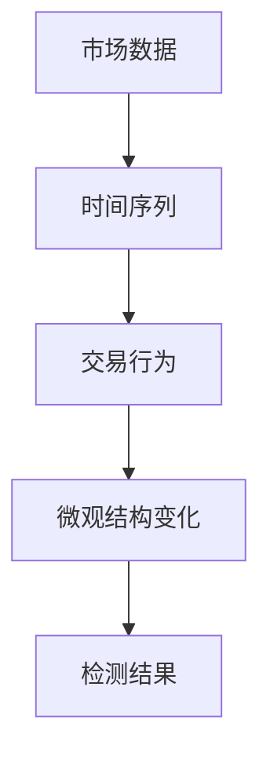

                 

# 第一部分: AI驱动的市场微观结构变化检测背景介绍

# 第1章: 问题背景与概念

## 1.1 问题背景
### 1.1.1 市场微观结构的基本概念
### 1.1.2 微观结构变化的定义与特征
### 1.1.3 传统方法的局限性与挑战

## 1.2 核心概念与问题描述
### 1.2.1 AI驱动的市场微观结构变化检测的定义
### 1.2.2 问题解决的目标与意义
### 1.2.3 边界与外延

## 1.3 数据特征与属性
### 1.3.1 市场数据的基本特征
### 1.3.2 微观结构变化的属性对比
### 1.3.3 数据预处理与特征提取

## 1.4 研究意义与应用价值
### 1.4.1 金融市场的实际需求
### 1.4.2 对投资者与监管机构的价值
### 1.4.3 技术进步对金融行业的影响

## 1.5 本章小结
...

# 第二部分: 核心概念与联系

# 第2章: 核心概念原理

## 2.1 微观结构变化检测的原理
### 2.1.1 时间序列分析的基本原理
### 2.1.2 异常检测的原理
### 2.1.3 深度学习在模式识别中的应用

## 2.2 核心概念属性对比
### 2.2.1 不同检测方法的对比分析
### 2.2.2 各种算法的优缺点
### 2.2.3 性能指标的对比

## 2.3 ER实体关系图

## 2.4 本章小结
...

# 第三部分: 算法原理讲解

# 第3章: 算法原理与实现

## 3.1 时间序列分析
### 3.1.1 ARIMA模型的原理
### 3.1.2 LSTM网络的原理
### 3.1.3 算法流程图

## 3.2 异常检测
### 3.2.1 基于统计的方法
### 3.2.2 基于机器学习的异常检测
### 3.2.3 深度学习的异常检测

## 3.3 深度学习模型
### 3.3.1 卷积神经网络（CNN）的应用
### 3.3.2 循环神经网络（RNN）的应用
### 3.3.3 Transformer模型的应用

## 3.4 算法实现与代码示例
### 3.4.1 环境安装与配置
### 3.4.2 数据预处理代码
### 3.4.3 模型训练代码
### 3.4.4 结果分析与解读

## 3.5 本章小结
...

# 第四部分: 系统分析与架构设计

# 第4章: 系统分析与架构设计

## 4.1 问题场景介绍
### 4.1.1 金融市场的数据特点
### 4.1.2 微观结构变化检测的业务需求
### 4.1.3 系统目标与功能

## 4.2 系统功能设计
### 4.2.1 数据采集模块
### 4.2.2 数据处理模块
### 4.2.3 模型训练模块
### 4.2.4 结果展示模块

## 4.3 系统架构设计
### 4.3.1 分层架构设计
### 4.3.2 微服务架构设计
### 4.3.3 可扩展性设计

## 4.4 接口设计
### 4.4.1 数据接口设计
### 4.4.2 模型接口设计
### 4.4.3 用户接口设计

## 4.5 交互设计
### 4.5.1 用户与系统的交互流程
### 4.5.2 数据流与控制流
### 4.5.3 异常处理机制

## 4.6 本章小结
...

# 第五部分: 项目实战与应用

# 第5章: 项目实战与应用

## 5.1 项目环境安装
### 5.1.1 Python环境配置
### 5.1.2 相关库的安装（如TensorFlow、PyTorch）
### 5.1.3 数据集准备与获取

## 5.2 核心功能实现
### 5.2.1 数据预处理代码
### 5.2.2 模型训练代码
### 5.2.3 结果可视化代码

## 5.3 实际案例分析
### 5.3.1 数据集的选择与描述
### 5.3.2 模型训练与结果分析
### 5.3.3 案例中的问题与解决方案

## 5.4 项目小结
...

# 第六部分: 最佳实践与总结

# 第6章: 最佳实践与总结

## 6.1 项目总结
### 6.1.1 项目目标的达成情况
### 6.1.2 项目中的关键点与难点
### 6.1.3 经验与教训

## 6.2 注意事项与建议
### 6.2.1 数据质量的重要性
### 6.2.2 模型选择与调优的建议
### 6.2.3 系统性能优化的建议

## 6.3 拓展阅读
### 6.3.1 相关领域的最新研究
### 6.3.2 其他AI技术在金融中的应用
### 6.3.3 进一步学习的资源推荐

## 6.4 本章小结
...

# 结语

# 参考文献

---

### 文章关键词：
- AI驱动
- 市场微观结构
- 变化检测
- 时间序列分析
- 深度学习
- 金融数据分析

### 摘要：
《AI驱动的市场微观结构变化检测》系统地探讨了如何利用人工智能技术，特别是深度学习和时间序列分析，来检测金融市场中的微观结构变化。文章首先介绍了市场微观结构的基本概念和检测的重要性，然后详细讲解了相关算法的原理和实现方法，包括ARIMA模型和LSTM网络等。接着，文章分析了系统的架构设计和项目实战，通过实际案例展示了如何将理论应用于实践。最后，文章总结了项目经验，并提出了进一步研究的方向和建议。本篇文章适合金融数据分析师、AI工程师以及对金融市场分析感兴趣的读者阅读。

