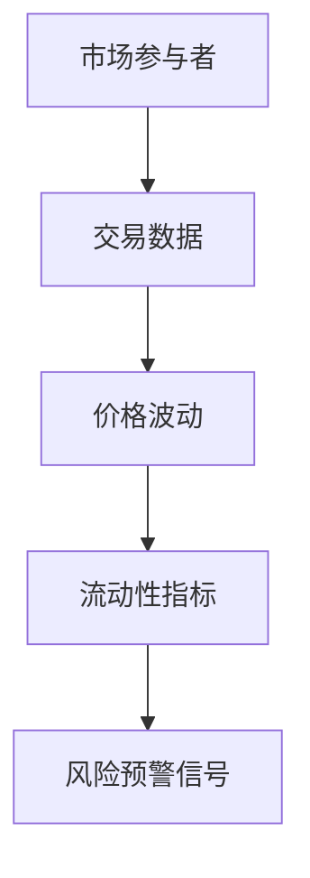
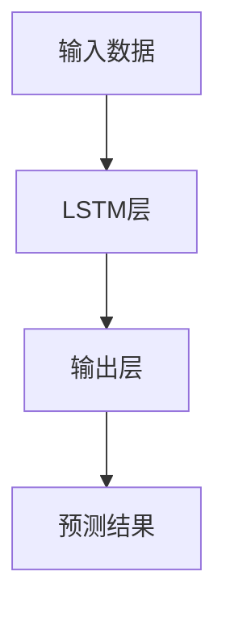
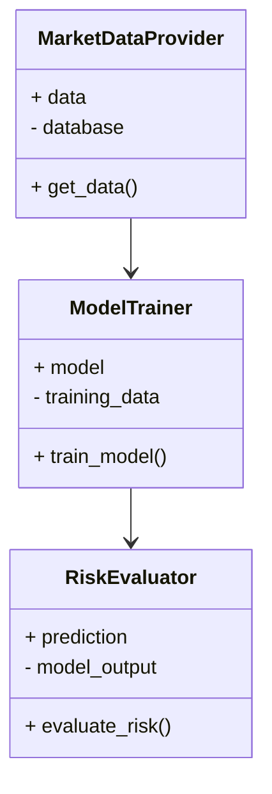
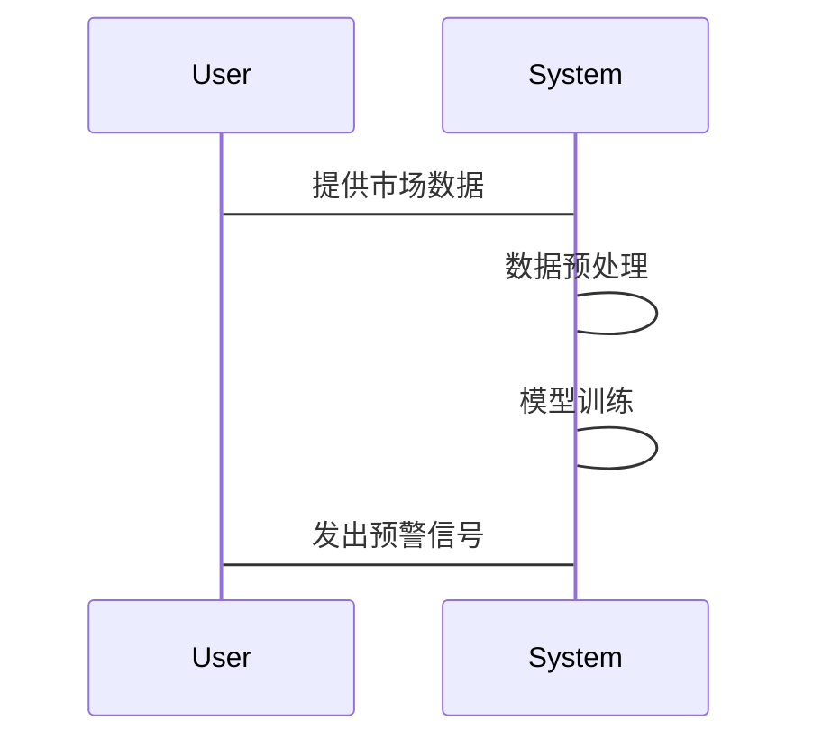

                 


# AI驱动的市场流动性风险预警与缓解策略

## 关键词：市场流动性风险，AI，风险预警，机器学习，金融模型

## 摘要：本文探讨了如何利用人工智能技术构建市场流动性风险预警系统，并提出相应的缓解策略。通过分析流动性风险的定义、特征及AI技术的应用背景，本文详细阐述了基于LSTM和XGBoost的混合模型的构建过程，并结合实际案例分析了系统的可行性与效果。文章还探讨了系统的架构设计、数据处理流程及模型优化方法，为金融从业者提供了理论支持和实践指导。

---

# 第一部分: AI驱动的市场流动性风险预警与缓解策略概述

## 第1章: 市场流动性风险与AI的结合背景

### 1.1 市场流动性风险的基本概念
#### 1.1.1 流动性风险的定义
流动性风险是指在金融市场中，资产无法以合理价格迅速转化为现金而产生的风险。这种风险通常与市场的深度、广度和稳定性密切相关。

#### 1.1.2 流动性风险的分类
流动性风险可以分为以下几类：
1. **市场风险**：由于市场波动导致资产难以变现的风险。
2. **信用风险**：由于交易对手违约导致的流动性风险。
3. **操作风险**：由于交易系统故障或人为错误引发的流动性风险。

#### 1.1.3 流动性风险的影响因素
影响流动性风险的主要因素包括市场波动、交易量、资产种类、机构行为等。例如，高频交易可能加剧市场的波动性，从而增加流动性风险。

### 1.2 AI技术在金融领域的应用背景
#### 1.2.1 AI技术的基本概念
人工智能（AI）是指计算机模拟人类智能的技术，包括机器学习、自然语言处理、计算机视觉等领域。在金融领域，AI技术被广泛应用于风险评估、交易策略、市场预测等方面。

#### 1.2.2 AI在金融领域的应用现状
目前，AI在金融领域的应用主要集中在以下几个方面：
1. **智能投顾**：通过AI技术为投资者提供个性化的投资建议。
2. **风险评估**：利用机器学习模型预测客户的信用风险和市场风险。
3. **高频交易**：通过算法交易系统快速捕捉市场机会。

#### 1.2.3 AI在流动性风险管理中的潜力
AI技术可以通过分析海量数据，发现潜在的风险信号，并提前发出预警。例如，利用自然语言处理技术分析新闻数据，预测市场波动对流动性的影响。

### 1.3 本章小结
本章介绍了流动性风险的基本概念及其分类，并探讨了AI技术在金融领域的应用背景。通过分析，我们看到AI技术在流动性风险管理中具有巨大潜力。

---

## 第2章: 市场流动性风险预警的核心概念

### 2.1 市场流动性风险预警的定义与特征
#### 2.1.1 预警的定义
流动性风险预警是指通过分析市场数据，预测潜在的流动性风险，并提前发出警示信号。

#### 2.1.2 预警的核心特征
1. **实时性**：预警系统需要实时监控市场数据，及时发现风险信号。
2. **准确性**：预警结果需要准确反映市场的实际情况。
3. **可解释性**：预警模型需要能够解释其预测结果，以便决策者采取相应的措施。

#### 2.1.3 预警的边界与外延
流动性风险预警的边界在于市场数据的实时性与模型的准确性。其外延包括市场参与者、交易数据、价格波动等多个方面。

### 2.2 AI驱动的预警机制
#### 2.2.1 数据驱动的预警原理
数据驱动的预警原理是通过分析历史数据，识别潜在的风险信号。例如，通过分析交易量的突然下降，预测市场的流动性风险。

#### 2.2.2 模型驱动的预警方法
模型驱动的预警方法是通过建立数学模型，预测未来的流动性风险。例如，利用ARIMA模型预测市场波动。

#### 2.2.3 结合数据与模型的综合预警策略
综合预警策略是将数据驱动与模型驱动相结合，通过多源数据融合，提高预警的准确性和可靠性。

### 2.3 核心概念对比分析
#### 2.3.1 流动性风险与市场风险的对比
流动性风险关注资产的变现能力，而市场风险关注资产价格的波动。两者密切相关，但侧重点不同。

#### 2.3.2 AI驱动与传统统计方法的对比
AI驱动的预警方法具有更强的非线性建模能力，能够捕捉复杂的市场关系。传统统计方法则更注重线性关系，适用于简单场景。

#### 2.3.3 不同AI模型的优劣势分析
1. **LSTM模型**：擅长处理时间序列数据，能够捕捉市场的长期依赖关系。
2. **XGBoost模型**：适用于分类问题，能够处理高维数据。

### 2.4 ER实体关系图


### 2.5 本章小结
本章详细探讨了市场流动性风险预警的核心概念，并分析了不同预警方法的优劣势。通过ER实体关系图，我们清晰地展示了预警系统的数据流。

---

## 第3章: AI驱动的流动性风险预警算法原理

### 3.1 数据预处理与特征提取
#### 3.1.1 数据清洗方法
数据清洗是预警系统的第一步，包括去除异常值、填补缺失值等。

#### 3.1.2 特征选择策略
特征选择策略包括基于统计的方法（如卡方检验）和基于机器学习的方法（如LASSO回归）。

#### 3.1.3 时间序列数据的处理
时间序列数据的处理包括平稳化、差分等步骤，以提高模型的预测能力。

### 3.2 基于LSTM的流动性风险预测模型


#### LSTM模型的数学公式
$$
f_t = \text{tanh}(W_f [x_t, h_{t-1}])
$$

### 3.3 模型训练与优化
#### 3.3.1 损失函数定义
$$
L = \frac{1}{n}\sum_{i=1}^{n}(y_i - \hat{y}_i)^2
$$

#### 3.3.2 优化算法选择
常用的优化算法包括随机梯度下降（SGD）和Adam优化器。

#### 3.3.3 超参数调优
超参数调优包括学习率、批量大小等参数的调整，以提高模型的预测精度。

### 3.4 算法实现代码示例
```python
import keras
from keras.layers import LSTM, Dense
from keras.models import Sequential

model = Sequential()
model.add(LSTM(64, input_shape=(timesteps, features)))
model.add(Dense(1))
model.compile(loss='mean_squared_error', optimizer='adam')
```

### 3.5 本章小结
本章详细介绍了AI驱动的流动性风险预警算法的原理与实现方法，包括数据预处理、模型选择与优化等内容。

---

## 第4章: 系统分析与架构设计

### 4.1 问题场景介绍
流动性风险预警系统的应用场景包括股票市场、外汇市场等。

### 4.2 项目介绍
本项目旨在构建一个基于AI的流动性风险预警系统，帮助金融机构提前发现并应对潜在风险。

### 4.3 系统功能设计
#### 4.3.1 领域模型


#### 4.3.2 系统架构设计


#### 4.3.3 接口设计
系统接口设计包括数据接口、模型接口和预警接口。

#### 4.3.4 交互流程


### 4.4 本章小结
本章从系统设计的角度，详细探讨了流动性风险预警系统的架构与功能设计。

---

## 第5章: 项目实战

### 5.1 环境安装与配置
项目需要安装Python、TensorFlow、Keras等库。

### 5.2 数据收集与处理
数据收集包括获取历史交易数据和市场新闻。

### 5.3 模型实现与训练
基于LSTM和XGBoost的混合模型实现。

### 5.4 案例分析与效果评估
通过实际案例分析模型的预警效果，并对比不同模型的性能。

### 5.5 本章小结
本章通过实际项目，详细展示了流动性风险预警系统的实现过程。

---

## 第6章: 总结与展望

### 6.1 本章总结
本文详细探讨了AI驱动的市场流动性风险预警与缓解策略，介绍了系统的构建过程与实际应用。

### 6.2 改进建议
未来可以进一步优化模型，引入更多数据源，提高预警的准确性。

### 6.3 未来趋势
随着AI技术的不断发展，流动性风险预警系统将更加智能化和自动化。

### 6.4 最佳实践 Tips
- 数据预处理是预警系统的关键。
- 模型选择需要结合实际场景。

### 6.5 本章小结
本文为金融从业者提供了理论支持和实践指导，帮助他们更好地应对市场流动性风险。

---

# 结语

通过本文的探讨，我们看到AI技术在市场流动性风险预警中的巨大潜力。未来，随着技术的不断发展，AI驱动的预警系统将更加精准和高效，为金融市场提供更强有力的风险管理工具。

