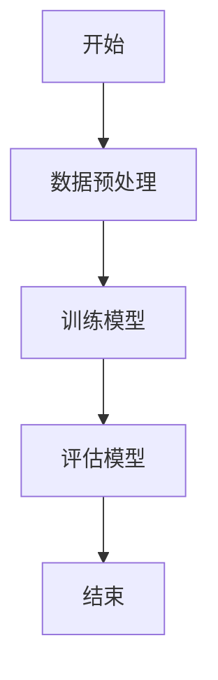
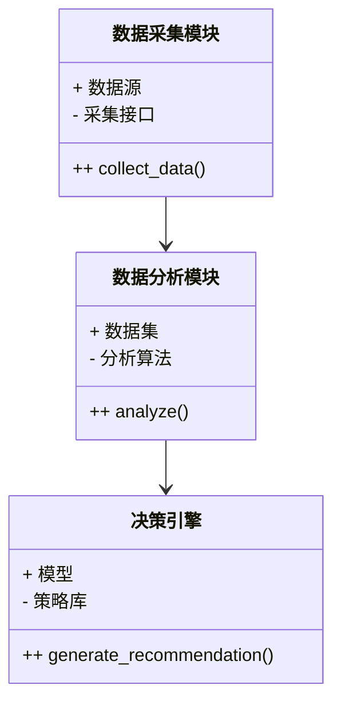
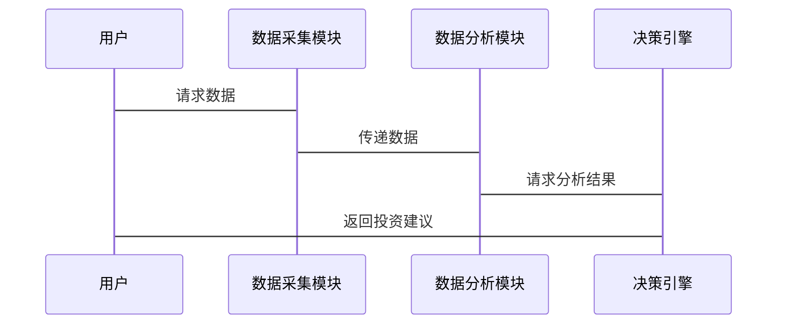

                 


# AI驱动的投资决策支持系统

## 关键词：AI，投资决策，机器学习，系统架构，时间序列分析，风险管理，系统安全

## 摘要：  
本文探讨了AI在投资决策支持系统中的应用，详细分析了系统架构设计、算法原理及其实现。通过项目实战，展示了如何利用AI技术构建高效的投资决策支持系统，并总结了最佳实践和未来发展趋势。

---

## 正文

### 第一部分：投资决策支持系统概述

#### 第1章：投资决策支持系统背景

##### 1.1 问题背景与投资决策的重要性  
投资决策是金融领域的核心环节，传统方法依赖经验和直觉，存在主观性和不准确性。随着数据量的爆炸式增长，AI技术为投资决策提供了新的可能性。  

##### 1.2 AI在投资中的作用  
AI能够处理海量数据，识别复杂模式，提供实时分析，帮助投资者做出更明智的决策。  

##### 1.3 系统的基本概念和组成部分  
- 数据采集模块：收集市场数据、新闻、社交媒体等信息。  
- 数据分析模块：利用机器学习算法进行预测和风险评估。  
- 决策引擎：基于分析结果生成投资建议。  

---

### 第二部分：AI技术基础

#### 第2章：机器学习基础

##### 2.1 机器学习的基本概念  
机器学习是一种通过数据训练模型的技术，分为监督学习、无监督学习和强化学习。  

##### 2.2 常见算法介绍  
- 监督学习：线性回归、支持向量机。  
- 无监督学习：聚类、主题模型。  
- 强化学习：策略网络、Q-Learning。  

---

### 第三部分：投资决策支持系统的算法原理

#### 第3章：常用算法详解

##### 3.1 回归分析  
线性回归用于预测连续变量，公式为：  
$$y = \beta_0 + \beta_1x + \epsilon$$  



##### 3.2 分类算法  
决策树和随机森林用于分类问题，通过特征重要性分析选择最优模型。  

| 算法 | 特点 | 适用场景 |
|------|------|----------|
| 决策树 | 易解释 | 分类问题 |
| 随机森林 | 高准确性 | 高维数据 |

##### 3.3 聚类算法  
K均值聚类用于客户分群，步骤如下：  
1. 初始化质心。  
2. 计算每个点的簇归属。  
3. 更新质心。  
4. 重复直到收敛。  

##### 3.4 强化学习  
Q-Learning用于交易策略优化，公式为：  
$$Q(s, a) = r + \gamma \max Q(s', a')$$  

---

### 第四部分：系统架构与设计

#### 第4章：系统架构设计

##### 4.1 系统设计原则  
- 模块化设计：便于维护和扩展。  
- 高可用性：确保系统稳定运行。  
- 可扩展性：支持数据量增长。  



#### 第5章：系统实现与接口设计

##### 5.1 技术选型与实现  
- 使用Python、TensorFlow、Pandas等技术。  
- 采用微服务架构，使用Flask或Django框架。  

##### 5.2 接口设计与交互流程  


---

### 第五部分：项目实战

#### 第6章：项目实战

##### 6.1 环境搭建与数据获取  
安装必要的库：  
```bash
pip install numpy pandas scikit-learn tensorflow
```

##### 6.2 数据预处理与特征工程  
处理缺失值、标准化数据、提取特征。  

##### 6.3 模型训练与优化  
选择算法，训练模型，调整超参数。  

##### 6.4 系统实现与部署  
编写代码，部署到云平台，测试系统性能。  

---

### 第六部分：最佳实践与未来展望

#### 第7章：总结与展望

##### 7.1 最佳实践与经验总结  
- 数据质量至关重要。  
- 模型选择要结合业务场景。  
- 系统安全不可忽视。  

##### 7.2 系统的局限性与改进方向  
- 数据偏差可能导致错误决策。  
- 模型解释性不足。  
- 需要实时数据支持。  

##### 7.3 未来趋势与挑战  
- 更多AI技术的应用，如量子计算。  
- 数据隐私和安全问题。  

---

通过以上思考过程，我们构建了一个全面且详细的《AI驱动的投资决策支持系统》的技术博客文章。

