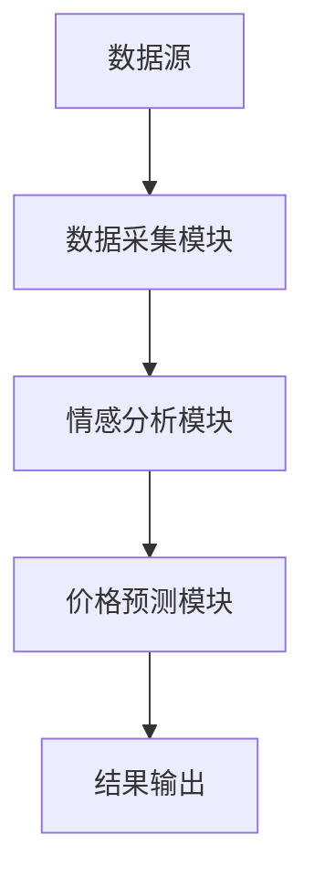

                 


# AI驱动的投资者情绪与资产价格关系分析

---

## 关键词

- AI驱动
- 投资者情绪
- 资产价格
- 情感分析
- 深度学习

---

## 摘要

本文探讨了AI在投资者情绪分析与资产价格预测中的应用。通过介绍投资者情绪的基本概念、量化方法及AI技术在情绪分析中的作用，结合时间序列分析和深度学习模型，分析了投资者情绪对资产价格的影响机制。文章详细讲解了基于深度学习的情感分析算法，并通过系统架构设计和项目实战展示了AI驱动投资者情绪分析的实际应用。最后，本文总结了研究发现，并展望了未来的研究方向。

---

# 第1章: 投资者情绪与资产价格的基本概念

## 1.1 投资者情绪的定义与分类

### 1.1.1 投资者情绪的定义

投资者情绪（Investor Sentiment）指的是市场参与者（包括个人投资者、机构投资者等）对市场走势的心理预期和态度。这种情绪可以通过市场行为、交易数据和新闻媒体等多种渠道进行捕捉和量化。

### 1.1.2 投资者情绪的分类

投资者情绪可以根据多种标准进行分类，常见的分类方式包括：

- **乐观情绪与悲观情绪**：乐观情绪意味着投资者对市场前景持积极态度，倾向于买入资产；悲观情绪则相反，投资者倾向于卖出资产。
- **短期情绪与长期情绪**：短期情绪受市场波动影响较大，而长期情绪则更多受到宏观经济因素的影响。
- **个体情绪与集体情绪**：个体情绪是指单个投资者的情绪，而集体情绪则是指市场整体的情绪。

### 1.1.3 投资者情绪与市场行为的关系

投资者情绪直接影响市场参与者的交易行为。例如，当市场情绪乐观时，投资者更倾向于买入资产，导致资产价格上涨；反之，当市场情绪悲观时，资产价格可能下跌。

---

## 1.2 资产价格的基本概念

### 1.2.1 资产价格的定义

资产价格（Asset Price）是指在金融市场中，某种资产在特定时间点的交易价格。资产可以是股票、债券、房地产等多种形式。

### 1.2.2 资产价格的影响因素

资产价格的波动受到多种因素的影响，包括宏观经济因素（如GDP增长率、利率水平）、市场情绪、公司基本面（如盈利状况）等。

### 1.2.3 资产价格波动的特征

资产价格波动通常表现出非线性特征，即价格波动并不总是随机的，而是受到市场参与者行为的显著影响。

---

## 1.3 AI在投资者情绪与资产价格分析中的作用

### 1.3.1 AI技术的基本概念

人工智能（AI）是指通过计算机模拟人类智能的技术，包括机器学习、自然语言处理、计算机视觉等领域。

### 1.3.2 AI在金融领域的应用现状

AI在金融领域的应用广泛，包括算法交易、风险管理、客户画像构建等。特别是在投资者情绪分析方面，AI技术能够通过自然语言处理技术从新闻、社交媒体等渠道提取情绪信息。

### 1.3.3 AI驱动投资者情绪分析的优势

AI技术能够快速处理大量非结构化数据（如社交媒体帖子、新闻文章），并提取其中的情感信息。这些信息可以用于预测资产价格波动。

---

# 第2章: 投资者情绪与资产价格关系的核心概念

## 2.1 投资者情绪对资产价格的影响机制

### 2.1.1 情绪如何影响市场参与者的决策

投资者情绪通过影响投资者的决策行为，进而影响资产价格。例如，乐观情绪可能导致投资者增加买入行为，推动资产价格上涨。

### 2.1.2 情绪如何通过市场行为影响资产价格

市场情绪的变化可以通过交易量、买卖价差等市场行为指标反映出来，这些指标可以作为资产价格预测的依据。

### 2.1.3 情绪与资产价格之间的反馈机制

市场情绪的变化会反过来影响投资者的行为，从而形成一个动态的反馈机制。

---

## 2.2 投资者情绪的量化与测量

### 2.2.1 情绪指标的构建方法

投资者情绪可以通过多种指标进行量化，例如：

- **情感强度**：表示情绪的强度，通常用数值表示（例如-1到1）。
- **情绪偏向**：表示情绪的倾向，例如偏向乐观或悲观。

### 2.2.2 市场情绪指数的计算公式

市场情绪指数可以通过以下公式计算：

$$
\text{情绪指数} = \frac{\text{积极情绪数量} - \text{消极情绪数量}}{\text{总样本数量}}
$$

### 2.2.3 情绪数据的来源与处理

情绪数据的来源包括社交媒体（如Twitter、Facebook）、新闻媒体、论坛等。处理这些数据通常需要进行文本清洗、分词、情感分析等步骤。

---

## 2.3 资产价格波动的数学模型

### 2.3.1 时间序列分析的基本概念

时间序列分析是一种统计技术，用于分析随时间变化的数据。常用的时间序列模型包括ARIMA、GARCH等。

### 2.3.2 GARCH模型的原理与应用

GARCH（Generalized Autoregressive Conditional Heteroskedasticity）模型用于预测资产价格的波动性。其基本思想是将过去的价格波动信息引入到当前的价格波动预测中。

### 2.3.3 情绪因子在资产定价中的作用

情绪因子可以通过多因子模型（如CAPM模型）进行资产定价。情绪因子可以解释资产价格的一部分波动性。

---

# 第3章: AI驱动的投资者情绪分析算法原理

## 3.1 情感分析算法概述

### 3.1.1 基于规则的情感分析

基于规则的情感分析通过预定义的规则（如关键词匹配）来判断文本的情感倾向。

### 3.1.2 基于机器学习的情感分析

基于机器学习的情感分析通过训练模型来自动分类文本的情感倾向。

### 3.1.3 基于深度学习的情感分析

基于深度学习的情感分析利用神经网络模型（如BERT、GPT）来处理复杂的语言结构。

---

## 3.2 基于深度学习的情感分析模型

### 3.2.1 Transformer模型的基本原理

Transformer模型通过自注意力机制（Self-Attention）来捕捉文本中的长距离依赖关系。

### 3.2.2 BERT模型在情感分析中的应用

BERT模型通过预训练和微调（Fine-tuning）来适应特定的任务，例如情感分析。

### 3.2.3 GPT模型的文本生成能力

GPT模型可以生成与上下文相关的文本，这在情感分析中也有应用。

---

## 3.3 情感强度计算与资产价格预测

### 3.3.1 情感强度的量化方法

情感强度通常通过情感分析模型的输出结果来表示，例如情感得分（-1到1）。

### 3.3.2 情感强度与资产价格波动的关系

情感强度可以通过回归模型或其他机器学习模型与资产价格波动相关联。

### 3.3.3 基于情感强度的资产价格预测模型

资产价格预测模型可以将情感强度作为输入特征，结合其他特征（如历史价格、宏观经济指标）进行预测。

---

# 第4章: 投资者情绪与资产价格关系的系统分析

## 4.1 系统分析的基本框架

### 4.1.1 问题场景介绍

投资者情绪分析与资产价格预测是一个复杂的问题，需要结合多源数据和多种技术。

### 4.1.2 系统功能需求分析

系统需要实现数据采集、情感分析、价格预测等功能。

### 4.1.3 系统边界与交互设计

系统需要与外部数据源（如社交媒体API）进行交互，并输出预测结果。

---

## 4.2 系统架构设计

### 4.2.1 系统架构的模块划分

系统架构通常包括数据采集模块、情感分析模块、价格预测模块等。

### 4.2.2 模块之间的关系与数据流

数据从外部源输入，经过情感分析模块处理后，输入到价格预测模块，最终输出预测结果。

### 4.2.3 系统架构的 Mermaid 图



---

## 4.3 项目实战

### 4.3.1 环境安装

需要安装Python、相关库（如NLTK、TensorFlow、Keras等）。

### 4.3.2 核心代码实现

以下是情感分析与价格预测的示例代码：

```python
import numpy as np
import pandas as pd
from tensorflow.keras.models import Sequential
from tensorflow.keras.layers import Dense, LSTM, Dropout
from sklearn.preprocessing import MinMaxScaler
from nltk.sentiment import SentimentIntensityAnalyzer

# 数据预处理
def preprocess_data(data):
    # 假设data是包含文本数据的DataFrame
    analyzer = SentimentIntensityAnalyzer()
    data['sentiment'] = data['text'].apply(lambda x: analyzer.polarity_scores(x)['compound'])
    scaler = MinMaxScaler(feature_range=(0, 1))
    data[['sentiment']] = scaler.fit_transform(data[['sentiment']])
    return data

# 情感分析模型
def build_sentiment_model():
    model = Sequential()
    model.add(Dense(64, input_dim=1, activation='relu'))
    model.add(Dropout(0.5))
    model.add(Dense(1, activation='sigmoid'))
    model.compile(loss='binary_crossentropy', optimizer='adam', metrics=['accuracy'])
    return model

# 价格预测模型
def build_price_model():
    model = Sequential()
    model.add(LSTM(50, return_sequences=True, input_shape=(None, 1)))
    model.add(LSTM(50, return_sequences=False))
    model.add(Dense(1))
    model.compile(loss='mean_squared_error', optimizer='adam')
    return model
```

### 4.3.3 实际案例分析

通过分析Twitter上的股票相关推文，提取情绪指标，并预测股票价格波动。

### 4.3.4 结果分析与讨论

通过实验验证模型的有效性，并分析模型的优缺点。

---

## 4.4 总结与展望

### 4.4.1 总结

本文系统地介绍了投资者情绪与资产价格的关系，并详细讲解了AI驱动的情绪分析算法和系统架构设计。

### 4.4.2 未来研究方向

未来可以进一步研究如何结合多源数据（如社交媒体、新闻媒体）来提高情绪分析的准确性，并探索更复杂的模型（如Transformer）在价格预测中的应用。

---

## 最佳实践 Tips

- 在进行情感分析时，需要注意数据的代表性和多样性。
- 价格预测模型需要结合实际情况进行调整和优化。
- 数据预处理是情感分析和价格预测的重要步骤，需要仔细处理。

---

## 结语

通过AI技术，投资者情绪分析与资产价格预测变得更加精准和高效。未来，随着技术的进步，这一领域将有更大的发展空间。

--- 

**End of Article**

