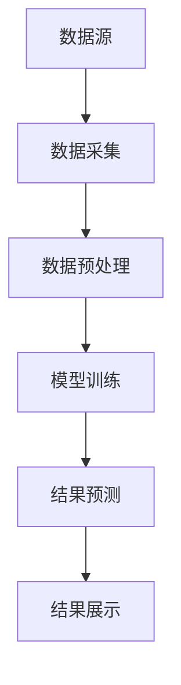
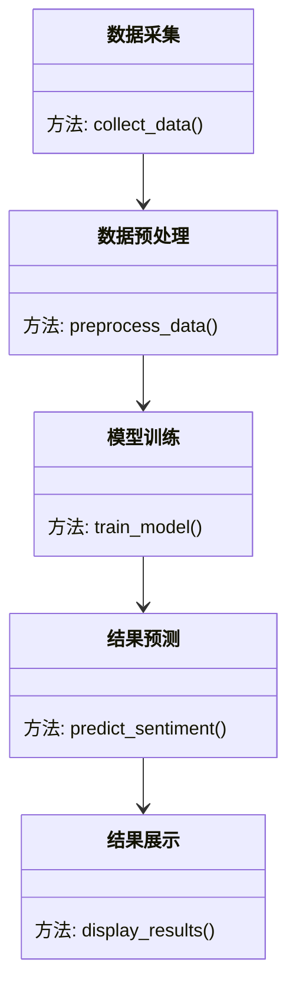
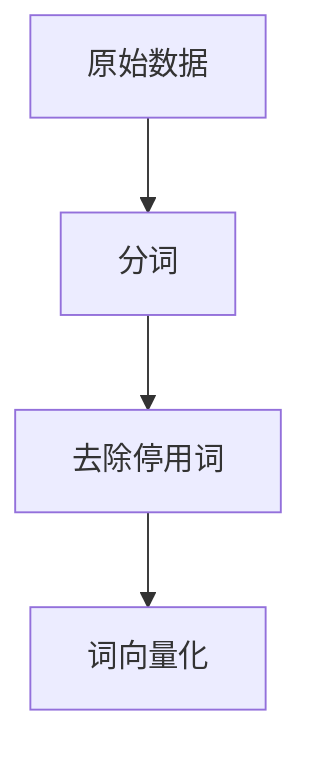
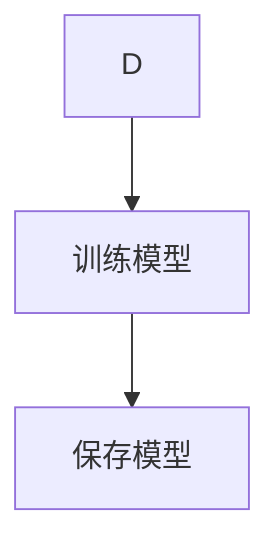
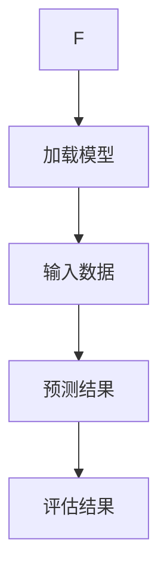

                 


# AI驱动的投资者情绪指数预测系统

## 关键词：AI、投资者情绪、指数预测、机器学习、金融分析

## 摘要：本文介绍了一种基于人工智能的投资者情绪指数预测系统，详细阐述了其背景、核心概念、算法原理、系统架构及实现。通过AI技术，该系统能够实时分析市场情绪，为投资决策提供支持。文章从基础概念到实际应用，全面解析了该系统的构建过程和应用场景。

---

# 第一部分: AI驱动的投资者情绪指数预测系统概述

## 第1章: 背景介绍

### 1.1 投资者情绪指数的基本概念

#### 1.1.1 什么是投资者情绪指数
投资者情绪指数（Investor Sentiment Index）是衡量市场参与者情绪状态的量化指标。它反映了投资者对市场的乐观或悲观程度，通常用于预测市场走势。

#### 1.1.2 投资者情绪指数的作用与意义
投资者情绪指数能够帮助投资者和机构理解市场情绪，从而优化投资策略。例如，当情绪过于乐观时，可能预示着市场的潜在风险。

#### 1.1.3 情绪指数在金融市场的应用
情绪指数广泛应用于金融市场的实时监控、投资组合管理、风险管理等领域。

### 1.2 问题背景与描述

#### 1.2.1 传统情绪指数的局限性
传统的情绪指数通常基于市场数据和交易量，难以捕捉市场参与者的实时情绪。

#### 1.2.2 AI技术在情绪指数预测中的优势
AI技术可以通过自然语言处理和机器学习，分析新闻、社交媒体等非结构化数据，捕捉市场情绪。

#### 1.2.3 当前市场对AI驱动情绪指数的需求
随着金融市场的复杂化，投资者需要更精准的情绪指数，以应对市场的波动。

## 第2章: 核心概念与联系

### 2.1 投资者情绪指数的定义与属性

#### 2.1.1 情绪指数的定义
投资者情绪指数是通过分析市场参与者的言论、交易行为等数据，量化其情绪状态的指标。

#### 2.1.2 情绪指数的核心属性对比表

| 属性         | 乐观情绪 | 悲观情绪 | 中立情绪 |
|--------------|----------|----------|----------|
| 情感倾向      | 正向     | 负向     | 中性     |
| 情感强度      | 高       | 低       | 一般     |
| 情感稳定性    | 稳定     | 不稳定   | 稳定     |

#### 2.1.3 情绪指数的ER实体关系图

```mermaid
erDiagram
    actor 投资者 {
        <属性> 姓名
        <属性> 账户
    }
    entity 情绪指数 {
        <属性> 情感倾向
        <属性> 情感强度
        <属性> 时间戳
    }
    investor --[1..n] sentiment_index
```

### 2.2 AI驱动的情绪指数预测系统架构

#### 2.2.1 系统整体架构图



#### 2.2.2 关键模块的实体关系图



---

## 第3章: 算法原理与实现

### 3.1 情绪分析算法概述

#### 3.1.1 基于机器学习的情绪分析算法
常用算法包括逻辑回归、支持向量机（SVM）等。

#### 3.1.2 基于深度学习的情绪分析算法
如LSTM和Transformer模型，能够捕捉长距离依赖关系。

#### 3.1.3 混合模型的优势与挑战
结合传统机器学习和深度学习的优势，但需要更多的计算资源。

### 3.2 算法流程与实现

#### 3.2.1 数据预处理流程



#### 3.2.2 模型训练流程



#### 3.2.3 结果预测与评估流程



### 3.3 情感分析的数学公式

#### 3.3.1 情感倾向分类公式

$$ P(positive) = \frac{1}{1 + e^{- (w_1x_1 + w_2x_2 + \dots + w_nx_n)}} $$

其中，$w_i$ 是权重，$x_i$ 是特征值。

#### 3.3.2 情感强度计算公式

$$ intensity = \sum_{i=1}^{n} w_i x_i $$

---

## 第4章: 系统分析与架构设计

### 4.1 系统应用场景

#### 4.1.1 金融市场的实时监控
实时分析市场情绪，帮助交易员做出快速决策。

#### 4.1.2 投资组合的风险评估
通过情绪指数评估投资组合的风险，优化资产配置。

#### 4.1.3 机构投资者的决策支持
为机构投资者提供基于情绪指数的决策支持。

### 4.2 系统功能设计

#### 4.2.1 数据采集模块
从新闻、社交媒体等渠道采集数据。

#### 4.2.2 数据处理模块
对数据进行清洗和特征提取。

#### 4.2.3 模型训练模块
训练情绪分析模型，并进行调优。

#### 4.2.4 结果展示模块
将情绪指数以可视化形式展示给用户。

### 4.3 系统架构图


---

## 第5章: 项目实战

### 5.1 环境安装与配置

#### 5.1.1 安装Python与相关库
安装Python和必要的库，如numpy、pandas、scikit-learn。

#### 5.1.2 数据集的获取与预处理
从社交媒体获取文本数据，并进行清洗。

#### 5.1.3 模型训练与优化
使用逻辑回归模型进行训练，并调整参数以优化性能。

### 5.2 核心代码实现

#### 5.2.1 数据预处理代码

```python
import pandas as pd
from sklearn.feature_extraction.text import TfidfVectorizer

# 数据加载
data = pd.read_csv('market_comments.csv')

# 分词与处理
vectorizer = TfidfVectorizer(stop_words='english')
X = vectorizer.fit_transform(data['comment'])
```

#### 5.2.2 模型训练代码

```python
from sklearn.linear_model import LogisticRegression

# 模型训练
model = LogisticRegression()
model.fit(X, data['label'])
```

#### 5.2.3 结果预测与可视化代码

```python
import matplotlib.pyplot as plt

# 预测结果
y_pred = model.predict(X)

# 可视化
plt.plot(data['date'], y_pred, label='Predicted Sentiment')
plt.plot(data['date'], data['actual_sentiment'], label='Actual Sentiment')
plt.legend()
plt.show()
```

### 5.3 实际案例分析

#### 5.3.1 案例背景
分析某段时间内的市场情绪变化，预测市场走势。

#### 5.3.2 数据分析与结果展示
展示预测结果与实际情绪指数的对比，评估模型性能。

### 5.4 项目总结与优化建议

#### 5.4.1 项目成果总结
成功构建了一个基于AI的投资者情绪指数预测系统，能够实时分析市场情绪。

#### 5.4.2 未来研究方向
探索更先进的深度学习模型，如BERT，以提高预测精度。

---

## 第6章: 最佳实践与总结

### 6.1 实践中的注意事项

#### 6.1.1 数据质量的重要性
确保数据的准确性和完整性，避免噪声干扰。

#### 6.1.2 模型调优的技巧
通过交叉验证和网格搜索优化模型参数。

#### 6.1.3 系统部署的注意事项
确保系统的实时性和稳定性，避免数据延迟。

### 6.2 项目总结与展望

#### 6.2.1 项目成果总结
本文成功构建了一个基于AI的投资者情绪指数预测系统，能够实时分析市场情绪，为投资决策提供支持。

#### 6.2.2 未来研究方向
未来可以进一步研究更复杂的情绪分析模型，如多模态数据的融合分析，以提高预测的准确性。

---

## 结语

通过本文的详细讲解，读者可以全面理解AI驱动的投资者情绪指数预测系统的构建过程和实际应用。希望本文能为金融领域的技术研究和实践提供有价值的参考。

---

**温馨提示：** 如果您对某些技术细节或公式有疑问，请随时查阅相关技术资料或联系技术支持。

