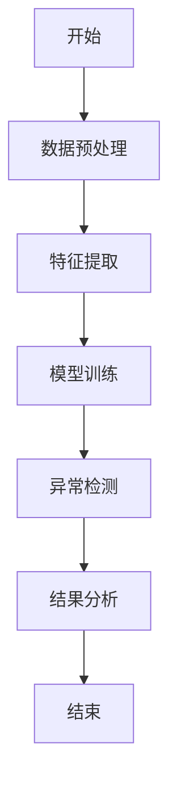
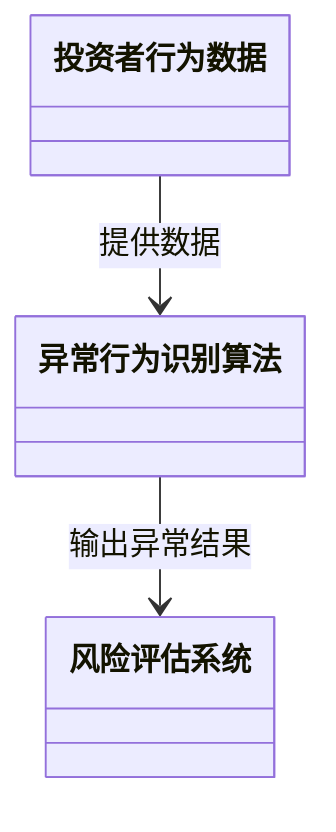
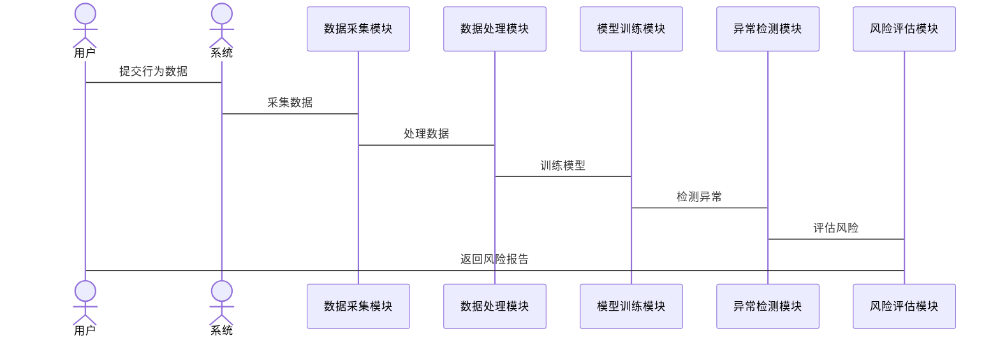

                 


# AI驱动的投资者行为异常识别

## 关键词：投资者行为分析、AI驱动、异常识别、系统架构、算法原理

## 摘要：本文详细探讨了利用人工智能技术识别投资者行为异常的方法。从背景介绍到系统架构设计，从算法原理到项目实战，全面解析了AI在投资者行为分析中的应用。通过具体案例分析和数学模型的建立，揭示了如何有效识别投资者异常行为，并提出了系统的解决方案和最佳实践。

---

# 第1章: AI驱动的投资者行为异常识别概述

## 1.1 背景介绍

### 1.1.1 问题背景
投资者行为分析是金融领域的重要研究方向，旨在通过分析投资者的行为模式，识别潜在的异常行为，从而帮助金融机构降低风险、优化投资策略。传统的投资者行为分析依赖于人工观察和经验判断，效率低且容易遗漏关键信息。随着人工智能技术的快速发展，利用AI技术进行投资者行为异常识别成为可能。

### 1.1.2 问题描述
投资者的行为异常可能包括非理性交易、过度交易、操纵市场等行为。这些异常行为不仅会影响市场稳定性，还可能对投资者和金融机构造成重大损失。如何快速、准确地识别这些异常行为，是当前金融领域的关键挑战。

### 1.1.3 问题解决
通过AI技术，我们可以利用机器学习算法对投资者的行为数据进行建模和分析，识别潜在的异常模式。这不仅可以提高异常识别的效率，还能发现传统方法难以察觉的复杂异常行为。

### 1.1.4 边界与外延
投资者行为异常识别的边界包括：明确的数据来源、特定的异常行为类型、模型的适用范围等。外延则包括将AI技术应用于其他领域的行为分析，如用户行为分析、社交网络分析等。

### 1.1.5 核心概念结构与要素
投资者行为异常识别的核心要素包括：行为数据、异常行为定义、AI算法、模型训练、结果评估等。这些要素共同构成了一个完整的识别系统。

## 1.2 投资者行为分析基础

### 1.2.1 投资者行为的分类
投资者行为可以分为理性行为和非理性行为。理性行为是指投资者根据市场信息做出合理决策，而非理性行为则是指投资者因情绪、认知偏差等因素做出的不合理决策。

### 1.2.2 异常行为的定义与特征
异常行为是指投资者在特定条件下表现出的与正常行为显著不同的行为模式。其特征包括：突发性、一致性、显著性等。

### 1.2.3 行为数据的获取与处理
行为数据的获取需要通过多种渠道，如交易数据、市场数据、投资者问卷调查等。数据处理包括数据清洗、特征提取、数据标准化等步骤。

### 1.2.4 异常行为识别的挑战与意义
识别投资者行为异常的挑战包括数据稀疏性、异常行为的复杂性、模型的泛化能力等。其意义在于帮助金融机构及时发现和应对潜在风险，提升市场稳定性。

## 1.3 本章小结
本章从背景出发，介绍了投资者行为异常识别的重要性，分析了投资者行为的分类和异常行为的特征，探讨了行为数据的获取与处理方法，并总结了异常行为识别的挑战与意义。

---

# 第2章: 核心概念与联系

## 2.1 核心概念原理

### 2.1.1 投资者行为分析的数学模型
投资者行为分析可以通过回归模型、聚类模型、时间序列分析等数学模型进行建模。例如，使用回归模型分析投资者的交易频率与市场波动的关系。

### 2.1.2 异常行为识别的算法原理
异常行为识别的核心算法包括：基于统计的方法（如Z-score）、基于距离的方法（如KNN）、基于深度学习的方法（如LSTM）。这些算法通过学习正常行为模式，识别偏离模式的异常行为。

### 2.1.3 AI驱动的核心机制
AI驱动的核心机制包括数据采集、特征提取、模型训练、异常检测等。通过这些机制，AI系统能够实时监控投资者行为，快速识别异常。

## 2.2 核心概念属性特征对比

### 2.2.1 行为特征对比表格
以下是正常行为和异常行为的特征对比：

| 特征维度 | 正常行为 | 异常行为 |
|----------|----------|----------|
| 交易频率 | 稳定 | 突然增加或减少 |
| 交易时间 | 集中 | 分散或无规律 |
| 交易金额 | 适中 | 过大或过小 |
| 情绪指标 | 平稳 | 波动剧烈 |

### 2.2.2 数据特征与模型性能对比
以下是不同数据特征对模型性能的影响对比：

| 数据特征 | 正常性能 | 异常性能 |
|----------|----------|----------|
| 数据量 | 中等 | 数据稀疏 |
| 数据维度 | 低维 | 高维 |
| 数据分布 | 正态分布 | 偏态分布 |

## 2.3 ER实体关系图

```mermaid
erDiagram
    actor 投资者
    actor 系统
    actor 数据源
    database 行为数据
    database 异常行为
    database 风险评估
    投资者 --> 行为数据: 提供数据
    系统 --> 行为数据: 加工数据
    行为数据 --> 异常行为: 分析异常
    异常行为 --> 风险评估: 评估风险
    系统 --> 风险评估: 生成报告
```

## 2.4 本章小结
本章详细介绍了投资者行为异常识别的核心概念，包括数学模型、异常识别算法、AI驱动的机制等。并通过对比分析，揭示了正常行为和异常行为的特征差异，为后续的算法设计提供了理论基础。

---

# 第3章: 算法原理讲解

## 3.1 异常行为识别算法

### 3.1.1 算法流程图



### 3.1.2 算法实现代码

#### 数据预处理

```python
import pandas as pd
data = pd.read_csv('behavior.csv')
data.dropna(inplace=True)
```

#### 特征提取

```python
from sklearn.preprocessing import StandardScaler
features = data[['feature1', 'feature2']]
scaler = StandardScaler()
features_scaled = scaler.fit_transform(features)
```

#### 模型训练

```python
from sklearn.ensemble import IsolationForest
model = IsolationForest(n_estimators=100, random_state=42)
model.fit(features_scaled)
```

#### 异常检测

```python
import numpy as np
y_pred = model.predict(features_scaled)
outliers = data[y_pred == -1]
```

## 3.2 数学模型与公式

### 3.2.1 概率模型

$$P(outlier) = 1 - P(normal)$$

### 3.2.2 距离度量

$$distance = \sqrt{(x_1 - x_2)^2 + (y_1 - y_2)^2}$$

---

# 第4章: 系统架构与设计

## 4.1 系统架构设计

### 4.1.1 功能模块设计

#### 领域模型



#### 系统架构图

```mermaid
container 投资者行为异常识别系统
    service 数据采集模块
    service 数据处理模块
    service 模型训练模块
    service 异常检测模块
    service 风险评估模块
```

### 4.1.2 接口设计

#### API接口

| 接口名称 | 接口描述 | 输入 | 输出 |
|----------|----------|------|------|
| 数据采集 | 获取投资者行为数据 | 数据请求 | 行为数据 |
| 异常检测 | 检测异常行为 | 行为数据 | 异常结果 |
| 风险评估 | 评估风险等级 | 异常结果 | 风险报告 |

### 4.1.3 交互流程图



## 4.2 本章小结
本章从系统架构设计的角度，详细介绍了投资者行为异常识别系统的功能模块、架构图、接口设计和交互流程，为系统的实现提供了框架支持。

---

# 第5章: 项目实战

## 5.1 环境安装

#### 安装Python环境

```bash
python --version
pip install --upgrade pip
```

#### 安装依赖库

```bash
pip install numpy pandas scikit-learn
```

## 5.2 核心实现代码

### 5.2.1 数据处理代码

```python
import pandas as pd
import numpy as np

# 读取数据
data = pd.read_csv('behavior.csv')

# 删除缺失值
data.dropna(inplace=True)

# 数据标准化
from sklearn.preprocessing import StandardScaler
features = data[['feature1', 'feature2']]
scaler = StandardScaler()
features_scaled = scaler.fit_transform(features)
```

### 5.2.2 异常检测代码

```python
from sklearn.ensemble import IsolationForest

# 训练模型
model = IsolationForest(n_estimators=100, random_state=42)
model.fit(features_scaled)

# 预测异常
y_pred = model.predict(features_scaled)
outliers = data[y_pred == -1]

# 输出结果
print(outliers)
```

## 5.3 案例分析与解读

### 5.3.1 案例分析

假设我们有以下行为数据：

| 交易时间 | 交易金额 | 交易频率 | 情绪指标 |
|----------|----------|----------|----------|
| 09:30    | 1000     | 1        | 0.5      |
| 10:00    | 5000     | 2        | 0.8      |
| 10:30    | 2000     | 3        | 0.6      |
| 11:00    | 10000    | 4        | 0.9      |

通过异常检测模型，我们发现交易金额和交易频率的变化异常，情绪指标也显著高于正常水平。这可能表明投资者在短时间内进行了大量交易，可能是异常行为。

### 5.3.2 代码实现解读
代码实现包括数据预处理、特征提取、模型训练和异常检测四个步骤。通过标准化处理，模型能够更好地捕捉数据特征，从而准确识别异常行为。

## 5.4 本章小结
本章通过实际案例分析和代码实现，展示了AI驱动的投资者行为异常识别系统的实际应用。案例分析表明，该系统能够有效识别异常行为，为金融机构的风险管理提供有力支持。

---

# 第6章: 最佳实践、小结与注意事项

## 6.1 最佳实践

### 6.1.1 数据处理
确保数据的完整性和准确性，合理处理缺失值和异常值。

### 6.1.2 模型选择
根据具体场景选择合适的模型，进行充分的实验验证。

### 6.1.3 模型调优
通过参数优化和模型集成，提升模型的性能和泛化能力。

### 6.1.4 系统部署
确保系统的稳定性和安全性，合理分配计算资源。

## 6.2 小结
本文详细介绍了AI驱动的投资者行为异常识别的背景、核心概念、算法原理、系统架构和项目实战。通过理论与实践的结合，为读者提供了一个完整的解决方案。

## 6.3 注意事项

### 6.3.1 数据隐私
投资者行为数据涉及个人隐私，需严格遵守数据隐私保护法规。

### 6.3.2 模型解释性
复杂的AI模型可能缺乏解释性，需结合业务知识进行验证。

### 6.3.3 模型更新
市场环境不断变化，需定期更新模型，确保识别能力。

## 6.4 拓展阅读
建议读者进一步阅读以下内容：
1. 《异常检测的理论与实践》
2. 《机器学习在金融领域的应用》
3. 《深度学习在时间序列分析中的应用》

---

# 结语
AI驱动的投资者行为异常识别是一项复杂但极具价值的挑战。通过本文的深入探讨，读者可以掌握从理论到实践的完整流程，为实际应用提供有力支持。未来，随着AI技术的不断进步，投资者行为异常识别将更加智能化和精准化，为金融市场的稳定与发展做出更大的贡献。

