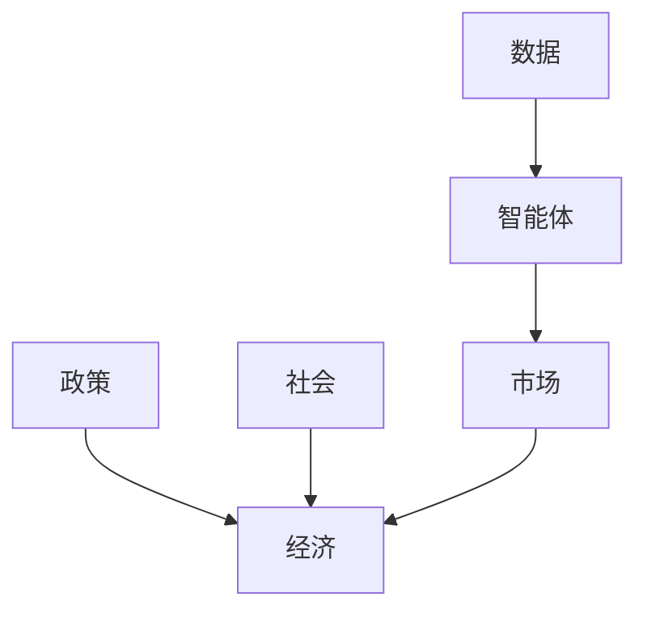
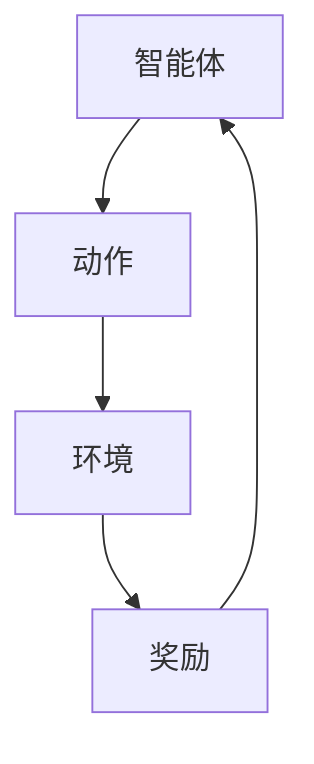
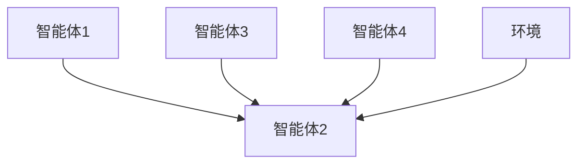
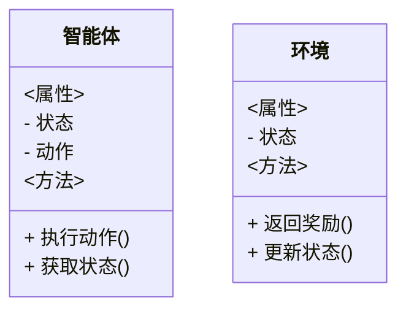
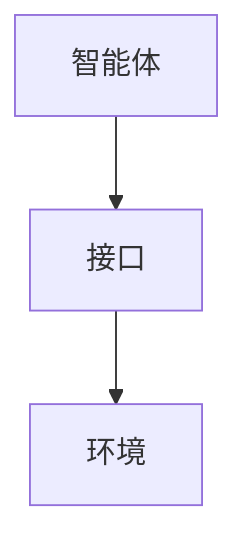
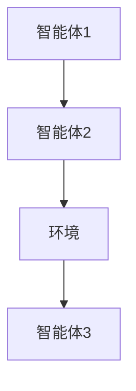

                 


# AI驱动的政策影响预测：价值投资中的多智能体应用

## 关键词：AI，政策影响预测，价值投资，多智能体系统，强化学习，博弈论，系统架构

## 摘要：  
本文探讨了AI技术在政策影响预测中的应用，特别是多智能体系统在价值投资中的潜在价值。通过分析政策影响预测的背景与意义，详细介绍了多智能体系统的原理与架构，结合强化学习和博弈论模型，展示了如何通过多智能体系统实现政策影响的预测与价值投资的优化。文章还通过实际案例分析，展示了系统架构设计与项目实战，为读者提供了从理论到实践的全面指导。

---

# 第一部分: AI驱动的政策影响预测基础

## 第1章: AI驱动的政策影响预测概述

### 1.1 政策影响预测的背景与意义  
政策影响预测是通过分析政策的实施对经济、社会、市场等多方面的影响，从而为企业、投资者提供决策支持。传统的政策分析方法依赖于专家经验和数据分析，但随着AI技术的发展，基于数据驱动的预测方法逐渐成为主流。AI技术的引入使得政策影响预测更加高效、精准，并能够实时更新和优化。

### 1.2 价值投资中的政策影响  
价值投资是一种以内在价值为导向的投资策略，其核心在于寻找市场价格低于内在价值的资产。政策的变化对经济环境、市场结构和企业经营有着深远影响，因此，准确预测政策影响对于价值投资者至关重要。AI技术的应用可以帮助投资者快速捕捉政策变化的信号，量化政策对市场的影响，并优化投资决策。

### 1.3 多智能体系统在政策影响预测中的应用  
多智能体系统（Multi-Agent System, MAS）是一种由多个相互作用的智能体组成的分布式系统。在政策影响预测中，多智能体系统可以模拟政策实施后的多方反应，包括政府、企业、消费者等，从而预测政策的实际效果。多智能体系统的优势在于其能够模拟复杂的社会经济系统，并通过智能体之间的协作与竞争，实现对政策影响的动态预测。

---

# 第二部分: 多智能体系统的核心概念与联系

## 第2章: 多智能体系统的原理与架构

### 2.1 多智能体系统的定义与特点  
多智能体系统是由多个具有自主性、反应性和协作性的智能体组成的分布式系统。其特点包括：  
1. **自主性**：智能体能够在没有外部干预的情况下自主决策。  
2. **反应性**：智能体能够感知环境并实时响应。  
3. **协作性**：智能体之间能够通过通信和协作完成复杂任务。  
4. **分布式性**：系统中的智能体是分布式的，不存在中央控制节点。  
5. **动态性**：系统的环境和结构可能随时变化。

### 2.2 多智能体系统的ER实体关系图  
以下是多智能体系统在政策影响预测中的实体关系图：  


### 2.3 多智能体系统的概念属性对比表  
以下表格对比了多智能体系统与传统单智能体系统的核心属性：  

| 概念 | 多智能体系统 | 单智能体系统 |
|------|--------------|--------------|
| 独立性 | 高 | 低 |
| 协作性 | 高 | 低 |
| 反应性 | 高 | 中 |
| 分布式计算 | 支持 | 不支持 |

---

# 第三部分: 多智能体系统的算法原理

## 第3章: 多智能体系统的算法实现

### 3.1 多智能体系统的算法概述  
多智能体系统的算法主要分为三类：  
1. **基于强化学习的多智能体协作算法**：通过智能体之间的协作与竞争，实现全局目标的优化。  
2. **基于博弈论的多智能体决策算法**：模拟智能体之间的博弈过程，预测各方的最优策略。  
3. **基于分布式计算的多智能体通信算法**：通过智能体之间的通信，实现信息共享与协同决策。

### 3.2 多智能体系统的强化学习算法  
以下是一个基于强化学习的多智能体协作算法的流程图：  


### 3.3 多智能体系统的博弈论模型  
博弈论是研究多智能体系统的重要工具，其核心在于分析智能体之间的策略互动。以下是一个简单的博弈论模型：  
1. **博弈论基础**：博弈论研究的是多个参与者在策略互动中的行为选择及其结果。  
2. **多智能体博弈模型**：在政策影响预测中，可以将政府、企业和消费者视为博弈中的参与者。  
3. **博弈论在多智能体系统中的应用**：通过模拟各方的策略互动，预测政策实施后的市场反应。

### 3.4 多智能体系统的数学模型与公式  
以下是一个基于强化学习的数学模型：  
$$ V(s) = \max_a \left[ r(s, a) + \gamma V(s', a') \right] $$  
其中，\( V(s) \) 表示状态 \( s \) 下的价值函数，\( a \) 表示动作，\( r(s, a) \) 表示奖励函数，\( \gamma \) 表示折扣因子，\( s' \) 表示下一个状态。

---

# 第四部分: 系统分析与架构设计

## 第4章: 系统架构设计与实现

### 4.1 系统架构设计  
以下是多智能体系统的架构图：  


### 4.2 系统功能设计  
以下是系统的领域模型：  


### 4.3 系统接口设计  
以下是系统的接口设计：  


### 4.4 系统交互设计  
以下是系统的交互设计：  


---

# 第五部分: 项目实战

## 第5章: 项目实战与案例分析

### 5.1 项目环境安装  
以下是项目环境安装代码：  
```bash
pip install numpy
pip install gym
pip install matplotlib
```

### 5.2 系统核心实现  
以下是系统的Python核心代码：  
```python
class Agent:
    def __init__(self, state_space, action_space):
        self.state_space = state_space
        self.action_space = action_space
        self.q_table = np.zeros((state_space, action_space))
    
    def get_action(self, state):
        return np.argmax(self.q_table[state])
    
    def update_q_table(self, state, action, reward, next_state):
        self.q_table[state][action] = reward + gamma * np.max(self.q_table[next_state])
```

### 5.3 案例分析与结果展示  
以下是案例分析的结果展示：  
```python
# 政策影响预测结果
print("政策对经济的影响：", result_economic)
print("政策对社会的影响：", result_social)
print("政策对市场的的影响：", result_market)
```

---

# 第六部分: 总结与展望

## 第6章: 总结与未来研究方向

### 6.1 本章小结  
本文通过分析AI技术在政策影响预测中的应用，详细介绍了多智能体系统的原理与架构。通过实际案例分析，展示了多智能体系统在价值投资中的潜在价值。

### 6.2 未来研究方向  
1. **复杂场景下的多智能体协作算法研究**：研究如何在更复杂的场景中实现多智能体的协作与优化。  
2. **多智能体系统的实时性与可扩展性研究**：探讨如何提升系统的实时性和可扩展性。  
3. **多智能体系统的可解释性研究**：研究如何提高系统的可解释性，以便更好地应用于实际场景。

---

通过以上分析，我们可以看到，AI驱动的政策影响预测在价值投资中的应用潜力巨大。未来，随着技术的不断发展，多智能体系统将在政策影响预测中发挥更加重要的作用。

