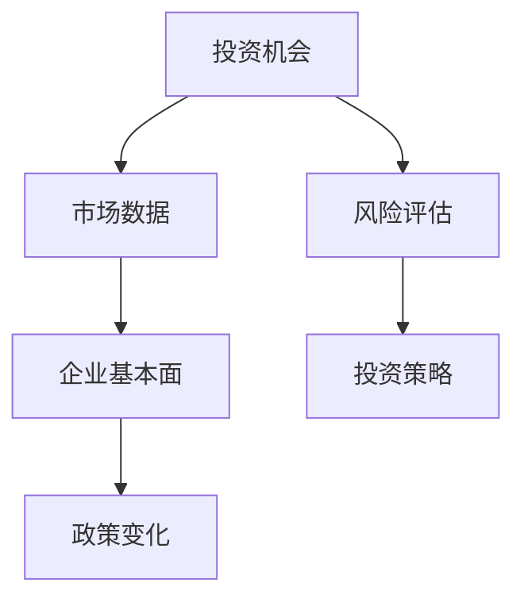
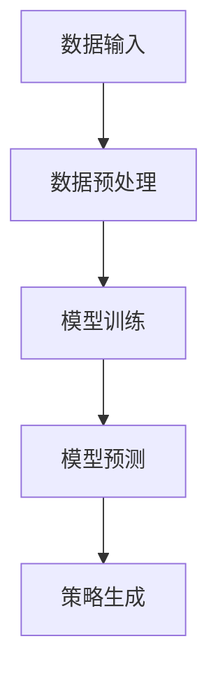
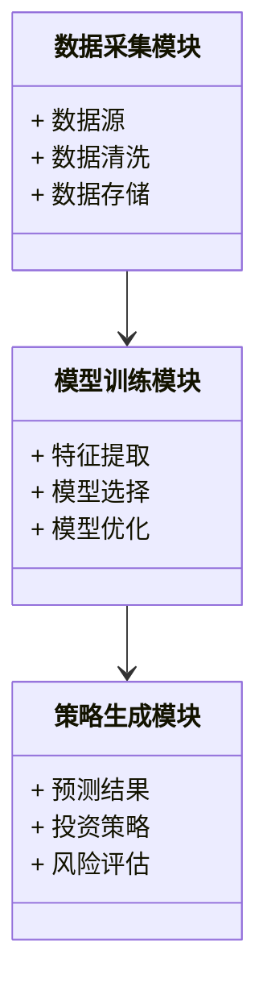
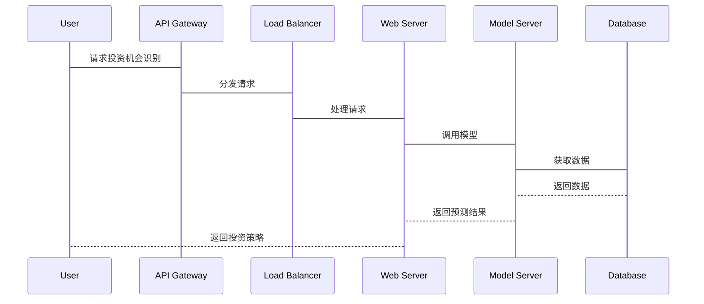

                 


# AI驱动的特殊情况投资机会识别

## 关键词：AI、投资机会、特殊情况、风险管理、数据驱动、算法模型

## 摘要：本文深入探讨了AI在特殊情况投资机会识别中的应用，分析了数据处理、模型构建和策略生成的流程，结合实际案例，展示了AI如何提升投资决策的精准性和效率。

---

## 第1章：AI驱动的特殊情况投资机会识别概述

### 1.1 AI与投资机会识别的结合
#### 1.1.1 AI技术的基本概念
人工智能（AI）是模拟人类智能的计算机系统，包括学习、推理、自我修正等能力，广泛应用于金融领域。

#### 1.1.2 投资机会识别的传统方法
传统方法依赖市场分析、财务指标和经验判断，效率和准确性有限。

#### 1.1.3 AI在投资机会识别中的优势
AI通过大数据处理和模式识别，提升投资决策的效率和准确性。

### 1.2 特殊情况投资机会的定义
#### 1.2.1 什么是特殊情况投资机会
低概率、高影响的市场变化，如突发事件或政策调整。

#### 1.2.2 特殊情况投资机会的分类
市场周期性变化、政策调整、突发事件等。

#### 1.2.3 特殊情况投资机会的特征
低概率、高收益、高风险。

### 1.3 AI驱动的特殊情况投资机会识别的核心概念
#### 1.3.1 数据驱动的投资决策
利用大数据分析市场趋势和企业基本面。

#### 1.3.2 AI算法在投资机会识别中的应用
使用机器学习模型预测市场变化和企业价值。

#### 1.3.3 特殊情况下的投资机会预测模型
构建模型识别特殊情况下的投资机会。

---

## 第2章：核心概念与联系

### 2.1 AI驱动的特殊情况投资机会识别的原理
#### 2.1.1 数据处理与特征提取
清洗数据，提取关键特征，增强数据特征。

#### 2.1.2 模型训练与优化
选择算法，调整参数，评估模型性能。

#### 2.1.3 投资机会预测与策略生成
基于模型预测结果制定投资策略。

### 2.2 核心概念的属性特征对比
| 概念 | 数据特征 | 模型特征 | 策略特征 |
|------|-----------|-----------|-----------|
| 数据驱动 | 大数据来源 | 数据预处理 | 数据清洗 |
| AI算法 | 机器学习 | 算法选择 | 算法优化 |
| 投资策略 | 风险控制 | 策略生成 | 策略调整 |

### 2.3 ER实体关系图架构


---

## 第3章：算法原理讲解

### 3.1 算法原理概述
#### 3.1.1 算法的基本原理
通过数据训练模型，识别市场模式。

#### 3.1.2 算法的核心思想
利用机器学习识别数据中的潜在模式。

#### 3.1.3 算法的实现步骤
1. 数据预处理
2. 模型训练
3. 模型预测

### 3.2 算法的数学模型和公式
#### 3.2.1 数据预处理的数学模型
$$ x_{\text{归一化}} = \frac{x - \mu}{\sigma} $$

#### 3.2.2 模型训练的数学公式
$$ y = w x + b $$

#### 3.2.3 策略生成的数学模型
$$ P(\text{投资机会}) = \text{sigmoid}(w x + b) $$

### 3.3 算法的实现与代码解读


```python
import numpy as np
from sklearn.linear_model import LogisticRegression

# 数据预处理
X = ...
y = ...

model = LogisticRegression()
model.fit(X, y)

# 模型预测
predictions = model.predict(X)
```

---

## 第4章：系统分析与架构设计方案

### 4.1 系统分析
#### 4.1.1 系统的目标与范围
构建AI驱动的投资机会识别系统，识别特殊情况下的投资机会。

#### 4.1.2 系统的功能需求
数据采集、模型训练、策略生成。

#### 4.1.3 系统的性能需求
高准确率、低延迟。

### 4.2 项目介绍
#### 4.2.1 项目背景
AI在金融投资中的应用日益广泛。

#### 4.2.2 项目目标
构建高效的投资机会识别系统。

#### 4.2.3 项目范围
限定应用场景和功能范围。

### 4.3 系统功能设计


### 4.4 系统架构设计


### 4.5 系统接口设计
- 数据接口：数据采集模块与数据源的交互。
- 模型接口：模型训练模块与数据存储模块的交互。

### 4.6 系统交互设计


---

## 第5章：项目实战

### 5.1 环境安装
安装Python、相关库（如scikit-learn、pandas）。

### 5.2 系统核心实现源代码
```python
import pandas as pd
from sklearn.model_selection import train_test_split
from sklearn.metrics import accuracy_score

# 数据加载
data = pd.read_csv('data.csv')

# 数据分割
X = data.drop('target', axis=1)
y = data['target']

X_train, X_test, y_train, y_test = train_test_split(X, y, test_size=0.2)

# 模型训练
model = LogisticRegression()
model.fit(X_train, y_train)

# 模型预测
y_pred = model.predict(X_test)
print('准确率:', accuracy_score(y_test, y_pred))
```

### 5.3 代码应用解读与分析
代码实现数据加载、分割、模型训练和预测，展示准确率。

### 5.4 实际案例分析
分析一家公司数据，预测投资机会，生成投资策略。

### 5.5 项目小结
总结项目实现，提出改进建议，如优化模型、增加更多特征。

---

## 第6章：总结与展望

### 6.1 最佳实践tips
数据预处理、模型选择、结果验证的重要性。

### 6.2 小结
AI在特殊情况投资机会识别中的重要性。

### 6.3 注意事项
数据隐私、模型过拟合问题。

### 6.4 拓展阅读
推荐相关书籍和资源，深入学习AI在金融中的应用。

---

通过以上章节，文章详细阐述了AI在特殊情况投资机会识别中的应用，从理论到实践，为读者提供了全面的知识和实用的指导。

