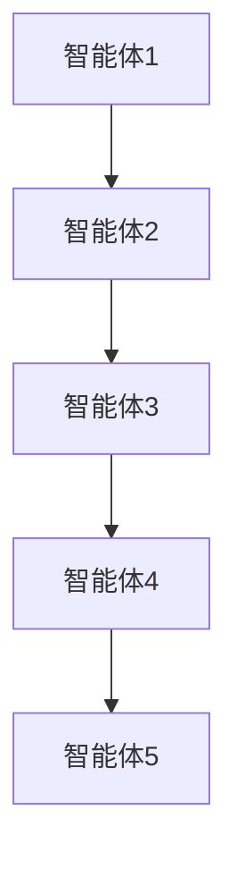
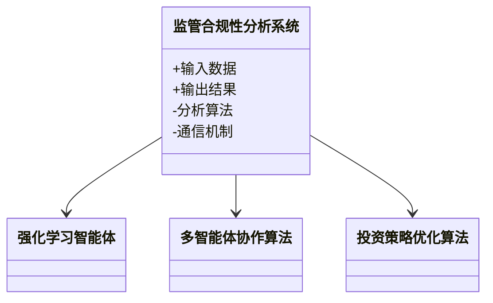
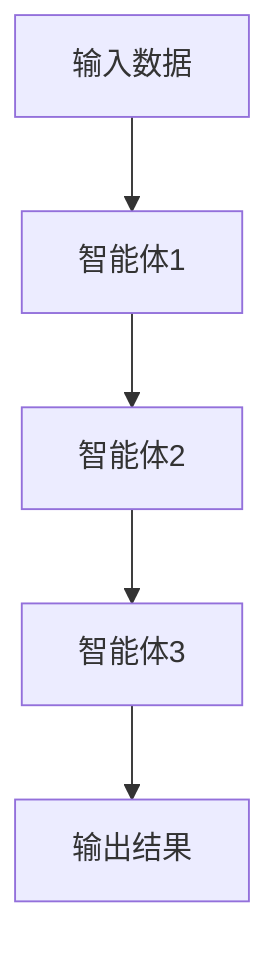

                 


# AI驱动的监管合规性分析：价值投资中的多智能体应用

> 关键词：AI，监管合规性分析，价值投资，多智能体系统，强化学习

> 摘要：随着金融市场的复杂化和监管要求的不断提高，传统的合规性分析方法已难以满足现代投资的需求。本文将深入探讨AI技术在监管合规性分析中的应用，特别是在价值投资中的多智能体应用。通过结合强化学习和多智能体协作算法，本文将展示如何利用AI技术提升合规性分析的效率和准确性，为投资者和监管机构提供更强大的工具和决策支持。

---

# 第一部分: AI驱动的监管合规性分析基础

## 第1章: 监管合规性分析的背景与挑战

### 1.1 监管合规性分析的定义与重要性
#### 1.1.1 监管合规性的定义
监管合规性分析是指通过法律法规和监管要求，对金融市场的行为、交易和信息披露进行审查和评估的过程。合规性分析的核心目标是确保所有市场参与者遵守相关法律法规，维护市场的公平性和稳定性。

#### 1.1.2 监管合规性在金融投资中的作用
在金融投资中，合规性分析是确保投资行为合法、合规的关键环节。它不仅保护投资者的利益，还维护了金融市场的秩序。例如，在价值投资中，投资者需要确保其投资行为符合相关法律法规，避免因违规操作而产生法律风险。

#### 1.1.3 合规性分析的复杂性与挑战
随着金融市场的全球化和复杂化，合规性分析的难度也在增加。传统的合规性分析方法依赖于人工审查和静态规则，难以应对金融市场中的动态变化和复杂场景。例如，新兴的金融工具、复杂的交易结构以及快速变化的监管环境都对合规性分析提出了更高的要求。

### 1.2 价值投资中的监管需求
#### 1.2.1 价值投资的基本原则
价值投资是一种基于对企业的内在价值进行评估的投资策略，强调长期投资、分散风险和精选优质资产。在价值投资中，合规性分析是确保投资行为合法、合规的重要环节。

#### 1.2.2 金融监管的核心要求
金融监管的核心要求包括确保市场参与者遵守法律法规、维护市场秩序、保护投资者利益以及防范系统性风险。在价值投资中，合规性分析需要确保投资组合、交易行为和信息披露均符合相关法规要求。

#### 1.2.3 合规性分析在价值投资中的应用场景
在价值投资中，合规性分析的应用场景包括：
1. 投资组合合规性审查：确保投资组合中的资产配置、杠杆比例等符合监管要求。
2. 交易行为监控：监控交易行为，识别和防范市场操纵、内幕交易等违规行为。
3. 信息披露合规性：确保企业信息披露的真实性和完整性，避免虚假陈述和误导性信息。

### 1.3 AI技术在合规性分析中的应用前景
#### 1.3.1 AI技术的基本优势
AI技术具有高效性、准确性、自适应性和智能化等特点，能够显著提升合规性分析的效率和准确性。例如，AI可以通过自然语言处理技术快速分析大量文本信息，识别潜在的合规风险。

#### 1.3.2 AI在金融监管中的潜在应用
AI技术在金融监管中的潜在应用包括：
1. 实时监控：通过实时数据分析，识别和预警潜在的合规风险。
2. 智能审查：利用机器学习技术自动审查交易行为和信息披露，提高审查效率。
3. 风险评估：通过AI技术评估投资组合的合规风险，提供决策支持。

#### 1.3.3 多智能体系统在合规性分析中的价值
多智能体系统（MAS）是一种由多个智能体协作完成复杂任务的系统。在合规性分析中，多智能体系统可以通过分工合作，分别负责不同的合规性审查任务，提高整体效率和准确性。

---

## 第2章: 多智能体系统的核心概念与架构

### 2.1 多智能体系统（MAS）的定义与特点
#### 2.1.1 多智能体系统的定义
多智能体系统是由多个智能体组成的分布式系统，这些智能体能够通过协作完成复杂的任务。与单智能体系统相比，多智能体系统具有更高的灵活性和适应性。

#### 2.1.2 多智能体系统的组成要素
多智能体系统通常包括以下组成要素：
1. 智能体：能够感知环境并采取行动的实体。
2. 环境：智能体所处的外部环境，包括其他智能体和静态环境。
3. 通信机制：智能体之间进行信息交换的机制。
4. 协作协议：智能体之间协作的规则和协议。

#### 2.1.3 多智能体系统与单智能体系统的对比
以下是多智能体系统与单智能体系统的对比表格：

| 特性                | 单智能体系统                | 多智能体系统                |
|---------------------|---------------------------|---------------------------|
| 系统复杂性          | 简单                      | 复杂                      |
| 灵活性              | 低                       | 高                       |
| 并行处理能力        | 低                       | 高                       |
| 可扩展性            | 低                       | 高                       |

### 2.2 多智能体系统的实体关系分析
#### 2.2.1 实体关系架构
以下是多智能体系统的实体关系架构图：



从图中可以看出，多个智能体通过通信机制进行协作，共同完成复杂的任务。

### 2.3 多智能体系统的架构设计
#### 2.3.1 分层架构设计
多智能体系统的分层架构通常包括以下几个层次：
1. **感知层**：智能体感知环境并获取信息。
2. **决策层**：智能体根据感知的信息做出决策。
3. **执行层**：智能体根据决策采取行动。
4. **通信层**：智能体之间进行信息交换和协作。

#### 2.3.2 组件间的交互关系
以下是多智能体系统组件间的交互关系图：


从图中可以看出，智能体之间通过通信机制进行协作，共同完成复杂的任务。

---

## 第3章: AI驱动的监管合规性分析算法原理

### 3.1 强化学习在合规性分析中的应用
#### 3.1.1 强化学习的基本原理
强化学习是一种通过试错过程来优化决策的机器学习方法。智能体通过与环境交互，不断学习和优化其决策策略，以最大化累积奖励。

#### 3.1.2 在合规性分析中的具体应用
在合规性分析中，强化学习可以用于实时监控和风险评估。例如，智能体可以通过强化学习算法，学习如何识别和预测潜在的合规风险。

#### 3.1.3 强化学习算法的数学模型
以下是强化学习算法的数学模型：

$$
Q(s, a) = Q(s, a) + \alpha \left[r + \max_{a'} Q(s', a') - Q(s, a)\right]
$$

其中：
- $Q(s, a)$ 表示状态 $s$ 下采取行动 $a$ 的价值函数。
- $\alpha$ 是学习率。
- $r$ 是奖励。
- $\max_{a'} Q(s', a')$ 是下一状态的最大价值函数。

### 3.2 多智能体协作算法
#### 3.2.1 多智能体协作的基本原理
多智能体协作算法通过多个智能体的协作，共同完成复杂的任务。智能体之间通过通信机制交换信息，协同决策。

#### 3.2.2 在合规性分析中的具体应用
在合规性分析中，多智能体协作算法可以用于投资组合优化和风险分散。多个智能体可以分别负责不同的资产类别，协同优化投资组合。

#### 3.2.3 多智能体协作算法的数学模型
以下是多智能体协作算法的数学模型：

$$
V(s) = \max_{a} \left[ r(s, a) + \gamma V(s', a) \right]
$$

其中：
- $V(s)$ 表示状态 $s$ 的价值函数。
- $r(s, a)$ 是采取行动 $a$ 的奖励。
- $\gamma$ 是折扣因子。
- $s'$ 是下一状态。

### 3.3 投资策略优化算法
#### 3.3.1 投资策略优化的基本原理
投资策略优化算法通过优化投资组合，提高投资收益并降低风险。AI技术可以用于优化投资策略，例如通过动态规划算法进行投资组合优化。

#### 3.3.2 在合规性分析中的具体应用
在合规性分析中，投资策略优化算法可以用于合规性审查。例如，智能体可以通过优化算法，确保投资组合中的资产配置符合监管要求。

#### 3.3.3 投资策略优化算法的数学模型
以下是投资策略优化算法的数学模型：

$$
\text{max} \quad \sum_{i=1}^{n} w_i r_i - \lambda \sum_{i=1}^{n} w_i^2
$$

其中：
- $w_i$ 是资产 $i$ 的权重。
- $r_i$ 是资产 $i$ 的预期收益。
- $\lambda$ 是惩罚系数。

---

## 第4章: 监管合规性分析的系统架构设计

### 4.1 系统功能设计
#### 4.1.1 领域模型设计
以下是系统功能设计的领域模型图：



从图中可以看出，监管合规性分析系统由多个智能体组成，分别负责不同的分析任务。

### 4.2 系统架构设计
#### 4.2.1 分层架构设计
以下是系统架构设计的分层架构图：



从图中可以看出，输入数据经过多个智能体的处理后，最终生成输出结果。

### 4.3 系统接口设计
#### 4.3.1 系统接口的设计
系统接口设计包括智能体之间的通信接口和系统与外部环境的接口。以下是系统接口设计的交互图：


从图中可以看出，输入数据经过多个智能体的处理后，最终生成输出结果。

---

## 第5章: 项目实战与最佳实践

### 5.1 环境配置与代码实现
#### 5.1.1 环境配置
以下是环境配置的代码示例：

```bash
# 安装Python环境
python --version
pip install --upgrade pip
pip install numpy
pip install gym
pip install matplotlib
pip install pandas
pip install scikit-learn
pip install tensorflow
```

#### 5.1.2 核心代码实现
以下是核心代码实现的示例：

```python
import numpy as np
import gym
from gym import spaces
from gym.utils import seeding

class MultiAgentEnv(gym.Env):
    def __init__(self, n_agents=5):
        self.n_agents = n_agents
        self.observation_space = spaces.Box(low=-1, high=1, shape=(1,))
        self.action_space = spaces.Box(low=-1, high=1, shape=(1,))
        self.state = np.zeros(self.n_agents)
        self.seed()

    def seed(self, seed=None):
        self.np_random, seed = seeding.np_random(seed)
        return [seed]

    def reset(self):
        self.state = np.zeros(self.n_agents)
        return self.state

    def step(self, action):
        # 更新状态
        self.state += action
        # 计算奖励
        reward = np.sum(self.state)
        # 判断终止条件
        done = np.all(self.state >= 1)
        return self.state, reward, done, {}
```

### 5.2 案例分析与代码解读
#### 5.2.1 案例分析
以下是案例分析的详细解读：

在价值投资中，我们可以使用多智能体系统进行投资组合优化。例如，五个智能体分别负责不同的资产类别，协同优化投资组合。

#### 5.2.2 代码实现
以下是代码实现的详细解读：

```python
import numpy as np
import gym
from gym import spaces
from gym.utils import seeding

class MultiAgentEnv(gym.Env):
    def __init__(self, n_agents=5):
        self.n_agents = n_agents
        self.observation_space = spaces.Box(low=-1, high=1, shape=(1,))
        self.action_space = spaces.Box(low=-1, high=1, shape=(1,))
        self.state = np.zeros(self.n_agents)
        self.seed()

    def seed(self, seed=None):
        self.np_random, seed = seeding.np_random(seed)
        return [seed]

    def reset(self):
        self.state = np.zeros(self.n_agents)
        return self.state

    def step(self, action):
        # 更新状态
        self.state += action
        # 计算奖励
        reward = np.sum(self.state)
        # 判断终止条件
        done = np.all(self.state >= 1)
        return self.state, reward, done, {}
```

### 5.3 项目小结与注意事项
#### 5.3.1 项目小结
通过本项目的实践，我们可以看到，AI技术在监管合规性分析中的应用前景广阔。多智能体系统可以通过分工合作，显著提高合规性分析的效率和准确性。

#### 5.3.2 注意事项
在实际应用中，需要注意以下几点：
1. 数据质量：确保输入数据的准确性和完整性。
2. 算法选择：根据具体场景选择合适的算法。
3. 系统维护：定期更新算法和模型，适应变化的监管环境。

---

## 第6章: 最佳实践与未来展望

### 6.1 最佳实践
1. **数据预处理**：确保输入数据的准确性和完整性。
2. **算法优化**：根据具体场景优化算法，提高分析效率。
3. **系统维护**：定期更新算法和模型，适应变化的监管环境。

### 6.2 未来展望
随着AI技术的不断发展，监管合规性分析将更加智能化和自动化。未来，我们可以期待更多基于多智能体系统的创新应用，为投资者和监管机构提供更强大的工具和决策支持。

---

# 结语

通过本文的探讨，我们看到了AI技术在监管合规性分析中的巨大潜力。特别是在价值投资中，多智能体系统可以通过分工合作，显著提高合规性分析的效率和准确性。未来，随着AI技术的不断发展，监管合规性分析将更加智能化和自动化，为投资者和监管机构提供更强大的工具和决策支持。

