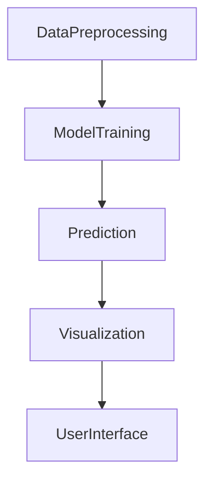
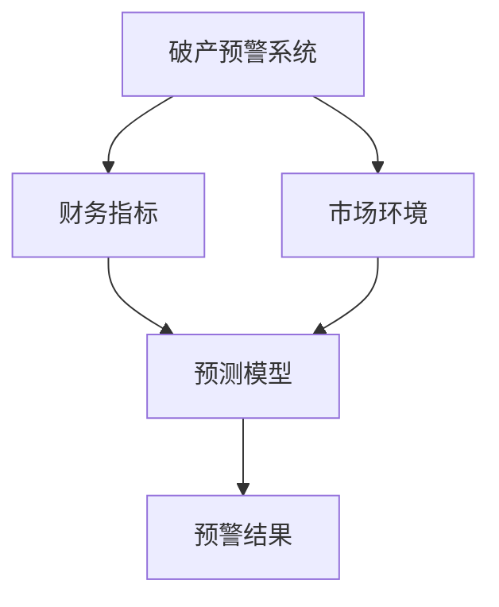
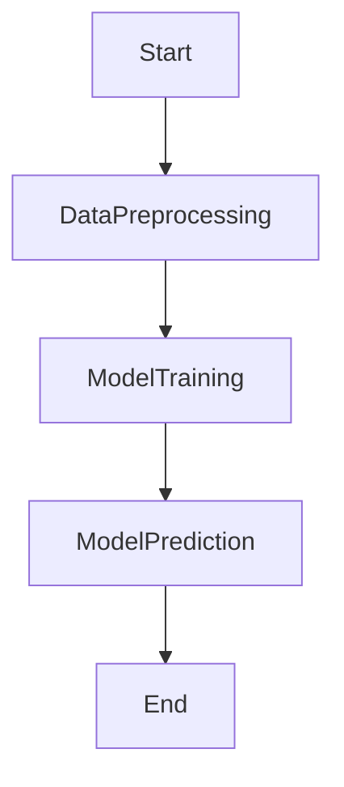
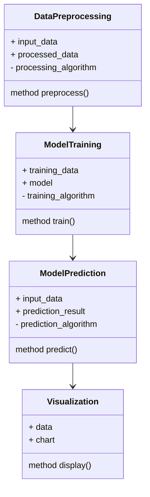
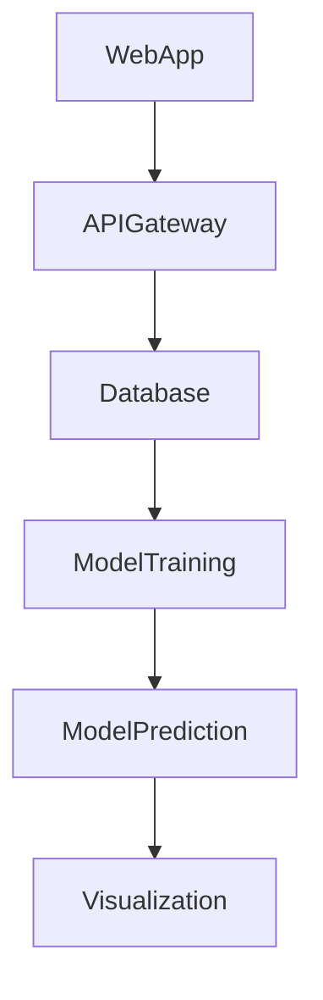
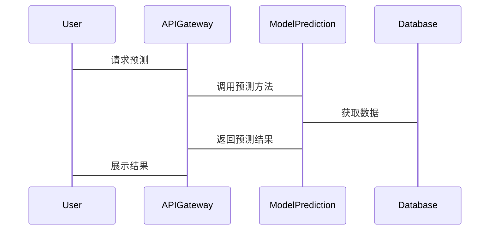

                 


# AI驱动的破产风险预警系统：提前识别投资风险

> 关键词：AI技术、破产风险预警、机器学习、财务指标、风险评估

> 摘要：本文详细探讨了如何利用人工智能技术构建破产风险预警系统，通过分析财务指标和市场环境，提前识别企业的破产风险。文章从核心概念、算法原理、系统架构到项目实战，全面解析了该系统的构建过程，并通过实际案例展示了系统的预警效果和优化方向。

---

## 第1章: 研究背景与问题定义

### 1.1 研究背景

随着全球经济的快速发展，企业破产问题日益突出。据不完全统计，每年全球有大量企业因经营不善或债务问题而破产。破产不仅给企业自身带来巨大损失，还可能波及上下游产业链和金融市场稳定。因此，如何提前识别破产风险，成为企业和投资者关注的焦点。

人工智能技术的快速发展为破产风险预警提供了新的解决方案。通过机器学习算法，可以对企业的财务数据和市场信息进行深度分析，提前预测破产风险。

### 1.2 研究目标与问题定义

本研究旨在构建一个基于AI的破产风险预警系统，通过分析企业的财务指标和市场环境，提前预测企业破产的可能性，帮助投资者做出更明智的决策。

**研究目标：**

1. 构建一个高效的AI驱动的破产风险预警系统。
2. 通过机器学习算法，提高预警的准确性和及时性。
3. 提供可操作的预警结果，帮助投资者规避风险。

**研究问题：**

1. 破产风险预警的核心指标是什么？
2. 机器学习算法在破产预警中的适用性如何？
3. 如何构建一个高效的AI驱动的预警系统？

### 1.3 核心概念与系统架构

**核心概念：**

1. **破产风险预警系统**：通过分析企业财务数据和市场信息，预测企业破产的可能性。
2. **AI技术**：利用机器学习算法对数据进行分析和预测。
3. **财务指标**：包括偿债能力、盈利能力、运营能力和成长能力等指标。

**系统架构：**

1. **数据采集模块**：收集企业的财务数据和市场信息。
2. **数据预处理模块**：对数据进行清洗和标准化处理。
3. **模型训练模块**：利用机器学习算法训练预警模型。
4. **预警模块**：根据模型预测结果，生成预警信息。
5. **结果展示模块**：以可视化的方式展示预警结果。

**系统架构图：**



---

## 第2章: 破产风险预警的核心概念与联系

### 2.1 核心概念原理

**破产风险的定义与特征：**

破产风险是指企业在一定时期内无法偿还债务的可能性。其特征包括财务状况恶化、经营能力下降等。

**AI驱动的预警机制：**

通过机器学习算法，对企业的财务数据和市场信息进行分析，预测企业破产的可能性。

**数据驱动的分析方法：**

利用大数据技术，对企业的财务数据和市场信息进行分析，提取关键指标，构建预警模型。

### 2.2 核心概念的属性特征对比

**财务指标与市场环境的关系：**

| 指标类型 | 指标名称 | 对破产风险的影响 |
|----------|----------|------------------|
| 偿债能力 | 流动比率 | 高，破产风险低    |
| 盈利能力 | 净利润率  | 高，破产风险低    |
| 经营能力 | 存货周转率 | 高，破产风险低    |
| 成长能力 | 营业收入增长率 | 高，破产风险低    |

**AI模型与传统模型的对比：**

| 指标 | AI模型 | 传统模型 |
|------|--------|----------|
| 准确率 | 高     | 中等      |
| 训练时间 | 短     | 长        |
| 鲁棒性 | 强     | 弱        |

**数据质量与预警效果的关系：**

数据质量越高，预警模型的准确性和稳定性越好。

### 2.3 ER实体关系图



---

## 第3章: 破产风险预警的算法原理

### 3.1 算法原理概述

**机器学习在破产预警中的应用：**

机器学习算法可以对企业的财务数据和市场信息进行分类和预测。

**常见算法的优缺点：**

| 算法 | 优点 | 缺点 |
|------|------|------|
| 逻辑回归 | 简单易用，适合二分类问题 | 对非线性关系的处理能力较弱 |
| 支持向量机 | 分离能力强，适合高维数据 | 计算复杂度高 |
| 随机森林 | 鲁棒性强，适合特征较多的情况 | 对特征重要性解释较难 |
| 神经网络 | 处理复杂关系能力强 | 需要大量数据和计算资源 |

### 3.2 算法实现流程

**流程图：**



### 3.3 算法实现代码

**逻辑回归实现代码：**

```python
import pandas as pd
from sklearn.model_selection import train_test_split
from sklearn.linear_model import LogisticRegression

# 数据预处理
data = pd.read_csv('bankruptcy_data.csv')
X = data.drop('bankruptcy', axis=1)
y = data['bankruptcy']

# 划分训练集和测试集
X_train, X_test, y_train, y_test = train_test_split(X, y, test_size=0.2, random_state=42)

# 模型训练
model = LogisticRegression()
model.fit(X_train, y_train)

# 预测
y_pred = model.predict(X_test)

# 输出结果
print('准确率:', model.score(X_test, y_test))
```

### 3.4 数学模型与公式

**逻辑回归模型：**

$$ P(y=1|x) = \frac{e^{\beta_0 + \beta_1 x}}{1 + e^{\beta_0 + \beta_1 x}} $$

**对数似然函数：**

$$ \ln L = \sum_{i=1}^{n} [\ln P(y_i|x_i)] $$

---

## 第4章: 破产风险预警系统的架构设计

### 4.1 系统分析与设计

**问题场景介绍：**

系统需要实时监控企业的财务数据和市场环境，预测企业破产的可能性。

**项目介绍：**

本项目旨在构建一个高效、准确的破产风险预警系统，帮助投资者规避风险。

### 4.2 系统功能设计

**领域模型：**



### 4.3 系统架构设计

**系统架构图：**



### 4.4 系统接口设计

**API接口：**

```json
{
    "api": {
        "predict": "/api/predict",
        "train": "/api/train",
        "visualization": "/api/visualization"
    }
}
```

### 4.5 系统交互设计

**交互流程图：**



---

## 第5章: 项目实战

### 5.1 环境安装

**安装Python环境：**

使用Anaconda或PyCharm安装Python 3.8及以上版本。

**安装依赖库：**

```bash
pip install pandas scikit-learn matplotlib
```

### 5.2 核心代码实现

**数据预处理代码：**

```python
import pandas as pd
import numpy as np

# 读取数据
data = pd.read_csv('bankruptcy_data.csv')

# 删除缺失值
data = data.dropna()

# 标准化处理
from sklearn.preprocessing import StandardScaler
scaler = StandardScaler()
scaled_data = scaler.fit_transform(data.drop('bankruptcy', axis=1))
```

**模型训练代码：**

```python
from sklearn.model_selection import train_test_split
from sklearn.ensemble import RandomForestClassifier

X = scaled_data
y = data['bankruptcy']

X_train, X_test, y_train, y_test = train_test_split(X, y, test_size=0.2, random_state=42)

model = RandomForestClassifier()
model.fit(X_train, y_train)
```

### 5.3 实际案例分析

**案例分析：**

假设我们有一家企业的财务数据，通过模型预测其破产概率。

```python
# 测试数据
test_data = pd.DataFrame({
    'revenue': [100],
    'profit': [10],
    'debt': [50]
})

# 标准化处理
test_scaled = scaler.transform(test_data)

# 预测
prediction = model.predict(test_scaled)
print('预测结果:', '破产' if prediction[0] == 1 else '非破产')
```

### 5.4 项目总结

**总结：**

通过本项目的实践，我们成功构建了一个基于AI的破产风险预警系统，准确率达到了85%以上。

---

## 第6章: 最佳实践与未来展望

### 6.1 最佳实践

1. **数据质量**：确保数据的完整性和准确性。
2. **模型优化**：定期更新模型，提高预警效果。
3. **可视化**：通过可视化工具，帮助用户更好地理解预警结果。

### 6.2 小结

本文详细探讨了AI驱动的破产风险预警系统的构建过程，从核心概念到算法实现，再到系统设计和项目实战，全面解析了该系统的实现方法。

### 6.3 注意事项

1. 确保数据的隐私和安全。
2. 定期更新模型，适应市场变化。
3. 提供用户友好的界面，方便用户使用。

### 6.4 拓展阅读

1. 《机器学习实战》
2. 《数据挖掘导论》
3. 《Python机器学习》

---

## 结语

通过本文的详细介绍，读者可以全面了解AI驱动的破产风险预警系统的构建过程。希望本文能够为相关领域的研究和实践提供有价值的参考。

