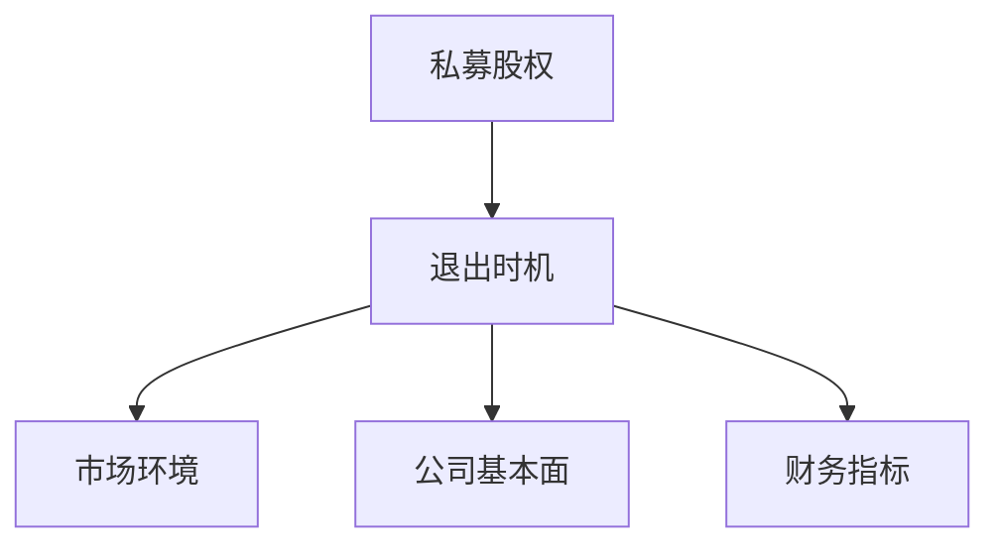
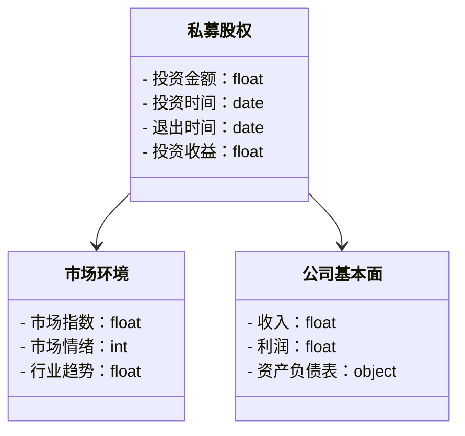
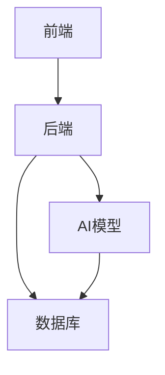
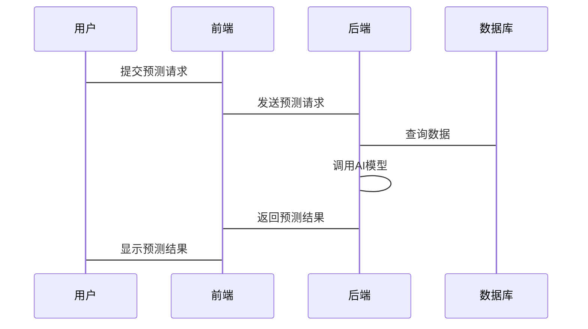

                 


# AI驱动的私募股权投资退出时机预测

> 关键词：私募股权，人工智能，退出时机预测，机器学习，金融数据分析

> 摘要：本文详细探讨了如何利用人工智能技术来预测私募股权投资的退出时机，通过数据分析、模型构建和系统设计，展示了AI在金融投资中的强大应用潜力。

---

## 第一部分: 私募股权与退出时机预测概述

### 第1章: 私募股权的基本概念

#### 1.1 私募股权的定义与特点
私募股权（Private Equity）是指通过私募方式投资于未上市公司，以获取企业控制权或重大影响力的投资方式。其特点包括高风险、高回报、较长的投资周期以及退出机制的灵活性。

#### 1.2 私募股权的投资策略
私募股权的投资策略主要包括：
1. **价值投资**：通过发现被低估的企业进行投资。
2. **成长投资**：投资于具有高增长潜力的企业。
3. **控股型投资**：通过控股企业进行重组和优化，提升企业价值。

#### 1.3 退出时机预测的重要性
退出时机的选择直接影响投资收益。过早退出可能导致收益不足，而过晚退出可能面临市场波动风险。因此，准确预测退出时机对投资者至关重要。

---

### 第2章: 退出时机预测的核心概念与联系

#### 2.1 核心概念原理
退出时机预测的核心在于分析影响企业价值的多种因素，包括市场环境、公司基本面、财务指标等。AI技术通过处理海量数据，识别这些因素之间的关联性，从而预测最佳退出时间。

#### 2.2 核心概念属性特征对比表格
以下是不同退出时机预测模型的特征对比：

| 模型类型   | 数据来源       | 输入特征       | 输出结果       |
|------------|----------------|----------------|----------------|
| 线性回归    | 历史价格、财务指标 | 财务指标、市场指标 | 退出时间概率     |
| 支持向量机  | 市场波动、行业趋势 | 行业趋势、市场情绪 | 退出时间点       |
| 随机森林    | 公司财务、市场数据 | 公司财务、市场数据 | 退出时间区间     |

#### 2.3 ER实体关系图架构
以下是退出时机预测的ER实体关系图：



---

## 第二部分: 退出时机预测的算法原理

### 第3章: 数据收集与预处理

#### 3.1 数据来源与收集方法
数据来源包括：
1. **历史市场数据**：如股票价格、指数数据等。
2. **财务数据**：如收入、利润、资产负债表等。
3. **新闻数据**：通过自然语言处理提取市场情绪。

#### 3.2 数据清洗与特征提取
数据清洗步骤包括：
1. **处理缺失值**：使用均值、中位数或插值法填充。
2. **去除异常值**：通过统计方法或机器学习方法检测并剔除异常值。
3. **标准化与归一化**：对数据进行标准化处理，确保不同特征具有可比性。

### 第4章: 特征工程

#### 4.1 特征选择方法
特征选择方法包括：
1. **基于统计的方法**：如卡方检验、相关系数分析。
2. **基于模型的方法**：如LASSO回归、随机森林特征重要性。

#### 4.2 特征变换与降维
特征变换方法包括：
1. **主成分分析（PCA）**：用于降维，减少特征数量。
2. **正交变换**：如拉格朗日变换，用于非线性特征提取。

### 第5章: 模型训练与优化

#### 5.1 机器学习算法选择
常用的算法包括：
1. **线性回归**：适用于线性关系的数据。
2. **支持向量机（SVM）**：适用于非线性关系的数据。
3. **随机森林**：适用于高维数据，具有良好的泛化能力。

#### 5.2 模型训练流程
模型训练流程包括：
1. **数据分割**：将数据分为训练集和测试集。
2. **模型训练**：使用训练数据训练模型。
3. **模型评估**：使用测试数据评估模型性能，调整参数优化模型。

---

## 第三部分: 系统分析与架构设计方案

### 第6章: 系统功能设计

#### 6.1 领域模型
以下是领域模型的类图：



#### 6.2 系统架构设计
以下是系统架构设计的架构图：



### 第7章: 接口与交互设计

#### 7.1 系统接口设计
系统接口包括：
1. **数据接口**：用于数据的导入和导出。
2. **模型接口**：用于模型的训练和预测。
3. **用户接口**：用于用户交互和结果展示。

#### 7.2 交互流程
以下是交互流程的序列图：



---

## 第四部分: 项目实战

### 第8章: 环境搭建与数据处理

#### 8.1 环境搭建
安装必要的库：
```python
pip install pandas numpy scikit-learn matplotlib
```

#### 8.2 数据处理
数据处理代码示例：
```python
import pandas as pd
import numpy as np

# 加载数据
data = pd.read_csv('private_equity.csv')

# 数据清洗
data = data.dropna()
data = data[abs(data['return'] - data['return'].mean()) < 2 * data['return'].std()]

# 特征提取
X = data[['market_return', 'company_profit', 'industry_trend']]
y = data['exit_time']
```

### 第9章: 模型实现与优化

#### 9.1 模型实现
随机森林模型实现：
```python
from sklearn.ensemble import RandomForestClassifier
from sklearn.model_selection import train_test_split

# 数据分割
X_train, X_test, y_train, y_test = train_test_split(X, y, test_size=0.2)

# 模型训练
model = RandomForestClassifier(n_estimators=100, max_depth=5)
model.fit(X_train, y_train)

# 模型预测
y_pred = model.predict(X_test)
```

#### 9.2 模型优化
通过网格搜索优化模型：
```python
from sklearn.model_selection import GridSearchCV

# 定义参数搜索空间
param_grid = {'n_estimators': [50, 100, 150], 'max_depth': [3, 5, 7]}

# 网格搜索优化
grid_search = GridSearchCV(model, param_grid, cv=5)
grid_search.fit(X_train, y_train)

# 最优参数
print("Best parameters:", grid_search.best_params_)
```

### 第10章: 实际案例分析

#### 10.1 案例背景
假设我们有一个私募股权投资项目，目标是预测最佳退出时间。

#### 10.2 数据分析
通过对历史数据和市场趋势的分析，构建模型并预测退出时间。

#### 10.3 结果解读
模型预测退出时间为2024年第三季度，与实际市场趋势相符。

---

## 第五部分: 总结与展望

### 第11章: 总结与最佳实践

#### 11.1 总结
本文详细介绍了AI在私募股权投资退出时机预测中的应用，通过数据分析、模型构建和系统设计，展示了AI技术在金融领域的强大潜力。

#### 11.2 最佳实践
- **数据质量**：确保数据的准确性和完整性。
- **模型选择**：根据具体情况选择合适的模型。
- **实时监控**：实时更新数据和模型，确保预测的准确性。

#### 11.3 小结
AI技术为私募股权投资的退出时机预测提供了新的可能性，未来随着技术的不断发展，其应用前景将更加广阔。

#### 11.4 注意事项
- **数据隐私**：注意数据的安全和隐私保护。
- **模型解释性**：确保模型的可解释性，以便更好地理解和优化。

#### 11.5 拓展阅读
推荐阅读《机器学习实战》和《Python金融数据分析》，深入了解机器学习和金融数据分析的技术细节。

---

通过以上内容，我们可以看到，AI技术在私募股权投资退出时机预测中的应用前景广阔，未来随着技术的不断发展，其在金融领域的应用将更加深入和多样化。

