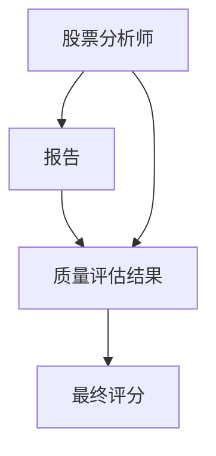
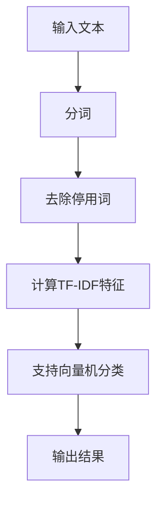
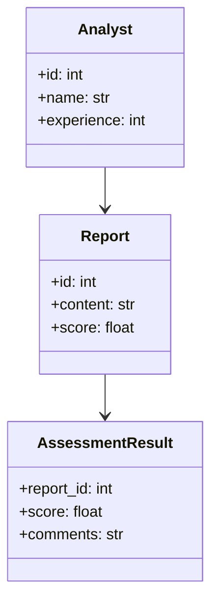
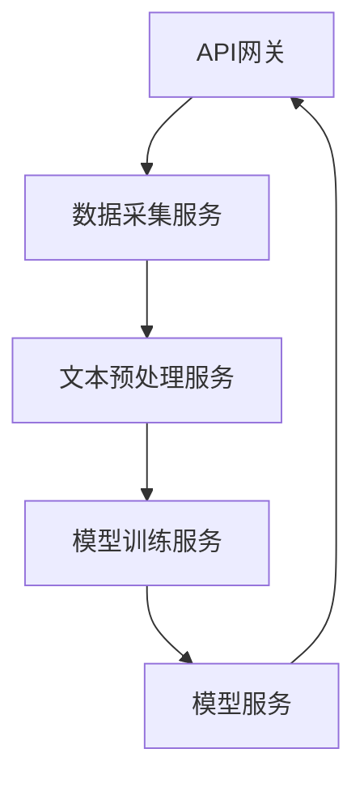
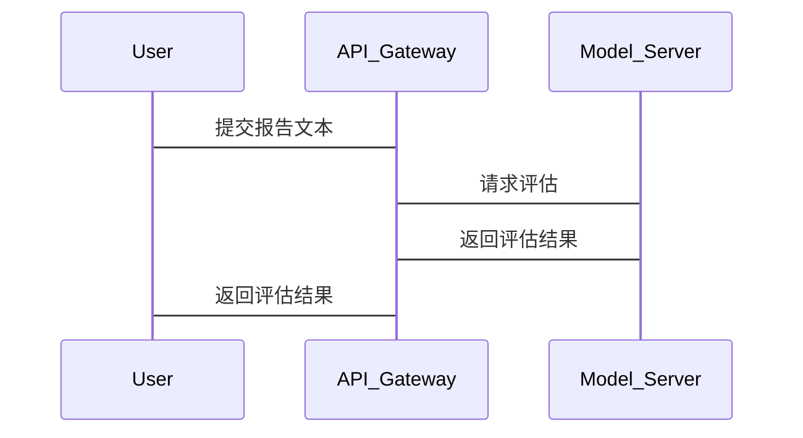

                 


# AI驱动的股票分析师报告质量评估

> 关键词：股票分析师、AI驱动、报告质量评估、自然语言处理、机器学习、金融分析

> 摘要：本文探讨了如何利用人工智能技术评估股票分析师报告的质量。通过结合自然语言处理和机器学习，我们提出了一种基于AI的解决方案，旨在提高报告评估的效率和准确性。文章详细介绍了核心概念、算法原理、系统架构以及实际应用案例，为读者提供全面的技术视角。

---

# 第一部分: AI驱动的股票分析师报告质量评估概述

## 第1章: 背景介绍

### 1.1 问题背景
股票分析师的报告在金融市场的决策过程中扮演着关键角色。然而，传统的人工评估方法存在效率低、主观性强、难以量化等问题。随着AI技术的快速发展，利用机器学习和自然语言处理（NLP）来自动化评估报告质量成为可能。

#### 1.1.1 股票分析师报告的重要性
股票分析师的报告通常包括市场趋势分析、公司基本面评估、投资建议等内容，这些信息对投资者的决策具有重要影响。高质量的报告能够帮助投资者做出明智的投资决策，而低质量的报告可能误导投资者，导致损失。

#### 1.1.2 传统报告质量评估的局限性
传统的报告评估方法主要依赖人工阅读和主观判断，存在以下问题：
- **效率低下**：人工评估耗时长，难以快速应对海量报告。
- **主观性**：评估结果受评估人员的经验和主观因素影响，缺乏客观性。
- **难以量化**：难以将报告质量转化为可量化的指标。

#### 1.1.3 AI技术在金融领域的潜力
AI技术，尤其是机器学习和自然语言处理，能够从大量文本数据中提取特征，并通过模型训练实现自动化评估。这不仅提高了效率，还能够量化报告质量，为投资者提供更可靠的决策支持。

### 1.2 问题描述
报告质量评估的核心在于如何准确、客观地衡量报告的内容、逻辑和预测能力。AI驱动的评估需要解决以下问题：
- **数据特征提取**：如何从文本中提取有用的特征。
- **模型选择**：选择适合的机器学习模型进行分类或回归。
- **性能优化**：如何提高模型的准确性和稳定性。

### 1.3 问题解决
AI驱动的报告质量评估通过以下步骤实现：
1. **数据收集**：收集大量股票分析师报告及其人工评估结果。
2. **文本预处理**：对文本进行分词、去除停用词、实体识别等处理。
3. **特征提取**：使用TF-IDF、Word2Vec等方法提取文本特征。
4. **模型训练**：使用支持向量机（SVM）、随机森林（RF）等模型进行训练。
5. **评估与优化**：通过交叉验证优化模型参数，评估模型性能。

### 1.4 边界与外延
- **评估范围**：主要针对报告的内容质量、逻辑性和预测准确性，不涉及报告的格式美观性。
- **相关领域**：与金融分析、自然语言处理、机器学习密切相关。
- **技术实现**：基于文本数据的特征提取和机器学习模型，不涉及实时数据流处理。

## 第2章: 核心概念与联系

### 2.1 AI在金融分析中的应用
AI在金融分析中的应用主要体现在以下几个方面：
- **自然语言处理（NLP）**：用于文本数据的分析，如情感分析、主题分类。
- **机器学习**：用于预测市场趋势、识别投资机会。
- **深度学习**：用于处理复杂的金融数据，如时间序列分析。

### 2.2 核心概念的对比分析
以下表格展示了传统报告评估与AI驱动评估的对比：

| 评估维度 | 传统评估 | AI驱动评估 |
|----------|----------|------------|
| 评估主体 | 人工评估 | 自动化评估 |
| 评估效率 | 低效 | 高效 |
| 评估结果 | 主观 | 客观 |
| 可扩展性 | 低 | 高 |

### 2.3 实体关系图（ER图）



---

# 第二部分: 算法原理讲解

## 第3章: 基于NLP的报告质量评估

### 3.1 算法原理
报告质量评估的核心在于从文本中提取特征，并通过机器学习模型进行分类或回归。以下是具体的实现步骤：

#### 3.1.1 文本预处理
1. **分词**：将文本分割成单词或短语。
2. **去除停用词**：移除常见词汇（如“的”、“是”）。
3. **实体识别**：识别文本中的公司名称、行业术语等。

#### 3.1.2 特征提取
使用TF-IDF（Term Frequency-Inverse Document Frequency）提取文本特征：
$$ TF-IDF(t, d) = \text{freq}(t, d) \times \log\left(\frac{N}{\text{doc\_count}(t)}\right) $$
其中，\( t \) 是一个词，\( d \) 是一篇文档，\( N \) 是文档总数，\( \text{doc\_count}(t) \) 是包含词 \( t \) 的文档数。

#### 3.1.3 分类模型
使用支持向量机（SVM）进行分类：
$$ \text{max} \quad \sum_{i=1}^{n} \alpha_i y_i \sum_{j=1}^{n} \alpha_j y_j \langle x_i, x_j \rangle - C \sum_{i=1}^{n} \alpha_i $$
其中，\( \alpha_i \) 是拉格朗日乘子，\( y_i \) 是标签，\( \langle x_i, x_j \rangle \) 是内积。

### 3.2 算法流程图



### 3.3 核心算法实现
以下是基于TF-IDF和SVM的Python实现示例：

```python
from sklearn.feature_extraction.text import TfidfVectorizer
from sklearn.svm import SVC
from sklearn.metrics import accuracy_score

# 示例数据
corpus = [
    "公司业绩良好，未来增长潜力大",
    "行业竞争激烈，公司前景黯淡",
    "市场波动较大，投资需谨慎"
]
labels = [1, 0, 0]  # 1表示高质量，0表示低质量

# 文本预处理
vectorizer = TfidfVectorizer()
X = vectorizer.fit_transform(corpus)

# 训练模型
model = SVC()
model.fit(X, labels)

# 预测
test_corpus = ["公司财务状况稳健，值得投资"]
test_X = vectorizer.transform(test_corpus)
predicted = model.predict(test_X)
print(predicted)
```

---

# 第三部分: 系统分析与架构设计

## 第4章: 系统设计与架构

### 4.1 项目介绍
本项目旨在开发一个基于AI的股票分析师报告质量评估系统，主要包括以下功能：
- 数据采集：从数据库中获取股票分析师报告。
- 文本预处理：对文本进行清洗和特征提取。
- 模型训练：训练机器学习模型并进行优化。
- 系统部署：提供API接口供其他系统调用。

### 4.2 系统功能设计

#### 4.2.1 领域模型
以下是系统领域模型的类图：



#### 4.2.2 系统架构
以下是系统的总体架构图：



### 4.3 系统接口设计
以下是系统接口设计的示例：

- **输入接口**：接收股票分析师报告的文本内容。
- **输出接口**：返回报告的质量评分和相关评论。

### 4.4 系统交互流程
以下是系统交互流程的序列图：



---

# 第四部分: 项目实战

## 第5章: 项目实现

### 5.1 环境安装
需要安装以下Python库：
- `scikit-learn`
- `nltk`
- `tensorflow`
- `pandas`

### 5.2 核心代码实现
以下是核心代码实现示例：

```python
import numpy as np
from sklearn.metrics import accuracy_score, precision_score, recall_score, f1_score
from sklearn.metrics import confusion_matrix

# 示例数据
X_train = np.array([[0.8, 0.2], [0.3, 0.7], [0.5, 0.5]])
y_train = np.array([1, 0, 1])
X_test = np.array([[0.6, 0.4], [0.7, 0.3]])
y_test = np.array([1, 0])

# 训练模型
model = SVC()
model.fit(X_train, y_train)

# 预测
y_pred = model.predict(X_test)

# 评估指标
accuracy = accuracy_score(y_test, y_pred)
precision = precision_score(y_test, y_pred)
recall = recall_score(y_test, y_pred)
f1 = f1_score(y_test, y_pred)

print(f"Accuracy: {accuracy}")
print(f"Precision: {precision}")
print(f"Recall: {recall}")
print(f"F1 Score: {f1}")
print("Confusion Matrix:\n", confusion_matrix(y_test, y_pred))
```

### 5.3 实际案例分析
以下是一个实际案例分析：

1. **数据准备**：收集100篇股票分析师报告及其人工评分。
2. **文本预处理**：去除停用词，提取关键词。
3. **模型训练**：使用SVM模型进行训练。
4. **模型评估**：计算准确率、召回率和F1分数。

---

# 第五部分: 最佳实践

## 第6章: 小结与注意事项

### 6.1 小结
本文详细介绍了AI驱动的股票分析师报告质量评估的实现过程，包括背景介绍、核心概念、算法原理、系统设计和项目实战。通过结合自然语言处理和机器学习技术，我们能够高效、准确地评估报告质量。

### 6.2 注意事项
- **数据隐私**：在处理股票分析师报告时，需注意数据隐私和合规性。
- **模型调优**：根据实际情况调整模型参数，优化模型性能。
- **持续学习**：定期更新模型，以适应市场变化。

## 6.3 拓展阅读
- 《机器学习实战》
- 《自然语言处理入门》
- 《深度学习》

---

# 结语

AI驱动的股票分析师报告质量评估是一项具有挑战性的任务，但也是一项极具潜力的技术。通过不断优化算法和系统架构，我们可以进一步提高评估的准确性和效率，为投资者提供更可靠的决策支持。

