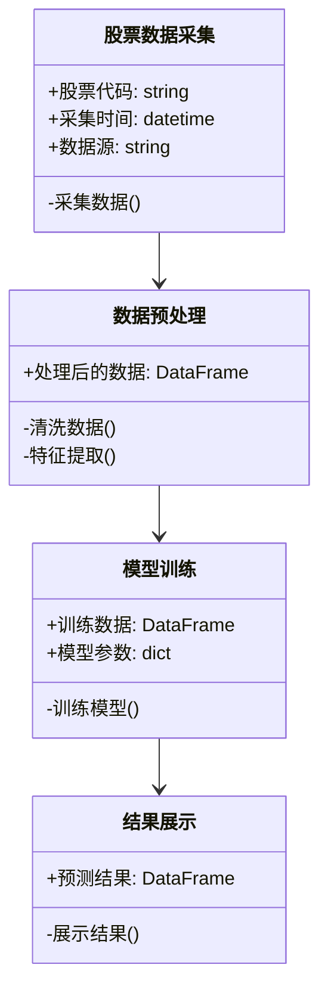
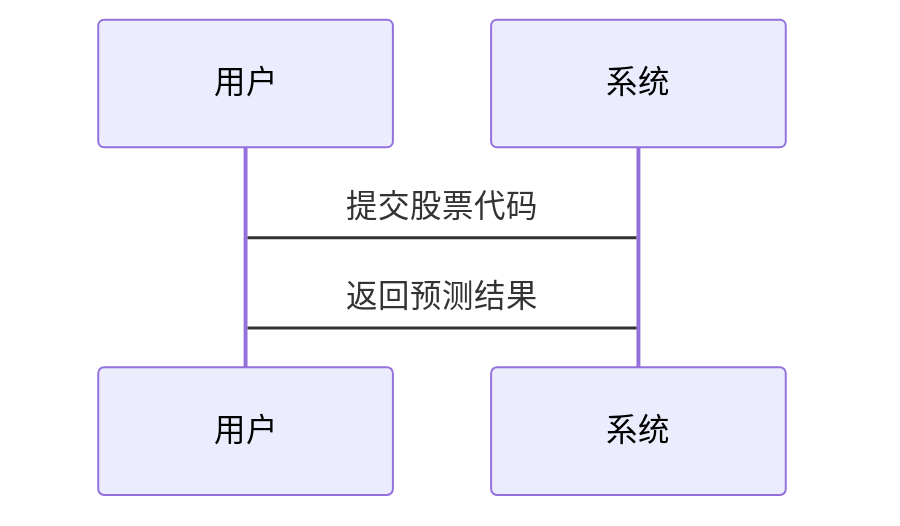

                 


# AI驱动的股票基本面分析工具

> 关键词：AI, 股票分析, 基本面分析, 机器学习, 深度学习, 自然语言处理, 投资决策

> 摘要：本文将详细探讨AI技术在股票基本面分析中的应用，从核心概念到具体算法，再到系统设计和项目实战，全面解析如何利用人工智能提升股票投资决策的效率和准确性。通过本文，读者将能够理解AI在股票分析中的作用，掌握相关算法原理，并学会如何构建一个基于AI的股票基本面分析工具。

---

# 第1章: AI驱动的股票基本面分析工具背景介绍

## 1.1 股票基本面分析的定义与重要性

### 1.1.1 什么是股票基本面分析
股票基本面分析是通过研究公司的财务状况、行业地位、管理团队、市场前景等因素，评估其内在价值的一种方法。它是投资者做出投资决策的重要依据。

### 1.1.2 基本面分析的核心要素
- **财务报表分析**：包括利润表、资产负债表、现金流量表等。
- **行业分析**：公司所在行业的市场规模、竞争格局、发展趋势等。
- **管理团队**：公司的管理层能力和战略规划。
- **宏观经济因素**：如GDP增长率、利率、通货膨胀等。

### 1.1.3 AI在股票分析中的作用
AI技术可以通过处理海量数据、识别复杂模式和提供实时分析，显著提升基本面分析的效率和准确性。

---

## 1.2 AI驱动股票分析的背景与趋势

### 1.2.1 传统股票分析的局限性
- 数据量大，人工分析效率低。
- 依赖主观判断，容易受到情绪影响。
- 无法及时捕捉市场变化。

### 1.2.2 AI技术在金融领域的应用现状
- 机器学习算法被广泛用于股票预测。
- 自然语言处理技术用于分析财务报告和新闻。
- 大数据分析帮助识别市场趋势。

### 1.2.3 未来AI驱动股票分析的发展方向
- 更加智能化：结合NLP和深度学习，实现自动化分析。
- 更加个性化：根据投资者风险偏好提供定制化建议。
- 更加实时化：通过实时数据处理提供动态分析。

---

## 1.3 本书的目标与读者定位

### 1.3.1 本书的核心目标
通过理论与实践相结合，帮助读者掌握AI驱动的股票基本面分析工具的设计与实现。

### 1.3.2 本书的读者群体
- 投资新手：希望通过AI技术提升股票分析能力。
- 技术开发者：希望将AI技术应用于金融领域。
- 金融从业者：希望通过技术手段优化分析流程。

### 1.3.3 本书的结构安排
从理论到实践，逐步引导读者构建一个完整的AI驱动股票分析工具。

---

# 第2章: 股票基本面分析的核心概念与原理

## 2.1 股票基本面分析的关键指标

### 2.1.1 市盈率（P/E）
市盈率是股票价格与每股收益的比率，用于衡量股票的投资价值。

$$ P/E = \frac{\text{股价}}{\text{每股收益}} $$

### 2.1.2 市净率（P/B）
市净率是股票价格与每股净资产的比率，用于评估股票的估值是否合理。

$$ P/B = \frac{\text{股价}}{\text{每股净资产}} $$

### 2.1.3 股息率
股息率是每股股息与股价的比率，用于衡量股票的投资回报率。

$$ \text{股息率} = \frac{\text{每股股息}}{\text{股价}} \times 100\% $$

### 2.1.4 营业收入与净利润增长率
这两个指标用于评估公司的盈利能力和发展潜力。

---

## 2.2 股票基本面分析的流程与方法

### 2.2.1 数据收集与处理
- 数据来源：财务报表、行业报告、市场数据等。
- 数据清洗：处理缺失值、异常值等。

### 2.2.2 数据分析与建模
- 通过统计分析识别趋势。
- 使用机器学习模型预测股票价格。

### 2.2.3 结果解读与投资决策
根据模型预测结果，结合市场情况做出投资决策。

---

## 2.3 AI在股票基本面分析中的应用

### 2.3.1 机器学习在股票预测中的应用
- 使用线性回归、随机森林等算法预测股票价格。

### 2.3.2 自然语言处理（NLP）在财务报告分析中的应用
- 通过NLP技术分析财务报告中的关键词和情感倾向。

### 2.3.3 时间序列分析在股票价格预测中的应用
- 使用ARIMA、LSTM等模型进行时间序列预测。

---

# 第3章: AI驱动股票基本面分析的核心算法与模型

## 3.1 机器学习算法在股票分析中的应用

### 3.1.1 线性回归模型
线性回归用于预测股票价格的趋势。

$$ y = \beta_0 + \beta_1 x + \epsilon $$

### 3.1.2 支持向量机（SVM）
SVM用于分类问题，可以用于判断股票是否值得投资。

### 3.1.3 随机森林与集成学习
随机森林通过集成多个决策树提升预测准确性。

---

## 3.2 深度学习模型在股票分析中的应用

### 3.2.1 循序神经网络（RNN）
RNN用于处理时间序列数据，如股票价格预测。

### 3.2.2 长短期记忆网络（LSTM）
LSTM能够捕捉长期依赖关系，适合股票价格预测。

### 3.2.3 Transformer模型
Transformer模型用于处理大规模数据，如新闻标题分析。

---

## 3.3 自然语言处理（NLP）在股票分析中的应用

### 3.3.1 文本数据的预处理与特征提取
- 分词、去除停用词、TF-IDF特征提取。

### 3.3.2 基于BERT的情感分析模型
BERT用于分析财务报告和新闻的情感倾向。

### 3.3.3 新闻标题与内容分析
通过NLP技术提取关键词和情感倾向，辅助投资决策。

---

# 第4章: AI驱动股票基本面分析系统的算法实现

## 4.1 算法实现的步骤与流程

### 4.1.1 数据预处理
- 数据清洗、特征提取、数据标准化。

### 4.1.2 模型训练
- 使用训练数据训练机器学习或深度学习模型。

### 4.1.3 模型评估
- 使用测试数据评估模型的准确率、召回率等指标。

### 4.1.4 模型优化
- 调参、交叉验证等方法优化模型性能。

---

## 4.2 基于机器学习的股票预测模型实现

### 4.2.1 线性回归模型实现
- 使用Python的scikit-learn库实现线性回归。

```python
from sklearn.linear_model import LinearRegression
model = LinearRegression()
model.fit(X_train, y_train)
y_pred = model.predict(X_test)
```

### 4.2.2 随机森林模型实现
- 使用scikit-learn库实现随机森林。

```python
from sklearn.ensemble import RandomForestRegressor
model = RandomForestRegressor(n_estimators=100)
model.fit(X_train, y_train)
y_pred = model.predict(X_test)
```

---

## 4.3 基于深度学习的股票预测模型实现

### 4.3.1 LSTM模型实现
- 使用Keras框架实现LSTM网络。

```python
from tensorflow.keras.models import Sequential
from tensorflow.keras.layers import LSTM, Dense

model = Sequential()
model.add(LSTM(64, input_shape=(timesteps, features)))
model.add(Dense(1))
model.compile(loss='mean_squared_error', optimizer='adam')
model.fit(X_train, y_train, epochs=10, batch_size=32)
```

---

## 4.4 基于NLP的新闻分析模型实现

### 4.4.1 文本数据的预处理
- 使用NLTK库进行分词和情感分析。

```python
import nltk
from nltk.corpus import stopwords

nltk.download('stopwords')
words = " ".join([word for word in words.split() if word.lower() not in stopwords.words('english')])
```

### 4.4.2 BERT模型实现
- 使用Hugging Face的Transformers库实现BERT模型。

```python
from transformers import BertTokenizer, TFBertModel

tokenizer = BertTokenizer.from_pretrained('bert-base-uncased')
model = TFBertModel.from_pretrained('bert-base-uncased')
```

---

# 第5章: AI驱动股票基本面分析系统的系统设计

## 5.1 系统设计的总体思路

### 5.1.1 问题场景分析
- 确定系统的功能需求和使用场景。

### 5.1.2 系统功能设计
- 包括数据采集、模型训练、结果展示等功能。

### 5.1.3 系统架构设计
- 使用分层架构，包括数据层、业务逻辑层和表现层。

---

## 5.2 系统架构设计

### 5.2.1 领域模型设计
- 绘制领域模型类图，展示系统各模块的关系。



---

## 5.3 系统交互设计

### 5.3.1 系统交互流程
- 绘制系统交互流程图，展示用户与系统之间的交互过程。



---

# 第6章: 项目实战——构建AI驱动的股票基本面分析工具

## 6.1 项目环境与工具安装

### 6.1.1 安装Python与相关库
- 使用pip安装numpy、pandas、scikit-learn、tensorflow、transformers等库。

```bash
pip install numpy pandas scikit-learn tensorflow transformers
```

---

## 6.2 数据收集与预处理

### 6.2.1 数据来源
- 使用Yahoo Finance API获取股票数据。
- 使用新闻API获取相关新闻数据。

### 6.2.2 数据清洗与特征提取
- 处理缺失值、异常值。
- 提取财务指标、市场指标等特征。

---

## 6.3 模型训练与优化

### 6.3.1 训练线性回归模型
- 使用scikit-learn库训练线性回归模型。

```python
import pandas as pd
from sklearn.linear_model import LinearRegression

# 假设data是包含股票数据的DataFrame
X = data[['PE', 'PB', 'ROE']]
y = data['Price']
model = LinearRegression()
model.fit(X, y)
```

### 6.3.2 训练LSTM模型
- 使用Keras框架训练LSTM模型。

```python
from tensorflow.keras.models import Sequential
from tensorflow.keras.layers import LSTM, Dense

# 假设sequences是包含时间序列数据的数组
model = Sequential()
model.add(LSTM(64, input_shape=(timesteps, features)))
model.add(Dense(1))
model.compile(loss='mean_squared_error', optimizer='adam')
model.fit(sequences, labels, epochs=10, batch_size=32)
```

---

## 6.4 系统实现与部署

### 6.4.1 实现股票数据采集功能
- 编写代码从Yahoo Finance API获取股票数据。

```python
import yfinance as yf

# 下载苹果股票数据
data = yf.download('AAPL', start='2020-01-01', end='2023-12-31')
```

### 6.4.2 实现模型预测功能
- 使用训练好的模型进行股票价格预测。

```python
# 使用LSTM模型进行预测
predictions = model.predict(X_test)
```

---

## 6.5 项目小结

### 6.5.1 项目总结
通过本项目，我们成功构建了一个基于AI的股票基本面分析工具，能够实现股票数据采集、模型训练和预测结果展示。

### 6.5.2 经验与教训
- 数据质量对模型性能影响重大。
- 模型选择需要根据具体问题进行调整。

### 6.5.3 项目拓展
未来可以进一步优化模型，集成更多的数据源，提升系统的实时性和准确性。

---

# 第7章: 总结与展望

## 7.1 总结

### 7.1.1 本书的核心内容回顾
从理论到实践，全面介绍了AI驱动的股票基本面分析工具的设计与实现。

### 7.1.2 AI在股票分析中的优势
- 高效性：快速处理海量数据。
- 准确性：通过算法优化提升预测精度。
- 实时性：实时监控市场变化。

---

## 7.2 未来展望

### 7.2.1 AI技术的进一步发展
- 更强大的深度学习模型（如Transformer）的应用。
- 多模态数据分析的结合（如图像、文本、数值数据）。

### 7.2.2 股票分析工具的智能化升级
- 自动化投资决策系统。
- 个性化投资建议。

---

## 7.3 最佳实践与注意事项

### 7.3.1 投资者需要注意的事项
- AI工具是辅助工具，不能完全依赖。
- 风险管理是投资成功的关键。

### 7.3.2 开发者的建议
- 持续优化模型，提升预测精度。
- 关注市场变化，及时更新数据。

---

## 7.4 拓展阅读

### 7.4.1 推荐书籍
- 《Python机器学习实战》
- 《深度学习》（Ian Goodfellow等著）

### 7.4.2 推荐博客与资源
- TensorFlow官方文档
- Keras官方文档
- GitHub上的相关项目

---

# 结语

通过本书的学习，读者不仅能够掌握AI驱动的股票基本面分析工具的理论知识，还能通过实际项目掌握相关技术的实现方法。希望本书能为读者在股票投资和AI技术结合的领域提供有价值的参考。

