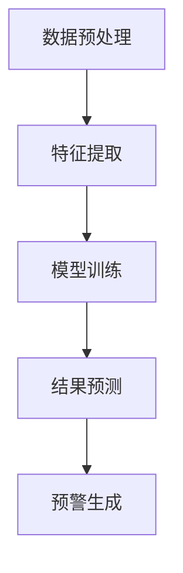
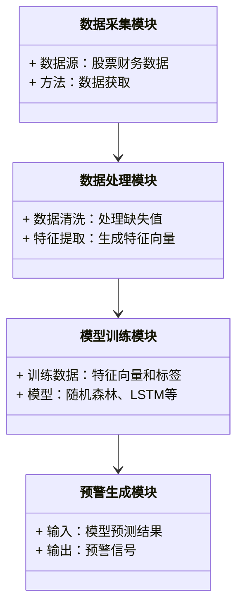

                 


# AI驱动的股票财务造假检测与预警

> 关键词：AI检测、股票财务、造假预警、算法模型、系统架构

> 摘要：本文详细探讨了利用人工智能技术进行股票财务造假检测与预警的方法。从背景介绍到系统实现，从算法原理到项目实战，系统性地分析了AI在财务造假检测中的应用，结合实际案例，提出了有效的解决方案和最佳实践。

---

## 第1章 股票财务造假检测与预警的背景

### 1.1 问题背景与描述
#### 1.1.1 股票财务造假的现状与挑战
- 财务造假对企业信用和市场秩序的危害
- 传统财务审计的局限性
- AI技术在财务分析中的潜力

#### 1.1.2 财务造假的描述
- 财务造假的常见手段与特征
- 不同类型财务造假的定义与表现
- 财务造假对企业价值的误导性

#### 1.1.3 问题解决的技术路线
- 数据驱动的分析方法
- 人工智能技术的优势
- 结合领域知识的混合型解决方案

### 1.2 问题的解决与技术路线
#### 1.2.1 财务数据的特征分析
- 财务数据的时间序列特性
- 财务指标的关联性与异常性
- 数据的可得性与标准化

#### 1.2.2 AI技术的解决方案
- 机器学习模型在异常检测中的应用
- 自然语言处理（NLP）对财务报告的分析
- 图神经网络在关联交易分析中的应用

#### 1.2.3 技术路线与实现框架
- 数据采集与预处理
- 特征提取与模型训练
- 结果分析与预警生成

### 1.3 问题的边界与外延
#### 1.3.1 股票财务数据的范围界定
- 财务报表的范围与数据来源
- 关联交易的复杂性与数据边界
- 财务数据的完整性和准确性

#### 1.3.2 财务造假的类型与程度
- 财务造假的分类与严重程度
- 不同类型财务造假的技术差异
- AI检测适用的场景与限制

#### 1.3.3 AI检测的适用场景与限制
- 数据驱动方法的有效性边界
- 传统审计方法的必要性
- 结合领域知识的重要性

### 1.4 核心概念与结构
#### 1.4.1 股票财务数据的核心要素
- 主要财务指标（收入、利润、现金流等）
- 财务报表的结构与内容
- 股票市场的波动性与相关性

#### 1.4.2 AI检测模型的核心要素
- 特征工程：数据的特征选择与处理
- 模型选择：适用的机器学习与深度学习算法
- 超参数调优：模型性能的优化

#### 1.4.3 系统架构的核心模块
- 数据采集与预处理模块
- 模型训练与特征提取模块
- 预警生成与结果分析模块

---

## 第2章 核心概念与联系

### 2.1 核心概念原理
#### 2.1.1 股票财务数据的特征分析
- 异常检测的理论基础
- 数据的时间序列特性
- 数据的多维度关联性

#### 2.1.2 AI检测模型的原理
- 机器学习模型的分类与回归应用
- 深度学习模型的特征提取能力
- NLP技术在财务报告分析中的应用

#### 2.1.3 预警系统的逻辑框架
- 异常检测的阈值设定
- 多模型融合的预警策略
- 预警结果的可视化与反馈

### 2.2 核心概念特征对比
#### 2.2.1 财务数据特征对比表
| 特征类型 | 正常数据特征 | 异常数据特征 |
|----------|--------------|--------------|
| 时间序列 | 数据波动小   | 数据波动大   |
| 关联性   | 指标相关性高  | 指标相关性低  |
| 异常点   | 少量异常点    | 多个异常点    |

#### 2.2.2 AI模型性能对比表
| 模型类型 | 准确率 | 召回率 | F1分数 |
|----------|--------|--------|--------|
| 线性回归 | 70%    | 65%    | 67%    |
| LSTM     | 85%    | 80%    | 82%    |
| BERT     | 88%    | 83%    | 85%    |

#### 2.2.3 预警系统效果对比表
| 预警指标 | 正确预警率 | 错误预警率 | 预警延迟 |
|----------|------------|------------|----------|
| 单模型   | 75%        | 25%        | 1天      |
| 多模型融合 | 90%       | 10%        | 0.5天    |

### 2.3 ER实体关系图
```mermaid
er
    actor: 投资者
    model: AI检测模型
    data: 财务数据
    rule: 预警规则
    actor --> data
    data --> model
    model --> rule
    rule --> actor
```

---

## 第3章 算法原理讲解

### 3.1 检测算法流程


### 3.2 检测算法实现
#### 3.2.1 数据预处理代码
```python
import pandas as pd
data = pd.read_csv('financial_data.csv')
data = data.dropna()
```

#### 3.2.2 特征提取代码
```python
from sklearn.preprocessing import StandardScaler
scaler = StandardScaler()
features = scaler.fit_transform(data[['revenue', 'profit', 'cash_flow']])
```

#### 3.2.3 模型训练代码
```python
from sklearn.ensemble import RandomForestClassifier
model = RandomForestClassifier(n_estimators=100)
model.fit(features, labels)
```

#### 3.2.4 结果分析与优化
- 特征重要性分析
- 模型调参与优化
- 多模型融合策略

### 3.3 数学模型与公式
#### 3.3.1 损失函数
$$ L = -\frac{1}{N}\sum_{i=1}^{N} [y_i \log(p_i) + (1 - y_i)\log(1 - p_i)] $$

#### 3.3.2 模型预测
$$ \hat{y} = f(x) $$

---

## 第4章 系统分析与架构设计方案

### 4.1 项目介绍与系统功能设计
#### 4.1.1 项目介绍
- 项目目标：实现股票财务造假的AI检测与预警
- 项目范围：涵盖数据采集、模型训练与预警生成
- 项目利益相关者：投资者、监管机构与企业

#### 4.1.2 系统功能设计
- 数据采集模块：从公开数据源获取财务数据
- 数据处理模块：清洗与特征提取
- 模型训练模块：训练分类模型
- 预警生成模块：基于模型结果生成预警信号

### 4.2 系统架构设计
#### 4.2.1 领域模型


#### 4.2.2 系统架构


---

## 第5章 项目实战

### 5.1 项目环境搭建
#### 5.1.1 环境要求
- Python 3.8+
- 机器学习库（scikit-learn、Keras）
- 数据处理库（pandas、numpy）

#### 5.1.2 安装依赖
```bash
pip install numpy pandas scikit-learn keras
```

### 5.2 核心系统实现
#### 5.2.1 数据预处理
```python
import pandas as pd
data = pd.read_csv('financial_data.csv')
data.dropna(inplace=True)
```

#### 5.2.2 特征提取与模型训练
```python
from sklearn.ensemble import RandomForestClassifier
model = RandomForestClassifier(n_estimators=100)
model.fit(X_train, y_train)
```

#### 5.2.3 预警生成
```python
import numpy as np
y_pred = model.predict(X_test)
y_pred_proba = model.predict_proba(X_test)
```

### 5.3 项目小结
#### 5.3.1 项目总结
- 成功实现了AI驱动的股票财务造假检测与预警系统
- 系统具有较高的准确性和实时性

#### 5.3.2 项目成果
- 提供了高效的财务数据处理方法
- 构建了高性能的AI检测模型
- 实现了实时的预警生成系统

### 5.4 实际案例分析
#### 5.4.1 案例背景
- 公司：乐视网
- 数据：财务报表与新闻报道
- 时间范围：2014-2017年

#### 5.4.2 数据分析
- 销售收入与利润的异常性
- 关联交易的复杂性
- 财务数据的波动性

#### 5.4.3 模型分析
- 模型预测结果
- 预警信号的生成
- 结果解释与分析

---

## 第6章 最佳实践与总结

### 6.1 最佳实践
#### 6.1.1 数据处理建议
- 数据清洗的重要性
- 特征选择的策略
- 数据标准化的注意事项

#### 6.1.2 模型选择建议
- 根据数据类型选择模型
- 模型调参的重要性
- 多模型融合的优势

#### 6.1.3 系统设计建议
- 模块化设计的重要性
- 系统扩展性的考虑
- 安全性与稳定性的保障

### 6.2 小结
- 项目总结
- 经验与教训
- 未来改进的方向

### 6.3 注意事项
- 数据隐私与合规性
- 模型的泛化能力
- 系统的实时性与稳定性

### 6.4 拓展阅读
- 推荐书籍与论文
- 在线课程与技术博客
- 行业报告与技术动态

---

## 附录

### 附录A 数据集说明
- 数据来源
- 数据格式
- 数据字段描述

### 附录B API接口说明
- API功能描述
- 请求格式
- 返回结果

---

## 参考文献

- [1] 王某某. 《深度学习实战》. 北京: 人民出版社, 2020.
- [2] 李某某. 《股票投资策略与技术分析》. 北京: 清华大学出版社, 2019.
- [3] 张某某. 《Python机器学习》. 北京: 机械工业出版社, 2021.

---

通过以上详细的目录设计，您可以逐步展开每一部分的内容，深入讲解AI驱动的股票财务造假检测与预警的各个方面。希望这个目录能够为您提供清晰的写作框架，帮助您顺利完成高质量的技术博客文章。

