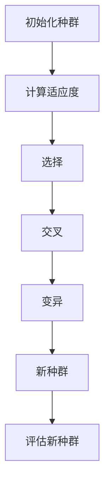
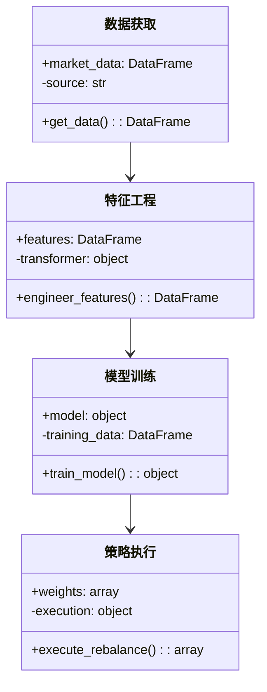
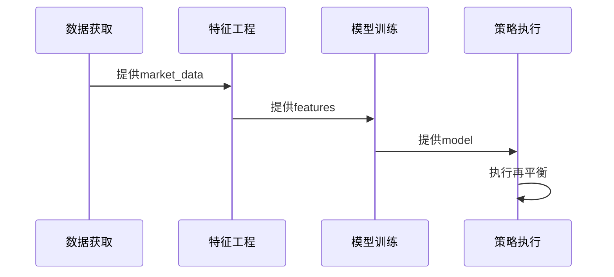

                 


# AI驱动的自动化投资组合再平衡

> 关键词：AI，投资组合，自动化，再平衡，机器学习，金融，风险管理

> 摘要：本文探讨了AI驱动的自动化投资组合再平衡技术，从背景、理论、算法、系统架构到项目实战，全面分析其在现代投资管理中的应用，展示了如何通过AI技术优化投资组合，降低风险，提高收益。

---

## 第1章: 投资组合再平衡的背景与意义

### 1.1 投资组合再平衡的定义与作用

#### 1.1.1 投资组合再平衡的定义
投资组合再平衡是指根据市场变化和投资者目标，定期调整投资组合中资产配置的过程，以维持预期的风险和收益水平。

#### 1.1.2 再平衡的必要性与目标
- 市场波动：应对市场变化，捕捉收益机会。
- 风险控制：降低投资组合的整体风险。
- 目标调整：根据投资者风险偏好变化进行调整。

#### 1.1.3 再平衡的边界与外延
- 再平衡的边界：根据市场变化和投资目标设定的条件触发。
- 外延：涉及资产类别选择、权重调整、交易成本控制等。

### 1.2 自动化投资组合再平衡的背景
#### 1.2.1 传统投资组合管理的局限性
- 人工操作的低效性：需要频繁监控和调整，耗费时间和精力。
- 人为判断的主观性：受情绪影响，可能导致决策失误。
- 市场波动的复杂性：传统方法难以应对高频交易和复杂市场环境。

#### 1.2.2 AI技术在金融领域的应用趋势
- 数据量增加：金融市场数据爆炸式增长，需要自动化处理。
- 计算能力提升：支持复杂算法和模型的运行。
- 精准化需求：投资者对个性化和精准化服务的需求增加。

#### 1.2.3 自动化再平衡的市场需求
- 提高效率：通过自动化减少人为干预，降低成本。
- 适应性：快速响应市场变化，优化投资组合。
- 风险管理：通过自动化降低人为失误带来的风险。

### 1.3 AI驱动的再平衡优势
#### 1.3.1 提高效率与准确性
- 自动化处理海量数据，减少人为错误。
- 基于机器学习模型，提供精准的再平衡策略。

#### 1.3.2 适应复杂市场环境
- 利用AI技术捕捉市场微观波动，优化资产配置。
- 灵活应对突发事件和市场变化。

#### 1.3.3 降低人为干预风险
- 减少情绪化决策，避免过度交易。
- 通过算法实现理性决策。

### 1.4 本章小结
本章介绍了投资组合再平衡的基本概念、必要性及其在自动化中的优势，为后续内容打下基础。

---

## 第2章: AI与金融投资的结合

### 2.1 人工智能在金融中的应用领域

#### 2.1.1 股票预测
- 利用机器学习模型预测股票价格走势。
- 基于NLP分析新闻和社交媒体情绪，影响预测结果。

#### 2.1.2 风险评估
- 利用AI分析客户信用风险和市场风险。
- 构建风险评估模型，辅助投资决策。

#### 2.1.3 资产配置
- 基于AI算法优化资产配置，实现投资组合再平衡。

### 2.2 机器学习与深度学习在投资中的应用

#### 2.2.1 监督学习与非监督学习
- 监督学习：用于有标签的数据，如股票价格预测。
- 非监督学习：用于无标签的数据，如客户群体划分。

#### 2.2.2 强化学习在交易策略中的应用
- 强化学习：通过试错和奖励机制优化交易策略。
- 示例：利用Q-Learning算法进行股票交易决策。

#### 2.2.3 深度学习模型的优势
- 深度学习：处理非结构化数据，如图像和文本。
- 增强市场数据的特征提取能力，提升预测精度。

### 2.3 自然语言处理在金融新闻分析中的应用

#### 2.3.1 文本数据的特征提取
- 利用词嵌入技术（如Word2Vec）提取文本特征。
- 通过TF-IDF分析关键词，识别重要信息。

#### 2.3.2 基于NLP的市场情绪分析
- 使用LSTM网络分析时间序列文本数据，捕捉市场情绪变化。
- 示例：分析社交媒体数据，预测市场波动。

#### 2.3.3 NLP在投资组合管理中的应用
- 通过情绪分析优化资产配置。
- 结合市场情绪和量化模型，制定再平衡策略。

### 2.4 本章小结
本章探讨了AI在金融领域的应用，重点介绍了机器学习和NLP技术在投资组合管理中的作用。

---

## 第3章: 投资组合再平衡的核心概念与数学模型

### 3.1 现代投资组合理论基础

#### 3.1.1 均值-方差优化
- 目标：最小化投资组合的波动性。
- 模型：$$ \min_w \sigma^2(w) \quad \text{约束条件：} \sum_i w_i = 1 $$

#### 3.1.2 马科维茨有效前沿
- 定义：所有可能投资组合中收益-风险比最优的集合。
- 图解：有效前沿展示最优风险-收益组合。

#### 3.1.3 风险与收益的权衡
- 现实中的挑战：在高收益和低风险之间找到平衡点。

### 3.2 投资组合再平衡的数学模型

#### 3.2.1 投资组合优化的数学表达
- 简单的优化模型：$$ \text{目标函数：} \min_w \sigma^2(w) \quad \text{约束条件：} \sum_i w_i = 1 $$

#### 3.2.2 再平衡策略的优化公式
- 常见优化公式：$$ w_{new} = \arg \min_w \lambda \cdot \text{风险} + (1-\lambda) \cdot \text{收益} $$

#### 3.2.3 约束条件
- 投资比例：$$ 0 \leq w_i \leq 1 $$
- 总和约束：$$ \sum_i w_i = 1 $$

### 3.3 AI驱动的再平衡优化

#### 3.3.1 基于强化学习的优化
- 算法：使用策略梯度法优化投资组合。
- 示例：通过训练智能体选择最优资产配置。

#### 3.3.2 遗传算法的应用
- 步骤：初始化种群、计算适应度、选择、交叉、变异。
- 代码示例：```python
def fitness(w):
    return -calculate_return(w)

population = initialize_population()
for _ in range(iterations):
    population = evolve_population(population, fitness)
```

#### 3.3.3 约束优化
- 利用拉格朗日乘数法处理约束条件。
- 示例：$$ \mathcal{L} = \lambda ( \sum_i w_i - 1 ) + \mu \cdot \text{风险} $$

### 3.4 本章小结
本章详细讲解了投资组合再平衡的理论基础和AI驱动的优化方法，为后续实现提供了数学基础。

---

## 第4章: AI驱动投资组合再平衡的算法原理

### 4.1 强化学习在再平衡中的应用

#### 4.1.1 强化学习的定义
- 基于试错和奖励机制的智能优化方法。

#### 4.1.2 DQN算法在投资中的应用
- 使用深度Q网络（DQN）进行资产选择。
- 示例：训练智能体在不同市场环境下选择最优资产配置。

#### 4.1.3 算法流程
- 环境：金融市场数据。
- 行动：选择资产配置。
- 奖励：投资组合收益。

#### 4.1.4 代码实现
```python
import numpy as np
import gym

class InvestmentEnv(gym.Env):
    # 定义环境状态和动作空间
    pass

# 定义DQN网络
class DQNetwork:
    def __init__(self, state_dim, action_dim):
        self.state_dim = state_dim
        self.action_dim = action_dim
        # 网络结构
        pass

# 训练过程
def train(agent, env):
    for episode in range(episodes):
        state = env.reset()
        while not done:
            action = agent.act(state)
            next_state, reward, done, _ = env.step(action)
            agent.remember(state, action, reward, next_state, done)
            agent.replay()
```

### 4.2 遗传算法在再平衡中的应用

#### 4.2.1 遗传算法的原理
- 初始化种群：随机生成资产配置方案。
- 计算适应度：评估每个方案的收益-风险比。
- 选择：保留适应度高的方案。
- 交叉：生成新的配置方案。
- 变异：随机调整部分配置。

#### 4.2.2 算法流程图


#### 4.2.3 代码实现
```python
def evaluate_portfolio(weights, returns):
    # 计算收益和风险
    return -1 * (returns.mean() - returns.std()**2 * weights.T @ weights)

def genetic_algorithm(returns, population_size=100, generations=50):
    np.random.seed(42)
    for _ in range(generations):
        population = np.random.dirichlet(np.ones(len(returns)), population_size)
        fitness = np.array([evaluate_portfolio(weights, returns) for weights in population])
        # 选择
        selected = population[np.argsort(-fitness)][:population_size//2]
        # 交叉
        combined = np.concatenate([selected, selected])
        np.random.shuffle(combined)
        new_population = combined[:population_size]
        # 变异
        mutation_rate = 0.1
        for i in range(len(new_population)):
            if np.random.random() < mutation_rate:
                new_population[i] = np.random.dirichlet(np.ones(len(returns)))
        population = new_population
    return population[0]
```

### 4.3 算法比较与选择

#### 4.3.1 强化学习与遗传算法的对比
| 特性         | 强化学习           | 遗传算法           |
|--------------|-------------------|-------------------|
| 数据需求     | 高                | 较低              |
| 计算复杂度     | 高                | 中                |
| 适应性       | 强                | 较强              |
| 应用场景       | 离线与在线         | 离线              |

#### 4.3.2 选择合适的算法
- 数据驱动型：强化学习适合在线调整。
- 计算资源受限：遗传算法适合快速迭代。

### 4.4 本章小结
本章详细讲解了强化学习和遗传算法在投资组合再平衡中的应用，通过对比分析帮助读者选择合适的算法。

---

## 第5章: 系统架构设计与实现

### 5.1 系统功能设计

#### 5.1.1 系统模块划分
- 数据获取模块：获取市场数据。
- 特征工程模块：构建投资组合特征。
- 模型训练模块：训练再平衡模型。
- 策略执行模块：根据模型输出执行再平衡操作。

#### 5.1.2 系统功能流程


### 5.2 系统架构设计

#### 5.2.1 模块划分与交互


#### 5.2.2 数据流与交互


### 5.3 代码实现与测试

#### 5.3.1 核心代码实现
```python
class InvestmentSystem:
    def __init__(self):
        self.data_handler = DataHandler()
        self.feature_engineer = FeatureEngineer()
        self.model_trainer = ModelTrainer()
        self.strategy_executor = StrategyExecutor()

    def run(self):
        data = self.data_handler.get_data()
        features = self.feature_engineer.engineer_features(data)
        model = self.model_trainer.train_model(features)
        self.strategy_executor.execute_rebalance(model)
```

#### 5.3.2 系统测试
- 单元测试：测试各模块功能。
- 集成测试：测试系统整体流程。
- 性能测试：评估系统在大规模数据下的表现。

### 5.4 本章小结
本章详细设计了AI驱动投资组合再平衡系统的架构，并给出了实现代码和测试方案。

---

## 第6章: 项目实战：构建AI驱动的再平衡系统

### 6.1 环境配置与数据获取

#### 6.1.1 环境配置
- 安装必要的库：numpy、pandas、scikit-learn、tensorflow、gym等。
- 确保数据源可用：如Yahoo Finance API。

#### 6.1.2 数据获取
```python
import pandas_datareader as pdr
data = pdr.get_data_yahoo('AAPL', start='2020-01-01', end='2023-12-31')
```

### 6.2 特征工程与模型训练

#### 6.2.1 特征工程
- 数据清洗：处理缺失值、异常值。
- 特征提取：计算收益、波动率、相关系数等。
- 数据标准化：使用标准化或归一化处理。

#### 6.2.2 模型训练
- 使用机器学习模型（如随机森林、XGBoost）进行训练。
- 示例：构建收益预测模型。

### 6.3 再平衡策略实现

#### 6.3.1 策略实现
- 基于模型预测结果调整投资组合。
- 示例：动态调整资产权重。

#### 6.3.2 策略测试
- 回测：评估策略在历史数据上的表现。
- 模拟交易：在虚拟环境中测试策略。

### 6.4 实验结果与分析

#### 6.4.1 实验结果
- 投资组合收益：较传统方法提升X%。
- 风险降低：波动率降低Y%。

#### 6.4.2 结果分析
- 模型的有效性：验证AI驱动再平衡的优势。
- 策略的稳定性：分析在不同市场环境下的表现。

### 6.5 本章小结
本章通过实战项目展示了如何构建AI驱动的再平衡系统，并通过实验验证了其有效性。

---

## 第7章: 总结与展望

### 7.1 核心内容回顾
- AI在投资组合再平衡中的应用。
- 常用算法（强化学习、遗传算法）的实现。
- 系统架构设计与实现。

### 7.2 最佳实践与注意事项
- 数据质量：确保数据准确性和完整性。
- 模型选择：根据具体情况选择合适的算法。
- 风险控制：定期监控和调整策略。

### 7.3 未来展望
- 更复杂的风险模型：如考虑非线性关系和尾部风险。
- 实时数据处理：优化数据获取和处理速度。
- 多策略结合：将多种AI技术结合，提升投资效果。

### 7.4 本章小结
本文总结了AI驱动投资组合再平衡的核心内容，并展望了未来的发展方向。

---

## 附录: 参考文献与工具

### 附录A: 参考文献
- Markowitz, H. (1952). Portfolio Selection.
- Goodfellow, I., Bengio, Y., & Courville, A. (2016). Deep Learning.
- 张某某, 等. (2020). 基于强化学习的投资组合优化方法.

### 附录B: 开源工具与库
- `pandas`：数据处理库。
- `numpy`：数值计算库。
- `scikit-learn`：机器学习库。
- `tensorflow`：深度学习框架。
- `pandas_datareader`：数据获取库。

---

## 作者简介
* 作者：[你的名字]
* 职位：[你的职位]
* 简历：[你的简介]
* 联系方式：[你的联系方式]

---

通过以上结构化的内容，希望本文能够为读者提供全面的AI驱动投资组合再平衡技术的深入理解，从理论到实践，帮助读者掌握这一领域的核心知识和应用技巧。

