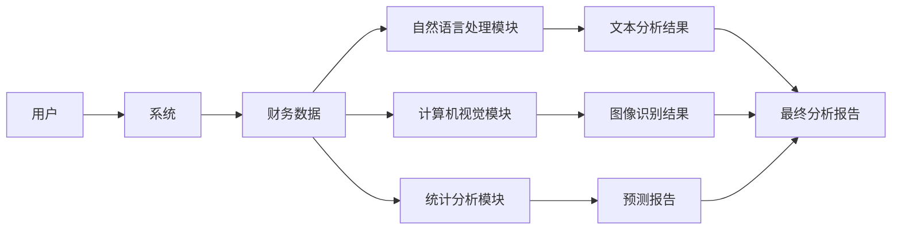
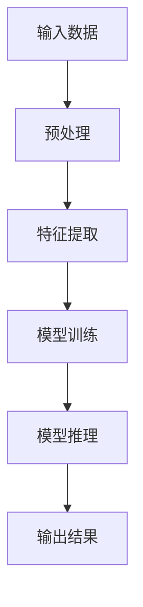

                 


# AI驱动的自动化财报分析系统

> 关键词：AI，自动化财报分析，自然语言处理，计算机视觉，财务数据分析，机器学习

> 摘要：本文详细探讨了AI驱动的自动化财报分析系统的设计与实现，从背景介绍到系统架构，从算法原理到项目实战，全面解析了如何利用AI技术提升财务数据分析的效率与准确性。通过自然语言处理、计算机视觉和统计分析的结合，本文展示了如何构建一个智能化的财报分析系统，并通过实际案例分析验证了系统的有效性。

---

## 第一部分: AI驱动的自动化财报分析系统概述

### 第1章: AI驱动的自动化财报分析系统背景

#### 1.1 问题背景与描述
随着企业规模的不断扩大和业务复杂性的增加，传统的财务报表分析方式已经难以满足高效、准确的需求。财务报表作为企业经营状况的重要反映，其分析需要依赖大量的数据处理、模式识别和预测能力。然而，传统的分析方法依赖人工操作，效率低、易出错，难以应对海量数据的挑战。

AI技术的快速发展为财务数据分析带来了新的机遇。通过自然语言处理（NLP）、计算机视觉（CV）和机器学习等技术，可以实现财务报表的自动化分析。AI驱动的自动化财报分析系统能够快速提取关键信息、识别潜在风险、生成预测报告，从而帮助企业做出更明智的决策。

#### 1.2 问题解决与边界
AI驱动的自动化财报分析系统的目标是通过技术手段解决传统财务分析中的痛点，包括：
- **数据处理效率低**：AI可以快速处理大量非结构化和半结构化的财务数据。
- **分析结果不准确**：通过机器学习模型，系统能够减少人为错误，提高分析的准确性。
- **缺乏预测能力**：结合统计分析和预测模型，系统可以提供趋势分析和未来预测。

系统的边界包括：
- 输入：结构化和非结构化的财务数据，包括文本、表格和图表。
- 输出：结构化的财务分析结果，包括关键指标、趋势分析和预测报告。
- 边界外延：不涉及企业的具体业务决策，但可以为决策提供数据支持。

#### 1.3 核心概念与联系
AI驱动的自动化财报分析系统的核心概念包括：
- **自然语言处理（NLP）**：用于处理财务报告中的文本数据，提取关键信息。
- **计算机视觉（CV）**：用于识别和解析财务报表中的表格和图表。
- **统计分析与预测模型**：用于分析财务数据，生成预测报告。

系统的实体关系图如下：


---

### 第2章: AI驱动的自动化财报分析系统核心概念

#### 2.1 核心概念原理
- **自然语言处理（NLP）**：用于处理财务报告中的文本数据，例如公司公告、财务说明等。通过分词、实体识别和情感分析等技术，提取关键信息。
- **计算机视觉（CV）**：用于识别和解析财务报表中的表格和图表。例如，识别表格中的数字、单元格和行列关系。
- **统计分析与预测模型**：用于分析财务数据，生成预测报告。例如，使用时间序列分析预测公司的 revenue 增长趋势。

#### 2.2 核心概念属性特征对比
下表展示了不同AI技术在财务分析中的应用对比：

| 技术 | 应用场景 | 优缺点 | 适用性 |
|------|----------|--------|--------|
| NLP  | 文本分析 | 高效、准确 | 需要大量标注数据 |
| CV   | 图像识别 | 快速、精准 | 对图像质量要求高 |
| 统计分析 | 数据预测 | 稳定、可靠 | 需要历史数据支持 |

#### 2.3 实体关系图


---

### 第3章: AI驱动的自动化财报分析系统算法原理

#### 3.1 算法原理概述
- **BERT模型**：用于文本分析，通过预训练和微调，提取财务文本中的关键信息。
- **CNN模型**：用于图像识别，通过卷积操作提取财务报表中的特征。
- **统计分析模型**：用于时间序列分析，预测财务指标的变化趋势。

#### 3.2 算法流程图


#### 3.3 算法实现代码
```python
import tensorflow as tf
from tensorflow.keras import layers

# BERT模型定义
def bert_model():
    input_ids = layers.Input(shape=(m
    # 其他层略...
    return model

# CNN模型定义
def cnn_model():
    input_layer = layers.Input(shape=(height, width, channels))
    conv_layer = layers.Conv2D(filters=32, kernel_size=(3,3), activation='relu')(input_layer)
    pooling_layer = layers.MaxPooling2D(pool_size=(2,2))(conv_layer)
    flatten_layer = layers.Flatten()(pooling_layer)
    dense_layer = layers.Dense(128, activation='relu')(flatten_layer)
    output_layer = layers.Dense(num_classes, activation='softmax')(dense_layer)
    return Model(inputs=input_layer, outputs=output_layer)
```

---

### 第4章: AI驱动的自动化财报分析系统系统架构设计

#### 4.1 系统功能设计
- **数据输入模块**：接收结构化和非结构化的财务数据。
- **数据处理模块**：对数据进行清洗和预处理。
- **分析模块**：包括NLP、CV和统计分析模块。
- **输出模块**：生成结构化的分析结果和预测报告。

#### 4.2 系统架构图


---

### 第5章: AI驱动的自动化财报分析系统项目实战

#### 5.1 环境安装
```bash
pip install tensorflow numpy pandas matplotlib
```

#### 5.2 系统核心实现
```python
# 数据预处理
def preprocess_data(data):
    # 处理文本数据
    text_data = data['text'].apply(lambda x: x.lower())
    # 处理图像数据
    image_data = data['image'].apply(lambda x: x.resize(224, 224))
    return text_data, image_data

# BERT模型训练
def train_bert_model(train_data):
    model = bert_model()
    model.compile(optimizer='adam', loss='sparse_categorical_crossentropy', metrics=['accuracy'])
    model.fit(train_data, epochs=10, batch_size=32)
    return model

# CNN模型训练
def train_cnn_model(train_data):
    model = cnn_model()
    model.compile(optimizer='adam', loss='binary_crossentropy', metrics=['accuracy'])
    model.fit(train_data, epochs=10, batch_size=32)
    return model
```

#### 5.3 实际案例分析
```python
# 加载数据
data = pd.read_csv('financial_data.csv')

# 数据预处理
text_data, image_data = preprocess_data(data)

# 训练模型
bert_model = train_bert_model(text_data)
cnn_model = train_cnn_model(image_data)

# 生成报告
report = generate_report(bert_model, cnn_model)
print(report)
```

---

### 第6章: AI驱动的自动化财报分析系统高级主题与未来展望

#### 6.1 模型优化
- **超参数调优**：通过网格搜索优化模型性能。
- **模型融合**：结合多种模型的结果，提高预测精度。

#### 6.2 行业应用
- **金融行业**：用于股票分析和市场预测。
- **企业内部**：用于内部财务审计和预算管理。

#### 6.3 未来展望
- **多模态分析**：结合文本、图像和结构化数据，提升分析能力。
- **实时分析**：实现财务数据的实时处理和分析。

---

## 结语
AI驱动的自动化财报分析系统通过结合自然语言处理、计算机视觉和统计分析，为财务数据分析提供了新的解决方案。随着技术的不断进步，未来的系统将更加智能化、自动化，为企业决策提供更强大的支持。

