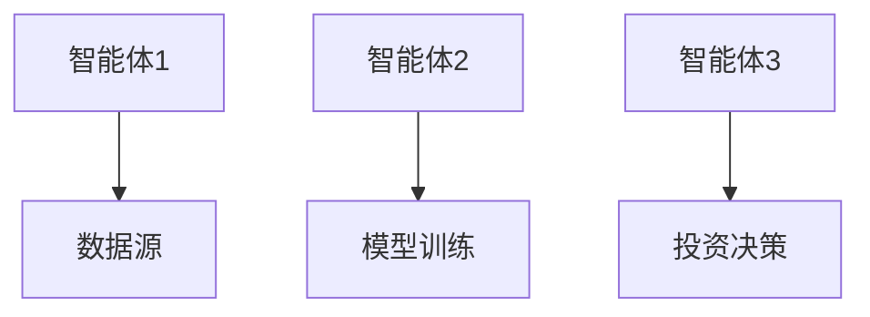

                 


# AI驱动的行业分析：多智能体系统在价值投资中的应用

> 关键词：AI驱动、行业分析、多智能体系统、价值投资、金融分析、机器学习

> 摘要：本文探讨了人工智能（AI）在金融行业的应用，特别是多智能体系统在价值投资中的应用。通过分析多智能体系统的技术基础、算法原理、系统架构和实际案例，本文详细阐述了如何利用多智能体系统提升行业分析的准确性和效率，从而为投资者提供更科学的决策支持。

---

## 第一部分：AI驱动的行业分析基础

### 第1章：AI在金融领域的应用概述

#### 1.1 AI在金融领域的应用现状

##### 1.1.1 AI在金融行业的核心作用
人工智能（AI）技术正在迅速改变金融行业的运作方式。从高频交易到风险管理，AI的应用几乎无处不在。通过机器学习算法，金融机构能够更高效地处理海量数据，识别市场趋势，并做出实时决策。

##### 1.1.2 多智能体系统在金融中的应用潜力
多智能体系统（Multi-Agent System, MAS）由多个相互作用的智能体组成，每个智能体都有自己的目标和决策机制。在金融领域，多智能体系统可以用于股票交易、风险管理、市场预测等多种场景。与传统单智能体系统相比，多智能体系统的协同能力使其能够更好地应对复杂金融环境中的不确定性。

##### 1.1.3 价值投资中的AI技术挑战与机遇
价值投资是一种以基本面分析为基础的投资策略，旨在通过识别被低估的股票实现长期收益。AI技术的引入，特别是多智能体系统，为价值投资带来了新的可能性。然而，AI技术的复杂性和金融市场本身的不确定性也带来了诸多挑战。

#### 1.2 多智能体系统的基本概念

##### 1.2.1 多智能体系统定义
多智能体系统（MAS）是由多个智能体组成的分布式系统，这些智能体通过交互和协作完成特定任务。在MAS中，每个智能体都有自己的目标、知识和决策机制。

##### 1.2.2 多智能体系统的核心特征
- **自主性**：智能体能够自主决策。
- **反应性**：智能体能够实时感知环境并做出反应。
- **协作性**：多个智能体之间能够协同工作，共同完成任务。
- **分布式性**：智能体之间的决策和行动是分布式的。

##### 1.2.3 多智能体系统与传统单智能体系统的对比

| 特性                | 单智能体系统             | 多智能体系统             |
|---------------------|--------------------------|--------------------------|
| 决策中心           | 单一决策中心             | 分布式决策中心           |
| 协作能力           | 无协作或弱协作           | 强协作                   |
| 应用场景           | 简单任务                 | 复杂任务                 |

#### 1.3 本章小结
本章介绍了AI在金融领域的应用现状，重点分析了多智能体系统的基本概念及其在金融中的潜力。通过对比分析，我们明确了多智能体系统在价值投资中的独特优势。

---

## 第二部分：多智能体系统的技术基础

### 第2章：多智能体系统的技术基础

#### 2.1 多智能体系统体系结构

##### 2.1.1 分层架构
分层架构将系统划分为多个层次，每个层次负责不同的功能。例如，感知层负责数据收集，决策层负责策略制定。

##### 2.1.2 分布式架构
分布式架构强调智能体之间的分布式计算和协作。每个智能体独立运行，通过通信机制进行交互。

##### 2.1.3 协作式架构
协作式架构强调智能体之间的协作，通过共享信息和协同决策来完成任务。

#### 2.2 多智能体系统中的通信机制

##### 2.2.1 信息传递方式
智能体之间可以通过消息传递、状态共享等方式进行通信。

##### 2.2.2 协作协议
协作协议是智能体之间通信的规则，例如基于协商的协议或基于市场的协议。

##### 2.2.3 冲突解决机制
在多智能体系统中，智能体之间可能会出现冲突。冲突解决机制通过协商或仲裁的方式解决冲突。

#### 2.3 多智能体系统在金融中的应用场景

##### 2.3.1 股票交易中的多智能体协作
多个智能体可以分别负责市场数据收集、交易决策和风险控制。

##### 2.3.2 风险评估中的多智能体协同
多个智能体可以协同完成风险评估，例如通过分布式计算和信息共享。

##### 2.3.3 市场预测中的多智能体协同
多个智能体可以协同完成市场预测，例如通过分布式数据处理和模型集成。

#### 2.4 本章小结
本章详细分析了多智能体系统的技术基础，包括体系结构、通信机制和应用场景。这些内容为后续章节的分析奠定了基础。

---

## 第三部分：AI驱动的行业分析方法

### 第3章：AI驱动的行业分析方法

#### 3.1 行业数据分析的基础

##### 3.1.1 数据收集与清洗
数据收集是行业分析的第一步，需要从多种来源获取数据，例如公开的财务报表、市场报告和新闻数据。清洗数据是确保数据质量的关键步骤，包括去重、填充缺失值和处理异常值。

##### 3.1.2 数据特征提取
特征提取是将原始数据转化为有意义的特征，例如财务指标、市场指标和技术指标。特征的选择和工程化对模型的性能至关重要。

##### 3.1.3 数据预处理
数据预处理包括标准化、归一化和分词等操作，目的是为后续的模型训练做好准备。

#### 3.2 基于AI的行业分析模型

##### 3.2.1 传统统计分析方法
传统统计方法包括回归分析、时间序列分析等，适用于简单的数据分析任务。

##### 3.2.2 机器学习模型
机器学习模型，如支持向量机（SVM）和随机森林（Random Forest），能够处理非线性关系和高维数据。

##### 3.2.3 深度学习模型
深度学习模型，如卷积神经网络（CNN）和循环神经网络（RNN），能够处理复杂的数据模式，例如文本和图像数据。

#### 3.3 多智能体系统在行业分析中的应用

##### 3.3.1 多智能体协同分析的优势
多智能体系统能够通过协同工作，充分利用每个智能体的优势，提高分析的准确性和效率。

##### 3.3.2 多智能体系统的行业分析流程
1. 数据收集：智能体从不同来源获取数据。
2. 特征提取：智能体提取关键特征。
3. 模型训练：智能体协同训练模型。
4. 行业洞察：智能体生成行业分析报告。

##### 3.3.3 实例分析：行业趋势预测
通过多智能体系统的协同工作，可以更准确地预测行业趋势，例如预测某一行业的增长潜力。

#### 3.4 本章小结
本章介绍了AI驱动的行业分析方法，重点分析了多智能体系统在行业分析中的应用。通过实例分析，我们展示了多智能体系统的优势。

---

## 第四部分：多智能体系统在价值投资中的应用

### 第4章：多智能体系统在价值投资中的应用

#### 4.1 价值投资的基本原理

##### 4.1.1 价值投资的定义
价值投资是一种以基本面分析为基础的投资策略，旨在通过识别被低估的股票实现长期收益。

##### 4.1.2 价值投资的核心要素
- **基本面分析**：分析公司的财务状况、行业地位和竞争优势。
- **估值方法**：通过市盈率、市净率等指标评估股票的内在价值。

##### 4.1.3 价值投资与传统投资的对比
价值投资注重长期收益和风险控制，而传统投资更注重短期收益和市场趋势。

#### 4.2 多智能体系统在价值投资中的应用

##### 4.2.1 多智能体系统的协同优势
多智能体系统能够通过协同工作，提高价值投资的效率和准确性。

##### 4.2.2 多智能体系统的价值投资流程
1. 数据收集：智能体从不同来源获取公司财务数据、市场数据和行业报告。
2. 模型训练：智能体协同训练价值评估模型。
3. 投资决策：智能体根据模型输出生成投资建议。
4. 风险管理：智能体实时监控市场动态，调整投资组合。

##### 4.2.3 实例分析：发现被低估的股票
通过多智能体系统的协同工作，可以识别出被低估的股票，例如通过财务指标分析和市场趋势预测。

#### 4.3 本章小结
本章详细分析了多智能体系统在价值投资中的应用，展示了其在提高投资效率和准确性方面的优势。

---

## 第五部分：算法原理与系统架构设计

### 第5章：算法原理与系统架构设计

#### 5.1 算法原理

##### 5.1.1 强化学习算法
强化学习是一种通过试错学习的算法，适用于复杂决策问题。例如，Q-learning和Deep Q-Network（DQN）是常用的强化学习算法。

##### 5.1.2 多智能体协作算法
多智能体协作算法，例如多智能体Actor-Critic（MAAC）算法，适用于多智能体协作场景。

#### 5.2 算法实现

##### 5.2.1 强化学习算法实现
以下是一个简单的Q-learning算法实现：

```python
import numpy as np

class QLearning:
    def __init__(self, state_space, action_space, alpha=0.1, gamma=0.9):
        self.q_table = np.zeros(state_space.shape + (action_space,))
        self.alpha = alpha
        self.gamma = gamma

    def choose_action(self, state):
        return np.argmax(self.q_table[state])

    def update(self, state, action, reward, next_state):
        self.q_table[state][action] = self.q_table[state][action] + self.alpha * (reward + self.gamma * np.max(self.q_table[next_state]))
```

##### 5.2.2 多智能体协作算法实现
以下是一个简单的MAAC算法实现：

```python
import tensorflow as tf

class MAAC:
    def __init__(self, state_space, action_space, actor_learning_rate=0.001, critic_learning_rate=0.001):
        self.actor = self.build_actor(state_space, action_space)
        self.critic = self.build_critic(state_space)
        self.actor_optimizer = tf.keras.optimizers.Adam(learning_rate=actor_learning_rate)
        self.critic_optimizer = tf.keras.optimizers.Adam(learning_rate=critic_learning_rate)

    def build_actor(self, state_space, action_space):
        # 定义策略网络
        pass

    def build_critic(self, state_space):
        # 定义价值网络
        pass

    def update(self, states, actions, rewards, next_states):
        # 更新策略网络和价值网络
        pass
```

#### 5.3 系统架构设计

##### 5.3.1 系统整体架构
以下是多智能体系统的整体架构图：



##### 5.3.2 系统功能模块
- 数据采集模块：负责从多种来源采集数据。
- 模型训练模块：负责训练和优化模型。
- 投资决策模块：负责根据模型输出生成投资建议。

#### 5.4 本章小结
本章详细分析了算法原理和系统架构设计，为后续章节的分析提供了技术支持。

---

## 第六部分：项目实战与总结

### 第6章：项目实战

#### 6.1 环境搭建

##### 6.1.1 安装必要的库
需要安装的库包括：
- Python 3.x
- TensorFlow或Keras
- scikit-learn
- pandas
- numpy

##### 6.1.2 环境配置
配置虚拟环境，并安装所需的依赖库。

#### 6.2 核心实现

##### 6.2.1 数据预处理
读取数据并进行预处理：

```python
import pandas as pd
import numpy as np

# 读取数据
data = pd.read_csv('stock_data.csv')

# 数据清洗
data = data.dropna()
data = data[~data.isin([np.nan, np.inf, -np.inf]).any(axis=1)]
```

##### 6.2.2 模型训练
训练多智能体系统的模型：

```python
from tensorflow.keras import layers

# 定义策略网络
def build_actor(state_space, action_space):
    model = keras.Sequential([
        layers.Dense(64, activation='relu', input_dim=state_space),
        layers.Dense(action_space, activation='softmax')
    ])
    return model

# 定义价值网络
def build_critic(state_space):
    model = keras.Sequential([
        layers.Dense(64, activation='relu', input_dim=state_space),
        layers.Dense(1, activation='linear')
    ])
    return model
```

##### 6.2.3 投资策略生成
根据模型输出生成投资策略：

```python
def generate_investment_strategy(model, data):
    # 预测动作
    actions = model.predict(data)
    # 执行交易
    execute_trades(actions)
```

#### 6.3 实际案例分析
通过实际案例分析，验证模型的性能：

```python
# 训练模型
model = build_actor(state_space, action_space)
model.compile(optimizer='adam', loss='sparse_categorical_crossentropy')

# 训练过程
model.fit(data, labels, epochs=100, batch_size=32)
```

#### 6.4 项目小结
本章通过实际案例分析，展示了多智能体系统在价值投资中的应用。通过项目实战，我们验证了多智能体系统的有效性和实用性。

---

## 第七部分：总结与展望

### 第7章：总结与展望

#### 7.1 本章小结
本文详细探讨了AI驱动的行业分析，特别是多智能体系统在价值投资中的应用。通过理论分析和实际案例，我们展示了多智能体系统在提高投资效率和准确性方面的优势。

#### 7.2 未来展望
未来，随着AI技术的不断发展，多智能体系统在金融领域的应用将更加广泛。例如，通过结合区块链技术，可以进一步提高系统的安全性和效率。

#### 7.3 小结
本文通过理论分析和实际案例，展示了多智能体系统在价值投资中的应用。未来的研究可以进一步探索多智能体系统与其他技术的结合，以实现更高效的金融分析。

---

## 第八部分：注意事项与最佳实践

### 第8章：注意事项与最佳实践

#### 8.1 注意事项

##### 8.1.1 数据隐私与安全
在实际应用中，需要注意数据隐私和安全问题，特别是在处理敏感数据时。

##### 8.1.2 模型的可解释性
模型的可解释性是价值投资中重要的因素，需要通过可视化和解释性分析工具来提高模型的透明度。

##### 8.1.3 系统的实时性
在金融市场中，实时性是关键因素。需要通过优化算法和架构设计来提高系统的实时性。

#### 8.2 最佳实践

##### 8.2.1 数据预处理
在数据预处理阶段，需要仔细清洗数据，确保数据的质量和准确性。

##### 8.2.2 模型选择
根据具体场景选择合适的模型，例如在处理复杂任务时选择深度学习模型。

##### 8.2.3 系统优化
通过并行计算和分布式架构优化系统的性能，提高系统的处理能力。

---

## 第九部分：拓展阅读与资源

### 第9章：拓展阅读与资源

#### 9.1 拓展阅读

##### 9.1.1 多智能体系统
- 多智能体系统的经典书籍：《Multi-Agent Systems: Algorithmic, Complexity, and Synthesis》
- 相关论文：《Multi-Agent Reinforcement Learning: A Survey》

##### 9.1.2 价值投资
- 价值投资的经典书籍：《The Intelligent Investor》
- 相关论文：《Value investing: A survey》

#### 9.2 资源推荐

##### 9.2.1 开源库
- TensorFlow：深度学习框架
- scikit-learn：机器学习库
- pandas：数据分析库

##### 9.2.2 在线课程
- Coursera：《Introduction to AI》
- edX：《AI for Finance》

##### 9.2.3 书籍推荐
- 《Hands-On Machine Learning with Scikit-Learn, Keras, and TensorFlow》
- 《Multi-Agent Systems: Algorithmic, Complexity, and Synthesis》

---

## 第十部分：总结

### 第10章：总结

#### 10.1 本章小结
本文详细探讨了AI驱动的行业分析，特别是多智能体系统在价值投资中的应用。通过理论分析和实际案例，我们展示了多智能体系统在提高投资效率和准确性方面的优势。

#### 10.2 未来展望
未来，随着AI技术的不断发展，多智能体系统在金融领域的应用将更加广泛。例如，通过结合区块链技术，可以进一步提高系统的安全性和效率。

#### 10.3 小结
本文通过理论分析和实际案例，展示了多智能体系统在价值投资中的应用。未来的研究可以进一步探索多智能体系统与其他技术的结合，以实现更高效的金融分析。

---

通过以上内容，我们详细探讨了AI驱动的行业分析，特别是多智能体系统在价值投资中的应用。从技术原理到实际案例，本文为读者提供了全面的分析和指导。

