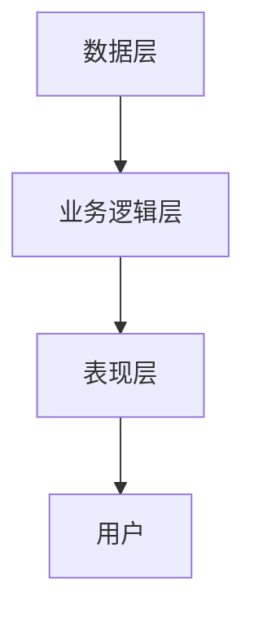

                 


# AI驱动的费雪成长型股票筛选系统

> 关键词：AI技术、费雪成长型股票、股票筛选系统、机器学习、金融投资

> 摘要：本文详细探讨了如何利用人工智能技术构建一个基于费雪成长型投资策略的股票筛选系统。通过结合传统投资学理论与现代机器学习算法，我们提出了一种创新的解决方案，能够高效地筛选出具有长期成长潜力的优质股票。文章从系统背景、核心算法、系统架构到项目实战，全面阐述了该系统的构建过程和实现方法，为投资者提供了新的思路和工具。

---

## 第一部分：AI驱动的费雪成长型股票筛选系统概述

### 第1章：费雪成长型股票筛选的背景与概念

#### 1.1 费雪投资理论的核心思想
费雪（Philip Fisher）是20世纪著名的投资大师，其成长型投资理论强调长期关注具有持续创新能力的企业。费雪提出了“10倍好公司”的概念，认为投资者应选择那些具有强大竞争优势、稳定的管理层和持续增长潜力的公司。

#### 1.2 AI技术在金融领域的应用背景
随着人工智能技术的快速发展，AI在金融领域的应用越来越广泛。通过机器学习算法，AI能够处理海量数据，发现传统方法难以察觉的模式和趋势。AI在股票筛选中的优势在于其高效性、准确性和可扩展性。

#### 1.3 费雪筛选法与AI技术的结合
将AI技术应用于费雪成长型股票筛选，能够提高筛选效率和准确性。通过机器学习模型，我们可以量化费雪筛选中的关键指标（如ROE、PEG等），并结合市场情绪、新闻数据等实时信息，动态调整筛选策略。

---

### 第2章：AI驱动的费雪筛选系统核心概念与联系

#### 2.1 费雪筛选法的核心要素
- **ROE（股东权益收益率）**：衡量公司盈利能力的重要指标，费雪认为ROE应持续稳定。
- **PEG（市盈率相对盈利增长比率）**：结合市盈率和盈利增长率，评估股票的估值是否合理。
- **管理层质量**：费雪强调管理层的决策能力和道德标准，AI可以通过分析公司财报和新闻数据来评估管理层的质量。

#### 2.2 AI技术在费雪筛选中的应用
- **数据特征提取**：通过NLP技术分析公司财报、新闻和社交媒体数据，提取情感指标和关键词。
- **机器学习模型**：使用随机森林、支持向量机（SVM）等算法对股票进行分类和预测。
- **模型优化**：通过交叉验证和超参数调优，提高模型的准确性和稳定性。

#### 2.3 费雪筛选系统中的数学模型
费雪筛选系统中的关键指标可以通过以下公式计算：

1. **ROE（股东权益收益率）**：
   $$ ROE = \frac{\text{净利润}}{\text{股东权益}} $$

2. **PEG（市盈率相对盈利增长比率）**：
   $$ PEG = \frac{\text{市盈率}}{\text{盈利增长率}} $$

---

## 第二部分：AI驱动的费雪筛选系统算法原理

### 第3章：机器学习在股票筛选中的应用

#### 3.1 监督学习与非监督学习的对比
- **监督学习**：基于标记数据训练模型，适用于分类任务（如股票涨跌预测）。
- **非监督学习**：基于无标记数据发现数据中的潜在结构，适用于聚类任务（如客户分群）。

#### 3.2 分类算法在股票筛选中的应用
- **随机森林**：通过特征重要性分析，筛选出影响股票表现的关键指标。
- **逻辑回归**：用于分类任务，如判断股票是否符合费雪筛选标准。

#### 3.3 回归算法在股票预测中的作用
- **线性回归**：预测股票价格走势。
- **Lasso回归**：通过L1正则化进行特征选择，减少过拟合。

---

### 第4章：基于费雪筛选法的机器学习模型构建

#### 4.1 数据预处理与特征工程
- 数据清洗：处理缺失值、异常值。
- 特征提取：从文本数据中提取关键词，从财务数据中提取关键指标。

#### 4.2 算法选择与模型训练
- 使用随机森林对股票进行分类，训练模型以判断股票是否符合费雪筛选标准。

#### 4.3 模型评估与优化
- 使用交叉验证评估模型性能。
- 调整超参数（如树的深度、学习率）优化模型。

---

## 第三部分：AI驱动的费雪筛选系统架构设计

### 第5章：系统功能模块设计

#### 5.1 数据采集模块
- 从数据库、API获取股票数据。
- 从新闻网站、社交媒体获取文本数据。

#### 5.2 特征提取模块
- 使用NLP技术提取文本数据中的关键词。
- 从财务数据中提取ROE、PEG等指标。

#### 5.3 模型训练与预测模块
- 使用训练好的模型对股票进行分类和预测。
- 输出筛选结果。

#### 5.4 结果展示与分析模块
- 可视化筛选结果，提供交互式界面。

### 第6章：系统架构设计

#### 6.1 分层架构设计
- 数据层：存储股票数据和模型。
- 业务逻辑层：处理用户请求，调用模型进行预测。
- 表现层：展示结果，提供交互界面。

#### 6.2 系统架构图


---

## 第四部分：项目实战

### 第7章：环境安装与系统实现

#### 7.1 环境搭建
- 安装Python、TensorFlow、Scikit-learn等库。

#### 7.2 核心代码实现
```python
import pandas as pd
from sklearn.ensemble import RandomForestClassifier
from sklearn.metrics import accuracy_score

# 加载数据
data = pd.read_csv('stock_data.csv')

# 特征工程
X = data.drop('target', axis=1)
y = data['target']

# 模型训练
model = RandomForestClassifier()
model.fit(X, y)

# 模型预测
y_pred = model.predict(X)
print(accuracy_score(y, y_pred))
```

---

### 第8章：案例分析与结果解读

#### 8.1 实际案例分析
- 选择一组股票，使用模型进行筛选。
- 对比模型筛选结果与实际市场表现。

#### 8.2 代码应用解读
- 解释代码的功能和实现细节。
- 分析模型输出结果的意义。

---

## 第五部分：总结与展望

### 第9章：最佳实践与注意事项

#### 9.1 小结
- AI技术能够显著提升费雪成长型股票筛选的效率和准确性。
- 需要结合多源数据和实时信息动态调整筛选策略。

#### 9.2 注意事项
- 数据质量对模型性能影响重大，需谨慎处理。
- 模型需要定期更新，以适应市场变化。

#### 9.3 拓展阅读
- 《The Intelligent Investor》——本杰明·格雷厄姆
- 《机器学习实战》—— Aurélien Géron

---

通过以上内容，我们详细探讨了AI驱动的费雪成长型股票筛选系统的构建过程，从理论到实践，为投资者提供了一种高效的投资工具。希望本文能为读者在AI与金融结合的领域提供新的思路和启发。

