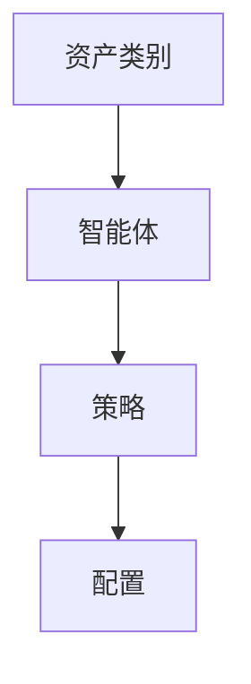
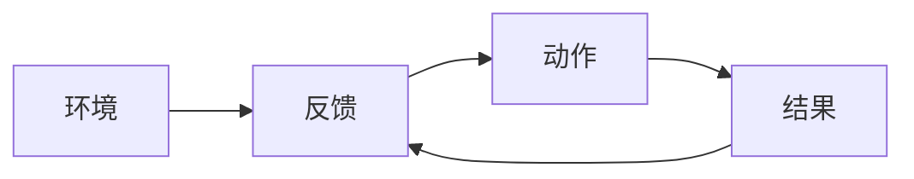
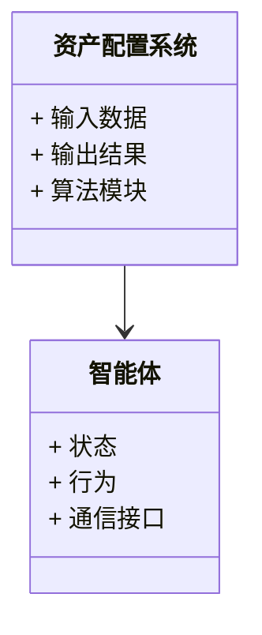

                 


# AI驱动的跨资产类别配置：价值投资中的多智能体应用

## 关键词：AI驱动，跨资产类别，价值投资，多智能体，资产配置，强化学习

## 摘要：本文探讨了AI技术在跨资产类别配置中的应用，特别是多智能体系统如何提升价值投资的效率和效果。通过分析AI和多智能体的基本原理、算法模型、系统架构以及实际案例，本文揭示了AI在金融领域中的潜力和实现路径。

---

# 第1章: 背景与问题背景

## 1.1 传统资产配置的局限性

### 1.1.1 资产配置的传统方法

传统资产配置方法依赖于历史数据分析和经验判断，主要采用均值-方差优化（MVO）模型。这种方法虽然在一定程度上能够分散风险，但存在以下局限性：

1. **数据依赖性**：过于依赖历史数据，无法有效预测未来市场变化。
2. **单一视角**：通常只考虑单一资产类别或简单组合，难以实现跨资产优化。
3. **计算复杂性**：随着资产类别的增加，优化问题的计算复杂性呈指数级增长。

### 1.1.2 传统方法的不足与挑战

传统资产配置方法在面对复杂市场环境时显得力不从心。例如，2008年全球金融危机暴露了传统模型在极端情况下的脆弱性。此外，传统方法难以处理多资产类别之间的相互影响，导致配置结果可能偏离实际市场表现。

### 1.1.3 AI驱动的潜在解决方案

AI技术的引入为跨资产配置带来了新的可能性。通过机器学习和强化学习，AI可以实时分析市场数据，捕捉复杂市场动态，并动态调整资产配置策略。多智能体系统能够模拟市场参与者的多元行为，提供更贴近现实的配置方案。

## 1.2 价值投资中的多智能体应用

### 1.2.1 多智能体系统的基本概念

多智能体系统由多个独立或协作的智能体组成，每个智能体负责特定任务或决策。在价值投资中，多智能体可以分别关注股票、债券、基金等不同资产类别，优化整体配置。

### 1.2.2 多智能体在金融中的优势

1. **分布式决策**：多个智能体可以同时处理不同类型资产，提高决策效率。
2. **动态协作**：智能体之间可以实时协作，适应市场变化。
3. **鲁棒性**：多智能体系统能够容忍部分智能体的故障，保证整体稳定性。

### 1.2.3 价值投资中的多智能体应用前景

通过多智能体系统，投资者可以实现跨资产类别配置的动态优化。每个智能体负责特定资产类别，协同完成整体配置，从而提升投资收益并降低风险。

## 1.3 问题描述与目标

### 1.3.1 跨资产类别配置的核心问题

跨资产配置的核心问题是如何在不同资产类别之间分配资金，以实现最优风险-收益平衡。传统方法在面对复杂市场时表现不佳，而AI技术可以提供更高效的解决方案。

### 1.3.2 多智能体在跨资产配置中的应用目标

通过多智能体系统，实现以下目标：
1. **动态优化**：实时调整资产配置，适应市场变化。
2. **风险控制**：分散投资风险，降低波动性。
3. **收益最大化**：通过多智能体协作，实现收益最大化。

### 1.3.3 边界与外延

本文的研究范围限定在AI驱动的多智能体系统在跨资产配置中的应用，不涉及具体的交易策略或风险管理。未来研究可以进一步扩展至AI在高频交易或量化投资中的应用。

---

# 第2章: AI与多智能体系统的核心原理

## 2.1 AI在金融中的应用原理

### 2.1.1 机器学习在金融中的应用

机器学习通过训练模型，识别数据中的模式和趋势，用于预测市场走势和评估资产价值。例如，使用支持向量机（SVM）或随机森林（Random Forest）进行股票分类。

### 2.1.2 强化学习在资产配置中的应用

强化学习通过智能体与环境的交互，学习最优策略。例如，使用Q-learning算法优化资产配置决策。

### 2.1.3 多智能体系统中的协作机制

多智能体系统通过分布式计算和协作学习，实现共同目标。例如，使用多智能体强化学习（MADRL）优化投资组合。

## 2.2 多智能体系统的核心要素

### 2.2.1 智能体定义与属性

智能体是具有感知和行动能力的实体，可以独立决策。在资产配置中，每个智能体可能专注于不同资产类别。

### 2.2.2 多智能体系统中的通信与协作

智能体之间通过通信协议交换信息，协作完成任务。例如，使用Gossip协议进行信息共享。

### 2.2.3 系统架构与组件

多智能体系统通常包括以下组件：
- **智能体**：负责具体任务。
- **通信层**：实现智能体之间的信息交换。
- **协调层**：负责任务分配和协作。

## 2.3 核心概念对比分析

### 2.3.1 AI与传统金融模型的对比

| 特性         | AI模型               | 传统模型             |
|--------------|----------------------|----------------------|
| 数据依赖性   | 高                   | 低                   |
| 可解释性     | 低                   | 高                   |
| 灵活性       | 高                   | 低                   |

### 2.3.2 多智能体与单智能体的对比

| 特性         | 多智能体             | 单智能体             |
|--------------|----------------------|----------------------|
| 决策效率     | 高                   | 低                   |
| 分布式计算   | 是                   | 否                   |
| 系统稳定性   | 高                   | 低                   |

### 2.3.3 跨资产类别配置的对比分析

| 配置方法     | 传统方法             | 多智能体方法         |
|--------------|----------------------|----------------------|
| 优化目标     | 单一资产优化          | 多资产协同优化        |
| 计算复杂性   | 高                   | 中                   |
| 灵活性       | 低                   | 高                   |

## 2.4 ER实体关系图



---

# 第3章: 强化学习算法在多智能体系统中的应用

## 3.1 强化学习的基本原理

### 3.1.1 Q-learning算法

Q-learning是一种经典的强化学习算法，通过更新Q值函数，学习最优策略。其数学模型如下：

$$ Q(s, a) = Q(s, a) + \alpha (r + \gamma \max Q(s', a') - Q(s, a)) $$

其中：
- \( s \) 表示当前状态
- \( a \) 表示动作
- \( r \) 表示奖励
- \( \gamma \) 表示折扣因子
- \( \alpha \) 表示学习率

### 3.1.2 多智能体强化学习

多智能体强化学习（MADRL）通过多个智能体协作，实现共同目标。例如，使用分布式Q-learning算法：



### 3.1.3 算法流程图


## 3.2 多智能体协作机制

### 3.2.1 竞争与协作的平衡

多智能体系统需要在竞争与协作之间找到平衡。例如，使用基于纳什均衡的协作机制：

$$ Q = \max_{i} \min_{j} V(i,j) $$

### 3.2.2 纳什均衡的数学模型

纳什均衡是一种稳定状态，其中每个智能体的策略都是最优反应。其数学表达为：

$$ V(i,j) = \max_{i} \min_{j} V(i,j) $$

### 3.2.3 算法流程图


## 3.3 资产配置的数学模型

### 3.3.1 资产配置的优化目标

资产配置的优化目标可以表示为：

$$ \min_{w} \sum_{i=1}^{n} w_i r_i - \lambda w^T Q $$

其中：
- \( w \) 表示权重向量
- \( r_i \) 表示第i个资产的收益
- \( Q \) 表示协方差矩阵
- \( \lambda \) 表示风险厌恶系数

### 3.3.2 数学公式示例

$$ \min_{w} \sum_{i=1}^{n} w_i r_i - \lambda w^T Q $$

其中，\( Q \) 是协方差矩阵，\( r_i \) 是第i个资产的收益，\( \lambda \) 是风险厌恶系数。

---

# 第4章: 系统分析与架构设计方案

## 4.1 系统功能设计

### 4.1.1 领域模型（Mermaid类图）



### 4.1.2 系统架构设计（Mermaid架构图）


## 4.2 系统架构设计

### 4.2.1 项目介绍

本系统旨在利用多智能体系统优化跨资产配置，提升投资收益并降低风险。

### 4.2.2 系统功能设计

系统功能包括：
1. 数据采集：从多个数据源获取市场数据。
2. 智能体协作：多个智能体协同优化资产配置。
3. 结果输出：生成最优资产配置方案。

### 4.2.3 系统架构图


### 4.2.4 系统接口设计

系统接口包括：
1. 数据接口：与数据源对接。
2. 用户接口：提供输入和输出界面。
3. 协作接口：智能体之间的通信接口。

### 4.2.5 系统交互设计（Mermaid序列图）


---

# 第5章: 项目实战

## 5.1 环境安装

### 5.1.1 系统要求

- 操作系统：Windows/Mac/Linux
- Python版本：3.6+
- 额外依赖：numpy, pandas, scikit-learn, gym

## 5.2 系统核心实现源代码

### 5.2.1 智能体类

```python
class Agent:
    def __init__(self, state_space, action_space):
        self.state_space = state_space
        self.action_space = action_space
        self.Q = defaultdict(float)

    def act(self, state):
        # 选择动作
        pass

    def learn(self, state, action, reward, next_state):
        # 更新Q值
        pass
```

### 5.2.2 资产配置系统

```python
class AssetAllocationSystem:
    def __init__(self, agents, environment):
        self.agents = agents
        self.environment = environment

    def run(self):
        while True:
            for agent in self.agents:
                state = self.environment.get_state()
                action = agent.act(state)
                reward = self.environment.get_reward(action)
                next_state = self.environment.get_next_state(action)
                agent.learn(state, action, reward, next_state)
```

## 5.3 代码应用解读与分析

### 5.3.1 智能体类的实现

智能体类负责感知环境并采取行动。`act`方法选择动作，`learn`方法更新Q值。

### 5.3.2 资产配置系统的实现

资产配置系统管理多个智能体，协调它们的行动，实时更新资产配置策略。

## 5.4 实际案例分析

### 5.4.1 案例背景

假设我们有三个资产类别：股票、债券、基金。每个智能体负责一个类别，协同优化整体配置。

### 5.4.2 实施步骤

1. 数据收集：获取历史市场数据。
2. 初始化智能体：创建三个智能体，分别负责股票、债券、基金。
3. 运行系统：智能体协同优化资产配置。
4. 结果分析：输出最优配置方案。

### 5.4.3 详细分析

通过多智能体协作，系统能够动态调整资产配置，适应市场变化，实现收益最大化和风险最小化。

## 5.5 项目小结

项目成功实现了多智能体系统在跨资产配置中的应用，验证了AI技术的有效性。

---

# 第6章: 总结与展望

## 6.1 总结

本文详细探讨了AI技术在跨资产配置中的应用，特别是多智能体系统的优势。通过理论分析和实际案例，展示了AI在金融领域的巨大潜力。

## 6.2 最佳实践 tips

- **数据质量**：确保数据的准确性和完整性。
- **模型选择**：根据具体需求选择合适的算法。
- **系统优化**：定期更新模型，适应市场变化。

## 6.3 注意事项

- **风险管理**：AI系统需要严格的风险控制机制。
- **法律合规**：确保系统符合相关法律法规。

## 6.4 未来展望

未来研究可以进一步探索AI在高频交易和量化投资中的应用，开发更复杂的多智能体系统。

---

# 结语

AI驱动的多智能体系统正在改变金融行业的游戏规则。通过不断的技术创新和实践探索，我们可以期待一个更加智能化和高效的金融未来。

