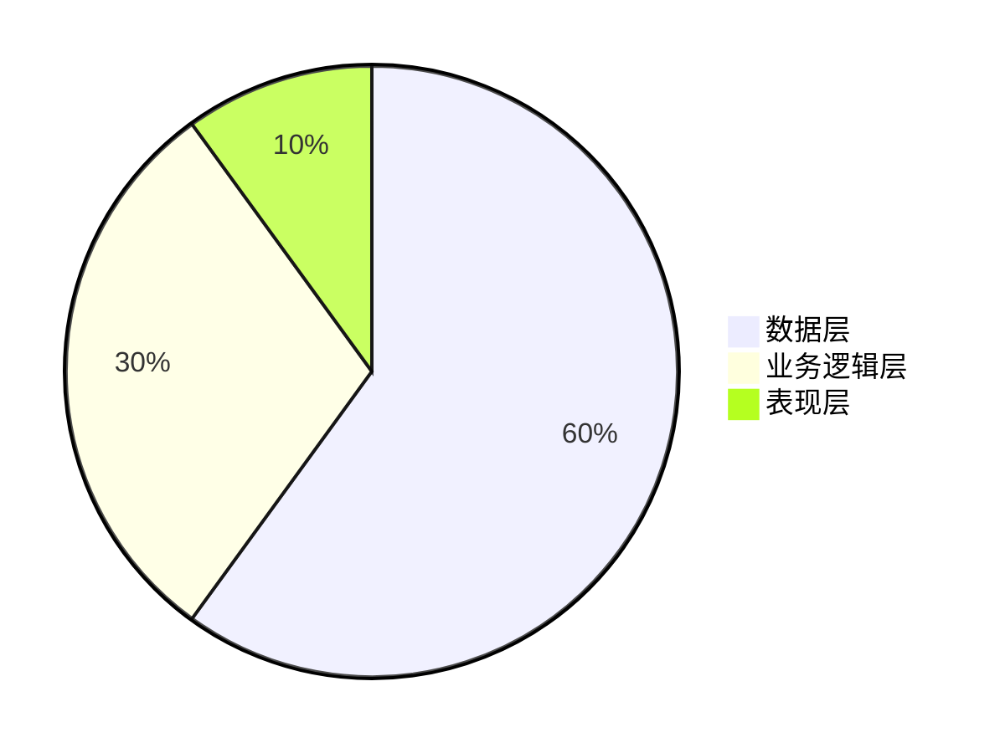
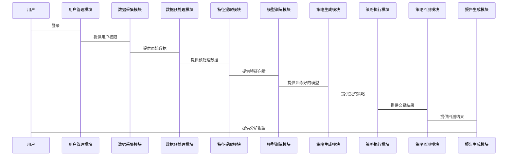

                 

# 系统架构设计

## 7. 系统架构设计

### 7.1 系统功能设计

在本节中，我们将详细设计AI驱动的逆向投资策略系统的功能模块，并展示系统的整体架构。通过模块化设计，我们可以清晰地看到各个功能模块之间的关系和交互流程。

#### 7.1.1 系统功能模块划分

系统功能模块划分为以下几个部分：

1. **用户管理模块**
2. **数据采集模块**
3. **数据预处理模块**
4. **特征提取模块**
5. **模型训练模块**
6. **策略生成模块**
7. **策略执行模块**
8. **策略回测模块**
9. **报告生成模块**

每个模块都有其特定的功能和输入输出接口，模块之间的交互通过定义良好的接口进行通信。

#### 7.1.2 系统功能设计

##### 1. 用户管理模块

- **功能描述**：管理系统的用户信息，包括用户注册、登录、权限管理等。
- **输入**：用户信息（用户名、密码、权限等）。
- **输出**：用户管理结果。

##### 2. 数据采集模块

- **功能描述**：从多个数据源采集金融市场的相关数据，如股票价格、财务报表、新闻等。
- **输入**：数据源配置（API、数据库等）。
- **输出**：原始数据集。

##### 3. 数据预处理模块

- **功能描述**：对采集到的数据进行清洗、转换和标准化处理。
- **输入**：原始数据集。
- **输出**：预处理后的数据集。

##### 4. 特征提取模块

- **功能描述**：从预处理后的数据中提取有助于投资决策的特征。
- **输入**：预处理后的数据集。
- **输出**：特征向量。

##### 5. 模型训练模块

- **功能描述**：利用机器学习算法训练预测模型。
- **输入**：特征向量、标签（如股票价格）。
- **输出**：训练好的模型。

##### 6. 策略生成模块

- **功能描述**：基于训练好的模型生成投资策略。
- **输入**：市场数据、模型预测结果。
- **输出**：投资策略（如买入、卖出信号）。

##### 7. 策略执行模块

- **功能描述**：根据生成的投资策略执行实际的交易操作。
- **输入**：投资策略、交易接口。
- **输出**：交易结果。

##### 8. 策略回测模块

- **功能描述**：对生成的投资策略进行回测，评估其表现。
- **输入**：历史数据、投资策略。
- **输出**：回测结果（如收益率、风险指标等）。

##### 9. 报告生成模块

- **功能描述**：生成投资策略的分析报告。
- **输入**：回测结果。
- **输出**：分析报告（如PDF、HTML等格式）。

### 7.2 领域模型类图

为了更好地理解系统的架构，我们可以使用类图来展示系统的各个模块及其关系。以下是系统的领域模型类图：

```mermaid
classDiagram

    class 用户管理模块 {
        + 用户信息
        + 权限
        + 登录
        + 注册
    }

    class 数据采集模块 {
        + 数据源配置
        + 数据采集
        + 数据存储
    }

    class 数据预处理模块 {
        + 数据清洗
        + 数据转换
        + 数据标准化
    }

    class 特征提取模块 {
        + 特征选择
        + 特征工程
        + 特征向量
    }

    class 模型训练模块 {
        + 机器学习算法
        + 模型训练
        + 模型评估
    }

    class 策略生成模块 {
        + 策略生成
        + 策略优化
        + 策略输出
    }

    class 策略执行模块 {
        + 交易执行
        + 订单管理
        + 交易结果
    }

    class 策略回测模块 {
        + 策略回测
        + 性能评估
        + 回测结果
    }

    class 报告生成模块 {
        + 报告生成
        + 数据可视化
        + 输出格式
    }

    用户管理模块 --> 数据采集模块: 提供用户权限
    数据采集模块 --> 数据预处理模块: 提供原始数据
    数据预处理模块 --> 特征提取模块: 提供预处理数据
    特征提取模块 --> 模型训练模块: 提供特征向量
    模型训练模块 --> 策略生成模块: 提供训练好的模型
    策略生成模块 --> 策略执行模块: 提供投资策略
    策略执行模块 --> 策略回测模块: 提供交易结果
    策略回测模块 --> 报告生成模块: 提供回测结果
```

### 7.3 系统架构设计

系统的整体架构采用分层设计，主要包括以下几个层次：

1. **数据层**：负责数据的采集、存储和预处理。
2. **业务逻辑层**：负责核心业务逻辑的实现，如特征提取、模型训练、策略生成等。
3. **表现层**：负责与用户的交互，展示系统的结果和报告。

以下是系统的整体架构图：

在数据层，我们通过数据采集模块从多个数据源获取金融市场的数据，如股票价格、财务报表、新闻等。数据预处理模块对这些数据进行清洗和标准化处理，为后续的特征提取和模型训练提供高质量的数据。

在业务逻辑层，特征提取模块从预处理后的数据中提取有助于投资决策的特征。模型训练模块利用机器学习算法对这些特征进行训练，生成预测模型。策略生成模块基于训练好的模型，结合当前市场数据，生成具体的投资策略。

在表现层，用户可以通过用户界面查看系统生成的投资策略，并根据需要进行调整。策略执行模块根据生成的策略执行实际的交易操作。策略回测模块对生成的投资策略进行回测，评估其表现。最后，报告生成模块根据回测结果生成详细的分析报告。

### 7.4 系统接口设计

为了确保系统各模块之间的良好交互，我们需要定义模块之间的接口。以下是系统的接口设计：

1. **数据采集模块接口**：
   - 输入：数据源配置。
   - 输出：原始数据集。

2. **数据预处理模块接口**：
   - 输入：原始数据集。
   - 输出：预处理后的数据集。

3. **特征提取模块接口**：
   - 输入：预处理后的数据集。
   - 输出：特征向量。

4. **模型训练模块接口**：
   - 输入：特征向量、标签。
   - 输出：训练好的模型。

5. **策略生成模块接口**：
   - 输入：市场数据、模型预测结果。
   - 输出：投资策略。

6. **策略执行模块接口**：
   - 输入：投资策略、交易接口。
   - 输出：交易结果。

7. **策略回测模块接口**：
   - 输入：历史数据、投资策略。
   - 输出：回测结果。

### 7.5 系统交互设计

为了更好地理解系统的交互流程，我们可以使用序列图来展示用户与系统之间的交互过程。以下是系统的交互序列图：

### 7.6 本节小结

在本节中，我们详细设计了AI驱动的逆向投资策略系统的功能模块、系统架构、接口设计和交互流程。通过模块化设计和清晰的接口定义，我们可以确保系统各部分之间的良好协同工作。系统的整体架构采用分层设计，数据层负责数据的采集和预处理，业务逻辑层负责核心的特征提取和模型训练，表现层负责与用户的交互和结果展示。

接下来，我们将进入项目实战部分，详细介绍如何在实际开发中实现这些功能模块。

