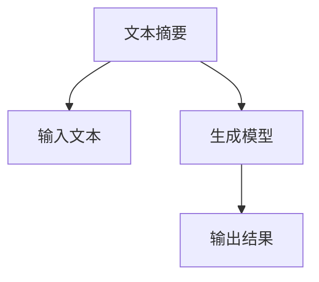
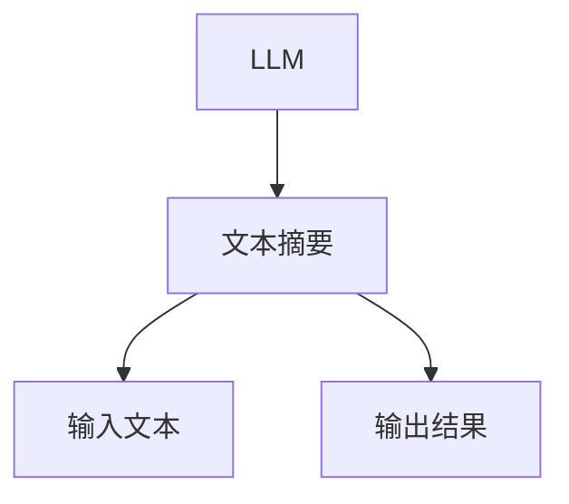
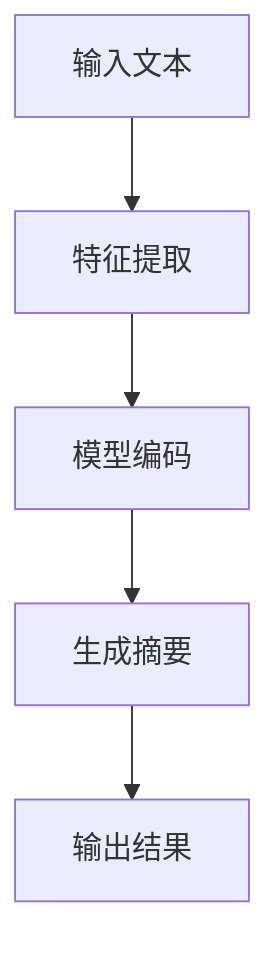
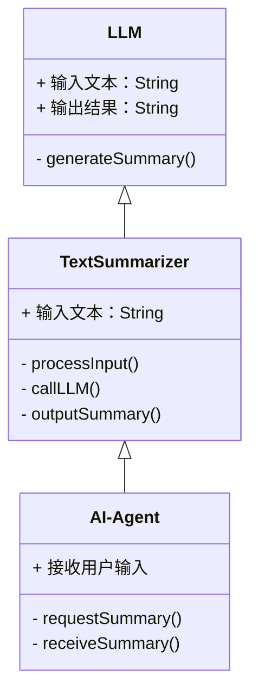
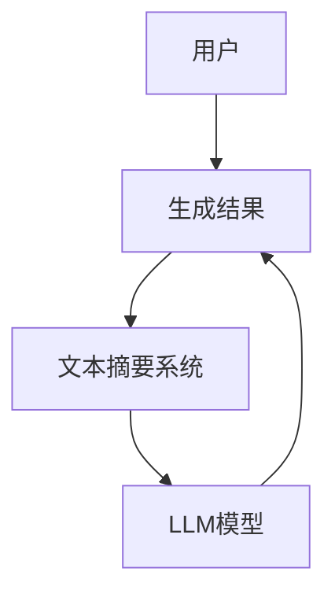
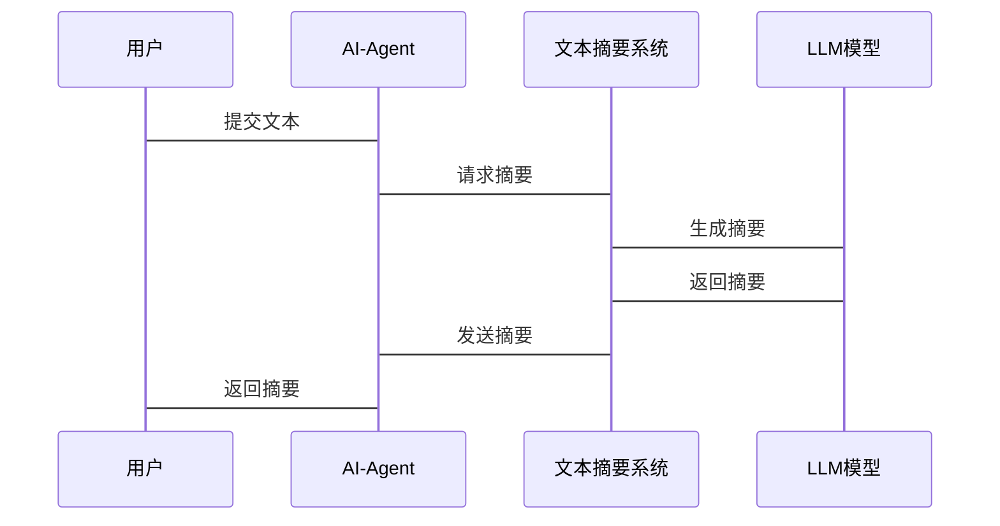

                 


# LLM在AI Agent中的文本摘要生成应用

## 关键词：LLM, AI Agent, 文本摘要, 大语言模型, 智能助手

## 摘要：本文深入探讨了大语言模型（LLM）在AI Agent中的文本摘要生成应用，分析了其背景、核心概念、算法原理、系统架构、项目实战及最佳实践。通过详细的技术分析和实际案例，展示了如何利用LLM提升文本摘要的效率和准确性，为AI Agent的应用提供有力支持。

---

# 第1章: 背景介绍

## 1.1 问题背景

### 1.1.1 文本摘要生成的定义与重要性
文本摘要生成是将长文本内容压缩成简短的摘要，保留原文的核心信息。在AI Agent中，文本摘要生成是关键任务之一，帮助用户快速获取信息。

### 1.1.2 LLM在文本摘要中的作用
大语言模型（LLM）通过强大的上下文理解和生成能力，能够高效生成高质量的文本摘要，提升AI Agent的智能化水平。

### 1.1.3 AI Agent中的文本摘要应用场景
- 信息筛选：从大量文本中提取关键信息。
- 交互优化：提升用户与AI Agent的对话效率。
- 内容生成：辅助生成报告、邮件等。

## 1.2 问题描述

### 1.2.1 文本摘要生成的核心问题
如何在保持信息完整性的前提下，生成简洁准确的摘要。

### 1.2.2 LLM在文本摘要中的优势与挑战
优势：生成能力强，适应性广。
挑战：信息抽取准确性、生成结果多样性。

### 1.2.3 AI Agent中文本摘要的边界与外延
边界：仅处理文本内容，不涉及图像、视频等其他数据。
外延：结合其他NLP任务，如情感分析、文本分类。

## 1.3 核心概念与联系

### 1.3.1 LLM与文本摘要的关系
LLM通过预训练掌握了丰富的语言知识，能够生成符合上下文的摘要。

### 1.3.2 文本摘要生成的流程与关键环节
流程：输入文本 → 分词处理 → 生成摘要 → 输出结果。
关键环节：特征提取、模型编码、生成优化。

### 1.3.3 实体关系图（ER图）展示



---

# 第2章: 核心概念与联系

## 2.1 LLM与文本摘要的原理

### 2.1.1 LLM的基本原理
LLM通过自注意力机制捕捉文本中的语义信息，生成与输入相关的摘要。

### 2.1.2 文本摘要生成的算法流程
输入文本 → 编码 → 解码生成摘要。

### 2.1.3 LLM在文本摘要中的应用模式
- 监督微调：基于特定任务数据优化模型。
- 生成式方法：直接生成摘要。

## 2.2 核心概念对比

### 2.2.1 LLM与传统文本摘要方法的对比
| 对比维度 | LLM | 传统方法 |
|----------|-----|----------|
| 效率     | 高   | 较低     |
| 精度     | 高   | 中等     |
| 多语言支持 | 强   | 较弱     |

### 2.2.2 不同LLM模型在文本摘要中的表现
| 模型名称 | 参数量 | 性能表现 |
|----------|--------|----------|
| GPT-3   | 175B   | 高        |
| BERT     | 110M   | 中等       |

### 2.2.3 实体关系图（ER图）展示



---

# 第3章: 算法原理讲解

## 3.1 LLM的训练与优化

### 3.1.1 监督微调（Supervised Fine-tuning）
- 在特定任务数据上微调LLM模型。
- 使用交叉熵损失函数优化模型。

### 3.1.2 生成式方法（Generative Approach）
- 基于概率模型生成摘要。
- 采用贪心算法优化生成结果。

### 3.1.3 损失函数与优化目标
交叉熵损失函数：
$$L = -\sum_{i=1}^{n} \log p(y_i|x)$$
优化目标：最小化损失函数。

## 3.2 文本摘要生成的算法流程

### 3.2.1 输入处理与特征提取
- 分词处理输入文本。
- 提取文本中的关键词和主题。

### 3.2.2 模型编码与解码过程
- 编码器将输入转换为向量表示。
- 解码器生成摘要文本。

### 3.2.3 输出生成与结果优化
- 多轮生成优化，提升摘要质量。
- 使用后处理技术调整生成结果。

## 3.3 算法流程图（Mermaid）



---

# 第4章: 数学模型与公式

## 4.1 LLM的数学模型

### 4.1.1 变压器（Transformer）模型
- 由编码器和解码器组成，通过自注意力机制处理输入。

### 4.1.2 注意力机制（Attention）
- 计算输入文本中每个词的重要性。
- 注意力权重计算公式：
$$\alpha_i = \frac{\exp(e_i)}{\sum_{j=1}^{m} \exp(e_j)}$$

### 4.1.3 概率分布与生成模型
- 使用生成模型（如GPT）生成摘要。

## 4.2 文本摘要的数学公式

### 4.2.1 损失函数
$$L = -\sum_{i=1}^{n} \log p(y_i|x)$$

### 4.2.2 注意力权重计算
$$\alpha_i = \frac{\exp(e_i)}{\sum_{j=1}^{m} \exp(e_j)}$$

### 4.2.3 模型训练目标
$$\text{Minimize } L \text{ over training data}$$

---

# 第5章: 系统分析与架构设计

## 5.1 问题场景介绍

### 5.1.1 AI Agent的功能需求
- 快速生成摘要。
- 支持多语言。

### 5.1.2 文本摘要生成的系统目标
- 高效准确生成摘要。
- 与AI Agent无缝集成。

### 5.1.3 系统的输入输出设计
- 输入：文本内容。
- 输出：摘要结果。

## 5.2 系统功能设计

### 5.2.1 领域模型（Mermaid类图）


### 5.2.2 系统架构设计（Mermaid架构图）


### 5.2.3 系统接口设计
- 输入接口：接收文本内容。
- 输出接口：返回摘要结果。

### 5.2.4 系统交互流程（Mermaid序列图）


---

# 第6章: 项目实战

## 6.1 环境安装

```bash
pip install transformers
pip install torch
pip install matplotlib
```

## 6.2 核心实现代码

### 6.2.1 加载预训练模型
```python
from transformers import AutoTokenizer, AutoModelForTextClassification
tokenizer = AutoTokenizer.from_pretrained('facebook/bart-large')
model = AutoModelForTextClassification.from_pretrained('facebook/bart-large')
```

### 6.2.2 编写生成函数
```python
def generate_summary(text):
    inputs = tokenizer(text, max_length=512, truncation=True, return_tensors='pt')
    with torch.no_grad():
        outputs = model(**inputs)
    summary = outputs.logits.argmax(dim=-1)
    return tokenizer.decode(summary)
```

### 6.2.3 示例案例分析
```python
text = "这是一段需要生成摘要的长文本。"
summary = generate_summary(text)
print(summary)
```

## 6.3 代码解读与分析
- 使用预训练模型生成摘要。
- 输入文本经过分词处理，模型生成摘要。
- 示例代码展示基本用法。

---

# 第7章: 最佳实践

## 7.1 小结
本文详细探讨了LLM在AI Agent中文本摘要的应用，分析了算法原理和系统架构，提供了实际案例。

## 7.2 注意事项
- 确保模型训练数据质量。
- 处理文本摘要结果时注意信息完整性。
- 定期更新模型以适应新数据。

## 7.3 扩展阅读
- 《大语言模型的训练与优化》
- 《AI Agent的设计与实现》
- 《文本摘要生成的前沿技术》

---

# 结语
通过本文的学习，读者可以深入了解LLM在AI Agent中文本摘要的应用，掌握相关算法原理和系统设计方法。未来，随着技术的发展，LLM在文本摘要中的应用将更加广泛，为AI Agent提供更多可能性。

--- 

希望这篇博客文章能为读者提供有价值的技术见解和实践指导。

