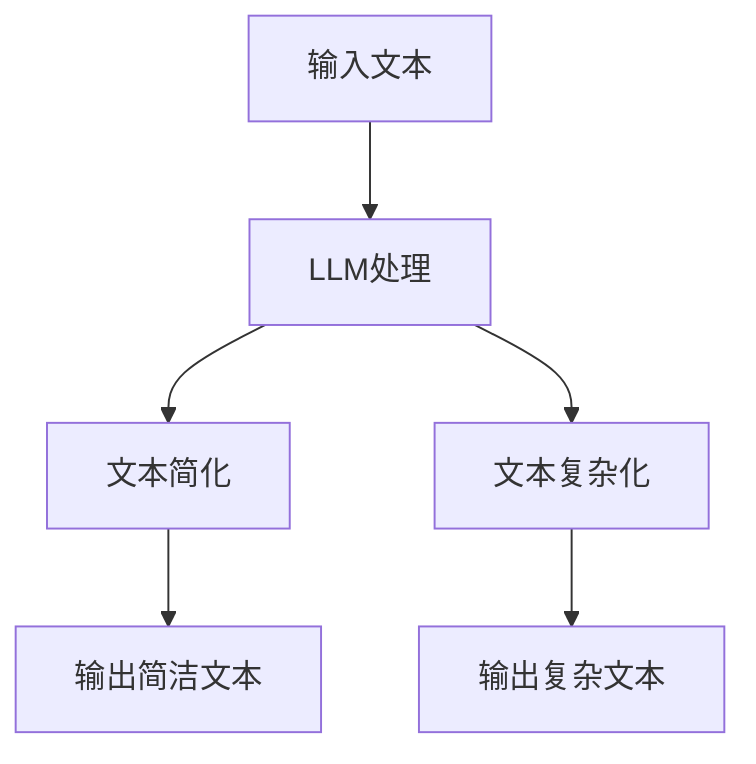

                 

<think>
好的，我将按照您的要求创作一篇关于“LLM在AI Agent中的文本简化与复杂化能力”的技术博客文章。为了让内容更完整，我先列出文章的基本结构。

# LLM在AI Agent中的文本简化与复杂化能力

> 关键词：LLM, AI Agent, 文本简化, 文本复杂化, 语言模型, 自然语言处理

> 摘要：大语言模型（LLM）在AI Agent中的文本处理能力，特别是文本简化与复杂化方面，展现了巨大的潜力。本文从LLM的基本概念和AI Agent的协同工作模式出发，深入分析了文本简化与复杂化的核心概念、算法原理、系统架构及实际应用案例，全面阐述了LLM在AI Agent中的文本处理能力。

---

接下来，我会按照以下章节逐步分析和撰写内容：

1. **背景介绍**：包括LLM和AI Agent的基本概念、它们的协同工作模式、文本简化与复杂化的定义和应用场景。

2. **核心概念与联系**：通过对比分析，解释LLM在文本简化和复杂化中的核心作用，并使用Mermaid流程图展示算法原理。

3. **算法原理讲解**：详细分析文本简化和复杂化的算法原理，包括数学公式和代码实现，并通过实际案例说明。

4. **系统分析与架构设计方案**：设计AI Agent的系统架构，包括功能模块划分、系统接口设计，并用Mermaid序列图展示交互流程。

5. **项目实战**：从环境安装到代码实现，详细解读如何在实际项目中应用LLM进行文本处理，并进行案例分析。

6. **最佳实践与总结**：总结LLM在文本处理中的应用价值，提出实际应用中的注意事项和未来研究方向。

---

让我们逐步展开每一部分的内容，深入分析和撰写这篇技术博客文章。

---

### 第1章: 背景介绍

#### 1.1 LLM的基本概念与技术背景
- **大语言模型（LLM）**：基于Transformer架构的深度学习模型，如GPT、BERT等，具备强大的文本生成、理解和推理能力。
- **AI Agent**：智能代理，能够感知环境、执行任务、与用户交互的智能系统，广泛应用于自动化服务、人机交互等领域。

#### 1.2 LLM与AI Agent的协同工作模式
- **协同目标**：通过LLM的文本处理能力，AI Agent能够更高效地完成任务，如信息提取、决策支持等。
- **应用场景**：例如，在智能客服系统中，AI Agent利用LLM快速理解用户需求并生成回复。

#### 1.3 文本简化与复杂化的定义与应用场景
- **文本简化**：将复杂的信息转化为简洁的表达，常用于信息摘要、数据清洗等场景。
- **文本复杂化**：在保持信息完整性的基础上增加细节，用于生成多样化的文本内容，如新闻扩展、文学创作等。

---

### 第2章: 核心概念与联系

#### 2.1 LLM在文本处理中的核心作用
- **文本理解**：通过LLM的上下文理解和意图识别能力，AI Agent能够准确解析用户需求。
- **文本生成**：LLM可以根据输入生成多样化的文本输出，满足不同场景的需求。

#### 2.2 文本简化与复杂化的对比分析
| **维度** | **文本简化** | **文本复杂化** |
|----------|--------------|----------------|
| **目标** | 简化信息表达 | 增加信息细节     |
| **应用** | 信息摘要、数据清洗 | 文本扩展、内容生成 |

#### 2.3 算法原理流程图


---

### 第3章: 算法原理讲解

#### 3.1 文本简化的算法原理
- **基于Transformer的文本摘要模型**：
  - 使用编码器-解码器结构，通过自注意力机制捕捉文本重点。
  - 示例代码（Python）：
    ```python
    def text_summarization(model, tokenizer, input_text):
        inputs = tokenizer(input_text, max_length=512, truncation=True, padding=True, return_tensors='pt')
        summary_ids = model.generate(inputs.input_ids, max_length=100, num_beams=5, early_stopping=True)
        summary = tokenizer.decode(summary_ids[0], skip_special_tokens=True)
        return summary
    ```
  - 数学模型：
    $$ \text{Summary} = \text{decoder}(f_{\text{att}}(\text{encoder}(x))) $$

#### 3.2 文本复杂化的算法原理
- **基于GPT的文本生成模型**：
  - 使用生成对抗网络或强化学习微调，提升文本生成的多样性和复杂性。
  - 示例代码（Python）：
    ```python
    def text_complexification(model, tokenizer, input_text, length=200):
        inputs = tokenizer(input_text, max_length=512, truncation=True, padding=True, return_tensors='pt')
        outputs = model.generate(inputs.input_ids, max_length=length, temperature=1.2, top_p=0.7)
        complex_text = tokenizer.decode(outputs[0], skip_special_tokens=True)
        return complex_text
    ```
  - 数学模型：
    $$ P(\text{token}_i | \text{context}) = \frac{\exp(\text{score})}{\sum_j \exp(\text{score}_j)} $$

---

### 第4章: 系统分析与架构设计方案

#### 4.1 系统功能设计
- **领域模型设计**：
  ```mermaid
  classDiagram
      class LLM {
          process(input);
      }
      class AI-Agent {
          receive(input);
          send(output);
      }
      class Text-Processor {
          simplify(input);
          complexify(input);
      }
      AI-Agent --> LLM
      AI-Agent --> Text-Processor
  ```

- **系统架构设计**：
  ```mermaid
  sequenceDiagram
      participant User
      participant AI-Agent
      participant LLM
      User -> AI-Agent: 提交任务
      AI-Agent -> LLM: 请求文本处理
      LLM -> Text-Processor: 返回处理结果
      AI-Agent -> User: 返回最终结果
  ```

---

### 第5章: 项目实战

#### 5.1 环境安装
- **所需工具**：
  - Python 3.8+
  - Hugging Face Transformers库
  - PyTorch

#### 5.2 核心代码实现
- **文本简化模块**：
  ```python
  from transformers import BartTokenizer, BartForConditionalGeneration

  model_name = 'facebook/bart-large-cnn'
  tokenizer = BartTokenizer.from_pretrained(model_name)
  model = BartForConditionalGeneration.from_pretrained(model_name)

  def summarize(text):
      inputs = tokenizer(text, max_length=512, truncation=True, padding=True, return_tensors='pt')
      outputs = model.generate(inputs.input_ids, max_length=100, num_beams=5, early_stopping=True)
      summary = tokenizer.decode(outputs[0], skip_special_tokens=True)
      return summary
  ```

- **文本复杂化模块**：
  ```python
  from transformers import GPT2Tokenizer, GPT2LMHeadModel

  model_name = 'gpt2-large'
  tokenizer = GPT2Tokenizer.from_pretrained(model_name)
  model = GPT2LMHeadModel.from_pretrained(model_name)

  def complexify(text, length=200):
      inputs = tokenizer(text, max_length=512, truncation=True, padding=True, return_tensors='pt')
      outputs = model.generate(inputs.input_ids, max_length=length, temperature=1.2, top_p=0.7)
      complex_text = tokenizer.decode(outputs[0], skip_special_tokens=True)
      return complex_text
  ```

#### 5.3 案例分析
- **实际案例1**：信息摘要
  - **输入**：一篇长篇文章
  - **输出**：简洁的摘要
- **实际案例2**：文本扩展
  - **输入**：简短的新闻标题
  - **输出**：详细的新闻报道

---

### 第6章: 最佳实践与总结

#### 6.1 总结
- LLM在AI Agent中的文本简化与复杂化能力为智能系统提供了强大的文本处理能力，能够显著提升系统的效率和用户体验。

#### 6.2 注意事项
- **数据质量**：确保输入数据的准确性和相关性，避免无效信息干扰。
- **模型调优**：根据具体场景调整模型参数，优化生成效果。
- **用户反馈**：结合用户反馈不断优化模型，提升文本处理的准确性和用户满意度。

#### 6.3 拓展阅读
- 推荐阅读《Deep Learning》、《Transformers: A Neuron Cookbook》等书籍，深入理解大语言模型的原理与应用。

---

希望这篇技术博客文章能满足您的要求。如果需要进一步补充或调整，请随时告诉我！

