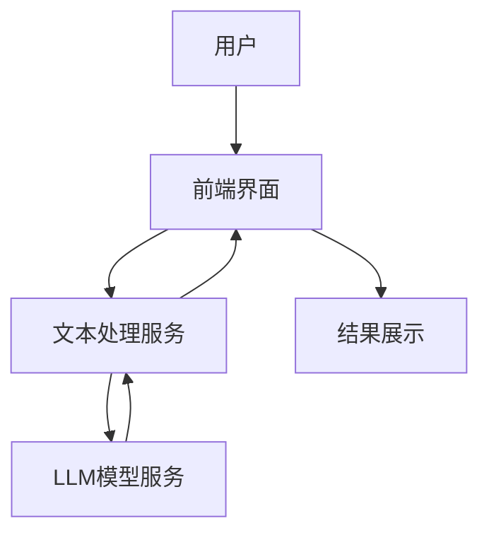

                 


# LLM在AI Agent中的文本纠错与改写应用

> 关键词：大语言模型（LLM）、AI Agent、文本纠错、文本改写、自然语言处理（NLP）

> 摘要：本文探讨了大语言模型（LLM）在AI Agent中的文本纠错与改写应用。通过分析LLM的核心原理，结合实际案例，详细讲解了LLM在AI Agent中的应用场景、实现机制及算法原理。文章还提供了系统架构设计、项目实战代码及优化建议，帮助读者全面理解并掌握LLM在文本处理中的应用。

---

## 第一部分: LLM在AI Agent中的文本纠错与改写概述

## 第1章: 背景与概述

### 1.1 问题背景

#### 1.1.1 文本纠错与改写的必要性
在人机交互场景中，文本纠错与改写是提升用户体验的关键环节。用户输入的文本可能存在语法错误、用词不当或表达不清的问题。AI Agent通过文本纠错与改写，能够帮助用户生成更准确、更流畅的表达，提升交互效率。

#### 1.1.2 LLM的崛起与应用潜力
近年来，大语言模型（LLM）如GPT-3、GPT-4等在自然语言处理（NLP）领域取得了显著进展。LLM具备强大的文本生成和理解能力，能够处理复杂的语言任务。AI Agent结合LLM的能力，可以实现智能化的文本纠错与改写。

#### 1.1.3 AI Agent在智能交互中的角色
AI Agent作为人机交互的桥梁，能够理解用户意图、提供个性化服务。在文本纠错与改写中，AI Agent通过LLM技术支持，能够实时处理用户输入，优化输出结果，提升用户体验。

### 1.2 核心概念

#### 1.2.1 大语言模型（LLM）的基本定义
大语言模型是一种基于深度学习的NLP模型，通过大量数据训练，能够理解和生成人类语言。LLM的核心在于其强大的上下文理解和生成能力。

#### 1.2.2 AI Agent的定义与功能
AI Agent是一种智能代理，能够感知环境、理解用户需求，并通过执行任务提供服务。在文本处理中，AI Agent结合LLM技术，实现文本纠错与改写功能。

#### 1.2.3 文本纠错与改写的实现机制
文本纠错涉及检测错误并进行修正，而文本改写则是优化表达，使其更符合上下文或用户意图。LLM通过生成模型，能够实现这两项任务。

### 1.3 应用场景

#### 1.3.1 自然语言处理中的纠错应用
在教育领域，AI Agent可以辅助学生纠正语法错误，提升写作能力。在客服系统中，AI Agent可以帮助用户生成准确的查询请求。

#### 1.3.2 AI Agent中的文本改写案例
AI Agent可以根据用户需求，将口语化表达转化为正式文本，或优化表达方式。例如，在商业沟通中，AI Agent可以将用户的大致想法转化为专业邮件。

#### 1.3.3 多语言支持与跨文化适应
LLM具备多语言处理能力，AI Agent可以通过LLM支持多种语言的纠错与改写，满足全球用户的需求。

### 1.4 本章小结
本章介绍了文本纠错与改写的必要性，分析了LLM的应用潜力，并阐述了AI Agent在文本处理中的角色和功能。

---

## 第二部分: LLM的核心原理与文本处理机制

## 第2章: 大语言模型（LLM）原理

### 2.1 LLM的基本原理

#### 2.1.1 模型结构与训练方法
LLM通常基于Transformer架构，通过自注意力机制和前馈网络处理输入文本。训练过程包括预训练和微调两个阶段。

#### 2.1.2 注意力机制与Transformer架构
注意力机制帮助模型关注输入文本中重要的部分，Transformer架构通过多层堆叠提升模型的表达能力。

#### 2.1.3 预训练与微调的流程
预训练阶段使用大规模通用文本数据训练模型，微调阶段针对特定任务（如文本纠错）进行优化。

### 2.2 文本纠错与改写的实现机制

#### 2.2.1 错误检测的算法原理
错误检测通常采用基于LLM的生成模型，通过对比输入和生成文本的差异来发现错误。

#### 2.2.2 文本改写的生成策略
文本改写基于LLM的生成能力，通过多轮生成和优化，提升文本的流畅性和准确性。

#### 2.2.3 基于LLM的纠错与改写模型
结合LLM的纠错与改写能力，AI Agent能够实时处理用户输入，提供准确的输出结果。

### 2.3 LLM与AI Agent的结合

#### 2.3.1 LLM在AI Agent中的角色
LLM作为AI Agent的核心组件，负责文本处理任务，提升交互体验。

#### 2.3.2 文本处理的实时性与准确性
通过优化LLM的推理速度和准确性，AI Agent能够实现实时的文本纠错与改写。

#### 2.3.3 模型的可解释性与优化方向
提升LLM的可解释性，优化模型性能，是未来研究的重要方向。

### 2.4 本章小结
本章详细讲解了LLM的基本原理，分析了其在文本纠错与改写中的应用机制。

---

## 第三部分: LLM在文本纠错与改写中的算法实现

## 第3章: 文本纠错算法原理

### 3.1 错误检测算法

#### 3.1.1 基于LLM的错误检测流程
输入文本经过LLM处理，生成潜在的错误位置和修改建议。

#### 3.1.2 错误类型与检测方法
错误类型包括语法错误、用词不当等，检测方法基于LLM的生成能力和上下文理解。

#### 3.1.3 错误修正策略
根据检测结果，生成修正建议，帮助用户优化文本表达。

### 3.2 文本改写算法

#### 3.2.1 基于LLM的改写模型
LLM通过生成模型，优化文本表达，使其更符合用户意图。

#### 3.2.2 多策略改写方法
结合多种改写策略，生成多样化的表达方式，提升文本的可读性。

#### 3.2.3 文本改写的评估指标
通过_bleu_、_rouge_等指标评估改写质量。

### 3.3 算法实现案例

#### 3.3.1 错误检测与修正的代码示例
```python
def detect_errors(text):
    # 使用LLM检测错误
    errors = model.detect_errors(text)
    return errors

def correct_text(text, errors):
    corrected = model.correct(text, errors)
    return corrected
```

#### 3.3.2 文本改写的实现代码
```python
def rewrite_text(text):
    rewritten = model.rewrite(text)
    return rewritten
```

### 3.4 本章小结
本章通过算法实现，详细讲解了基于LLM的文本纠错与改写方法。

---

## 第四部分: AI Agent的系统分析与架构设计

## 第4章: 系统分析与架构设计

### 4.1 问题场景介绍

#### 4.1.1 AI Agent的功能需求
AI Agent需要具备文本纠错与改写功能，支持实时交互。

#### 4.1.2 系统功能设计
系统功能包括文本输入、错误检测、改写生成、结果输出等。

#### 4.1.3 系统边界与外延
系统边界包括用户输入、模型调用、结果输出等，外延涉及用户反馈和模型优化。

### 4.2 系统功能设计

#### 4.2.1 领域模型设计
领域模型包括用户输入、错误检测模块、改写模块、结果输出模块。

#### 4.2.2 系统架构设计
系统架构采用微服务架构，包括前端、后端、模型服务等模块。

#### 4.2.3 系统交互流程
用户输入文本，系统调用LLM进行处理，生成结果并返回给用户。

### 4.3 系统架构图



### 4.4 本章小结
本章通过系统分析和架构设计，展示了AI Agent在文本纠错与改写中的实现方案。

---

## 第五部分: 项目实战与优化

## 第5章: 项目实战

### 5.1 环境配置

#### 5.1.1 安装依赖
安装Python和相关库，如`transformers`、`torch`等。

#### 5.1.2 配置LLM模型
选择合适的LLM模型，如GPT-2或GPT-3，并进行配置。

#### 5.1.3 API调用
通过API调用LLM模型，实现文本纠错与改写功能。

### 5.2 系统核心实现

#### 5.2.1 文本纠错与改写的实现代码
```python
from transformers import GPT2LMHeadModel, GPT2Tokenizer

tokenizer = GPT2Tokenizer.from_pretrained('gpt2')
model = GPT2LMHeadModel.from_pretrained('gpt2')

def correct_text(text):
    inputs = tokenizer.encode(text, return_tensors='pt')
    outputs = model.generate(inputs, max_length=50, num_beams=5)
    corrected = tokenizer.decode(outputs[0], skip_special_tokens=True)
    return corrected
```

#### 5.2.2 模型优化
通过微调模型，提升文本纠错与改写的准确性。

### 5.3 实际案例分析

#### 5.3.1 错误检测案例
输入文本："I have a dog, who is a good boy." LLM检测到语法错误，建议修改为"I have a dog who is a good boy."

#### 5.3.2 文本改写案例
输入文本："The project was successful." 改写为"The project was a great success."

### 5.4 项目小结
本章通过项目实战，展示了AI Agent在文本纠错与改写中的具体实现方法。

---

## 第六部分: 总结与展望

## 第6章: 总结与展望

### 6.1 本章总结
本文详细讲解了LLM在AI Agent中的文本纠错与改写应用，分析了其实现机制和系统架构。

### 6.2 未来展望
未来，LLM在AI Agent中的应用将更加广泛，模型的可解释性和实时性将得到进一步优化。

### 6.3 最佳实践Tips

#### 6.3.1 模型选择
根据具体需求选择合适的LLM模型，如较小模型适合实时性要求高的场景。

#### 6.3.2 数据优化
通过优化训练数据，提升模型的纠错与改写能力。

#### 6.3.3 系统设计
采用模块化设计，便于功能扩展和维护。

### 6.4 小结
本文通过理论分析和实际案例，展示了LLM在AI Agent中的应用潜力和实现方法。

---

## 附录: 拓展阅读

### 附录A: LLM与NLP技术的结合
介绍LLM在其他NLP任务中的应用，如文本摘要、机器翻译等。

### 附录B: AI Agent的其他应用场景
探讨AI Agent在智能客服、智能助手等领域的应用。

### 附录C: 开源工具与库
列出常用的NLP库和工具，如`transformers`、`spaCy`等。

---

通过以上结构，本文全面探讨了LLM在AI Agent中的文本纠错与改写应用，帮助读者深入了解相关技术的实现细节和应用潜力。

