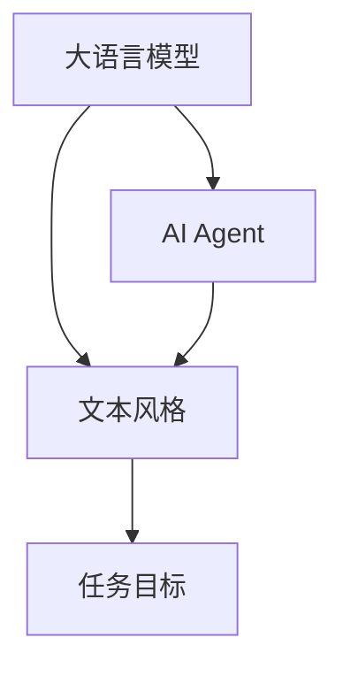
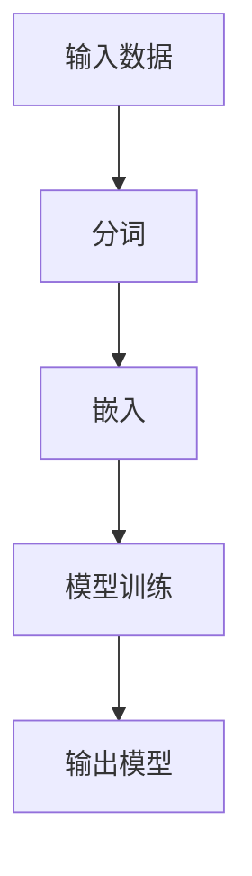
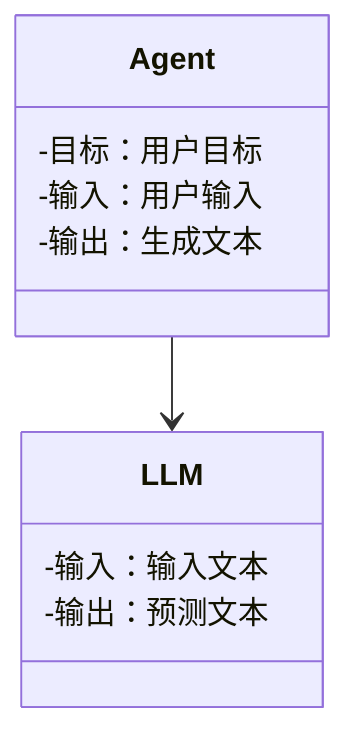
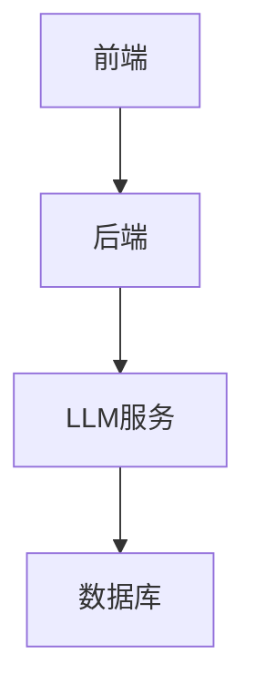
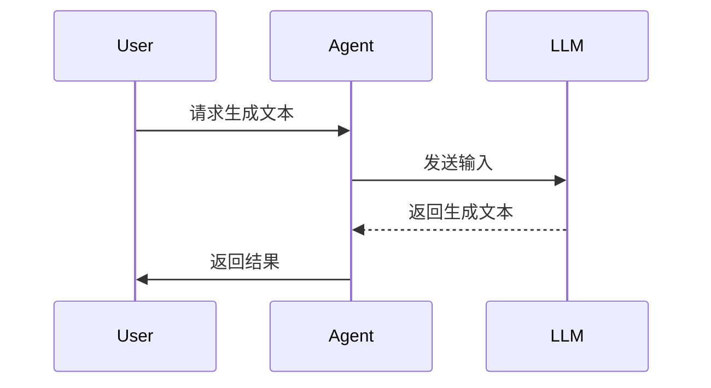

                 


# LLM在AI Agent中的文本风格一致性保持

## 关键词：LLM, AI Agent, 文本风格, 一致性保持, 自然语言处理, 深度学习

## 摘要：本文探讨了在AI Agent中利用大语言模型（LLM）保持文本风格一致性的方法。文章首先介绍了问题背景和核心概念，然后分析了LLM与AI Agent的关系，详细讲解了算法原理和系统架构设计，通过项目实战展示了具体实现，最后总结了最佳实践和注意事项。

---

# 目录

1. [背景介绍](#背景介绍)
2. [核心概念与联系](#核心概念与联系)
3. [算法原理与数学模型](#算法原理与数学模型)
4. [系统分析与架构设计](#系统分析与架构设计)
5. [项目实战](#项目实战)
6. [最佳实践与总结](#最佳实践与总结)

---

## 1. 背景介绍

### 1.1 问题背景

随着AI Agent在各个领域的广泛应用，保持生成文本的风格一致性变得至关重要。AI Agent需要能够理解用户意图并生成符合上下文和风格要求的文本。然而，现有的模型在风格一致性方面存在不足，导致生成文本缺乏连贯性和一致性。

### 1.2 核心概念与定义

- **大语言模型（LLM）**：基于深度学习的模型，能够理解和生成自然语言文本。
- **AI Agent**：能够感知环境并采取行动以实现目标的智能体。
- **文本风格一致性**：生成的文本在风格、语气和用词上保持一致。

### 1.3 问题描述与解决方案

AI Agent生成的文本可能风格不一致，影响用户体验。通过LLM的微调和特定策略的应用，可以实现风格一致性。解决方案包括数据预处理、模型微调和生成策略优化。

---

## 2. 核心概念与联系

### 2.1 LLM的核心原理

LLM通过大量数据训练，能够捕捉语言模式。其输入输出机制和可解释性是关键。

### 2.2 AI Agent的功能架构

AI Agent的输入输出流程、决策机制和交互模式决定了其生成文本的能力。

### 2.3 实体关系图



---

## 3. 算法原理与数学模型

### 3.1 LLM的训练流程



### 3.2 常见的LLM算法

- **Transformer**
- **BERT**
- **GPT**

### 3.3 数学模型

训练损失函数：
$$ \mathcal{L} = -\sum_{i=1}^{n} \log p(x_i) $$

优化器：Adam优化器，参数更新：
$$ \theta_{t+1} = \theta_t - \eta \nabla_{\theta} \mathcal{L} $$

---

## 4. 系统分析与架构设计

### 4.1 问题场景

AI Agent帮助用户撰写专业风格的邮件。

### 4.2 系统功能设计



### 4.3 系统架构设计



### 4.4 接口设计与交互流程

RESTful API：
```bash
POST /generate
Body: { "input": "..." }
```

交互流程：


---

## 5. 项目实战

### 5.1 环境安装

安装Python、TensorFlow和Hugging Face库。

### 5.2 核心代码实现

```python
from transformers import AutoModelForCausalLM, AutoTokenizer

model_name = "gpt2"
tokenizer = AutoTokenizer.from_pretrained(model_name)
model = AutoModelForCausalLM.from_pretrained(model_name)

def generate_text(prompt):
    inputs = tokenizer.encode(prompt, return_tensors="pt")
    outputs = model.generate(inputs, max_length=50, temperature=0.7, top_k=50)
    return tokenizer.decode(outputs[0], skip_special_tokens=True)
```

### 5.3 代码解读

- 加载预训练模型和分词器。
- `generate_text`函数生成符合风格的文本。

### 5.4 实际案例分析

通过案例分析展示生成过程，并总结经验教训。

---

## 6. 最佳实践与总结

### 6.1 小结

总结各章内容，强调LLM在AI Agent中的重要性。

### 6.2 注意事项

提醒读者注意数据隐私和模型泛化能力。

### 6.3 拓展阅读

推荐相关书籍和论文，鼓励深入学习。

---

通过以上内容，我们详细分析了LLM在AI Agent中的应用，从理论到实践，帮助读者全面理解并实现文本风格一致性保持。

