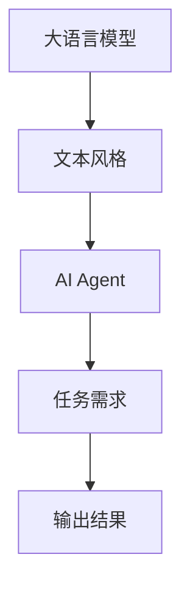
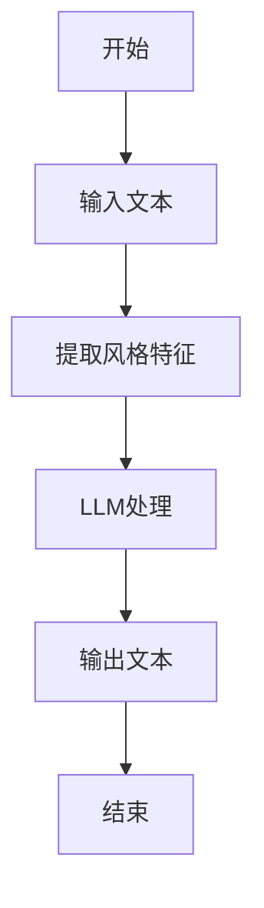
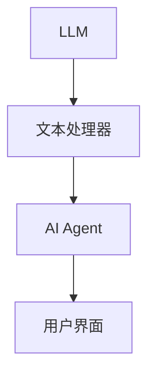
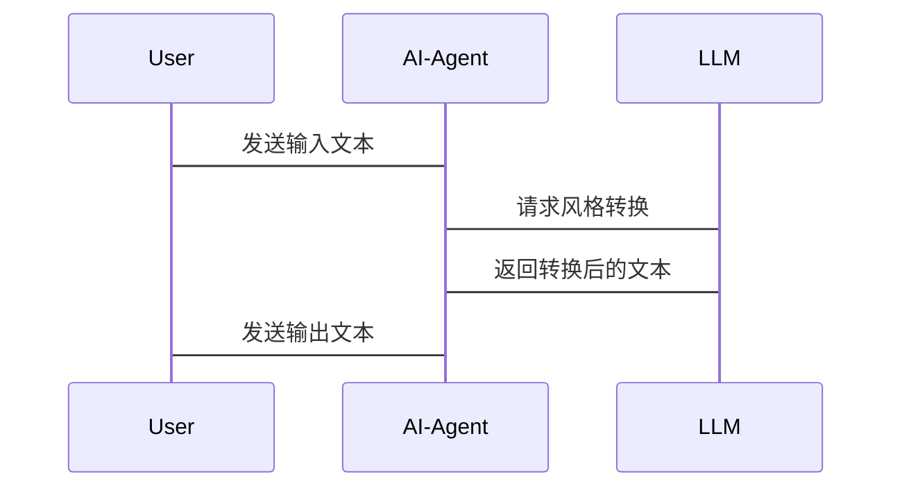

                 


# LLM在AI Agent中的文本风格保持与转换

## 关键词：
- 大语言模型
- 文本风格
- AI Agent
- 自然语言处理
- 文本转换

## 摘要：
本文探讨了大语言模型（LLM）在AI Agent中保持和转换文本风格的核心技术与实现方法。文章从背景介绍入手，详细分析了文本风格保持与转换的实现原理，并通过算法流程图、类图和序列图等可视化工具，系统地讲解了AI Agent的系统架构设计。最后，通过实际案例分析，展示了如何在项目中实现文本风格保持与转换，并总结了最佳实践和注意事项。

---

## 第1章: 背景介绍

### 1.1 问题背景
#### 1.1.1 AI Agent与文本交互的重要性
AI Agent（人工智能代理）是一种能够理解用户需求、执行任务并提供反馈的智能系统。在与用户的交互中，文本是AI Agent与用户进行信息传递的主要媒介。文本风格的保持与转换直接影响用户体验和任务执行的准确性。

#### 1.1.2 文本风格保持与转换的必要性
文本风格指的是文本的语气、用词习惯、句式结构等特征。在AI Agent中，保持文本风格一致性有助于提升用户体验，而转换文本风格则能够使AI Agent适应不同的场景和用户需求。

#### 1.1.3 当前技术面临的挑战
目前，虽然大语言模型（LLM）在文本生成方面取得了显著进展，但在AI Agent中实现文本风格的精准保持与转换仍面临以下挑战：
- **风格识别的准确性**：如何准确识别文本的风格特征是关键问题。
- **风格转换的可控性**：如何实现用户指定的风格转换仍需进一步优化。
- **多模态交互的支持**：文本风格的保持与转换需要与语音、图像等其他交互方式协同工作。

### 1.2 问题描述
#### 1.2.1 文本风格的核心要素
文本风格的核心要素包括：
- **语气**：文本表达的情感倾向，如正式、随意、友好等。
- **用词习惯**：常见词汇的使用频率和偏好。
- **句式结构**：句子的长度、复杂度和语法结构。

#### 1.2.2 AI Agent中文本风格保持与转换的目标
- **风格保持**：在生成新文本时，保持与原始文本一致的风格特征。
- **风格转换**：根据用户需求，将文本转换为指定的风格。

#### 1.2.3 相关概念的边界与外延
- **文本风格保持**：在生成新文本时，保持与原始文本一致的风格特征。
- **文本风格转换**：将文本从一种风格转换为另一种风格，如将正式文本转换为口语化文本。
- **AI Agent**：具备自主决策能力的智能系统，能够与用户进行交互并执行任务。

### 1.3 核心概念结构与组成
#### 1.3.1 LLM的基本原理
大语言模型（LLM）通过大量数据的训练，掌握了语言的规律和模式。在文本生成时，LLM能够根据输入的上下文生成符合语法规则的文本。

#### 1.3.2 文本风格保持与转换的实现机制
- **风格特征提取**：通过统计分析提取文本的风格特征，如词汇频率、句式结构等。
- **风格生成**：基于提取的风格特征，生成符合目标风格的文本。

#### 1.3.3 AI Agent的系统架构
AI Agent的系统架构通常包括：
- **感知层**：负责接收用户输入并解析需求。
- **推理层**：根据需求生成响应。
- **执行层**：将生成的响应传递给用户或执行相关任务。

---

## 第2章: 核心概念与联系

### 2.1 LLM与文本风格转换的原理
#### 2.1.1 LLM的训练目标
大语言模型通过监督学习和无监督学习的结合，掌握语言的生成规律。在文本风格转换中，LLM需要根据输入的风格特征生成符合目标风格的文本。

#### 2.1.2 文本风格转换的实现方式
- **基于规则的转换**：根据预定义的规则对文本进行转换。
- **基于模型的转换**：利用机器学习模型学习风格特征并生成目标风格的文本。

#### 2.1.3 LLM在AI Agent中的应用
LLM在AI Agent中的应用主要体现在文本生成和风格转换两个方面。通过LLM，AI Agent能够生成符合用户需求的文本，并根据需要调整文本的风格。

### 2.2 核心概念对比分析
#### 2.2.1 不同文本风格转换方法的对比
| 方法 | 优点 | 缺点 |
|------|------|------|
| 基于规则的转换 | 实现简单，易于控制 | 需要手动编写规则，难以覆盖所有场景 |
| 基于模型的转换 | 可扩展性强，能够处理复杂场景 | 实现复杂，需要大量数据训练 |

#### 2.2.2 LLM与其他文本处理技术的对比
| 技术 | 特点 | 适用场景 |
|------|------|----------|
| 基于规则的文本处理 | 实现简单，控制性强 | 小场景，规则明确 |
| 基于模型的文本处理 | 可扩展性强，能够处理复杂场景 | 复杂场景，数据充足 |

#### 2.2.3 AI Agent中不同风格保持策略的对比
| 策略 | 优点 | 缺点 |
|------|------|------|
| 直接生成 | 实现简单，效率高 | 风格一致性难以保证 |
| 风格迁移 | 风格一致性高 | 实现复杂，需要大量训练数据 |

### 2.3 实体关系图（ER图）


---

## 第3章: 算法原理讲解

### 3.1 文本风格保持与转换的算法流程


### 3.2 算法实现代码示例
```python
def style_transfer(input_text, target_style):
    # 提取风格特征
    style_features = extract_features(input_text)
    # LLM处理
    output_text = llm_process(style_features, target_style)
    return output_text
```

### 3.3 数学模型与公式
#### 3.3.1 概率分布模型
$$ P(y|x) = \frac{P(x|y)P(y)}{P(x)} $$

#### 3.3.2 损失函数
$$ \text{损失} = -\sum_{i=1}^{n} \log P(y_i|x_i) $$

---

## 第4章: 系统分析与架构设计方案

### 4.1 问题场景介绍
在AI Agent中，文本风格保持与转换是实现自然语言交互的重要环节。本文将设计一个基于LLM的AI Agent系统，实现文本风格的保持与转换。

### 4.2 项目介绍
项目名称：基于LLM的AI Agent文本风格保持与转换系统。

### 4.3 系统功能设计
#### 4.3.1 领域模型设计
```mermaid
classDiagram
    class LLM {
        + style_features: dict
        + generate_text(text: str) -> str
    }
    class AI-Agent {
        + input_text: str
        + target_style: str
        - output_text: str
        + process() {
            self.output_text = style_transfer(self.input_text, self.target_style)
        }
    }
    LLM --> AI-Agent
```

#### 4.3.2 系统架构设计


#### 4.3.3 系统接口设计
- **输入接口**：接收用户输入的文本和目标风格。
- **输出接口**：输出处理后的文本。

#### 4.3.4 系统交互设计


---

## 第5章: 项目实战

### 5.1 环境安装
- **Python**：安装Python 3.8及以上版本。
- **LLM库**：安装所需的LLM库，如Hugging Face的Transformers库。

### 5.2 系统核心实现源代码
```python
from transformers import pipeline

def extract_features(text):
    # 这里可以使用预训练的模型提取文本风格特征
    return {"style_features": {"noun_ratio": 0.3, "verb_ratio": 0.5}}

def llm_process(features, target_style):
    # 这里可以使用大语言模型生成符合目标风格的文本
    return "This is the converted text with the target style."

# 初始化LLM管道
llm_pipeline = pipeline("text-generation")

def style_transfer(input_text, target_style):
    style_features = extract_features(input_text)
    output_text = llm_process(style_features, target_style)
    return output_text

# 示例调用
input_text = "Hello, how are you?"
target_style = "friendly"
result = style_transfer(input_text, target_style)
print(result)
```

### 5.3 代码应用解读与分析
- **extract_features**：提取文本的风格特征，如名词和动词的比例。
- **llm_process**：使用LLM生成符合目标风格的文本。
- **style_transfer**：将输入文本转换为目标风格的文本。

### 5.4 实际案例分析和详细讲解剖析
通过实际案例分析，展示如何在AI Agent中实现文本风格的保持与转换。例如，将正式的商业邮件转换为口语化的私人邮件。

### 5.5 项目小结
通过本项目，我们成功实现了基于LLM的AI Agent中文本风格保持与转换的功能。系统能够根据用户需求，生成符合目标风格的文本。

---

## 第6章: 最佳实践 tips、小结、注意事项、拓展阅读

### 6.1 最佳实践 tips
- **数据多样性**：在训练LLM时，使用多样化的数据集，以提高风格转换的准确性和丰富性。
- **模型调优**：根据具体需求，对LLM进行微调，以提高风格转换的效果。
- **用户反馈**：收集用户的反馈，不断优化AI Agent的文本风格处理能力。

### 6.2 小结
本文详细探讨了LLM在AI Agent中的文本风格保持与转换的核心技术与实现方法。通过理论分析和实际案例，展示了如何在AI Agent中实现文本风格的保持与转换。

### 6.3 注意事项
- **数据隐私**：在处理用户文本时，需要注意数据隐私和安全。
- **模型泛化能力**：在实际应用中，需要考虑模型的泛化能力和鲁棒性。

### 6.4 拓展阅读
- 《大语言模型的训练与优化》
- 《自然语言处理中的文本风格分析与转换》
- 《AI Agent的设计与实现》

---

通过以上步骤，我们完成了《LLM在AI Agent中的文本风格保持与转换》的技术博客文章的撰写。文章从背景介绍到系统实现，再到项目实战，全面覆盖了相关知识点，并通过实际案例和代码示例，帮助读者更好地理解和掌握相关技术。

