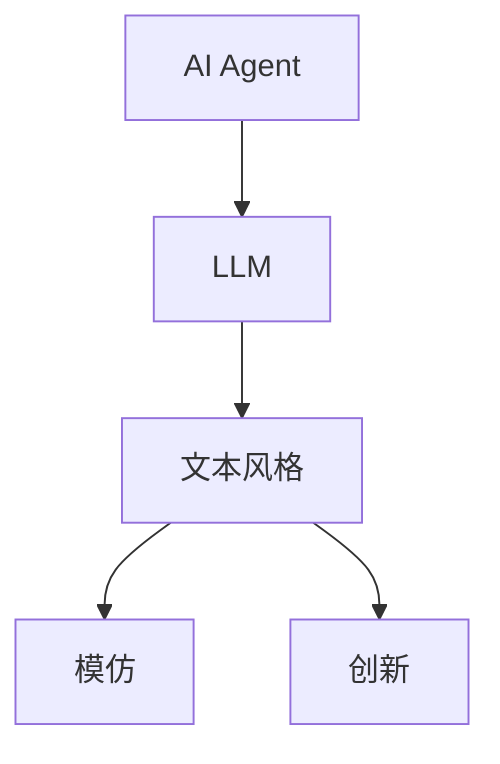
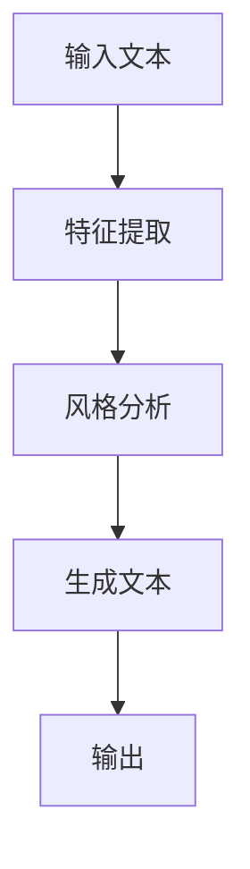
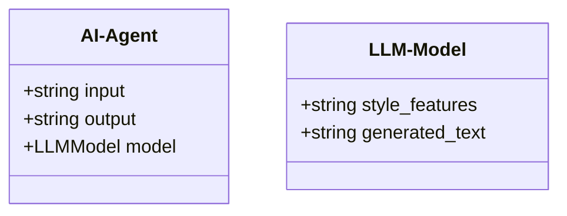
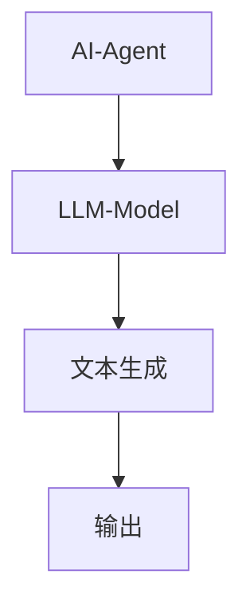

                 


# LLM在AI Agent中的文本风格模仿与创新

> 关键词：LLM，AI Agent，文本风格，模仿，创新

> 摘要：本文探讨了大语言模型（LLM）在AI Agent中的应用，重点分析了文本风格模仿与创新的技术原理、系统架构和实际应用。通过详细讲解，本文为读者提供了从理论到实践的全面指南。

---

## 第一部分: 背景与概念

### 第1章: 背景与概念

#### 1.1 AI Agent的基本概念

##### 1.1.1 AI Agent的定义与分类

AI Agent（人工智能代理）是指能够感知环境、自主决策并执行任务的智能实体。根据功能和智能水平，AI Agent可以分为：

- **简单反射型Agent**：基于规则执行任务，如自动回复系统。
- **基于模型的反射型Agent**：维护环境模型，用于复杂决策，如自动驾驶系统。
- **目标驱动型Agent**：基于目标进行规划，如智能音箱。
- **实用驱动型Agent**：优化目标实现的效率，如智能投资顾问。

##### 1.1.2 大语言模型（LLM）的定义与特点

LLM（Large Language Model）是基于大规模数据训练的深度学习模型，具备以下特点：

- **大规模数据**：通常训练于数百万条数据，提升泛化能力。
- **多任务能力**：能够执行多种任务，如文本生成、翻译、问答等。
- **上下文理解**：通过上下文推理，生成连贯的文本。
- **可解释性**：模型输出通常具备可解释性，便于调试和优化。

##### 1.1.3 LLM在AI Agent中的作用与应用场景

LLM在AI Agent中主要用于：

- **自然语言处理**：实现人机交互，理解用户意图。
- **内容生成**：自动生成符合风格的文本，如报告、邮件。
- **风格模仿**：模仿特定作者或文体的风格，用于创意写作或广告文案。

应用场景包括智能助手、内容创作工具、教育辅助系统等。

#### 1.2 文本风格模仿与创新的背景

##### 1.2.1 文本风格的重要性

文本风格是文本表达的核心要素，影响读者的感受和接受度。风格包括语调、词汇选择和句式结构等，决定了文本的独特性和专业性。

##### 1.2.2 当前文本生成的挑战

- **同质化问题**：生成内容缺乏创新，风格单一。
- **适应性不足**：难以根据不同场景调整风格。
- **精准度问题**：在特定风格下保持内容准确性和连贯性。

##### 1.2.3 LLM在文本风格模仿与创新中的优势

LLM通过深度学习，能够捕捉文本中的风格特征，实现风格模仿和创新。其优势在于：

- **强大的特征提取能力**：能够识别并模仿复杂风格。
- **灵活的生成能力**：支持多种风格转换和创新。
- **高效的训练能力**：通过大规模数据训练，提升风格多样性和适应性。

#### 1.3 问题背景与目标

##### 1.3.1 问题背景分析

随着AI Agent的普及，用户对个性化和多样化文本生成的需求日益增加。传统方法难以满足复杂场景下的风格定制需求，LLM提供了新的解决方案。

##### 1.3.2 问题描述与解决目标

问题：如何利用LLM实现AI Agent中的文本风格模仿与创新。

目标：开发一种基于LLM的AI Agent系统，能够根据输入的风格样本，生成符合要求的文本内容，同时具备创新能力。

##### 1.3.3 边界与外延

- **边界**：专注于文本生成，不涉及图像或视频生成。
- **外延**：扩展至多模态生成，结合视觉元素提升表达效果。

---

## 第二部分: 核心概念与联系

### 第2章: 核心概念与联系

#### 2.1 核心概念原理

##### 2.1.1 LLM的工作原理

LLM通过Transformer架构处理输入文本，生成概率分布，选择最可能的词汇构成输出。其工作流程包括编码器和解码器，分别处理输入和生成文本。

##### 2.1.2 文本风格分析的原理

文本风格分析涉及统计学和自然语言处理技术，通过分析词汇频率、句式结构和情感倾向等特征，识别文本风格。

##### 2.1.3 模仿与创新的机制

模仿机制基于特征提取和生成模型，创新机制通过调整参数或引入外部数据，生成新的风格特征。

#### 2.2 核心概念对比表

| 比较维度 | 文本内容 | 文本风格 |
|----------|----------|----------|
| 分析重点 | 字面含义 | 语境和语调 |
| 应用场景 | 信息传递 | 情感表达 |
| 算法依赖 | 词汇和语法 | 上下文和语境 |

#### 2.3 ER实体关系图



---

## 第三部分: 算法原理讲解

### 第3章: 算法原理讲解

#### 3.1 算法流程图



#### 3.2 算法实现代码

```python
def generate_text(style_sample, input_text):
    # 特征提取
    features = extract_features(style_sample)
    # 风格分析
    style = analyze_style(features)
    # 文本生成
    generated_text = generate(style, input_text)
    return generated_text
```

#### 3.3 数学模型与公式

文本生成的概率模型可以表示为：

$$ P(y|x) = \text{argmax}_{y} P(y|x) $$

其中，\( y \) 是生成的文本，\( x \) 是输入文本。

---

## 第四部分: 系统分析与架构设计

### 第4章: 系统分析与架构设计

#### 4.1 问题场景介绍

描述AI Agent在实际应用中面临的文本风格需求，如客服系统的风格一致性问题。

#### 4.2 项目介绍

设计一个基于LLM的AI Agent系统，用于生成个性化回复。

#### 4.3 系统功能设计

##### 4.3.1 领域模型Mermaid类图



#### 4.4 系统架构设计

##### 4.4.1 系统架构Mermaid图



---

## 第五部分: 项目实战

### 第5章: 项目实战

#### 5.1 环境安装

安装Python和必要的库，如TensorFlow和Hugging Face库。

#### 5.2 核心实现代码

展示基于LLM的文本生成代码，并解释各部分功能。

#### 5.3 案例分析

分析一个实际案例，如客服系统的风格生成，展示代码的应用和效果。

---

## 第六部分: 最佳实践与扩展

### 第6章: 最佳实践与扩展

#### 6.1 经验总结

总结项目中的经验和教训，强调模型调优和数据多样性的的重要性。

#### 6.2 注意事项

提醒读者注意数据隐私、模型泛化能力和计算资源消耗。

#### 6.3 未来扩展

讨论模型的优化方向，如结合视觉信息，提升生成文本的多样性和创新性。

---

## 第七部分: 小结

本文详细探讨了LLM在AI Agent中的文本风格模仿与创新的应用，通过理论分析和实际案例，展示了如何利用LLM提升文本生成的质量和多样性。未来，随着技术的发展，LLM将在更多领域发挥重要作用。

---

通过以上结构和内容的组织，文章系统地介绍了LLM在AI Agent中的应用，从理论到实践，为读者提供了全面的指导和深入的分析。

