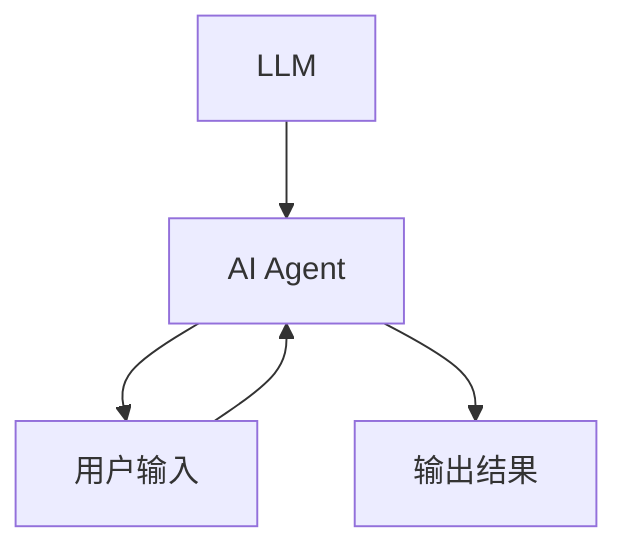
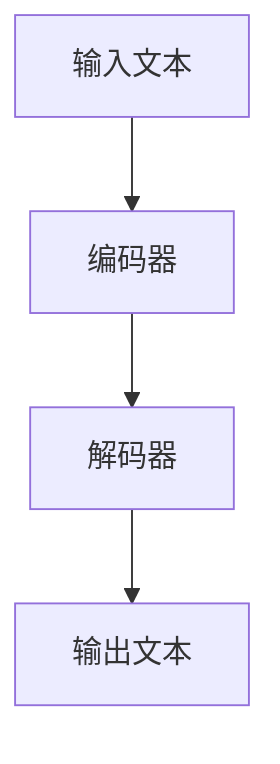
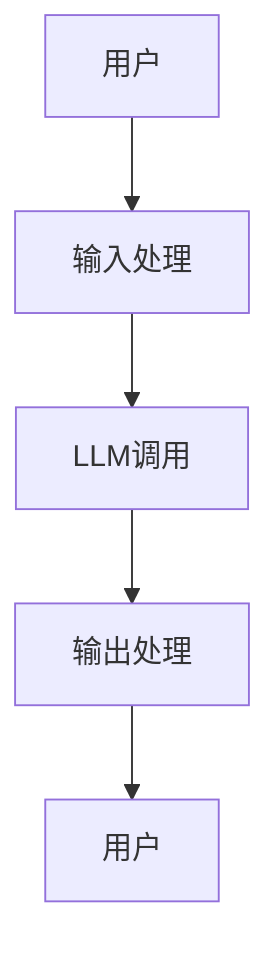

                 


# LLM在AI Agent中的文本风格融合与创新

---

## 关键词：  
LLM、AI Agent、文本风格、融合与创新、算法原理、系统架构、项目实战

---

## 摘要：  
本文探讨了如何在AI Agent中利用大语言模型（LLM）进行文本风格的融合与创新。文章从背景、核心概念、算法原理、系统架构、项目实战等多个方面展开，详细分析了LLM在AI Agent中的应用及其对文本风格的影响。通过实际案例和代码实现，展示了如何通过技术创新实现文本风格的融合与创新，为AI Agent的未来发展提供了有价值的参考。

---

# 第一部分: LLM在AI Agent中的文本风格融合与创新背景介绍

## 第1章: LLM与AI Agent的背景与概念

### 1.1 问题背景与描述  
随着人工智能技术的快速发展，AI Agent（智能代理）在各个领域的应用日益广泛。AI Agent能够通过与用户的交互，理解用户需求并提供相应的服务。然而，现有的AI Agent在文本生成方面存在一定的局限性，特别是在处理多样化的文本风格时，往往显得单一或不够自然。  
LLM（Large Language Model）的出现为解决这一问题提供了新的可能性。LLM具有强大的文本理解和生成能力，能够帮助AI Agent实现更复杂的文本交互，尤其是在文本风格的融合与创新方面。

### 1.2 核心概念与问题解决  
**AI Agent**：AI Agent是一种能够感知环境并采取行动以实现目标的智能系统。它可以分为简单Agent和复杂Agent，复杂Agent通常需要处理复杂的信息和任务，而LLM的引入使其具备了更强大的文本处理能力。  
**文本风格**：文本风格是指文本在表达方式、语言习惯、语气等方面的独特特征。不同的文本风格适用于不同的场景和用户群体。  
**文本风格融合与创新**：文本风格的融合是指将多种文本风格的特点结合起来，而创新则是在此基础上产生新的、独特的文本风格。

### 1.3 概念结构与核心要素  
通过对比分析表和实体关系图，我们可以更清晰地理解LLM与AI Agent之间的关系，以及文本风格融合与创新的具体实现方式。

---

# 第二部分: LLM与AI Agent的核心概念与联系

## 第2章: LLM的核心原理与实现

### 2.1 LLM的原理概述  
LLM基于Transformer架构，通过自注意力机制和前馈神经网络实现强大的文本生成能力。自注意力机制能够捕捉文本中的长距离依赖关系，使模型更好地理解上下文。前馈神经网络则用于将输入的序列转换为输出的序列。

### 2.2 AI Agent的系统架构  
AI Agent的系统架构通常包括输入处理模块、LLM调用模块和输出处理模块。输入处理模块负责接收用户的输入并进行预处理，LLM调用模块负责调用LLM模型生成文本，输出处理模块则将生成的文本进行格式化并返回给用户。

### 2.3 LLM与AI Agent的实体关系图  
通过Mermaid图，我们可以清晰地看到LLM与AI Agent之间的关系：



---

# 第三部分: LLM在AI Agent中的算法原理与数学模型

## 第3章: LLM的算法原理与流程

### 3.1 LLM的算法流程图  
以下是LLM的算法流程图：



### 3.2 Transformer模型的数学公式  
**自注意力机制公式**：  
$$\text{Attention}(Q,K,V) = \text{softmax}\left(\frac{QK^T}{\sqrt{d_k}}\right)V$$  
其中，$Q$、$K$、$V$分别是查询、键和值，$d_k$是键的维度。  

**前馈神经网络公式**：  
$$f(x) = \text{ReLU}(Wx + b)$$  
其中，$W$和$b$是权重矩阵和偏置项，$\text{ReLU}$是激活函数。

### 3.3 AI Agent的决策模型  
**决策树**：通过构建决策树，AI Agent可以在多个可能的文本风格中选择最合适的风格。  
**决策模型的数学表达**：  
$$P(a|s) = \text{softmax}(Ws + b)$$  
其中，$a$是动作（文本风格），$s$是状态，$W$和$b$是参数。

---

# 第四部分: LLM与AI Agent的系统分析与架构设计

## 第4章: 系统功能与架构设计

### 4.1 系统功能模块设计  
**输入处理模块**：接收用户的输入并进行预处理，例如分词、去停用词等。  
**LLM调用模块**：调用LLM模型生成文本，可以选择不同的文本风格进行生成。  
**输出处理模块**：将生成的文本进行格式化处理，例如调整语气、调整词汇复杂度等。  

### 4.2 系统架构设计图  
以下是系统的架构设计图：



### 4.3 接口设计与交互流程  
**接口设计**：通过REST API或WebSocket接口与用户进行交互。  
**交互流程图**：  


---

# 第五部分: LLM在AI Agent中的项目实战

## 第5章: 项目实战与案例分析

### 5.1 环境安装  
要运行以下代码，需要先安装Python和相关库，例如：  
```bash
pip install transformers torch
```

### 5.2 系统核心实现源代码  
以下是AI Agent的核心实现代码：

```python
from transformers import AutoTokenizer, AutoModelForCausalLM
import torch

class AIAgent:
    def __init__(self, model_name):
        self.tokenizer = AutoTokenizer.from_pretrained(model_name)
        self.model = AutoModelForCausalLM.from_pretrained(model_name)
    
    def generate_response(self, input_text, style='neutral'):
        inputs = self.tokenizer(input_text, return_tensors='pt')
        outputs = self.model.generate(**inputs, max_length=50, temperature=0.7)
        response = self.tokenizer.decode(outputs[0], skip_special_tokens=True)
        return response
```

### 5.3 代码应用解读与分析  
上述代码实现了AI Agent的基本功能，包括输入处理、模型调用和输出生成。通过调整`temperature`参数，可以控制生成文本的创意程度，从而实现不同风格的文本生成。

### 5.4 实际案例分析  
假设用户希望生成一段带有幽默风格的文本，可以通过以下代码实现：

```python
agent = AIAgent('gpt2')
response = agent.generate_response('今天天气不错哦！', style='humorous')
print(response)
```

---

# 第六部分: 总结与最佳实践

## 第6章: 总结与最佳实践

### 6.1 小结  
本文详细探讨了LLM在AI Agent中的文本风格融合与创新，通过理论分析和实际案例展示了如何实现多样化的文本风格生成。通过本文的讲解，读者可以深入了解LLM的核心原理以及在AI Agent中的具体应用。

### 6.2 最佳实践  
1. **选择合适的LLM模型**：根据具体需求选择适合的模型，例如GPT-2、GPT-3等。  
2. **调整参数**：通过调整`temperature`和`top_k`等参数，可以控制生成文本的风格和质量。  
3. **结合领域知识**：在特定领域中，可以结合领域知识进一步优化文本风格。  
4. **持续优化**：通过用户反馈不断优化模型，提升生成文本的质量和自然度。

### 6.3 注意事项  
- 在实际应用中，需要注意生成文本的合规性和安全性，避免生成不当内容。  
- 对于大规模数据训练的模型，需要考虑计算资源和训练时间。  

### 6.4 拓展阅读  
推荐读者进一步阅读以下内容：  
- GPT模型的论文：[Attention Is All You Need](https://arxiv.org/abs/1706.03798)  
- AI Agent的经典书籍：《人工智能：现代Approach》  

---

通过本文的讲解，读者可以深入了解LLM在AI Agent中的应用，掌握文本风格融合与创新的核心技术，并能够通过实际案例实现自己的AI Agent系统。希望本文对读者在AI Agent和LLM的研究与应用中有所帮助。

