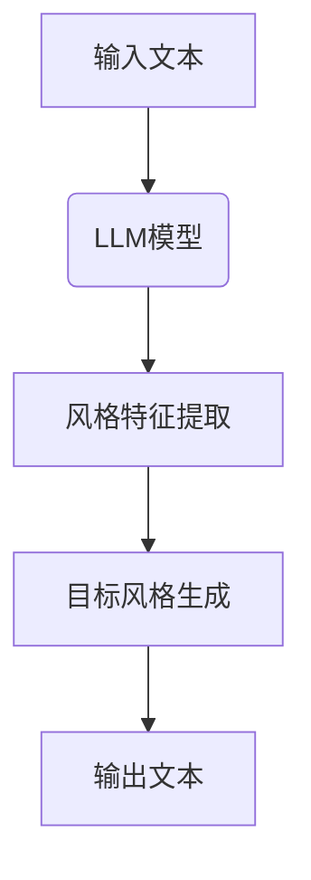
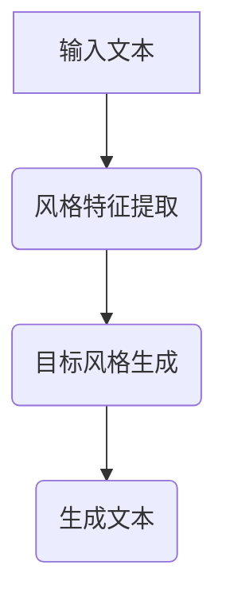
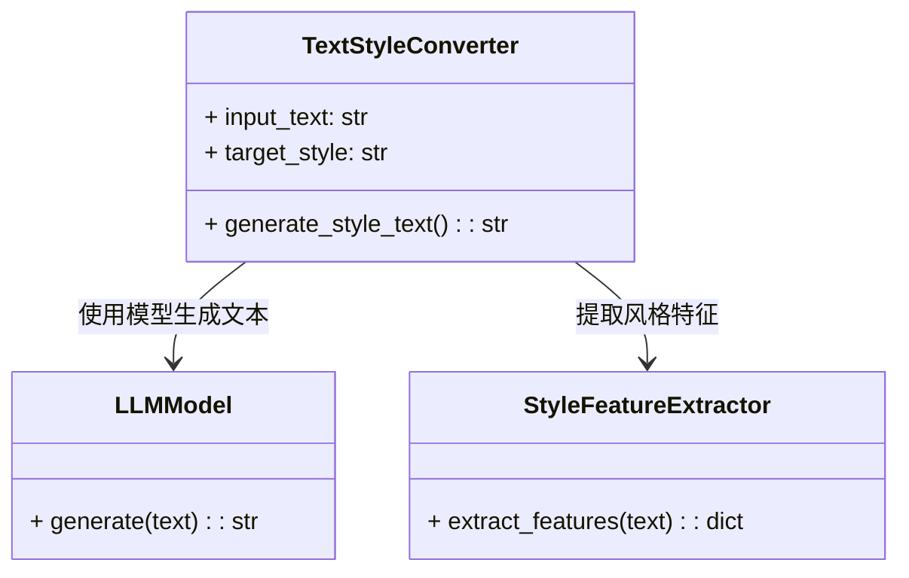

                 


# LLM在AI Agent中的文本风格转换与保持

## 关键词：LLM, AI Agent, 文本风格转换, 风格保持, NLP

## 摘要：  
随着大语言模型（LLM）在AI Agent中的广泛应用，文本风格转换与保持成为实现自然流畅人机交互的关键技术。本文从背景介绍、核心概念、算法原理、系统架构、项目实战、最佳实践等方面，全面解析LLM在AI Agent中的文本风格转换与保持的技术细节，结合实际案例和代码实现，深入探讨其应用价值和未来发展方向。

---

## 第一章: 背景介绍

### 1.1 问题背景  
AI Agent作为人机交互的重要载体，需要在不同场景下灵活调整文本输出的风格，以满足用户需求。例如，在客服系统中，AI Agent需要使用正式且礼貌的语言；在社交媒体中，则需要更随意和活泼的表达方式。然而，现有的LLM在处理风格转换时，往往难以准确捕捉用户意图，导致输出文本风格不一致或不符合场景需求。

### 1.2 问题描述  
文本风格转换的核心问题在于如何在保持文本内容不变的情况下，调整其表达方式，使其符合特定的风格要求。LLM虽然具有强大的语言生成能力，但在风格转换与保持方面仍面临以下挑战：  
1. **风格特征提取**：如何准确识别文本中的风格特征？  
2. **风格保持与生成的平衡**：如何在转换过程中既保持原文的核心信息，又生成符合目标风格的文本？  
3. **多风格场景下的适应性**：如何在复杂场景中灵活切换不同的风格？

### 1.3 问题解决  
通过结合LLM的生成能力和风格控制技术，可以实现文本风格的灵活转换与保持。本文将重点探讨以下解决方案：  
1. **基于LLM的风格控制技术**：通过调整模型的参数或引入风格控制令牌，实现对生成文本风格的精准控制。  
2. **风格特征提取与重构**：通过预训练模型提取文本的风格特征，并将其应用于目标风格的生成。  
3. **多风格模型设计**：构建一个多风格模型，能够同时处理多种风格的文本生成任务。

### 1.4 边界与外延  
文本风格转换的边界在于：  
1. **输入文本的质量**：低质量的输入可能影响风格转换的效果。  
2. **目标风格的多样性**：过于多样化的风格需求可能增加模型的复杂性。  
3. **应用场景的限制**：某些特定场景下，风格转换可能受到限制，例如实时交互中的性能要求。

### 1.5 概念结构与核心要素  
文本风格转换的核心要素包括：  
1. **输入文本**：需要转换风格的原始文本。  
2. **目标风格**：用户指定的风格类型，例如“正式”、“随意”、“技术性”等。  
3. **风格特征**：文本中反映风格的关键特征，例如词汇选择、句式结构、语气等。  
4. **转换模型**：负责将输入文本转换为目标风格的模型或算法。  
5. **评估指标**：用于衡量风格转换效果的指标，例如相似度、保真度等。

---

## 第二章: 核心概念与联系  

### 2.1 核心概念原理  
1. **LLM的基本工作原理**：  
   大语言模型通过预训练掌握了大量语言知识，能够生成与输入上下文相符的文本。  
2. **文本风格转换的实现机制**：  
   通过调整模型的输出策略或引入风格控制令牌，实现对生成文本风格的控制。  
3. **风格保持的关键技术**：  
   通过引入风格特征提取模块，确保生成文本在风格上与输入文本保持一致。

### 2.2 核心概念对比  

| 对比维度       | 基于LLM的风格转换 | 基于规则的风格转换 | 基于小样本微调的风格转换 |
|----------------|------------------|---------------------|--------------------------|
| **实现复杂度** | 高               | 低                  | 中                      |
| **生成质量**   | 高               | 中                  | 高                      |
| **灵活性**     | 高               | 低                  | 中                      |

### 2.3 系统架构  



---

## 第三章: 算法原理  

### 3.1 算法流程  



### 3.2 核心代码  

```python
def style_transfer(input_text, target_style):
    # 提取输入文本的风格特征
    style_features = extract_style_features(input_text)
    # 调整模型参数以匹配目标风格
    adjusted_features = adjust_features(style_features, target_style)
    # 生成目标风格的文本
    output_text = generate_text(adjusted_features)
    return output_text
```

### 3.3 数学公式  

$$ P(y|x) = \text{模型生成概率} $$  
$$ \text{目标风格} = f(P(y|x), \text{目标风格特征}) $$  

---

## 第四章: 系统分析与架构设计  

### 4.1 问题场景介绍  
以一个AI Agent在客服系统中的应用为例，分析其文本风格转换需求：  
1. **输入文本**：用户的问题描述。  
2. **目标风格**：正式、礼貌且简洁。  

### 4.2 系统功能设计  



---

## 第五章: 项目实战  

### 5.1 环境安装  
1. Python 3.8+  
2. PyTorch 1.9+  
3. Hugging Face库  

### 5.2 核心代码实现  

```python
from transformers import AutoTokenizer, AutoModelForCausalLM
import torch

class StyleConverter:
    def __init__(self, model_name):
        self.tokenizer = AutoTokenizer.from_pretrained(model_name)
        self.model = AutoModelForCausalLM.from_pretrained(model_name)
    
    def convert_style(self, input_text, target_style):
        inputs = self.tokenizer.encode(input_text, return_tensors="pt")
        with torch.no_grad():
            outputs = self.model.generate(inputs, max_length=50)
        return self.tokenizer.decode(outputs[0], skip_special_tokens=True)
```

### 5.3 实际案例分析  
1. **输入文本**：用户的问题描述。  
2. **目标风格**：正式、礼貌且简洁。  
3. **转换结果**：生成符合目标风格的文本。

---

## 第六章: 最佳实践  

### 6.1 经验总结  
1. **数据质量**：确保输入文本的质量对风格转换效果至关重要。  
2. **模型调参**：根据具体场景调整模型参数，以优化生成效果。  
3. **风格多样性**：在处理多样化的风格需求时，建议采用多风格模型。

### 6.2 小结  
通过本文的详细讲解，读者可以深入了解LLM在AI Agent中的文本风格转换与保持的技术细节，并通过实际案例和代码实现，掌握其具体应用方法。

### 6.3 注意事项  
1. 在实际应用中，需注意文本风格的多样性和复杂性可能会影响模型的性能。  
2. 风格转换的效果依赖于模型的训练数据和目标风格的定义，需根据具体需求进行调整。

### 6.4 拓展阅读  
推荐阅读以下资料，深入了解相关技术：  
1. Hugging Face的官方文档。  
2. 最新NLP领域的研究论文。

---

## 第七章: 未来展望  

### 7.1 技术发展趋势  
1. **多模态风格转换**：结合视觉和听觉信息，实现更丰富的风格表达。  
2. **自适应风格转换**：根据用户实时反馈，动态调整文本风格。  

### 7.2 挑战与机遇  
1. **挑战**：如何在复杂场景中实现高效的风格转换与保持？  
2. **机遇**：通过技术创新，进一步提升LLM的风格转换能力，拓展其应用场景。

---

以上是文章的完整大纲和内容。

