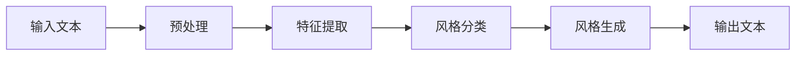
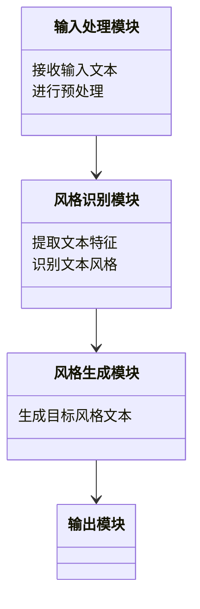

                 


# LLM在AI Agent中的文本风格转换应用

> 关键词：LLM, AI Agent, 文本风格转换, 自然语言处理, 深度学习

> 摘要：本文探讨了大语言模型（LLM）在AI Agent中的文本风格转换应用，分析了LLM与AI Agent的核心概念、算法原理及系统架构设计，结合实际项目案例，详细讲解了文本风格转换的实现过程，并总结了最佳实践和未来发展方向。

---

## 第一部分: 背景介绍

### 第1章: 大语言模型（LLM）与AI Agent概述

#### 1.1 大语言模型（LLM）的基本概念
- **1.1.1 什么是大语言模型**  
  大语言模型（Large Language Model, LLM）是一种基于深度学习的自然语言处理模型，通过大量文本数据的训练，能够理解并生成人类语言。

- **1.1.2 LLM的核心特点**  
  - 数据驱动：依赖大量标注数据进行训练。  
  - 深度学习：使用多层神经网络结构，如Transformer架构。  
  - 上下文理解：能够捕捉文本的上下文关系，生成连贯的回答。

- **1.1.3 LLM的应用场景**  
  - 自然语言理解（NLU）：文本分类、问答系统。  
  - 自然语言生成（NLG）：文本摘要、机器翻译。  

#### 1.2 AI Agent的基本概念
- **1.2.1 什么是AI Agent**  
  AI Agent（人工智能代理）是指能够感知环境并采取行动以实现目标的智能实体。

- **1.2.2 AI Agent的核心功能**  
  - 感知环境：通过传感器或接口获取信息。  
  - 决策与行动：基于感知信息做出决策并执行行动。  
  - 学习与优化：通过反馈不断优化自身行为。

- **1.2.3 AI Agent的应用领域**  
  - 机器人控制：智能家居、工业机器人。  
  - 虚拟助手：智能音箱、智能手机助手。  
  - 自动驾驶：车辆控制、路径规划。

#### 1.3 文本风格转换的背景与意义
- **1.3.1 文本风格转换的定义**  
  文本风格转换是指将一种风格的文本转换为另一种风格的过程，例如将正式风格转换为口语风格。

- **1.3.2 文本风格转换的应用场景**  
  - 内容创作：个性化内容生成。  
  - 信息传递：适应不同受众的需求。  
  - 跨語言通信：帮助不同语言背景的人进行交流。

- **1.3.3 文本风格转换的重要性**  
  通过风格转换，可以提高内容的可读性、可理解性和适用性，满足多样化的用户需求。

---

### 第2章: LLM在AI Agent中的应用背景

#### 2.1 LLM作为AI Agent的核心模块
- LLM为AI Agent提供了强大的自然语言处理能力，使其能够理解并生成人类语言。

#### 2.2 文本风格转换在AI Agent中的作用
- 文本风格转换帮助AI Agent根据不同的场景和用户需求，调整输出文本的风格，提升用户体验。

---

## 第二部分: 核心概念与联系

### 第3章: LLM与AI Agent的核心概念

#### 3.1 LLM的核心原理
- **3.1.1 概率语言模型的定义**  
  概率语言模型将文本生成视为概率分布问题，通过计算每个词的条件概率来生成文本。

- **3.1.2 深度学习在LLM中的应用**  
  使用深度神经网络（如Transformer架构）训练模型，通过反向传播算法优化模型参数。

- **3.1.3 注意力机制与Transformer架构**  
  注意力机制帮助模型关注输入文本中重要的部分，Transformer架构通过自注意力机制捕捉长距离依赖关系。

#### 3.2 AI Agent的核心原理
- **3.2.1 AI Agent的感知与决策机制**  
  AI Agent通过传感器或接口获取环境信息，基于感知信息进行决策。

- **3.2.2 基于LLM的自然语言处理能力**  
  AI Agent利用LLM进行文本理解和生成，实现与用户的自然语言交互。

- **3.2.3 AI Agent的自主学习与优化**  
  通过强化学习等方法，AI Agent可以根据反馈优化自身的决策和行为。

#### 3.3 LLM与AI Agent的关系
- **3.3.1 LLM作为AI Agent的核心模块**  
  LLM为AI Agent提供自然语言处理能力，使其能够理解和生成人类语言。

- **3.3.2 AI Agent对LLM的扩展与应用**  
  AI Agent利用LLM的能力，扩展其应用场景，如智能客服、自动化写作。

- **3.3.3 LLM与AI Agent的协同工作模式**  
  LLM作为AI Agent的智能核心，AI Agent为LLM提供应用场景和反馈。

### 第4章: 文本风格转换的核心概念

#### 4.1 文本风格转换的定义与分类
- **4.1.1 文本风格转换的定义**  
  将一种风格的文本转换为另一种风格的过程。

- **4.1.2 文本风格转换的分类**  
  - 基于规则的风格转换：通过预定义的规则进行文本替换。  
  - 基于统计的风格转换：利用统计模型学习风格特征。  
  - 基于深度学习的风格转换：使用神经网络模型进行风格迁移。

---

## 第三部分: 算法原理

### 第5章: 文本风格转换的算法原理

#### 5.1 转换模型的数学基础
- **概率生成模型**  
  使用概率分布生成文本，目标是最大化生成文本的概率。  
  $$ P(y|x) = \frac{P(x,y)}{P(x)} $$

- **损失函数**  
  使用交叉熵损失函数衡量生成文本与目标风格文本的差异。  
  $$ \text{Loss} = -\sum_{i=1}^{n} \log P(y_i|x) $$

#### 5.2 转换模型的实现流程
- **预处理**：对输入文本进行清洗和格式化。  
- **特征提取**：提取文本的特征表示，如词向量。  
- **风格分类**：基于特征表示对文本风格进行分类。  
- **风格生成**：根据目标风格生成新的文本。

#### 5.3 算法实现的Mermaid流程图


---

## 第四部分: 系统架构设计

### 第6章: 系统架构设计

#### 6.1 系统功能设计
- **输入处理模块**：接收输入文本并进行预处理。  
- **风格识别模块**：识别文本的当前风格。  
- **风格生成模块**：生成目标风格的文本。  
- **输出模块**：将生成的文本输出给用户。

#### 6.2 系统架构的Mermaid图


---

## 第五部分: 项目实战

### 第7章: 项目实战

#### 7.1 环境安装
- 需要安装Python、TensorFlow、Keras等依赖库。

#### 7.2 核心代码实现
```python
import tensorflow as tf
from tensorflow.keras import layers

def style_transfer_model(input_shape, style_features):
    model = tf.keras.Sequential()
    model.add(layers.InputLayer(input_shape))
    model.add(layers.Dense(128, activation='relu'))
    model.add(layers.Dense(style_features))
    return model

def loss_function(y_true, y_pred):
    return tf.keras.losses.binary_crossentropy(y_true, y_pred)

model = style_transfer_model((100, 100, 3), 128)
model.compile(optimizer='adam', loss=loss_function)
model.fit(x_train, y_train, epochs=10, batch_size=32)
```

#### 7.3 案例分析
- 输入文本：正式风格的邮件。  
- 转换目标：口语风格的短信。  
- 输出结果：生成的口语风格短信。

---

## 第六部分: 总结与展望

### 第8章: 总结与展望

#### 8.1 小结
本文详细探讨了LLM在AI Agent中的文本风格转换应用，从背景介绍到算法实现，再到系统设计和项目实战，全面分析了该技术的核心内容。

#### 8.2 注意事项
- 数据质量对风格转换效果影响较大，需确保训练数据的多样性和代表性。  
- 模型的泛化能力需要进一步优化，以应对不同风格的文本转换需求。

#### 8.3 拓展阅读
- 《Deep Learning for Text: A Tutorial》  
- 《Neural Networks and Representation Learning for NLP》

---

通过以上内容，您已经了解了LLM在AI Agent中的文本风格转换应用的各个方面，包括核心概念、算法原理、系统设计和实际案例。希望本文能为您提供有价值的技术洞察和实践指导。

