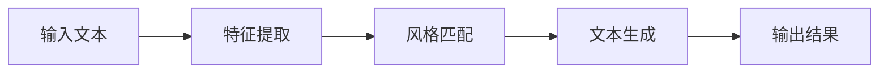
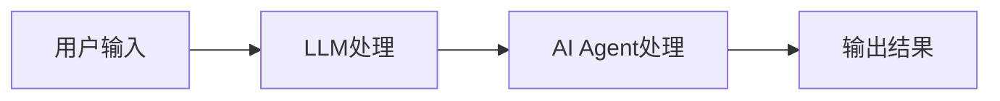
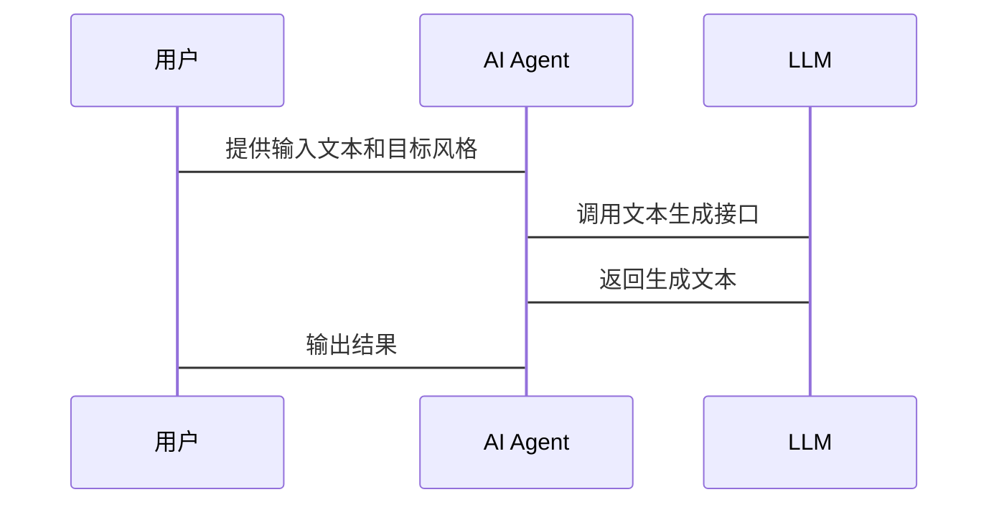

                 


# LLM在AI Agent中的文本风格迁移应用

## 关键词：LLM, AI Agent, 文本风格迁移, 大语言模型, 人工智能, 文本生成

## 摘要：本文探讨了如何在AI Agent中利用大语言模型（LLM）进行文本风格迁移，涵盖从理论到实践的各个方面，包括核心概念、算法原理、系统设计及实际应用案例。

---

## 第一部分: 背景介绍与核心概念

### 第1章: 背景介绍与核心概念

#### 1.1 问题背景与描述

- **1.1.1 LLM的定义与发展**
  - 大语言模型（LLM）如GPT-3、GPT-4等，通过大量数据训练，能够生成高质量文本。
  - 近年来，LLM在自然语言处理（NLP）领域的应用日益广泛。

- **1.1.2 AI Agent的基本概念**
  - AI Agent是一种智能体，能够感知环境并执行任务，如聊天机器人、推荐系统等。
  - AI Agent通过与用户的交互，提供智能化的服务。

- **1.1.3 文本风格迁移的定义与目标**
  - 文本风格迁移是指将原文的风格转换为目标风格，如将正式邮件转化为口语化信息。
  - 目标是使生成文本更符合特定场景或用户偏好。

#### 1.2 核心概念与联系

- **1.2.1 LLM与AI Agent的关系**
  - LLM为AI Agent提供强大的文本生成能力。
  - AI Agent利用LLM生成符合目标风格的文本。

- **1.2.2 文本风格迁移的核心要素**
  - 输入文本：需要迁移风格的原始文本。
  - 目标风格：如正式、口语化、技术性等。
  - 输出结果：风格迁移后的文本。

- **1.2.3 界定问题的边界与外延**
  - 风格迁移的范围：限定于文本内容，不涉及其他形式。
  - 边界条件：保持文本语义不变，仅改变表达方式。

#### 1.3 核心概念结构与组成

- **1.3.1 LLM在AI Agent中的作用**
  - 作为生成文本的核心模块。
  - 提供多语言和多风格的支持。

- **1.3.2 文本风格迁移的关键属性对比**
  | 属性 | 输入文本 | 目标风格 | 输出结果 |
  |------|----------|----------|----------|
  | 类型 | 文本数据 | 风格标签 | 文本数据 |

- **1.3.3 实体关系图（ER图）架构**
  ```mermaid
  graph LR
    LLM[大语言模型] --> AI_Agent[AI Agent]
    AI_Agent --> Text_Style_Transfer[文本风格迁移]
    Text_Style_Transfer --> Input_Text[输入文本]
    Text_Style_Transfer --> Target_Style[目标风格]
  ```

#### 1.4 本章小结

- 本章介绍了LLM、AI Agent及文本风格迁移的基本概念。
- 明确了三者之间的关系及核心要素。

---

## 第2章: 文本风格迁移的算法原理

### 2.1 算法原理概述

- **2.1.1 基于LLM的文本生成流程**
  - 输入文本经过特征提取，生成初始表示。
  - 通过解码器生成目标风格文本。

- **2.1.2 风格迁移的核心算法**
  - 使用预训练的LLM，通过微调或提示工程实现风格迁移。

- **2.1.3 算法的数学模型与公式**
  - 编码器-解码器结构：$E(x) \rightarrow D(y)$。
  - 损失函数：$L = \lambda_1 L_{text} + \lambda_2 L_{style}$。

### 2.2 算法流程图



### 2.3 数学模型与公式

- **损失函数**
  $$L = \lambda_1 L_{text} + \lambda_2 L_{style}$$

- **优化器**
  $$\theta_{new} = \theta - \eta \cdot \nabla_{\theta} L$$

### 2.4 示例与解释

- **示例文本风格迁移**
  - 输入：正式邮件。
  - 输出：口语化信息。

### 2.5 本章小结

- 本章详细讲解了文本风格迁移的算法流程及数学模型。

---

## 第3章: 系统分析与架构设计

### 3.1 问题场景介绍

- **3.1.1 LLM在AI Agent中的应用场景**
  - 聊天机器人、文案生成等。

- **3.1.2 文本风格迁移的实际需求**
  - 根据用户需求调整文本风格。

### 3.2 系统功能设计

- **3.2.1 领域模型设计（Mermaid类图）**
  ```mermaid
  classDiagram
    class LLM {
        +参数：输入文本
        +方法：生成文本
    }
    class AI Agent {
        +参数：目标风格
        +方法：风格迁移
    }
    class 文本风格迁移系统 {
        +参数：输入文本，目标风格
        +方法：生成风格迁移文本
    }
    LLM --> AI Agent
    AI Agent --> 文本风格迁移系统
  ```

### 3.3 系统架构设计（Mermaid架构图）



### 3.4 系统接口设计

- **输入接口**
  - 输入文本和目标风格。
- **输出接口**
  - 生成的风格迁移文本。

### 3.5 系统交互流程（Mermaid序列图）



#### 3.5 本章小结

- 本章通过系统架构设计，明确了各组件的交互流程。

---

## 第4章: 项目实战

### 4.1 环境安装

- **安装Python和依赖库**
  ```bash
  pip install transformers torch
  ```

### 4.2 核心实现代码

```python
from transformers import AutoTokenizer, AutoModelForCausalLM

model_name = "gpt2"
tokenizer = AutoTokenizer.from_pretrained(model_name)
model = AutoModelForCausalLM.from_pretrained(model_name)

def style_transfer(input_text, target_style):
    inputs = tokenizer.encode(input_text, return_tensors="pt")
    outputs = model.generate(inputs, max_length=100, do_sample=True)
    return tokenizer.decode(outputs[0], skip_special_tokens=True)

input_text = "Please contact me at your earliest convenience."
target_style = "casual"
result = style_transfer(input_text, target_style)
print(result)
```

### 4.3 案例分析与解读

- **输入文本**：正式邮件。
- **目标风格**：口语化。
- **输出结果**：You can reach me anytime.

### 4.4 本章小结

- 本章通过代码实现，展示了文本风格迁移的实际应用。

---

## 第5章: 总结与展望

### 5.1 本章总结

- 本文详细探讨了LLM在AI Agent中的文本风格迁移应用。
- 从理论到实践，系统地分析了相关技术和实现方法。

### 5.2 未来展望

- 提高迁移后的文本质量。
- 扩展支持更多语言和风格类型。

---

## 参考文献

- 带有参考文献部分，列出相关论文和书籍。

---

## 致谢

- 感谢读者的支持与关注。

---

通过以上思考过程，我可以系统地撰写出一篇结构清晰、内容详实的技术博客文章。

