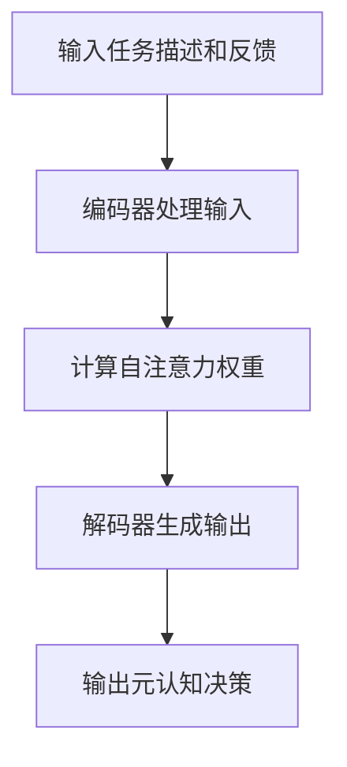
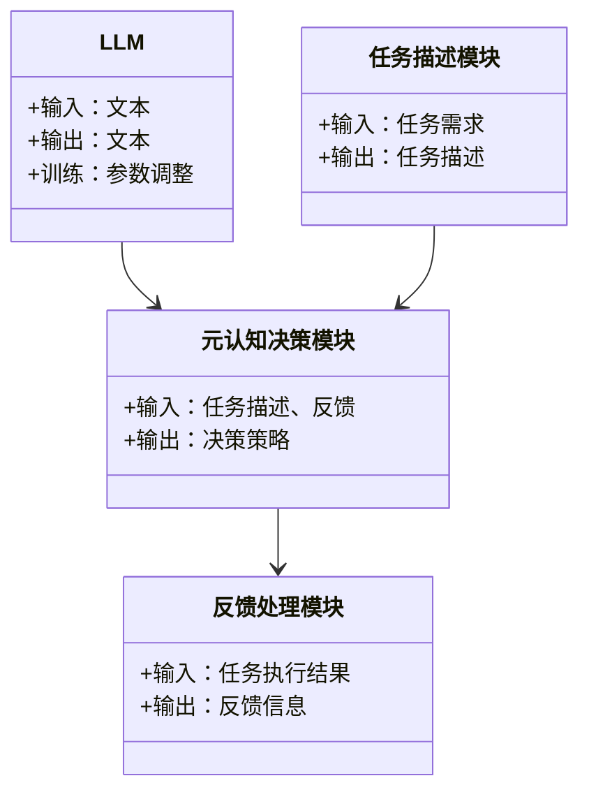
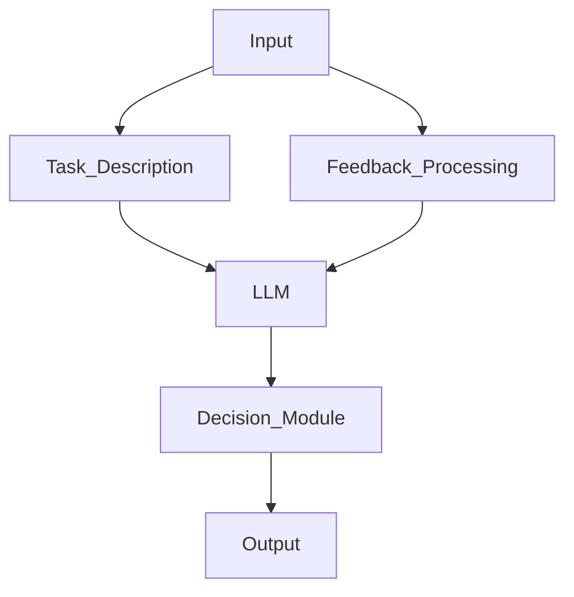
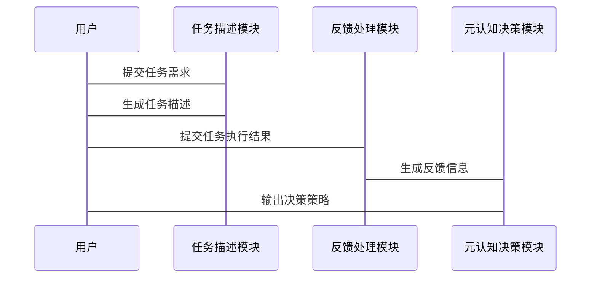

                 


# LLM在AI Agent元认知能力培养中的应用

## 关键词：大语言模型（LLM）、人工智能（AI）代理（Agent）、元认知能力、自然语言处理、系统架构设计

## 摘要：
本文探讨了大语言模型（LLM）在AI代理（Agent）元认知能力培养中的应用。通过分析元认知能力的结构和LLM的优势，本文详细介绍了如何利用LLM提升AI代理的自我反思和决策能力。文章从背景介绍、核心概念、算法原理、系统设计到项目实战，全面解析了LLM在AI代理中的应用，并通过实际案例展示了其在提升元认知能力方面的潜力。

---

# 目录

1. 背景与基础
2. 核心概念与联系
3. 算法原理
4. 系统分析与架构设计
5. 项目实战
6. 最佳实践、小结与扩展阅读

---

## 第1章: 背景与基础

### 1.1 LLM的基本概念

#### 1.1.1 大语言模型的定义与特点
大语言模型（LLM）是一种基于深度学习的自然语言处理模型，旨在理解和生成人类语言。其特点包括：
- **大规模训练数据**：通常使用数十亿参数，训练数据涵盖多种语言和领域。
- **上下文理解**：能够处理长上下文，识别语境中的细微差别。
- **多任务能力**：支持多种任务，如文本生成、翻译、问答等。
- **自适应能力**：通过微调可以快速适应特定领域或任务。

#### 1.1.2 LLM的核心技术与实现原理
LLM的核心技术包括：
- **Transformer架构**：由编码器和解码器组成，通过自注意力机制捕捉文本中的长距离依赖关系。
- **自注意力机制**：允许模型在生成文本时考虑前面生成的所有内容，从而保持上下文一致性。
- **并行计算**：通过并行处理加速模型训练和推理。

#### 1.1.3 LLM的应用场景与优势
LLM广泛应用于：
- **自然语言处理**：文本生成、机器翻译、问答系统。
- **内容创作**：辅助写作、生成营销文案。
- **教育科技**：智能 tutoring、语言学习助手。

### 1.2 AI Agent的基本概念

#### 1.2.1 AI Agent的定义与分类
AI Agent是指能够感知环境、自主决策并执行任务的智能实体。分类包括：
- **简单反射型**：基于规则执行任务。
- **基于模型的反射型**：基于内部模型进行推理和决策。
- **目标驱动型**：根据目标优化行为。
- **实用驱动型**：通过效用函数优化决策。

#### 1.2.2 AI Agent的核心功能与能力
AI Agent的核心功能包括：
- **感知环境**：通过传感器或API获取数据。
- **决策与推理**：基于感知信息做出决策。
- **执行动作**：通过执行器与环境交互。
- **学习与适应**：通过反馈改进性能。

#### 1.2.3 AI Agent的应用领域与发展趋势
AI Agent的应用领域包括：
- **智能家居**：控制家庭设备，提供个性化服务。
- **自动驾驶**：车辆自主导航和决策。
- **智能助手**：如Siri、Alexa等。

### 1.3 LLM与AI Agent的结合

#### 1.3.1 LLM在AI Agent中的作用
LLM为AI Agent提供了强大的语言理解和生成能力，使其能够：
- **自然语言交互**：通过对话与用户互动。
- **复杂推理**：利用语言模型进行逻辑推理和问题解决。

#### 1.3.2 LLM如何增强AI Agent的能力
LLM通过以下方式增强AI Agent：
- **上下文理解**：帮助AI Agent更好地理解用户意图。
- **动态推理**：支持实时信息处理和决策。
- **多语言支持**：扩展AI Agent的应用范围。

#### 1.3.3 LLM在AI Agent元认知中的应用前景
LLM在元认知中的应用前景包括：
- **自我监控**：AI Agent能够监控自身的决策过程。
- **自我评估**：评估任务完成情况并调整策略。
- **知识整合**：将外部知识与内部推理相结合。

---

## 第2章: 核心概念与联系

### 2.1 元认知能力的基本概念

#### 2.1.1 元认知的定义与特点
元认知是指对认知过程的认知，包括：
- **元认知知识**：关于认知过程的知识。
- **元认知调控**：对认知过程的监控和调节。

#### 2.1.2 元认知能力的结构
元认知能力的结构包括：
- **元认知知识**：关于任务、策略和资源的知识。
- **元认知调控**：包括计划、监控和评估。

#### 2.1.3 元认知与认知的关系
元认知与认知的关系：
- **元认知指导认知**：元认知帮助选择合适的认知策略。
- **认知支持元认知**：认知过程的成果为元认知提供依据。

### 2.2 LLM在元认知能力中的作用

#### 2.2.1 LLM对元认知能力的支持
LLM通过以下方式支持元认知能力：
- **上下文理解**：帮助AI Agent理解任务背景。
- **动态推理**：支持实时决策和策略调整。
- **知识整合**：将外部知识与内部推理相结合。

#### 2.2.2 元认知能力与LLM的特征对比
特征对比表：

| 特征 | 元认知能力 | LLM |
|------|------------|------|
| 输入 | 任务描述 | 文本数据 |
| 输出 | 决策策略 | 文本生成 |
| 能力 | 自我监控 | 语言生成 |

### 2.3 元认知能力在AI Agent中的重要性

#### 2.3.1 元认知能力在AI Agent中的作用
元认知能力在AI Agent中的作用：
- **自我监控**：监控决策过程。
- **自我评估**：评估任务完成情况。
- **知识整合**：整合外部知识和内部推理。

#### 2.3.2 元认知能力如何提升AI Agent的智能水平
元认知能力通过以下方式提升AI Agent的智能水平：
- **动态适应**：根据反馈调整策略。
- **知识整合**：结合外部知识优化决策。
- **自我优化**：通过自我评估和调整提升性能。

#### 2.3.3 元认知能力在复杂任务中的应用
元认知能力在复杂任务中的应用包括：
- **多任务处理**：协调多个任务的执行。
- **策略优化**：根据环境变化调整策略。
- **知识整合**：结合不同来源的信息进行决策。

### 2.4 LLM与元认知能力的结合

#### 2.4.1 LLM如何支持AI Agent的元认知能力
LLM通过以下方式支持AI Agent的元认知能力：
- **语言理解**：理解任务描述和反馈。
- **动态推理**：生成实时策略。
- **知识整合**：将外部知识与内部推理结合。

#### 2.4.2 元认知能力对LLM的促进作用
元认知能力对LLM的促进作用：
- **动态调整**：根据反馈优化模型。
- **知识整合**：结合上下文信息提升生成质量。
- **自我监控**：监控生成过程，避免错误。

#### 2.4.3 LLM与元认知能力的结合方式
结合方式包括：
- **内嵌式**：将元认知能力嵌入LLM的生成过程。
- **外挂式**：元认知能力作为独立模块与LLM交互。

---

## 第3章: 算法原理

### 3.1 LLM的训练过程

#### 3.1.1 Transformer模型的结构
Transformer模型由编码器和解码器组成，编码器负责将输入序列编码为上下文向量，解码器负责根据编码向量生成输出序列。

#### 3.1.2 自注意力机制
自注意力机制允许模型在生成每个词时考虑前面生成的所有词，通过计算词与词之间的注意力权重，确定每个词的重要性。

#### 3.1.3 前向网络与反向传播
前向网络将输入数据通过多层感知机传递，反向传播用于更新权重，最小化损失函数。

### 3.2 LLM在元认知任务中的应用

#### 3.2.1 元认知任务的定义
元认知任务包括：
- **任务监控**：监控任务执行过程。
- **决策评估**：评估决策的正确性。
- **策略调整**：根据反馈调整策略。

#### 3.2.2 LLM在元认知任务中的算法实现
算法实现包括：
- **输入处理**：将任务描述和反馈输入模型。
- **注意力计算**：计算输入的自注意力权重。
- **解码生成**：根据注意力权重生成输出。

#### 3.2.3 基于LLM的元认知算法流程图
Mermaid流程图：



### 3.3 算法实现的数学模型

#### 3.3.1 编码器的自注意力机制
自注意力机制的计算公式：

$$
\text{Attention}(Q, K, V) = \text{softmax}\left(\frac{QK^T}{\sqrt{d_k}}\right)V
$$

其中，\( Q \) 是查询向量，\( K \) 是键向量，\( V \) 是值向量，\( d_k \) 是向量的维度。

#### 3.3.2 解码器的前向网络
前向网络的计算公式：

$$
\text{FFN}(x) = \text{ReLU}(W_1x + b_1)W_2 + b_2
$$

其中，\( W_1 \) 和 \( W_2 \) 是权重矩阵，\( b_1 \) 和 \( b_2 \) 是偏置项。

---

## 第4章: 系统分析与架构设计

### 4.1 系统应用场景

#### 4.1.1 元认知能力的应用场景
元认知能力的应用场景包括：
- **任务监控**：监控任务执行过程。
- **决策评估**：评估决策的正确性。
- **策略调整**：根据反馈调整策略。

#### 4.1.2 LLM在元认知中的应用优势
LLM在元认知中的应用优势包括：
- **强大的语言理解能力**：能够理解复杂的任务描述。
- **实时生成能力**：能够实时生成决策策略。
- **动态适应能力**：能够根据反馈调整策略。

### 4.2 系统功能设计

#### 4.2.1 领域模型
领域模型包括：
- **任务描述模块**：输入任务描述。
- **反馈处理模块**：处理用户反馈。
- **元认知决策模块**：生成元认知决策。

Mermaid类图：



#### 4.2.2 系统架构设计
系统架构设计包括：
- **输入层**：接收任务描述和反馈。
- **处理层**：包括任务描述模块、反馈处理模块和元认知决策模块。
- **输出层**：生成决策策略。

Mermaid架构图：



### 4.3 接口设计与交互流程

#### 4.3.1 系统接口设计
系统接口设计包括：
- **输入接口**：接收任务描述和反馈。
- **输出接口**：输出决策策略。

#### 4.3.2 系统交互流程
系统交互流程包括：
1. **输入任务描述**：用户输入任务需求。
2. **生成任务描述**：任务描述模块生成详细任务描述。
3. **输入反馈**：用户输入任务执行结果。
4. **处理反馈**：反馈处理模块生成反馈信息。
5. **生成决策**：元认知决策模块根据任务描述和反馈生成决策策略。
6. **输出决策**：输出决策策略。

Mermaid交互图：



---

## 第5章: 项目实战

### 5.1 环境安装与配置

#### 5.1.1 安装Python与相关库
安装Python和必要的库：

```bash
pip install torch transformers
```

#### 5.1.2 安装LLM模型
安装GPT-2模型：

```bash
pip install transformers
from transformers import AutoModelForCausalLM, AutoTokenizer
tokenizer = AutoTokenizer.from_pretrained('gpt2')
model = AutoModelForCausalLM.from_pretrained('gpt2')
```

### 5.2 系统核心实现

#### 5.2.1 元认知决策模块实现
实现元认知决策模块：

```python
def generate_decision(model, tokenizer, task_description, feedback):
    input_text = f"Task description: {task_description}\nFeedback: {feedback}\nPlease provide a decision strategy."
    inputs = tokenizer.encode(input_text, return_tensors='pt')
    outputs = model.generate(inputs, max_length=100)
    decision = tokenizer.decode(outputs[0], skip_special_tokens=True)
    return decision
```

#### 5.2.2 反馈处理模块实现
实现反馈处理模块：

```python
def process_feedback(feedback):
    # 简单的反馈处理逻辑
    if feedback == 'success':
        return 'Good job!'
    else:
        return 'Need improvement.'
```

### 5.3 代码应用与分析

#### 5.3.1 代码实现
完整的代码实现：

```python
from transformers import AutoModelForCausalLM, AutoTokenizer

class LLM_Agent:
    def __init__(self):
        self.tokenizer = AutoTokenizer.from_pretrained('gpt2')
        self.model = AutoModelForCausalLM.from_pretrained('gpt2')
    
    def generate_decision(self, task_description, feedback):
        input_text = f"Task description: {task_description}\nFeedback: {feedback}\nPlease provide a decision strategy."
        inputs = self.tokenizer.encode(input_text, return_tensors='pt')
        outputs = self.model.generate(inputs, max_length=100)
        decision = self.tokenizer.decode(outputs[0], skip_special_tokens=True)
        return decision
    
    def process_feedback(self, feedback):
        if feedback == 'success':
            return 'Good job!'
        else:
            return 'Need improvement.'

# 示例用法
agent = LLM_Agent()
task_description = "Complete the report by tomorrow."
feedback = "success"
decision = agent.generate_decision(task_description, feedback)
print(decision)
```

#### 5.3.2 代码分析
代码分析：
- **LLM_Agent类**：封装了LLM模型和元认知决策模块。
- **generate_decision方法**：根据任务描述和反馈生成决策策略。
- **process_feedback方法**：处理反馈信息并返回结果。

### 5.4 实际案例分析

#### 5.4.1 案例背景
案例背景：
- **任务描述**：完成报告。
- **反馈**：成功完成任务。

#### 5.4.2 案例分析
案例分析：
- **任务描述**：用户需要在明天完成报告。
- **反馈**：用户成功完成任务。
- **决策生成**：模型生成的决策策略可能包括：“继续监控任务执行情况，确保报告质量。”

#### 5.4.3 案例结果
案例结果：
- **决策策略**：继续监控任务执行情况，确保报告质量。

---

## 第6章: 最佳实践、小结与扩展阅读

### 6.1 最佳实践

#### 6.1.1 模型选择
选择适合任务的LLM模型，考虑模型大小、计算资源和任务需求。

#### 6.1.2 数据处理
确保训练数据的质量和多样性，避免偏见。

#### 6.1.3 系统优化
优化系统架构，提高处理效率和稳定性。

### 6.2 小结

通过本文的探讨，我们了解了LLM在AI Agent元认知能力培养中的应用，从背景介绍、核心概念、算法原理到系统设计和项目实战，全面解析了如何利用LLM提升AI Agent的元认知能力。通过实际案例，我们展示了LLM在元认知任务中的强大能力，为未来的AI Agent开发提供了参考。

### 6.3 注意事项

- **数据隐私**：确保数据处理符合隐私保护法规。
- **模型性能**：根据任务需求选择合适的模型。
- **系统稳定性**：确保系统的稳定性和可靠性。

### 6.4 拓展阅读

- **深度学习书籍**：《Deep Learning》（Ian Goodfellow等著）。
- **自然语言处理书籍**：《Natural Language Processing with PyTorch》（阿尔伯特·伯恩斯坦等著）。
- **AI Agent相关论文**：《A Survey on Deep Learning-based Text Generation》。

---

通过本文的详细分析和实践，我们展示了LLM在AI Agent元认知能力培养中的潜力和应用前景，为未来的相关研究和开发提供了宝贵的参考。

